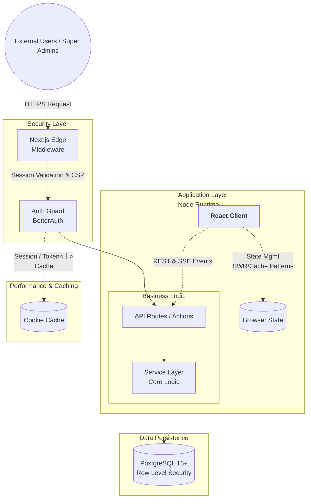
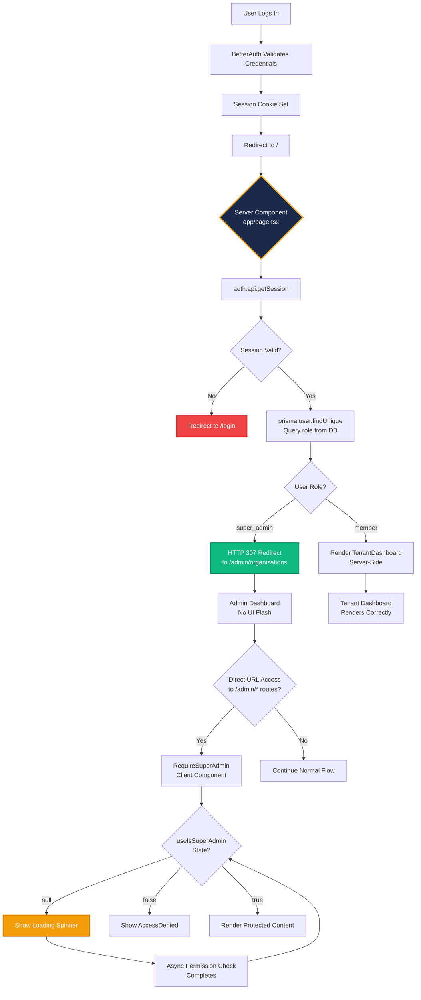

# Property NI Portal - System Architecture

## 📋 Overview
The Property NI (nipp) portal is a full-stack, multi-tenant property management system designed for Northern Ireland's public sector housing authority. It provides a secure, role-based platform for managing organizations (tenants), users, properties, leases, and maintenance requests. The system enforces strict data isolation between organizations using a defense-in-depth architecture combining application-layer query interception and database-level Row Level Security (RLS).

## 🏗️ Technology Stack

### Frontend
- **Framework:** Next.js 15 (App Router)
- **UI Library:** React 19
- **Styling:** Tailwind CSS v4 (with `@tailwindcss/postcss` and `@tailwindcss/typography`)
- **State Management:** React Server Components / Client Components with `useSyncExternalStore` for session state, SWR/React Query patterns implied by caching architecture
- **Testing UI:** Testing Library (`@testing-library/react`, `@testing-library/jest-dom`)

### Backend
- **Runtime:** Node.js 22 LTS (pinned)
- **API Routes:** Next.js API Routes (App Router) with explicit `nodejs` runtime for Prisma compatibility
- **Authentication:** BetterAuth v1.6 (with Organization plugin)
- **Database ORM:** Prisma 6 (`@prisma/client`)
- **Connection Pooler:** PgBouncer (manages database connections between Node.js and PostgreSQL)
- **Database:** PostgreSQL 16+
- **Caching:** Redis (via `ioredis`) for permission caching and session cache

### Testing & Quality
- **Unit/Integration Tests:** Vitest v4.1 (with `@vitest/coverage-v8`)
- **Type Checking:** TypeScript 5.7 (strict mode)
- **Linting:** ESLint 9 (flat config via `eslint-config-next`)
- **Formatting:** Prettier v3.4


## High Level Architecture

The following diagram illustrates the core components, data flow and security boundaries of the portal

## High Level Architecture

The following diagram illustrates the core components, data flow, and security boundaries of the portal.



## 🗂️ Project Structure

```
nipp/
├── app/                          # Next.js App Router (pages & API routes)
│   ├── (auth)/                   # Authentication pages (login, register)
│   ├── admin/                    # Super admin dashboard & layouts
│   ├── api/                      # API endpoints (RESTful routes)
│   │   ├── auth/[...all]/        # BetterAuth catch-all handler
│   │   ├── health/               # Health check endpoint for monitoring
│   │   └── ...                   # Domain-specific API routes
│   ├── layout.tsx                # Root layout
│   └── ...                       # Page components & layouts
├── components/                   # Reusable React components
│   ├── auth/                     # Auth-related components (RequirePermission, RequireSuperAdmin)
│   └── ui/                       # UI primitives & domain components
├── lib/                          # Core business logic & utilities
│   ├── auth.ts                   # BetterAuth configuration & session callbacks
│   ├── auth-client.ts            # Client-side auth utilities & hooks
│   ├── authz.ts                  # Authorization logic (hasPermission, isSuperAdmin)
│   ├── tenant-db.ts              # Multi-tenant Prisma extension ($extends)
│   ├── db.ts                     # Global Prisma client instance
│   ├── tenant-context.ts         # AsyncLocalStorage for tenant context propagation
│   └── permissions/              # Permission resolution & caching logic
├── services/                     # Domain-specific business logic layers
│   ├── organization-service.ts   # Organization management service
│   └── team-service.ts           # Team CRUD, membership, and role inheritance
├── hooks/                        # Custom React hooks (useSession, usePermission)
├── prisma/                       # Database schema & migrations
│   ├── schema.prisma             # Prisma schema definition (enums, models, relations)
│   └── migrations/               # Database migration files & RLS policies
├── tests/                        # Test suites
│   ├── unit/                     # Unit tests (isolated function testing)
│   ├── integration/              # Integration tests (PostgreSQL + Redis)
│   └── isolation/                # Tenant isolation guarantee tests
├── scripts/                      # Utility scripts (secret checking, DB setup)
│   └── check-secrets.sh          # Pre-commit secret scanning hook
├── middleware.ts                 # Route protection & Edge-runtime cookie validation
└── next.config.ts                # Next.js configuration (CSP, webpack externals)
```

## 🔐 Multi-Tenant Architecture

### Tenant Isolation Strategy
The system enforces strict tenant isolation using a **defense-in-depth** approach. If one layer fails, the other acts as a safety net to prevent cross-tenant data leakage.

**Layer 1: Application-Level Isolation (Prisma `$extends`)**
- Located in `lib/tenant-db.ts`, this extension intercepts Prisma queries at the application layer.
- **Context Propagation:** The current `organizationId` is stored in Node.js `AsyncLocalStorage` via middleware and `lib/tenant-context.ts`.
- **Query Interception:** The extension automatically injects `organizationId` into the `where`, `data`, `create`, and `update` clauses for tenant-scoped models.
- **Fail-Safe:** If a query executes against a scoped model without an active tenant context, the extension throws an explicit error (`Tenant context missing for scoped query.`), preventing accidental global queries.

**Layer 2: Database-Level Isolation (PostgreSQL RLS)**
- PostgreSQL Row Level Security policies are applied to tenant-scoped tables as a secondary safety net.
- Even if the application layer is bypassed or misconfigured, the database engine rejects any query attempting to access rows belonging to a different `organizationId`.
- RLS policies use `current_setting('app.current_org_id', true)` to enforce isolation at the database engine level.

### Data Flow
1. **Request arrives** → Middleware checks session cookie presence (Edge-safe, no Prisma)
2. **Tenant context established** → `AsyncLocalStorage` stores the user's `organizationId`
3. **Database query executed** → Prisma extension automatically injects tenant filter into `where` clauses
4. **Response returned** → User only sees data scoped to their organization

### Tenant-Scoped Models
The following models are strictly scoped to organizations and protected by the Prisma extension:
- `Role` (organization-scoped role definitions)
- `RolePermission` (junction table mapping roles to permissions, org-scoped for isolation)
- `MemberRole` (junction table linking members to roles, org-scoped for isolation)
- `Team` (sub-organizational groupings, org-scoped)
- `TeamMember` (user-to-team membership, org-scoped)
- `TeamRole` (team-level role definitions mapped to org roles, org-scoped)

Global models (`User`, `Organization`, `Member`, `Permission`, `AuditLog`) are not scoped and require explicit authorization checks.

## 🔒 Content Security Policy (CSP)

The application enforces a strict Content Security Policy via Edge Runtime middleware (`middleware.ts`) to mitigate Cross-Site Scripting (XSS) and data injection attacks. CSP is deployed in **Report-Only** mode initially, allowing us to monitor violations without blocking legitimate functionality.

### Architecture & Flow
1. **Nonce Generation:** On every request, a cryptographically secure random nonce is generated using `@/lib/csp-nonce`.
2. **Header Propagation:** The nonce is passed to the client via a custom `x-csp-nonce` header, allowing React components and scripts to dynamically inject the nonce into `<script>` tags.
3. **Directive Enforcement:** The middleware constructs a CSP string applied to the `Content-Security-Policy-Report-Only` (dev) or `Content-Security-Policy` (prod) header.

**NOTE:** The `script-src` directive uses `'unsafe-inline'` rather than nonce-based enforcement. See the **Nonce Limitation** section below for details.

### Policy Directives
| Directive | Value | Rationale |
|-----------|-------|-----------|
| `default-src` | `'self'` | Blocks all resources not explicitly allowed. |
| `script-src` | `'self' 'unsafe-inline'` (+ `'unsafe-eval'` in dev) | See **Nonce Limitation** below. `unsafe-eval` is only allowed in development for Next.js Fast Refresh (HMR). |
| `style-src` | `'self' 'unsafe-inline'` | Next.js internal runtime injects inline styles at hydration time. |
| `img-src` | `'self' data: blob:` | Allows standard images, inline base64 data URIs, and blob URLs. |
| `font-src` | `'self' data:` | Allows standard fonts and base64-encoded font files. |
| `connect-src` | `'self'` | Restricts AJAX/Fetch/WebSocket connections to the same origin. |
| `frame-ancestors` | `'none'` | Prevents clickjacking by disallowing the app from being embedded in iframes. |
| `base-uri` / `form-action` | `'self'` | Prevents base tag hijacking and restricts form submissions to the same origin. |

### Nonce Limitation (Known Trade-Off)
The `x-csp-nonce` header is generated and available for application-level inline scripts (see Component Integration below), but it is **not** used in the `script-src` CSP directive. This is because Next.js App Router injects its own inline scripts for RSC hydration payloads and Fast Refresh that cannot be given nonces — there is no supported mechanism to inject a nonce into these internal scripts without a custom server.

This means `script-src` must use `'unsafe-inline'` in both development and production. This is the industry-standard compromise for Next.js App Router (see [vercel/next.js#54850](https://github.com/vercel/next.js/issues/54850)). While `'unsafe-inline'` weakens CSP compared to a strict nonce-only policy, the risk is mitigated by:
- **Report-Only mode in development** — violations are logged but not enforced, allowing safe iteration.
- **Strict enforcement of all other directives** — `default-src 'self'`, `connect-src 'self'`, `frame-ancestors 'none'` still block the vast majority of XSS attack vectors.
- **Application-level nonce availability** — any inline scripts you add in your own components can (and should) use the `x-csp-nonce` header, which browsers will honor alongside `'unsafe-inline'`.

### Development vs Production
- **Development:** `script-src` includes `'unsafe-eval'` to support Next.js Hot Module Replacement (Fast Refresh). All other directives remain strict.
- **Production:** `script-src` uses `'self' 'unsafe-inline'`. No `'unsafe-eval'` is permitted. The nonce infrastructure (`x-csp-nonce`) remains available for application-level scripts.

### Component Integration
React components consume the nonce via the `x-csp-nonce` header for any inline scripts you add (the nonce is not applied to Next.js internal hydration scripts):
```tsx
import { headers } from 'next/headers';

export default function MyComponent() {
  const nonce = headers().get('x-csp-nonce') ?? '';
  return (
    <script nonce={nonce} dangerouslySetInnerHTML={{ __html: '/* inline script */' }} />
  );
}
```

### Safe Rollout Strategy
CSP is set via `Content-Security-Policy-Report-Only` in development (logs violations without blocking) and `Content-Security-Policy` in production (strict enforcement). The nonce infrastructure (`x-csp-nonce`) is available in both modes for application-level scripts.


## 🔐 Authentication & Authorization

### Authentication Flow
- **Provider:** BetterAuth v1.6 with email/password and OAuth (Google) support.
- **Session Management:** Secure, HTTP-only cookies (`better-auth.session_token`, `__Secure-better-auth.session_token`).
- **Cookie Cache:** Enabled in `lib/auth.ts` (`maxAge: 5 minutes`) for fast, Edge-runtime-safe session validation without hitting Prisma.
- **Session Callbacks:** In Node.js runtime, the `session` callback resolves user permissions and Super Admin status before returning the session object. In Edge runtime (middleware), it returns a lightweight session without permissions to avoid Prisma initialization errors.

### Authorization Flow & Permission Resolution
The system uses a multi-layered approach to determine if an action is permitted.

#### 1. Identity vs. Membership (The Data Model)
It is critical to distinguish between global identity and organizational authorization:
- **`User` (Identity):** Represents a global entity. The `role` field here defines the **System Role** (e.g., `super_admin` vs `member`). This determines if the user has platform-wide privileges.
- **`Member` (Membership):** A junction table linking a `User` to an `Organization`. This represents the user's presence within a specific tenant.
- **`Role` (Tenant Authorization):** Organization-scoped role definitions (e.g., "Manager", "Technician").
- **`MemberRole` (Assignment):** A junction table linking a `Member` to one or more `Roles`. This allows a single user to hold multiple roles within one organization.
- **`RolePermission` (Capability):** Maps `Roles` to atomic `Permissions`.

#### Dual-Authorization Model Clarification (`User.role` vs `MemberRole`)
To prevent authorization confusion, the system explicitly separates global routing gates from org-scoped permissions:

| Field | Scope | Purpose | Usage |
|-------|-------|---------|-------|
| `User.role` | Global | Server-side routing & access gates (e.g., `/admin/*` vs tenant dashboard) | Used exclusively in middleware, server components, and API route guards to determine *where* a user can go. |
| `MemberRole` | Org-Scoped | Fine-grained permission checks within an organization (e.g., `properties:view`, `tenants:create`) | Used by `<RequirePermission>`, `hasPermission()`, and service-layer authorization checks to determine *what* a user can do. |

**Important:** `User.role` does **not** grant org-scoped permissions. A `super_admin` bypasses org-scoped checks entirely, but a standard `member` must be assigned `MemberRole`s to perform actions. This dual-model ensures clean separation between platform administration and tenant operations.

#### 2. The Logical Permission Flow
When an authorization check is performed (via `hasPermission` or `<RequirePermission>`):

1.  **Super Admin Bypass (Fast Path):** The system first checks if the user's global identity is a `super_admin`. If true, access is granted immediately. **Note:** This "short-circuits" the permission resolver; Super Admins do not have their permissions cached in Redis because they bypass the granular check entirely.
2.  **Permission Resolution (Standard Path):** If not a Super Admin, the `resolvePermissions` function is called:
    *   **Cache Check:** It checks Redis for an existing permission set (`perm:${userId}:${orgId}`).
    *   **Database Fetch:** On a cache miss, it performs a join: `Member` $\rightarrow$ `MemberRole` $\rightarrow$ `RolePermission` $\rightarrow$ `Permission`.
    *   **Cache Write:** The resulting flattened list of permissions is written to Redis (TTL: 300s).
3.  **Enforcement:** The resulting permission list is compared against the required `resource:action` string.

### Middleware Protection
- **Edge-Safe Validation:** `middleware.ts` performs a fast check for session cookie presence. This avoids Prisma Edge Runtime crashes while ensuring unauthenticated users are redirected to `/login`.
- **Cache Control:** Protected routes return `Cache-Control: no-store, max-age=0` headers to prevent caching of sensitive data and ensure logout is respected across tabs.
- **Public Routes:** `/login`, `/register`, `/api/auth`, and `/api/health` are explicitly whitelisted.

## 👥 Teams Architecture

BetterAuth's **Teams** plugin provides sub-organizational groupings within each tenant, enabling finer-grained user organization beyond the flat member model.

### Design Decisions
- **Explicit Prisma Models:** `Team`, `TeamMember`, and `TeamRole` are defined as explicit Prisma models (not relying on BetterAuth's internal schema), giving full type safety and tenant isolation coverage.
- **Dedicated TeamService:** Business logic lives in `services/team-service.ts` following the single responsibility principle, separate from `OrganizationService`.
- **Role Inheritance:** When a user is added to a team via `addTeamMember()`, all team roles are automatically assigned to the user's member record via `assignTeamRolesToMember()`. Removing a team member revokes those roles.
- **Default "Members" Team:** Every organization bootstrapped via seed receives a default "Members" team with slug `members`.

### Team Service API (`services/team-service.ts`)
| Method | Description |
|---|---|
| `createTeam(ctx, input)` | Create a new team within an organization |
| `getTeamById(ctx, teamId)` | Get team details with members and roles |
| `updateTeam(ctx, teamId, input)` | Update team name/slug/description |
| `deleteTeam(ctx, teamId)` | Delete a team (revokes all memberships) |
| `listTeams(ctx, orgId)` | List all teams in an organization |
| `addTeamMember(ctx, teamId, userId)` | Add a user to a team (assigns all team roles) |
| `removeTeamMember(ctx, teamId, userId)` | Remove a user from a team (revokes team roles) |
| `listTeamMembers(ctx, teamId)` | List all members of a team |
| `assignTeamRoles(ctx, teamId, roleIds)` | Assign org-scoped roles to a team |
| `removeTeamRoles(ctx, teamId, roleIds)` | Remove org-scoped roles from a team |
| `listTeamRoles(ctx, teamId)` | List all roles assigned to a team |

### REST API Routes
| Route | Methods | Description |
|---|---|---|
| `/api/organizations/[orgId]/teams` | GET, POST | List teams / Create team |
| `/api/organizations/[orgId]/teams/[teamId]` | GET, PATCH, DELETE | Get / Update / Delete team |
| `/api/organizations/[orgId]/teams/[teamId]/members` | GET, POST, DELETE | List / Add / Remove members |
| `/api/organizations/[orgId]/teams/[teamId]/roles` | GET, POST, DELETE | List / Assign / Remove roles |

All routes require admin membership in the target organization and enforce tenant isolation via `AsyncLocalStorage` context.

## 🗄️ Database Design

### Core Entities
- **User:** Authentication principal with email, password hash, role, and ban status.
- **Organization:** Tenant entity with lifecycle states (`PENDING`, `ACTIVE`, `SUSPENDED`, `ARCHIVED`).
- **Member:** Junction table linking Users to Organizations (many-to-many).
- **Role:** Organization-scoped role definitions (default bootstrapped roles vs. custom admin-created roles).
- **Permission:** Global master catalog of atomic actions (`resource:action`).
- **RolePermission:** Junction table mapping Roles to Permissions.
- **MemberRole:** Junction table linking Members to Roles (supports multiple roles per member).
- **AuditLog:** Global security audit trail recording admin actions across all organizations.
- **Team:** Sub-organizational groupings within a tenant (e.g., "Operations", "QA"). Organization-scoped.
- **TeamMember:** Junction table linking a `User` to a `Team`. Organization-scoped.
- **TeamRole:** Team-level role definitions mapped to organization-scoped `Role` records. Organization-scoped.

### Relationships
- `User` ↔ `Organization`: Via `Member` (many-to-many)
- `Role` → `Permission`: Via `RolePermission` (one-to-many from Role, many-to-one to Permission)
- `Member` → `Role`: Via `MemberRole` (one-to-many from Member, many-to-one to Role)
- `Organization` → `Role`, `MemberRole`, `AuditLog`, `Team`: One-to-many cascading deletes
- `Team` → `TeamMember`, `TeamRole`: One-to-many cascading deletes
- `User` ↔ `Team`: Via `TeamMember` (many-to-many)
- `TeamRole` → `Role`: Many-to-one mapping to org-scoped roles (role inheritance)

### Indexing Strategy
- Foreign keys are automatically indexed by Prisma.
- Explicit composite indexes on `organizationId` for tenant-scoped models (`Role`, `RolePermission`, `MemberRole`).
- Additional indexes on `AuditLog` for `userId`, `organizationId`, `timestamp`, and `resourceType` to support Super Admin cross-tenant queries.
- Unique constraints on `[userId, orgId]` (Member), `[roleId, permissionId]` (RolePermission), and `[memberId, roleId]` (MemberRole) to prevent duplicates.

## 🔗 Connection Pooling (PgBouncer)

### Overview
The system uses **PgBouncer** as a lightweight connection pooler between the Node.js application and PostgreSQL. Instead of each Prisma client instance maintaining a direct connection to the database, PgBouncer maintains a pool of persistent connections and multiplexes them across application requests.

### Why PgBouncer?
- **Connection Overhead Reduction:** PostgreSQL connection establishment is expensive. PgBouncer keeps a fixed number of server connections open, regardless of how many client requests are made.
- **Resource Efficiency:** Prevents connection exhaustion under high concurrency, ensuring stable performance during traffic spikes.
- **Pool Modes:** Configured to use `transaction` or `session` pooling (depending on requirements) to balance connection reuse and transaction safety.

### Architecture & Integration
- **Client Configuration:** Prisma clients connect to PgBouncer's listening port (default `6432`) instead of the raw PostgreSQL port (`5432`).
- **Admin Interface:** PgBouncer exposes an admin interface that accepts administrative queries (`SHOW CLIENTS`, `SHOW DATABASES`, `SHOW POOLS`, etc.).
- **Health Monitoring:** The `/api/health` endpoint includes a dedicated PgBouncer health check. It connects to the admin interface, verifies responsiveness, and reports connection counts and pool utilization. If PgBouncer is unreachable, the system status becomes `unhealthy` (HTTP 503), as it is a critical dependency for database connectivity.

### Monitoring & Observability
- **Health Check Integration:** The `PgBouncerMonitor` utility (`lib/pgbouncer-monitor.ts`) queries the admin interface to gather metrics like active clients, idle servers, and pool utilization.
- **System Health Card:** The admin dashboard (`components/admin/SystemHealthCard.tsx`) displays PgBouncer status, latency, and active connections alongside Database and Cache health.
- **Alerting:** If PgBouncer goes offline or pool utilization exceeds thresholds, it triggers system logs and alerts via the health check pipeline.

This ensures that connection pooling is transparent to the application while providing robust visibility into database connectivity health.

## 🧪 Testing Strategy

### Test Categories
- **Unit Tests:** Isolated function testing using Vitest. Mocks Prisma and Redis clients to test business logic without database dependencies.
- **Integration Tests:** Full stack testing with real PostgreSQL and Redis instances. Validates end-to-end workflows like organization bootstrapping, role assignment, and permission resolution.
- **Isolation Tests:** Specifically verify tenant isolation guarantees by attempting cross-tenant queries and confirming they are blocked at the application or database layer.

### Test Infrastructure
- **Vitest Configuration:** Uses `jsdom` environment for React component tests, Node.js environment for backend logic.
- **Mocking Strategies:** `vi.mock()` is used extensively to mock `@/lib/db`, `@/lib/redis`, and custom hooks. Mocks return structured objects matching Prisma schema shapes to catch type mismatches early.
- **Test Fixtures:** Seed data and test organizations are created programmatically within tests or via `prisma/seed.ts`.

## 🚀 Deployment & DevOps

### Build Process
- `npm run build` triggers Next.js production build, TypeScript compilation (`tsc --noEmit`), and Prisma client generation.
- `serverExternalPackages: ['ioredis']` in `next.config.ts` ensures Redis client is bundled correctly for Edge runtime compatibility.
- Webpack externals configuration prevents `ioredis` from being bundled in Edge middleware bundles.

### Environment Variables
| Variable | Purpose |
|----------|---------|
| `DATABASE_URL` | PostgreSQL connection string |
| `BETTER_AUTH_SECRET` | Session encryption key (generated via `openssl rand -base64 32`) |
| `PLATFORM_ORG_ID` | ID of the Platform Organization for Super Admin detection (auto-written by seed) |
| `REDIS_URL` | Redis connection string for permission caching (optional, app degrades gracefully) |
| `PII_ENCRYPTION_KEY` | AES-256-GCM key for PII encryption (optional) |
| `GOOGLE_CLIENT_ID` / `GOOGLE_CLIENT_SECRET` | OAuth credentials (optional) |

### Security Measures
- **Pre-Commit Hooks:** `scripts/check-secrets.sh` scans staged files for AWS keys, private key headers, and database passwords. Commits are blocked if secrets are detected.
- **CSP Headers:** Configured in `next.config.ts` to mitigate XSS and data injection attacks (`default-src 'self'`, `frame-ancestors 'none'`, etc.).
- **Secrets Management:** `.env` files are strictly gitignored. Only `.env.example` (with placeholders) is committed.

## 📊 Performance Considerations

### Caching Strategy
- **Permission Cache:** Redis stores permission lists per user (`perm:${userId}:${orgId}`) with a 5-minute TTL. Cache is invalidated on role/permission changes via `invalidateUserCache()`.
- **Session Cache:** BetterAuth's `cookieCache` enables encrypted, signed session cookies that can be validated in Edge runtime without database lookups (maxAge: 5 minutes).
- **Cache Invalidation:** Triggered explicitly when roles, permissions, or memberships change. Middleware prevents caching of protected pages via `Cache-Control: no-store`.

### Database Optimization
- **Connection Pooling:** Managed by Prisma's built-in connection pooler.
- **Query Optimization:** Tenant-scoped queries benefit from indexes on `organizationId`. Super Admin audit log queries use composite indexes for efficient cross-tenant filtering.
- **Prisma Accelerate:** Not currently enabled, but architecture supports future migration to Prisma's global connection pool for multi-region deployments.

## 🔄 Data Flow Diagrams

### User Login Flow
1. User submits credentials → `/api/auth/sign-in/email`
2. BetterAuth validates password hash, creates `Session` record
3. Sets HTTP-only session cookie (`better-auth.session_token`)
4. Session callback resolves permissions (Node.js runtime) or returns lightweight session (Edge runtime)
5. User redirected to dashboard, `AsyncLocalStorage` populated with `organizationId`

### Tenant-Scoped Query Flow
1. Request arrives at API route or Server Component
2. Middleware validates session cookie, sets `Cache-Control` headers
3. Tenant context middleware extracts `organizationId` from session/headers, stores in `AsyncLocalStorage`
4. Prisma extension intercepts query, injects `organizationId` into `where` clause
5. Database executes query with RLS policy as secondary filter
6. Response returned containing only tenant-scoped data

### Permission Resolution Flow
1. User accesses protected resource → `<RequirePermission>` or API route guard
2. `resolvePermissions(userId, orgId)` called
3. Check Redis cache for `perm:${userId}:${orgId}`
4. If miss: Query `Member` → `MemberRole` → `RolePermission` → `Permission` tables
5. Flatten permission keys, store in Redis (TTL: 300s)
6. Return permission list for authorization check

### Health Check Flow
1. Load balancer/monitoring service sends `GET /api/health`
2. Middleware bypasses session validation (public route)
3. Endpoint executes database check (`SELECT 1`) with timeout
4. If Redis configured, endpoint executes cache check (`PING`)
5. Returns JSON response with status, uptime, and individual check results
6. HTTP 200 for healthy/degraded, HTTP 503 for unhealthy

## 🔒 Data-in-Transit Payload Encryption

**Status: Infrastructure complete — route-by-route migration in progress.**

Payload encryption is gated by `PAYLOAD_ENCRYPTION_MODE=disabled` (default). When enabled, selected PII-bearing API routes encrypt request and response bodies at the application layer using AES-256-GCM, on top of TLS transport encryption.

### Implementation Status (Phase 2)

| Component | Status |
|---|---|
| Environment variables (`lib/env.ts`) | ✅ Implemented |
| Logger PII redaction fields | ✅ Implemented |
| Payload format module (`lib/payload-format.ts`) | ✅ Implemented |
| Server crypto (`lib/crypto-server.ts`) | ✅ Implemented |
| Client crypto (`lib/crypto-client.ts`) | ✅ Implemented |
| Payload key store & issuance (`lib/payload-key-server.ts`) | ✅ Implemented |
| Key endpoint (`app/api/security/payload-key/route.ts`) | ✅ Implemented |
| PII route matcher (`lib/pii-routes.ts`) | ✅ Implemented — 11 patterns |
| Server middleware/wrapper (`lib/payload-middleware.ts`) | ✅ Implemented |
| Client key manager (`lib/payload-key-manager.ts`) | ✅ Implemented |
| Encrypted fetch wrapper (`lib/api-client.ts`) | ✅ Implemented |
| Unit tests (111 tests) | ✅ Passing |
| PII routes wrapped with `wrapPiiRoute()` | 🔄 In progress — 11 of ~20 PII routes wrapped |
| Client calls migrated to `encryptedFetch` | 🔄 In progress — 10 of ~20 client pages migrated |
| Integration tests | ❌ Planned |
| Browser/Playwright tests | ❌ Planned |

### Wrapped Routes (Phase 2)

| Route | Methods | PII Data |
|---|---|---|
| `/api/admin/users/search` | GET | User names, emails |
| `/api/admin/organizations/:orgId/members` | GET, POST | Member names, emails |
| `/api/admin/organizations/:orgId/members/:memberId` | PATCH, DELETE | Member names, emails |
| `/api/admin/organizations` | GET, POST | Admin email, member lists |
| `/api/admin/organizations/:orgId` | GET, PATCH, DELETE | Admin email, member lists |
| `/api/auth/user-permissions` | GET | User identity data |
| `/api/admin/audit-logs` | GET | User names, emails, actions |
| `/api/admin/system-logs` | GET | User agents, IPs |
| `/api/admin/organizations/search` | GET | Org names/slugs (admin-only) |
| `/api/admin/organizations/:orgId/status` | PATCH | Org status transitions |
| `/api/admin/organizations/:orgId/settings` | PATCH | Org name/slug/status |

### Client Pages Migrated (Phase 2)

| Page | Route(s) |
|---|---|
| `app/admin/organizations/page.tsx` | GET org list, search |
| `app/admin/organizations/create/page.tsx` | POST create org |
| `app/admin/organizations/[orgId]/page.tsx` | GET/PATCH status |
| `app/admin/organizations/[orgId]/members/page.tsx` | GET/POST members, PATCH/DELETE |
| `app/admin/organizations/[orgId]/settings/page.tsx` | GET/PATCH settings |
| `features/organization/api/useOrganization.ts` | GET org details |
| `features/organization/api/useUpdateOrgSettings.ts` | PATCH org settings |
| `features/permissions/api/usePermissions.ts` | GET user permissions |
| `app/admin/audit-logs/page.tsx` | GET audit logs |
| `app/admin/system-logs/page.tsx` | GET system logs |

### Architecture Overview

```
Phase 1 (implemented): Infrastructure
┌──────────────┐     POST /api/security/payload-key      ┌──────────────────┐
│  Browser     │ ──────────────────────────────────────► │  Server          │
│              │                                         │                  │
│ encryptedFetch()                    ◄─────────────────  Returns keyId,   │
│   ├─ getPayloadKey()              encrypted key       │ algorithm,      │
│   ├─ encrypt(body)                binary response     │ expiresAt, key  │
│   └─ send binary body               (no-store)        │ material        │
└──────────────┘                                         └──────────────────┘

Phase 2 (in progress): Route & client migration
✅ 11 PII routes wrapped with wrapPiiRoute()
🔄 ~9 additional PII routes to be assessed and wrapped
✅ 10 client pages migrated to encryptedFetch()
🔄 ~10 additional client pages to be assessed and migrated
```

### Key Components

| Component | File | Purpose |
|---|---|---|
| Payload Key Store | `lib/payload-key-server.ts` | In-memory key storage with session binding and expiry |
| Key Issuance Endpoint | `app/api/security/payload-key/route.ts` | Authenticated endpoint for key bootstrap |
| Server Crypto | `lib/crypto-server.ts` | AES-256-GCM with AAD using `node:crypto` |
| Client Crypto | `lib/crypto-client.ts` | AES-256-GCM with AAD using Web Crypto API |
| Wire Format | `lib/payload-format.ts` | Shared constants, binary helpers, validation |
| Route Matcher | `lib/pii-routes.ts` | PII route configuration and matching (11 patterns) |
| Server Middleware | `lib/payload-middleware.ts` | Route wrapper with decryption/encryption |
| Client Key Manager | `lib/payload-key-manager.ts` | In-memory key fetching and caching |
| API Client | `lib/api-client.ts` | Encrypted fetch wrapper for PII calls |

### Key Lifecycle

1. **Issuance:** Client POSTs to `/api/security/payload-key` with BetterAuth session cookie
2. **Validation:** Server validates session, generates 32-byte AES-256 key
3. **Storage:** Key is stored in-memory bound to session ID with TTL expiry (single-instance only)
4. **Distribution:** Server returns keyId, algorithm, expiresAt, and base64url-encoded key material
5. **Import:** Client imports as non-extractable `CryptoKey` (Web Crypto)
6. **Refresh:** Client refreshes key 30s before expiry or on stale-key error
7. **Revocation:** Keys are revoked on logout via `revokeSessionKeys()`

**Note on multi-instance deployments:** The current in-memory key store does not work across multiple server instances. For production multi-instance deployments, the `PayloadKeyStore` interface should be backed by Redis or a shared database. The interface (`lib/payload-key-server.ts`) is designed to support this via `setPayloadKeyStore()`.

### Payload Format

```
┌──────────────┬─────────────────┬──────────────────┐
│ 12-byte      │ ciphertext      │ 16-byte          │
│ nonce        │ (AES-GCM)       │ auth tag         │
└──────────────┴─────────────────┴──────────────────┘
```

HTTP headers for encrypted requests:
| Header | Value |
|---|---|
| `X-Payload-Encryption` | `v1` |
| `X-Payload-Key-Id` | key identifier |
| `X-Payload-Timestamp` | Unix timestamp (seconds) |
| `X-Payload-Nonce` | base64url random value |

### Feature Flag Modes

| Mode | Behavior |
|---|---|
| `disabled` (default) | No payload encryption is required or applied |
| `permissive` | Server accepts encrypted payloads; emits metrics for plaintext PII (migration-only) |
| `enforce` | Server requires encrypted payloads for configured PII routes |

**Note:** The feature flag enforcement logic is implemented in `lib/payload-middleware.ts`. Currently 11 routes are wrapped with `wrapPiiRoute()`, so enabling the flag will activate encryption for those routes. Additional routes are being assessed and migrated in Phase 2.

### Configuration

| Variable | Default | Description |
|---|---|---|
| `PAYLOAD_ENCRYPTION_MODE` | `disabled` | Feature flag mode (`disabled`, `permissive`, `enforce`) |
| `PAYLOAD_ENCRYPTION_MAX_BYTES` | `65536` | Maximum encrypted payload size |
| `PAYLOAD_ENCRYPTION_KEY_TTL_SECONDS` | `300` | Payload key lifetime |
| `PAYLOAD_ENCRYPTION_REPLAY_WINDOW_SECONDS` | `30` | Replay protection window |
| `PAYLOAD_ENCRYPTION_NONCE_TTL_SECONDS` | `60` | Replay nonce cache TTL |
| `PAYLOAD_ENCRYPTION_REPLAY_CACHE` | `redis` | Replay cache backend (`memory`, `redis`) |
| `PAYLOAD_ENCRYPTION_REQUIRE_REPLAY_CACHE` | `false` | Fail closed if replay cache unavailable (set to `true` for production enforce mode) |

### Multi-Instance Deployment Limitations

**Critical:** The current payload key store (`lib/payload-key-server.ts`) uses an in-memory `Map`. This means:

- **Single-instance only:** Keys issued on one instance are not visible to other instances.
- **Memory-only replay cache** (`PAYLOAD_ENCRYPTION_REPLAY_CACHE=memory`) has the same limitation.
- **Enforce mode must not be enabled** on multi-instance deployments until a shared key store is implemented.

For production multi-instance deployments, the `PayloadKeyStore` interface should be backed by Redis or a shared database. The interface (`lib/payload-key-server.ts`) is designed to support this via `setPayloadKeyStore()`.

### Fail-Closed Replay Protection

When `PAYLOAD_ENCRYPTION_REQUIRE_REPLAY_CACHE=true`:
- If the replay cache (Redis) is unavailable during enforce mode, requests return HTTP 503 with error `replay_cache_unavailable`.
- This prevents replay attacks from being silently disabled during outages.
- In permissive mode, the cache unavailability check is not enforced (warn-and-continue).

---

## 🛠️ Development Workflow

### Local Setup
```bash
git clone <repo-url> && cd nipp
nvm use                          # Switch to Node.js 22
npm install                      # Install dependencies
bash scripts/setup-db.sh         # Create PostgreSQL databases
cp .env.example .env             # Configure environment variables
npx prisma generate              # Generate Prisma client
npx prisma db push               # Push schema to database
npm run db:seed                  # Seed admin user & permission catalog
npm run dev                      # Start development server
```

### Running Tests
- `npm test` → Run all unit tests (fast, no running system required)
- `npm run test:watch` → Watch mode for unit tests
- `npm run test:integration` → Run integration & isolation tests (requires PostgreSQL + Redis)
- `npm run test:all` → Execute full test suite
- `npm run test:coverage` → Generate code coverage report

### Database Migrations
- `npm run db:migrate` → Create and apply migration files (recommended for production)
- `npm run db:push` → Push schema changes directly to database (dev only, skips migration files)
- `npm run db:studio` → Open Prisma Studio GUI for visual data inspection

## 📚 Key Design Decisions

### Why Prisma `$extends` over Proxy?
The team evaluated proxy-based query interception but chose Prisma's native `$extends` API for:
- **Type Safety:** Native extension hooks preserve TypeScript types and autocomplete.
- **Maintainability:** Official API with clear lifecycle management, no runtime proxy overhead.
- **Reliability:** Direct integration with Prisma's query engine ensures compatibility across version upgrades.

### Why BetterAuth?
BetterAuth was selected over NextAuth or custom authentication due to:
- **Official Prisma Adapter:** Seamless integration with Prisma 6 without custom adapter maintenance.
- **Organization Plugin:** Built-in multi-tenancy support with `Member`, `Invitation`, and `SentInvitation` models.
- **Edge Runtime Support:** Native support for Edge-compatible session validation via cookie caching.
- **Active Development:** Rapid iteration, strong TypeScript support, and growing ecosystem.

### Why AsyncLocalStorage for Tenant Context?
`AsyncLocalStorage` was chosen over prop drilling or global state because:
- **Automatic Propagation:** Context flows automatically through async call chains without manual passing.
- **Thread Safety:** Each request maintains isolated context, preventing cross-request data leakage.
- **Middleware Integration:** Seamlessly integrates with Next.js middleware and API routes without architectural changes.

### Why a Dedicated Service Layer?
We have introduced a dedicated `services/` layer to sit between the API routes and the database (Prisma). This architectural decision was made for several key reasons:

- **Separation of Concerns:** API routes should focus on HTTP concerns (parsing params, status codes, request validation), while services handle core business logic (slug generation, complex transactions, multi-step bootstrapping).
- **Reusability:** Business logic (e.g., `createOrganization`) can be reused across different entry points, such as REST API routes, Server Actions, or CLI scripts, without duplicating code.
- **Testability:** Services are easier to unit test in isolation. We can mock the database client and focus on testing complex logic like slug collision handling or admin bootstrapping without spinning up a full HTTP server.
- **Transaction Management:** Complex workflows involving multiple database operations (e.g., creating an organization AND a user AND a member relationship) are encapsulated within a single service method, ensuring atomic operations and consistent error handling.
- **Reduced Complexity in Routes:** By offloading logic to services, API route handlers remain thin and readable, making the codebase easier to navigate and maintain as the domain grows.

## 🏥 Health Check Architecture

The `/api/health` endpoint provides standardized health monitoring for production deployments.

### Design Principles
- **No Authentication Required:** Publicly accessible for load balancers and monitoring services
- **Generic Terminology:** Uses `cache` instead of `redis` to avoid leaking technology stack details
- **Graceful Degradation:** Non-critical checks (Redis) don't cause unhealthy status if unavailable
- **No Sensitive Data:** Response only includes status, latency, and uptime—no connection strings or internal details
- **Edge-Safe:** Excluded from middleware session validation to prevent Prisma Edge Runtime crashes

### Implementation Details
- **Location:** `app/api/health/route.ts`
- **Database Check:** Uses `prisma.$queryRaw`SELECT 1`` with timeout handling
- **Cache Check:** Uses `redis.ping()` with 3-second timeout (gracefully skips if Redis not configured)
- **Status Logic:**
  - `healthy`: All checks pass
  - `degraded`: Non-critical check failed (Redis down, database up)
  - `unhealthy`: Critical check failed (database unreachable) → HTTP 503
- **Response Fields:** `status`, `timestamp`, `version`, `uptime` (from `process.uptime()`), `checks`

### Monitoring Integration
- **Load Balancers:** Configure health check to call `/api/health` every 10-30 seconds
- **Container Orchestrators:** Use as liveness probe (HTTP 200 = running, HTTP 503 = restart)
- **Uptime Monitoring:** External services can verify application availability and dependency health
- **Alerting:** Set up alerts for HTTP 503 responses or degraded status

## 📡 Real-Time & High Volatility Architecture

The system handles high-frequency data (like Notifications) using a **Hybrid SSE-to-Cache Injection** pattern. This avoids the "Loading Spinner Fatigue" and heavy server load associated with standard polling or constant WebSocket connections.

### The "Push-to-Cache" Pattern
Instead of the UI components listening to a socket directly, the **React Query Cache** acts as the single source of truth.

1.  **The Stream (Server):** A dedicated SSE (Server-Sent Events) endpoint (`/api/notifications/stream`) maintains a long-lived connection. It pushes lightweight JSON events to the client.
2.  **The Bridge (Client Hook):** The `useNotifications` hook manages the lifecycle of the `EventSource`.
3.  **The Injection (Cache):** When a new event arrives, the hook uses `queryClient.setQueryData` to **manually inject** the new item into the top of the existing list in the cache.
4.  **The UI (Reaction):** Because the component is subscribed to the React Query key, it re-renders instantly when the cache is modified.

### Intelligent Polling (The Safety Net)
To ensure eventual consistency even if a user's internet drops momentarily and misses an SSE event, we implement **Context-Aware Polling**:
- **Active State:** When the browser tab is in focus, we run a slow poll (e.g., 60s) as a fallback.
- **Background State:** When the tab is blurred, polling is paused entirely to conserve battery and server bandwidth.
- **Re-sync:** Upon returning to the tab (`window.onfocus`), a fresh fetch is triggered to reconcile any missed data.


---

# Flash of Incorrect Content (FOIC) Fix - Architecture Decision Record

## Executive Summary

24/7/26: Today's changes eliminated the Flash of Incorrect Content (FOIC) that Super Admins experienced when logging into the Property NI Multi-Tenant Portal. The fix involved moving authentication routing from the client-side to the server-side, implementing a three-state permission checking pattern, and properly separating server and client components.

## Problem Statement

### The User Experience Issue

When a Super Admin logged into the application, they experienced a jarring visual flash:
1. The browser would briefly render the default tenant dashboard layout
2. Then flash an "Access Denied" screen
3. Finally redirect to the `/admin/organizations` Super Admin dashboard

This occurred because client-side routing inherently paints the initial route before asynchronous permission checks complete and redirects can fire.

### The Root Causes

**Cause 1: Client-Side Routing Race Condition**

```typescript
// ❌ PROBLEMATIC PATTERN
export default function HomePage() {
  const { isSuperAdmin, isLoading } = useIsSuperAdmin();
  
  // This renders BEFORE the async check completes
  if (!isSuperAdmin) {
    return <TenantDashboard />; // Wrong UI shown initially
  }
  
  // Then redirect happens after fetch completes
  if (isSuperAdmin) {
    router.push('/admin/organizations');
  }
}
```

**Cause 2: Incorrect State Initialization**

```typescript
// ❌ PROBLEMATIC PATTERN
const [isSuperAdmin, setIsSuperAdmin] = useState(false);

useEffect(() => {
  fetch('/api/auth/permissions')
    .then(res => res.json())
    .then(data => setIsSuperAdmin(data.isSuperAdmin));
}, []);
```

During the async fetch, `isSuperAdmin` is `false`, causing `RequireSuperAdmin` to immediately render `<AccessDenied />` before the true value arrives.

## Solution Architecture

### Decision 1: Server-Side Authentication Routing Gate

**Implementation:** `app/page.tsx` as a pure Server Component

```typescript
import { auth } from '@/lib/auth';
import { headers } from 'next/headers';
import { redirect } from 'next/navigation';
import { prisma } from '@/lib/db';

export default async function HomePage() {
  // 1. Securely fetch session on the server
  const session = await auth.api.getSession({
    headers: await headers(),
  });

  if (!session) {
    redirect('/login');
  }

  // 2. Query database directly for user role
  const user = await prisma.user.findUnique({
    where: { id: session.user.id },
    select: { role: true },
  });

  // 3. Server-side redirect BEFORE any HTML is sent
  if (user?.role === 'super_admin') {
    redirect('/admin/organizations');
  }

  // 4. Render tenant dashboard for standard users
  return <TenantDashboard />;
}
```

**Why Query the Database Instead of Using Session Cookie?**

BetterAuth does not serialize custom fields (like `role`) into the session cookie payload by default. While we could reconfigure BetterAuth to include the role, querying the database directly provides:
- **Single source of truth**: Database is always authoritative
- **No configuration complexity**: No need to modify BetterAuth's session serialization
- **Minimal performance impact**: Single lightweight query on server-side
- **Security**: Prevents client-side spoofing of role claims

### Decision 2: Three-State Client-Side Permission Guards

**Implementation:** `hooks/usePermission.ts`

```typescript
// ✅ CORRECT PATTERN
export function useIsSuperAdmin(): boolean | null {
  const [isSuperAdmin, setIsSuperAdmin] = useState<boolean | null>(null);

  useEffect(() => {
    async function checkPermissions() {
      const res = await fetch('/api/auth/permissions');
      const data = await res.json();
      setIsSuperAdmin(data.isSuperAdmin === true);
    }
    checkPermissions();
  }, []);

  return isSuperAdmin; // Returns null initially, then true/false
}
```

**Three-State Machine Implementation:**

```typescript
// components/auth/RequireSuperAdmin.tsx
export function RequireSuperAdmin({ children }) {
  const isSuperAdmin = useIsSuperAdmin();

  // State 1: null = check in progress
  if (isSuperAdmin === null) {
    return <LoadingSpinner />;
  }

  // State 2: false = check complete, unauthorized
  if (!isSuperAdmin) {
    return <AccessDenied />;
  }

  // State 3: true = check complete, authorized
  return <>{children}</>;
}
```

### Decision 3: Client Component Extraction

**Problem:** `app/page.tsx` must remain a Server Component to use `headers()` and `redirect()`, but interactive elements require `onClick` handlers.

**Solution:** Extract `LogoutButton` to a separate Client Component file.

```typescript
// components/auth/LogoutButton.tsx
'use client'; // Required for onClick and window.location

export function LogoutButton() {
  async function handleLogout() {
    await signOutUser();
    window.location.replace('/login');
  }

  return <button onClick={handleLogout}>Logout</button>;
}
```

## Flow Diagram



## Consequences

### Positive Consequences

#### 1. **Zero UI Flash**
- Super Admins are instantly routed to the correct dashboard
- No intermediate rendering of tenant UI or access denied screens
- HTTP 307/308 redirects happen before any HTML is painted

#### 2. **Enhanced Security**
- Authorization verified on the server before any client code executes
- Database is the single source of truth for user roles
- No risk of client-side role spoofing or manipulation
- Prevents unauthorized UI exposure during async checks

#### 3. **Improved Performance**
- Server-side redirect is faster than client-side navigation
- No unnecessary rendering of incorrect components
- Reduced client-side JavaScript execution for routing logic

#### 4. **Better Developer Experience**
- Clear separation between Server Components (data fetching, secure routing) and Client Components (interactivity)
- Explicit three-state pattern prevents common authorization bugs
- Documented architecture decision prevents future regressions

#### 5. **Maintainability**
- Server-side gate is easy to understand and test
- Client-side guards follow a consistent pattern across the application
- Type-safe implementation with proper null handling

### Trade-offs and Considerations

#### 1. **Additional Database Query**
- **Trade-off**: One extra database query per root page load
- **Mitigation**: Query is lightweight (`SELECT role FROM users WHERE id = ?`) and executes in < 5ms
- **Acceptable because**: Security and UX benefits far outweigh minimal performance cost

#### 2. **Server Component Complexity**
- **Trade-off**: Cannot use React hooks or browser APIs in `app/page.tsx`
- **Mitigation**: Extract interactive elements to Client Components
- **Acceptable because**: This is the recommended Next.js pattern for authentication flows

#### 3. **Client-Side Guards Still Required**
- **Trade-off**: Must maintain both server-side and client-side authorization checks
- **Mitigation**: Client-side guards only handle direct URL access to `/admin/*` routes
- **Acceptable because**: Defense-in-depth security model is industry best practice

#### 4. **TypeScript Complexity**
- **Trade-off**: Must handle `boolean | null` return types in permission hooks
- **Mitigation**: Use nullish coalescing (`?? false`) for type safety
- **Acceptable because**: Prevents the exact bug we fixed (premature access denied rendering)

## Security Implications

### What We Prevented
1. **Client-Side Role Spoofing**: Server-side verification prevents attackers from manipulating client-side state
2. **Unauthorized UI Exposure**: Tenant UI never renders for Super Admins, preventing accidental data exposure
3. **Race Condition Exploits**: Three-state pattern prevents "fail-open" or "fail-closed" authorization bugs

### What We Maintained
1. **Row Level Security (RLS)**: Database-level tenant isolation unchanged
2. **Session Validation**: BetterAuth session cookies still cryptographically validated
3. **Permission Catalog**: All 43 permissions still enforced at API layer

## Performance Impact

### Before (Client-Side Routing)
```
1. Browser requests /
2. Server renders TenantDashboard HTML
3. Browser paints TenantDashboard
4. Client JS loads and executes
5. useIsSuperAdmin fetches permissions
6. Redirect to /admin/organizations
7. Browser requests /admin/organizations
8. Server renders AdminDashboard HTML
9. Browser paints AdminDashboard

Total: 2 full page renders, 1 redirect, visible flash
```

### After (Server-Side Routing)
```
1. Browser requests /
2. Server validates session
3. Server queries user role
4. Server issues HTTP 307 redirect
5. Browser requests /admin/organizations
6. Server renders AdminDashboard HTML
7. Browser paints AdminDashboard

Total: 1 full page render, 1 redirect, no flash
```

**Performance Gain**: Eliminated one full page render and all associated client-side JavaScript execution.

## Migration Guide

### For Existing Code

If you have other pages that need similar protection:

```typescript
// app/protected-page/page.tsx
import { auth } from '@/lib/auth';
import { headers } from 'next/headers';
import { redirect } from 'next/navigation';
import { prisma } from '@/lib/db';

export default async function ProtectedPage() {
  const session = await auth.api.getSession({
    headers: await headers(),
  });

  if (!session) {
    redirect('/login');
  }

  const user = await prisma.user.findUnique({
    where: { id: session.user.id },
    select: { role: true },
  });

  if (user?.role !== 'super_admin') {
    redirect('/unauthorized');
  }

  return <ProtectedContent />;
}
```

### For New Client Components

Always follow the three-state pattern:

```typescript
export function usePermission(permission: string): boolean | null {
  const [hasPermission, setHasPermission] = useState<boolean | null>(null);
  
  useEffect(() => {
    // Fetch permission
    setHasPermission(result);
  }, []);
  
  return hasPermission;
}

// In component:
const hasPermission = usePermission('properties:create');

if (hasPermission === null) return <LoadingSpinner />;
if (!hasPermission) return <AccessDenied />;
return <ProtectedContent />;
```

## Testing Checklist

- [x] Super Admin login redirects instantly to `/admin/organizations` with zero flash
- [x] Standard tenant user login renders tenant dashboard correctly
- [x] Direct URL access to `/admin/*` by non-admin shows loading spinner, then access denied
- [x] Logout button works correctly on tenant dashboard
- [x] TypeScript compilation passes with strict null checks
- [x] No console errors during authentication flow
- [x] Session cookie properly validated on server-side

## Related Documentation

- **[SECURITY.md](./SECURITY.md)** - Security guidelines and RLS policies
- **[README.md](./README.md)** - Project overview and quick start
- **[QUICK_START.md](./QUICK_START.md)** - Developer onboarding guide

## Conclusion

The FOIC fix represents a significant improvement in both user experience and security. By moving authentication routing to the server-side and implementing proper three-state permission checking, we've eliminated a class of bugs that commonly plague React applications. The trade-offs (one additional database query, component extraction complexity) are minimal compared to the benefits (zero flash, enhanced security, better performance).

This architecture decision should be followed for all future authentication and authorization routing in the application.

---

## 🔮 Future Considerations

### Scalability
- **Horizontal Scaling:** Stateless architecture supports horizontal scaling via load balancers. Session cookies are self-contained (signed/encrypted), eliminating sticky session requirements.
- **Database Sharding:** Architecture supports future sharding by `organizationId` if single-tenant PostgreSQL becomes a bottleneck.
- **CDN Integration:** Static assets and API responses can be cached via CDN with proper `Cache-Control` headers.

### Feature Roadmap
- **Email Notifications:** Nodemailer integration for password reset, invitation emails, and maintenance alerts.
- **Audit Log Enhancements:** Real-time audit log streaming via WebSockets for Super Admin dashboard.
- **Multi-Region Support:** Prisma Accelerate integration for global read replicas and reduced latency.
- **Advanced RBAC:** Dynamic permission evaluation (e.g., `properties:view:own` vs `properties:view:all`) with context-aware middleware.


---

*Last Updated: 26/07/26
*Maintained by: Property NI Development Team*
