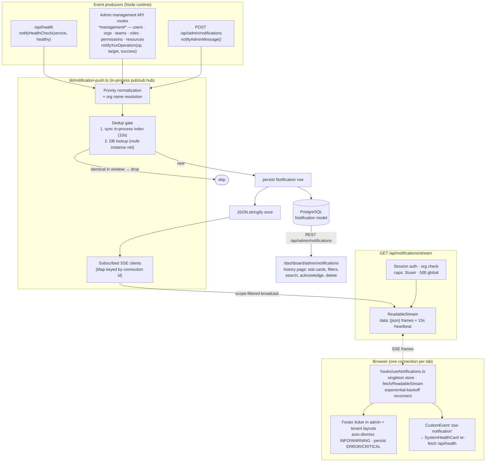
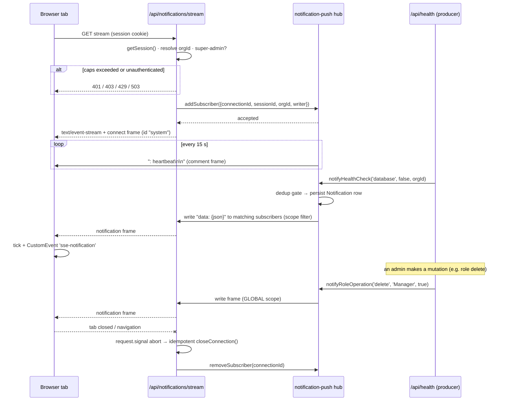
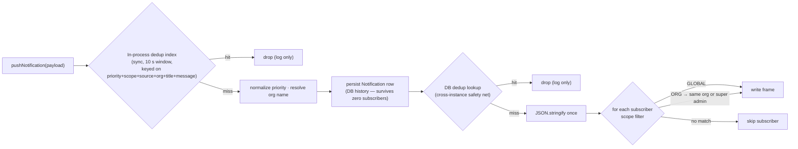

# Property NI Portal — System Architecture

A full-stack, multi-tenant property management system for Northern Ireland's public sector housing authority. It provides a secure, role-based platform for managing organizations (tenants), users, properties, leases, and maintenance requests. The system enforces strict data isolation between organizations using a defense-in-depth architecture combining application-layer query interception and database-level Row Level Security (RLS).

This document is organized by **functional area**. Use the table of contents below to navigate directly to the section you need.

## Table of Contents

- [1. Technology Stack](#1-technology-stack)
  - [Frontend](#frontend)
  - [Backend & Infrastructure](#backend--infrastructure)
  - [Testing & Quality](#testing--quality)
- [2. High-Level Architecture](#2-high-level-architecture)
  - [Component Diagram](#component-diagram)
  - [Layer Responsibilities](#layer-responsibilities)
- [3. Authentication & Session Management](#3-authentication--session-management)
  - [Auth Flow](#auth-flow)
  - [Session Cookies & Caching](#session-cookies--caching)
  - [Auto-Logout on Inactivity](#auto-logout-on-inactivity)
  - [Middleware Protection](#middleware-protection)
  - [Public Routes](#public-routes)
- [4. Authorization (RBAC)](#4-authorization-rbac)
  - [Identity vs. Membership](#identity-vs-membership)
  - [Dual-Authorization Model](#dual-authorization-model)
  - [Permission Resolution Flow](#permission-resolution-flow)
  - [Domain-Specific Permission Modules](#domain-specific-permission-modules)
  - [Role Validation](#role-validation)
- [5. Multi-Tenant Architecture](#5-multi-tenant-architecture)
  - [Defense-in-Depth Strategy](#defense-in-depth-strategy)
    - [Layer 1: Application-Level Isolation](#layer-1-application-level-isolation)
    - [Layer 2: Database-Level Isolation](#layer-2-database-level-isolation)
  - [Tenant Context Propagation](#tenant-context-propagation)
  - [Data Flow](#data-flow)
  - [Tenant-Scoped vs. Global Models](#tenant-scoped-vs-global-models)
- [6. Service Layer](#6-service-layer)
  - [Base Services](#base-services)
  - [Domain Services](#domain-services)
- [7. Data Layer](#7-data-layer)
  - [Core Entities](#core-entities)
  - [Relationships](#relationships)
  - [Indexing Strategy](#indexing-strategy)
  - [Connection Pooling (PgBouncer)](#connection-pooling-pgbouncer)
- [8. Real-Time Notification System (SSE)](#8-real-time-notification-system-sse)
  - [System Overview](#system-overview)
  - [Core Components](#core-components)
  - [Data Model: Scope & Priority](#data-model-scope--priority)
  - [Event Source Catalog](#event-source-catalog)
  - [Connection Security, Caps & Lifecycle](#connection-security-caps--lifecycle)
  - [Deduplication & Delivery Flow](#deduplication--delivery-flow)
  - [Client Architecture](#client-architecture-react-side)
  - [Health Event Integration](#health-event-integration)
  - [Notification Log API](#notification-log-api)
  - [Testing](#testing)
  - [Multi-Instance Limitation](#multi-instance-limitation)
- [9. Calendar System](#9-calendar-system)
  - [Models & Services](#models--services)
  - [Recurrence Handling](#recurrence-handling)
  - [Authorization](#authorization)
- [10. Cache Architecture](#10-cache-architecture)
  - [Overview](#overview)
  - [Layer 1: In-Memory LRU Cache](#layer-1-in-memory-lru-cache)
  - [Layer 2: Redis (Distributed Cache)](#layer-2-redis-distributed-cache)
  - [Hybrid Cache Orchestration](#hybrid-cache-orchestration)
  - [Adaptive TTL Strategy](#adaptive-ttl-strategy)
  - [Cross-Instance Invalidation](#cross-instance-invalidation)
  - [Stampede Protection](#stampede-protection)
  - [Cache Monitoring & Metrics](#cache-monitoring--metrics)
- [11. Security](#11-security)
  - [Content Security Policy (CSP)](#content-security-policy-csp)
  - [Data-in-Transit Payload Encryption](#data-in-transit-payload-encryption)
  - [CSRF Protection](#csrf-protection)
  - [Secrets Management](#secrets-management)
  - [PII Logging Policy](#pii-logging-policy)
- [12. Project Structure](#12-project-structure)
- [13. Development & Testing](#13-development--testing)
  - [Local Setup](#local-setup)
  - [Running Tests](#running-tests)
  - [Database Migrations](#database-migrations)

---

## 1. Technology Stack

### Frontend

| Component | Version / Library |
|-----------|-------------------|
| Framework | Next.js 15 (App Router) |
| UI Library | React 19 |
| Styling | Tailwind CSS v4 (`@tailwindcss/postcss`, `@tailwindcss/typography`) |
| State / Data Fetching | TanStack Query v5 (React Query) |
| Calendar Engine | rrule v2.8.1 |
| UI Primitives | lucide-react (icons), sonner (toasts) |
| Validation | Zod v4.0.0 |
| Testing | Vitest v4, React Testing Library, jsdom |

### Backend & Infrastructure

| Component | Version / Library |
|-----------|-------------------|
| Runtime | Node.js 22 LTS (pinned, `>=22.0.0 <23.0.0`) |
| API Layer | Next.js App Router (API Routes) + Server Components |
| Authentication | BetterAuth v1.6 (Organization plugin, Teams mode) |
| Database ORM | Prisma 6 (`@prisma/client`) |
| Database | PostgreSQL 16+ |
| Connection Pooler | PgBouncer (port 6432) |
| Cache / Session Store | Redis (`ioredis`) |
| In-Memory Cache | `lru-cache` v11 (L1 cache) |
| Email | Nodemailer v9.0.3 |
| Logging | Pino (`pino`, `pino-pretty`) |
| Database Driver | `pg` v8.22.0 |

### Testing & Quality

| Tool | Version |
|------|---------|
| Test Runner | Vitest v4.1 (with `@vitest/coverage-v8`) |
| E2E Testing | Playwright v1.62 |
| Type Checking | TypeScript 5.7 (strict mode) |
| Linting | ESLint 9 (flat config, `eslint-config-next`) |
| Formatting | Prettier v3.4 |
| Git Hooks | Husky + lint-staged |

---

## 2. High-Level Architecture

The following diagram illustrates the core components, data flow, and security boundaries of the portal.

```mermaid
flowchart TB
    %% --- Clients & Entry Points ---
    User((External Users / Super Admins)) -->|HTTPS Request| Middleware[Next.js Edge<br/>Middleware]

    %% --- Security & Routing Layer ---
    subgraph Security_Layer [Security Layer<br/>Edge Runtime]
        Middleware -->|Session Validation & CSP| Authm[Auth Guard<br/>BetterAuth]
    end

    %% --- Application Layer ---
    subgraph App_Layer [Application Layer<br/>Node Runtime]
        Authm --> API[API Routes / Actions]

        subgraph Business_Logic [Business Logic]
            API --> Services[Service Layer<br/>Core Logic]
            Services --> SSEHub[SSE Notification Push Hub<br/>lib/notification-push.ts]
        end

        ReactApp[<b>React Client</b>] -.->|REST & SSE Events| API
        SSEHub -.->|SSE stream<br/>(/api/notifications/stream)| ReactApp
        ReactApp -.->|State Mgmt<br/>TanStack Query| Browser[(Browser State)]
    end

    %% --- Data Persistence Layer ---
    subgraph Data_Layer [Data Persistence<br/>Database]
        Services --> Postgres[(PostgreSQL 16+<br/>Row Level Security)]
    end

    %% --- Performance Caching Layer ---
    subgraph Cache_Layer [Performance & Caching]
        Authm -.->|Session / Token<br/>Cache| Cookie[(Cookie Cache)]
        Services -.->|L1 + L2 Caching| Redis[(Redis)]
    end

    linkStyle default interpolate spline;
```

### Layer Responsibilities

| Layer | Responsibility | Runtime |
|-------|---------------|---------|
| **Edge Middleware** (`middleware.ts`) | Session cookie check, CSP headers, cache control. Fast path — no Prisma. | Edge |
| **API Routes** (`app/api/`) | HTTP request handling, parameter parsing, status codes. Thin wrappers around services. | Node |
| **Service Layer** (`services/`, `lib/services/`) | Business logic: slug generation, complex transactions, multi-step bootstrapping. | Node |
| **Data Layer** (`prisma/schema.prisma`) | Schema definition, relations, RLS policies. | PostgreSQL |
| **Cache Layer** (`lib/cache/`, `lib/redis.ts`) | L1 in-memory + L2 Redis caching with stampede protection and cross-instance invalidation. | Node / Redis |
| **Real-Time Push** (`lib/notification-push.ts`, `app/api/notifications/stream/route.ts`) | SSE notification hub: subscriber registry, two-layer dedup, DB persistence, scope-filtered fan-out to admin & tenant browsers (Section 8). | Node |

---

## 3. Authentication & Session Management

### Auth Flow

Authentication is provided by **BetterAuth v1.6** with email/password and OAuth (Google) support.

1. User submits credentials to `/api/auth/sign-in/email`
2. BetterAuth validates the password hash, creates a `Session` record
3. Sets an HTTP-only session cookie (`__Secure-better-auth.session_token`)
4. In Node.js runtime, the `session` callback resolves user permissions and Super Admin status before returning the session object
5. In Edge runtime (middleware), a lightweight session is returned without permissions to avoid Prisma initialization errors
6. User is redirected to the appropriate dashboard; `AsyncLocalStorage` is populated with `organizationId`

### Session Cookies & Caching

- **Cookie Cache:** Enabled in `lib/auth.ts` (`maxAge: 5 minutes`). Encrypted, signed session cookies that can be validated in Edge runtime without database lookups.
- **Session Expiry:** Absolute maximum lifetime of 1 hour (`session.expiresIn`). Sessions renew on any request when remaining time drops below 15 minutes (`session.updateAge`).
- **Cross-Tab Invalidation:** Logout revokes the session in the database, expires all cookies via `document.cookie`, and performs a hard redirect to bust client-side caches.

### Auto-Logout on Inactivity

A React hook (`hooks/useInactivityTimeout.ts`) listens for `mousemove`, `click`, `keydown`, `scroll`, and `touchstart` events. After a configurable idle period (default 15 minutes, controlled by `INACTIVITY_TIMEOUT_MINS`), the session is terminated: a warning toast appears 30 seconds before timeout, then `signOutUser()` is called to delete the session from the database and redirect to `/login`.

### Middleware Protection

`middleware.ts` performs a fast check for session cookie presence on every non-public route. This avoids Prisma Edge Runtime crashes while ensuring unauthenticated users are redirected to `/login`. Protected routes return `Cache-Control: no-store, max-age=0`, `Surrogate-Control: no-store`, and `Pragma: no-cache` headers to prevent caching of sensitive data.

### Public Routes

The following routes bypass session validation: `/login`, `/register`, `/api/auth/*`, and `/api/health`.

---

## 4. Authorization (RBAC)

### Identity vs. Membership

The system explicitly separates global identity from organizational authorization:

| Model | Scope | Purpose |
|-------|-------|---------|
| `User` (Identity) | Global | Authentication principal. The `role` field defines the **System Role** (`super_admin` vs `member`). |
| `Member` (Membership) | Organization | Junction linking a `User` to an `Organization`. Represents presence within a tenant. |
| `Role` (Tenant Authorization) | Organization-scoped | Role definitions within an org (e.g., "Manager", "Technician"). |
| `MemberRole` (Assignment) | Organization-scoped | Links a `Member` to one or more `Roles`. Supports multiple roles per member. |
| `RolePermission` (Capability) | Organization-scoped | Maps `Roles` to atomic `Permissions`. |

### Dual-Authorization Model

| Field | Scope | Purpose | Usage |
|-------|-------|---------|-------|
| `User.role` | Global | Server-side routing & access gates (e.g., `/admin/*` vs tenant dashboard) | Used in middleware, server components, and API route guards to determine *where* a user can go. |
| `MemberRole` | Org-Scoped | Fine-grained permission checks within an organization (e.g., `properties:view`, `tenants:create`) | Used by `<RequirePermission>`, `hasPermission()`, and service-layer authorization checks to determine *what* a user can do. |

`User.role` does **not** grant org-scoped permissions. A `super_admin` bypasses org-scoped checks entirely, but a standard `member` must be assigned `MemberRole`s to perform actions.

### Permission Resolution Flow

When an authorization check is performed (via `hasPermission` or `<RequirePermission>`):

1. **Super Admin Bypass (Fast Path):** If the user's global identity is `super_admin`, access is granted immediately. Super Admins do not have their permissions cached in Redis because they bypass the granular check entirely.
2. **Permission Resolution (Standard Path):** The `resolvePermissions` function in `lib/permissions/resolver.ts`:
   - Checks the hybrid cache (L1 → L2 → DB) for `perm:${userId}:${orgId}`
   - On cache miss, joins: `Member` → `MemberRole` → `RolePermission` → `Permission`
   - Writes the flattened permission list to both L1 and L2 caches (TTL: 5 min, volatile type)
3. **Enforcement:** The resulting permission list is compared against the required `resource:action` string.

### Domain-Specific Permission Modules

The permission system is organized into domain-specific modules under `lib/permissions/`:

| Module | File | Responsibility |
|--------|------|---------------|
| Contractor | `lib/permissions/contractor.ts` | Permissions and validation for contractor-related operations |
| Financial | `lib/permissions/financial.ts` | Permissions and validation for financial operations |
| Maintenance | `lib/permissions/maintenance.ts` | Permissions and validation for maintenance operations |
| Property | `lib/permissions/property.ts` | Permissions and validation for property management operations |
| Resolver | `lib/permissions/resolver.ts` | Core permission resolution with hybrid caching (L1 → L2 → DB) |
| Tenant | `lib/permissions/tenant.ts` | Permissions and validation for tenant-related operations |

### Role Validation

Role names are validated against the organization's role catalog to prevent free-text assignment. The validation utilities in `lib/roles/validation.ts` provide three functions:

- `isValidRoleName(roleName, orgId)` — returns boolean
- `getValidRoleNames(orgId)` — returns list of valid role names (for dropdowns)
- `assertValidRoleName(roleName, orgId)` — throws if invalid (fail-fast in API routes)

Domain-specific role modules under `lib/roles/` provide additional validation and definitions:
- `contractor.ts`, `letting.ts`, `maintenance.ts`, `property-management.ts` — domain role definitions
- `validation.ts` — core role name validation

---

## 5. Multi-Tenant Architecture

### Defense-in-Depth Strategy

The system enforces strict tenant isolation using a **defense-in-depth** approach. If one layer fails, the other acts as a safety net to prevent cross-tenant data leakage.

#### Layer 1: Application-Level Isolation

Located in `lib/tenant-db.ts`, a Prisma `$extends` extension intercepts queries at the application layer:

- **Context Propagation:** The current `organizationId` is stored in Node.js `AsyncLocalStorage` via middleware and `lib/tenant-context.ts`.
- **Query Interception:** The extension automatically injects `organizationId` into the `where`, `data`, `create`, and `update` clauses for tenant-scoped models.
- **Fail-Safe:** If a query executes against a scoped model without an active tenant context, the extension throws `Tenant context missing for scoped query.`, preventing accidental global queries.

#### Layer 2: Database-Level Isolation

PostgreSQL Row Level Security policies are applied to tenant-scoped tables as a secondary safety net. Even if the application layer is bypassed or misconfigured, the database engine rejects any query attempting to access rows belonging to a different `organizationId`. RLS policies use `current_setting('app.current_org_id', true)` to enforce isolation at the database engine level.

### Tenant Context Propagation

1. Request arrives at an API route or Server Component
2. Middleware extracts `organizationId` from the session, stores it in `AsyncLocalStorage` via `lib/tenant-context.ts`
3. Service layer and Prisma queries automatically inherit the context
4. The Prisma extension injects the filter into every tenant-scoped query

### Data Flow

1. **Request arrives** → Middleware checks session cookie presence (Edge-safe, no Prisma)
2. **Tenant context established** → `AsyncLocalStorage` stores the user's `organizationId`
3. **Database query executed** → Prisma extension automatically injects tenant filter into `where` clauses
4. **Response returned** → User only sees data scoped to their organization

### Tenant-Scoped vs. Global Models

| Scope | Models |
|-------|--------|
| **Tenant-Scoped** (protected by Prisma extension + RLS) | `Role`, `RolePermission`, `MemberRole`, `Team`, `TeamMember`, `TeamRole`, `Calendar`, `CalendarEvent`, `CalendarRecurrence` |
| **Global** (not org-scoped; require explicit authorization) | `User`, `Organization`, `Member`, `Permission`, `AuditLog`, `NotificationLog`, `Resource`, `ResourceRole` |

---

## 6. Service Layer

A dedicated `services/` layer sits between the API routes and the database (Prisma). This provides separation of concerns, reusability across entry points (REST API routes, Server Actions, CLI scripts), testability via mocking, transaction management for complex workflows, and reduced complexity in route handlers.

### Base Services

| File | Responsibility |
|------|---------------|
| `lib/services/base-service.ts` | Base class / utilities shared across all domain services |
| `lib/services/error-handler.ts` | Standardized error handling and transformation |
| `lib/services/types.ts` | Shared type definitions for service layer |

### Domain Services

| Service | File | Responsibility |
|---------|------|---------------|
| Organization | `services/organization-service.ts` | Org CRUD, slug generation, lifecycle transitions, bootstrapping with default teams and roles |
| User | `services/user-service.ts` | User CRUD, ban management, organization membership creation |
| Team | `services/team-service.ts` | Team CRUD, membership management, role inheritance (auto-assign on join) |
| Permission | `services/permission-service.ts` | Global permission catalog CRUD |
| Role | `services/role-service.ts` | Org-scoped role CRUD, permission assignment |
| Resource | `services/resource-service.ts` | Global resource catalog CRUD (Super Admin only) |
| Calendar | `services/calendar-service.ts` | Calendar container CRUD, default-calendar bootstrapping (org-scoped) |
| Calendar Event | `services/calendar-event-service.ts` | Event CRUD, recurrence expansion, upcoming events |
| Calendar Notification | `services/calendar-notification-service.ts` | Today's-events email notifications, delivery history |

---

## 7. Data Layer

### Core Entities

| Entity | Scope | Description |
|--------|-------|-------------|
| `User` | Global | Authentication principal with email, password hash, system role (`super_admin`/`member`), ban status |
| `Organization` | Global | Tenant entity with lifecycle states (`PENDING`, `ACTIVE`, `SUSPENDED`, `ARCHIVED`) |
| `Member` | Global | Junction linking Users to Organizations (many-to-many) |
| `Role` | Org-scoped | Organization-scoped role definitions (bootstrapped defaults vs. custom admin-created) |
| `Permission` | Global | Master catalog of atomic actions (`resource:action` syntax) |
| `RolePermission` | Org-scoped | Maps Roles to Permissions |
| `MemberRole` | Org-scoped | Links Members to Roles (multiple roles per member supported) |
| `Team` | Org-scoped | Sub-organizational groupings (e.g., "Operations", "QA") |
| `TeamMember` | Org-scoped | User-to-team membership within an organization |
| `TeamRole` | Org-scoped | Team-level role definitions mapped to org-scoped `Role` records |
| `Resource` | Global | Catalog of portal feature modules (e.g., "platform", "organizations") |
| `ResourceRole` | Global | Junction linking Resources to org-scoped Roles (feature-level access control) |
| `AuditLog` | Global | Security audit trail recording admin actions across all organizations |
| `NotificationLog` | Global | Tracks email notifications sent by the notification system |
| `Notification` | Global | In-app events pushed over SSE: title, message, priority (`INFO`/`WARNING`/`ERROR`/`CRITICAL`), scope (`GLOBAL`/`ORG`), source tag, optional `organizationId`, and an `acknowledged` admin flag |
| `Calendar` | Org-scoped | Container/namespace for calendar events (one default per org) |
| `CalendarEvent` | Org-scoped | Individual events within a calendar (local datetimes, optional property association) |
| `CalendarRecurrence` | Org-scoped | 1:1 recurrence rule per event (iCal-inspired fields, `excludedDates` JSON array) |

### Relationships

- `User` ↔ `Organization`: Via `Member` (many-to-many)
- `Role` → `Permission`: Via `RolePermission` (one-to-many from Role)
- `Member` → `Role`: Via `MemberRole` (one-to-many from Member)
- `Organization` → `Role`, `Team`, `Calendar`: One-to-many cascading deletes
- `Team` → `TeamMember`, `TeamRole`: One-to-many cascading deletes
- `User` ↔ `Team`: Via `TeamMember` (many-to-many)
- `TeamRole` → `Role`: Many-to-one mapping to org-scoped roles (role inheritance)
- `Resource` → `Role`: Via `ResourceRole` (many-to-many, global junction)
- `Calendar` → `CalendarEvent`: One-to-many cascading delete
- `CalendarEvent` ↔ `CalendarRecurrence`: One-to-one via `eventId @unique`
- `Notification` → `Organization`: Optional many-to-one (`SetNull` on org delete) — carries the affected tenant for org-level events; NULL for pure global broadcasts

### Indexing Strategy

- Foreign keys are automatically indexed by Prisma.
- Explicit composite indexes on `organizationId` for tenant-scoped models (`Role`, `RolePermission`, `MemberRole`).
- Additional indexes on `AuditLog` for `userId`, `organizationId`, `timestamp`, and `resourceType` to support Super Admin cross-tenant queries.
- Unique constraints on `[userId, orgId]` (Member), `[roleId, permissionId]` (RolePermission), and `[memberId, roleId]` (MemberRole) to prevent duplicates.

### Connection Pooling (PgBouncer)

The system uses **PgBouncer** as a connection pooler between the Node.js application and PostgreSQL. Prisma clients connect to PgBouncer's port (default 6432) instead of the raw PostgreSQL port (5432).

- **Health Monitoring:** The `/api/health` endpoint includes a dedicated PgBouncer health check via `lib/pgbouncer-monitor.ts`. It queries the admin interface for connection counts and pool utilization.
- **System Health Card:** The admin dashboard displays PgBouncer status, latency, and active connections alongside Database and Cache health.
- **Pool Modes:** Configured for `transaction` or `session` pooling depending on requirements.

---

## 10. Cache Architecture

The portal implements a **multi-layered caching strategy** combining Next.js ISR, L1 in-memory LRU cache, Redis (L2), TanStack Query (client-side), and SSE for real-time updates. This section covers the server-side cache layers in detail.

For client-side caching, see [CACHING_ARCHITECTURE.md](./CACHING_ARCHITECTURE.md); for the SSE real-time notification system, see [Section 8](#8-real-time-notification-system-sse).

### Overview

```
Request → API Route / Resolver
    │
    ▼
L1 Cache Check (in-memory, <0.1ms)
    ├── HIT → Return cached value
    │
    └── MISS
        │
        ▼
L2 Cache Check (Redis, ~5ms)
    ├── HIT → Populate L1, return value
    │
    └── MISS
        │
        ▼
Database Query (Prisma, ~15–40ms)
    │
    ▼
Write-Through: L2 (Redis, configurable TTL) + L1 (60s TTL)
    │
    ▼
Pub/Sub Publish → Other instances evict L1 key
```

### Layer 1: In-Memory LRU Cache

A high-performance, instance-local cache for frequently accessed data. Eliminates network round-trips for hot keys.

| Parameter | Default | Description |
|-----------|---------|-------------|
| `L1_CACHE_MAX_ENTRIES` | 1000 | Maximum cache entries per instance |
| `L1_CACHE_TTL_MS` | 60,000 (60s) | Max TTL for cache entries |
| `ENABLE_L1_CACHE` | `true` | Feature flag to disable L1 entirely |

- **Library:** `lru-cache` v11 with byte-level size calculation
- **Runtime Guard:** Disabled on Edge runtime (`process.env.NEXT_RUNTIME === 'edge'`)
- **Max Entry Size:** 10KB (rejects oversized entries to prevent memory issues)
- **Singleton Pattern:** Stored on `globalThis` for a single instance across all Next.js route bundles
- **TTL Strategy:** 60-second max TTL (shorter than Redis to limit stale data window)

### Layer 2: Redis (Distributed Cache)

Distributed server-side cache for cross-instance consistency and persistence across restarts.

- **Client:** `ioredis` with retry strategy (max 10 retries, exponential backoff)
- **Connection Pooling:** Handled internally by ioredis
- **Invalidation:** Explicit via `cacheDel()` + Pub/Sub for cross-instance sync

### Hybrid Cache Orchestration

The hybrid cache layer (`lib/cache/hybrid.ts`) provides a unified interface: `cacheGet(key, resolver, options)` checks L1 first, falls back to Redis (L2), then calls the resolver function on a miss. Results are written through to both layers.

- **Read Path:** L1 → L2 (Redis) → Resolver (DB). Write-through stores to both layers on miss.
- **Write Path:** L2 first (source of truth) → L1 → Pub/Sub publish for cross-instance invalidation.
- **Delete Path:** Remove from both layers + Pub/Sub publish.

### Adaptive TTL Strategy

| Type | TTL | Used For |
|------|-----|----------|
| `permanent` | No TTL (evicted only on explicit delete) | Static reference data |
| `stable` | 1 hour (3600s) | Orgs, users, roles |
| `volatile` | 5 minutes (300s) | Permissions (can change with role updates) |
| `search` | 30 seconds | Search results (relatively stable) |

### Cross-Instance Invalidation

When data changes, a Pub/Sub message is published to Redis channel `cache:invalidations`. All instances subscribe to this channel and evict the affected key from their L1 cache:

```
Instance A:  Mutation → redis.publish('cache:invalidations', { key })
Instance B:  subscriber.on('message') → lruCache.delete(key)
Instance C:  subscriber.on('message') → lruCache.delete(key)
```

### Stampede Protection

When the L1 cache is cold (e.g., after restart), concurrent requests for the same key could all miss and trigger simultaneous DB queries. Stampede protection uses a `Map<string, Promise>` (`lib/cache/stampede.ts`) to deduplicate concurrent misses — only one resolver is executed per unique key.

### Cache Monitoring & Metrics

Cache metrics are exposed via `lib/cache/health.ts` and the health endpoint (`GET /api/health`):

```json
{
  "l1Hits": 1500,
  "l1Misses": 500,
  "l2Hits": 450,
  "l2Misses": 50,
  "l1Size": 850,
  "l1MemoryBytes": 4250000,
  "l1HitRate": 75.0,
  "redisConnected": true
}
```

| Metric | Source | Target |
|--------|--------|--------|
| L1 Hit Rate | `lib/cache/health.ts` | >70% (varies by traffic) |
| L1 Entry Count | `lib/cache/health.ts` | <1000 (configurable) |
| L1 Memory Usage | `lib/cache/health.ts` | <20MB per instance |
| Redis Latency | `lib/redis.ts` | <5ms p99 |
| Redis Connection State | `lib/redis.ts` | Connected |

The admin dashboard includes a cache metrics page at `/admin/cache-metrics`. A profiling script (`scripts/cache-benchmark.ts`) measures real-world cache performance across all scenarios.

---

## 8. Real-Time Notification System (SSE)

The platform pushes in-app notifications to every connected browser over a
single Server-Sent Events (SSE) endpoint, `GET /api/notifications/stream`. One
central push service owns the wire format, scoping, deduplication, and
persistence, so any server-side code path — health checks, admin management
APIs, future domain events — can surface an event with a one-line call.

### System Overview



Step by step, a notification travels this path:

1. **A producer emits an event** — e.g. `/api/health` detects that the
   database just recovered, or a team-management route finishes a role
   deletion. All producers call one of the typed wrappers in
   `lib/notification-push.ts` (see [Core Components](#core-components)).
2. **The push service normalizes and deduplicates** — priority is coerced to a
   canonical Prisma enum value, then two dedup layers run (see [Deduplication &
   Delivery Flow](#deduplication--delivery-flow)).
3. **It persists before it broadcasts** — every notification is written to the
   `Notification` table first, so history survives even when zero clients are
   connected.
4. **It serializes once and fans out** — the JSON frame is written to each
   matching subscriber's stream: `GLOBAL` goes to everyone; `ORG` goes only to
   that tenant's subscribers plus Super Admins (who have no org binding).
5. **The route handler ships it over SSE** — each connection is a web
   `ReadableStream` with proper `text/event-stream` headers, a 15-second
   heartbeat comment frame (`: heartbeat`) so proxies don't drop idle streams,
   and backlog protection that disconnects clients falling more than 1 MiB behind.
6. **The browser reacts** — the singleton hook appends the item to its store
   (max 20 kept), renders the footer ticker, and mirrors the message to an
   `sse-notification` CustomEvent for pages that want a reaction without a
   connection of their own.

### Core Components

| Component | File | Responsibility |
|-----------|------|----------------|
| SSE endpoint | `app/api/notifications/stream/route.ts` | Auth, org validation, connection caps, `ReadableStream` response, connect frame, disconnect cleanup (`force-dynamic`) |
| Push hub | `lib/notification-push.ts` | Subscriber registry, dedup index, persistence, scope-filtered broadcast, heartbeat loop, and all typed producer wrappers |
| Client hook | `hooks/useNotifications.ts` | Singleton connection + store (via `useSyncExternalStore`), reconnect with backoff, auto-dismiss timers, CustomEvent mirroring |
| Ticker UI | `app/admin/layout.tsx`, `app/dashboard/admin/layout.tsx` | Footer ticker rendered once per layout — every admin/tenant page inherits it |
| Reactive consumers | `components/admin/SystemHealthCard.tsx` | Listens for the mirrored `sse-notification` event; re-fetches `/api/health` immediately on health-check sources (60 s poll remains as safety net) |
| History API + UI | `app/api/admin/notifications/route.ts`, `app/dashboard/admin/notifications/page.tsx` | Notification log: filters, search, stat cards, acknowledge/delete |

### Data Model: Scope & Priority

Events are stored in the global `Notification` model (distinct from
`NotificationLog`, which tracks *email* deliveries for calendar events):

| Field | Values | Meaning |
|-------|--------|---------|
| `priority` | `INFO` · `WARNING` · `ERROR` · `CRITICAL` | Display weighting. `INFO`/`WARNING` auto-dismiss from the ticker after 10 s; `ERROR`/`CRITICAL` persist until manually dismissed. Health failures push `CRITICAL`. |
| `scope` | `GLOBAL` · `ORG` (default) | **Who receives it live over SSE.** `GLOBAL` = every connected subscriber; `ORG` = that tenant's subscribers plus Super Admins only. |
| `source` | e.g. `health-check:database`, `admin:role-management` | Machine-readable event family; powers filters, search, and page-level reactions (health card keys off these). |
| `organizationId` | nullable | Carries the affected tenant for org-level operations so the log can attribute them; NULL for pure global broadcasts. Org deletion is `SetNull`. |
| `acknowledged` | boolean, default `false` | Admin triage flag; toggled from the notification log page. |

Key rule: **scope gates live delivery, not historical visibility.** Super
Admins see every persisted notification in the log regardless of scope.

### Event Source Catalog

Every currently wired producer, with its success/failure priorities:

| Source | Wrapper (`lib/notification-push.ts`) | Events | Success / Failure priority | Scope |
|--------|--------------------------------------|--------|----------------------------|-------|
| `health-check:database` | `notifyHealthCheck('database', …)` | DB down / first healthy after boot / recovery | INFO / **CRITICAL** | GLOBAL |
| `health-check:cache` | `notifyHealthCheck('cache', …)` | Redis up/down transitions | INFO / CRITICAL | GLOBAL |
| `health-check:pgbouncer` | `notifyHealthCheck('pgbouncer', …)` | Pooler up/down transitions | INFO / CRITICAL | GLOBAL |
| `admin:user-management` | `notifyUserOperation(op, target, success, err?)` | user create · update · delete | INFO / ERROR | GLOBAL¹ |
| `admin:organization-management` | `notifyOrganizationOperation(…)` | org create · update · **archive** (no hard deletes — archive is terminal) | INFO / ERROR | GLOBAL¹ |
| `admin:team-management` | `notifyTeamOperation(…)` | team create · update · delete | INFO / ERROR | GLOBAL¹ |
| `admin:role-management` | `notifyRoleOperation(…)` | role create · update · delete | INFO / ERROR | GLOBAL¹ |
| `admin:permission-management` | `notifyPermissionOperation(…)` | permission create · update · delete | INFO / ERROR | GLOBAL (no org — global catalog) |
| `admin:resource-management` | `notifyResourceOperation(…)` | resource create · update · delete | INFO / ERROR | GLOBAL (no org — global catalog) |
| `admin:message` | `notifyAdminMessage(title, message, orgId?, priority?)` | Admin broadcast via `POST /api/admin/notifications` | caller-selected (default INFO) | GLOBAL or ORG |

¹ Sent `GLOBAL` so all Super Admins see platform operations everywhere, but the
affected `organizationId` is passed through so the log attributes the event to
the right tenant.

### Connection Security, Caps & Lifecycle

The stream endpoint enforces:

- **Authentication** — 401 without a valid BetterAuth session; anonymous access is impossible.
- **Org binding** — 403 for non-admin users with no active organization (they have nothing to receive); an optional `?orgId=` param may override the connection's scope only if it matches the user's own org, or for Super Admins (who see all).
- **Per-user cap** — max **3** SSE connections per session (extra tabs: 429), preventing StrictMode/tab-doubling abuse.
- **Global cap** — max **500** total connections (503 when saturated), bounding memory on long-lived streams.
- **Backpressure** — a client whose stream backlog exceeds 1 MiB is dropped rather than allowed to grow unbounded.



### Deduplication & Delivery Flow

High-frequency producers (health polling is the main case) can emit the same
title/message in a very short window — e.g. two `/api/health` requests racing
at boot both see "no previous state" and would each push a "first healthy"
notification. Two layers prevent that:



- **Layer 1 — synchronous in-process index.** Checked *and* marked atomically
  (single-threaded event loop) before any `await`, closing the TOCTOU gap the
  DB check has. Window: 10 s; entries opportunistically pruned past 256.
- **Layer 2 — database lookup.** An identical persisted row within the window
  means another instance (or a previous race in this process) already pushed it.
- The hub state (subscriber map, dedup index, heartbeat timer) lives on
  `globalThis` deliberately: Next.js dev mode can evaluate a module twice per
  process, and plain module-level state would give each copy an invisible
  separate subscriber registry — the "my subscribers are invisible to
  pushNotification" bug.

### Client Architecture (React Side)

- **One connection per tab, full stop.** `hooks/useNotifications.ts` starts a
  module-level singleton (100 ms after load so React StrictMode's double mount
  settles); every component consumes the shared store through
  `useSyncExternalStore` instead of opening its own stream.
- **Transport:** plain `fetch('/api/notifications/stream', {credentials:
  'include'})` reading a `ReadableStream` — cookie auth with no token-in-URL,
  which native `EventSource` can't do. Frames are parsed off the `data:` prefix,
  deduplicated by id, and capped at 20 in memory.
- **Reconnect:** exponential backoff `min(1s · 2^attempts, 30s)`; a clean
  stream end retries after 2 s; attempts reset on success.
- **Ticker behavior:** INFO/WARNING auto-dismiss after 10 s; ERROR/CRITICAL
  remain until dismissed; per-item dismiss and "clear all" are exposed by the
  hook.
- **Event mirroring:** each received message is re-dispatched as a
  `sse-notification` window CustomEvent, so any page can react (the system
  health card refetches on `health-check:*` sources) without holding its own SSE
  connection or duplicating state.
- The legacy bell in `features/notifications/` is a separate,
  poll-based inbox (React Query, 30 s when focused, paused when backgrounded —
  see `tests/integration/notification-reliability.test.tsx`); it intentionally
  never opens its own SSE connection so the per-user cap isn't a footgun.

### Health Event Integration

`/api/health` (`app/api/health/route.ts`) tracks each service's previous state
via `lib/system-logs.ts` and calls `notifyHealthCheck(service, healthy,
platformOrgId)` **only on transitions**: first check after boot (so admins know
the DB is up), failure onset (CRITICAL), and recovery (INFO). Polling ticks
that see no change push nothing — the dedup gate above remains as a backstop.

### Notification Log API

| Method | Route | Auth | Purpose |
|--------|-------|------|---------|
| `GET` | `/api/notifications/stream[?orgId=]` | valid session | Open the live SSE stream (401/403/429/503 as above) |
| `POST` | `/api/admin/notifications` | Super Admin + rate limit | Broadcast: `{title, message, scope: 'global'\|'org', organizationId?, priority?}` — scope requires a valid org id either way (a global sent on behalf of an org carries that org in the log) |
| `GET` | `/api/admin/notifications` | Super Admin | List with filters: `page`, `pageSize` (50), `scope`, `priority`, `organizationId`, `acknowledged`, `search` (source/message). Returns rows plus `counts` (total, per-priority, acknowledged) for the stat cards |
| `PATCH` | `/api/admin/notifications?id=…` | Super Admin | Mark acknowledged |
| `DELETE` | `/api/admin/notifications?id=…` | Super Admin | Remove a log entry |

### Testing

- **Unit** — one suite per producer family: `tests/unit/notify-health-check.test.ts`, `notify-user-operation.test.ts`, `notify-organization-operation.test.ts`, `notify-team-operation.test.ts`, `notify-role-operation.test.ts`, `notify-permission-operation.test.ts`, `notify-resource-operation.test.ts`. Coverage includes success/failure titles, priority selection, `source` and `organizationId` propagation, concurrent-push deduplication, org scope non-dedup, and swallowed persistence failures.
- **Integration** — `tests/integration/notification-reliability.test.tsx` verifies the client's focus/blur-aware polling logic (listener attach/detach, event response) for the poll-based inbox hook.

### Multi-Instance Limitation

The subscriber registry and dedup index are **in-process** (`globalThis`) by
design of a single-instance deployment: a push only reaches clients connected
to *this* server process. Cross-instance, every instance still persists to the
shared `Notification` table, so history in the log is complete regardless of
which instance handled the event — but a client on instance B would not
instantly receive an event pushed by instance A. Scaling out requires relaying
pushes through a shared broker (e.g. the same Redis Pub/Sub pattern used for
cache invalidation) plus a shared dedup store; this is tracked as deferred work
(see README, Appendix F).

---

## 9. Calendar System

### Models & Services

| Model | Scope | Description |
|-------|-------|-------------|
| `Calendar` | Org-scoped | Container/namespace for events (one default per org, multiple supported) |
| `CalendarEvent` | Org-scoped | Individual events (local datetimes, optional property association) |
| `CalendarRecurrence` | Org-scoped | 1:1 recurrence rule per event (`eventId @unique`, iCal-inspired fields, `excludedDates` JSON array for drag-and-drop instance exclusion) |

Services:
- `services/calendar-service.ts` — Calendar CRUD, default-calendar bootstrapping (org-scoped)
- `services/calendar-event-service.ts` — Event CRUD, recurrence expansion, upcoming events
- `services/calendar-notification-service.ts` — Today's-events email notifications

Recurrence handling is supported by:
- `lib/recurrence.ts` — Core recurrence expansion logic
- `lib/recurrence-rrule.ts` — rrule library integration for iCal-compatible rules
- `lib/recurrence-scopes.ts` — Scoping logic for recurrence instances

### Real-Time Notifications (SSE)

In-app real-time updates are delivered by the platform-wide SSE notification
system documented in [Section 8 — Real-Time Notification System](#8-real-time-notification-system-sse): a single
`/api/notifications/stream` endpoint, the central push service in
`lib/notification-push.ts`, and the singleton `useNotifications` client hook.
Calendar pages inherit that live feed through the dashboard layout's footer
ticker rather than running a calendar-specific stream, and they receive
platform health events like any other page.

The only calendar-owned notification flow is **email** dispatch for today's
events, handled by `lib/notifications/dispatcher.ts`, with delivery via
`lib/notifications/email.ts` (nodemailer) and event definitions in
`lib/notifications/events.ts`.

### Authorization

Every `/api/organizations/[orgId]/calendar*` route verifies the session (401) and membership in the URL's organization via `globalDb.member.findFirst` (403 for non-members). Mutations call `requireAnyAdmin(ctx)` — only tenant admins can modify data; members are read-only. Permissions: `calendar:read`, `calendar:create`, `calendar:update`, `calendar:delete` are seeded into the permission catalog.

---

## 11. Security

### Content Security Policy (CSP)

The application enforces a strict CSP via Edge Runtime middleware (`middleware.ts`) to mitigate XSS and data injection attacks. CSP is deployed in **Report-Only** mode in development (logs violations without blocking) and strict enforcement in production.

| Directive | Development | Production | Rationale |
|-----------|------------|------------|-----------|
| `default-src` | `'self'` | `'self'` | Blocks all resources not explicitly allowed. |
| `script-src` | `'self' 'unsafe-inline' 'unsafe-eval'` | `'self' 'unsafe-inline'` | `unsafe-eval` only in dev for Fast Refresh. `unsafe-inline` required because Next.js App Router injects inline scripts (hydration, RSC payload) that cannot be given nonces without a custom server. |
| `style-src` | `'self' 'unsafe-inline'` | `'self' 'unsafe-inline'` | Next.js internal runtime injects inline styles at hydration time. |
| `img-src` | `'self' data: blob:` | `'self' data: blob:` | Standard images, inline base64 data URIs, and blob URLs. |
| `font-src` | `'self' data:` | `'self' data:` | Standard fonts and base64-encoded font files. |
| `connect-src` | `'self'` | `'self'` | Restricts AJAX/Fetch/WebSocket connections to same origin. |
| `frame-ancestors` | `'none'` | `'none'` | Prevents clickjacking. |
| `base-uri` / `form-action` | `'self'` | `'self'` | Prevents base tag hijacking and restricts form submissions. |

**Nonce Infrastructure:** A cryptographically secure nonce is generated on every request (`lib/csp-nonce.ts`) and passed via the `x-csp-nonce` header. Application-level inline scripts can use this nonce (browsers honor it alongside `'unsafe-inline'`). The nonce cannot be applied to Next.js internal hydration scripts — this is a known limitation documented at [vercel/next.js#54850](https://github.com/vercel/next.js/issues/54850).

### Data-in-Transit Payload Encryption

**Status:** Infrastructure complete — route-by-route migration in progress.

Payload encryption is gated by `PAYLOAD_ENCRYPTION_MODE=disabled` (default). When enabled, selected PII-bearing API routes encrypt request and response bodies at the application layer using AES-256-GCM, on top of TLS transport encryption.

#### Key Components

| Component | File | Purpose |
|-----------|------|---------|
| Payload Key Store | `lib/payload-key-server.ts` | In-memory key storage with session binding and expiry |
| Key Issuance Endpoint | `app/api/security/payload-key/route.ts` | Authenticated endpoint for key bootstrap |
| Server Crypto | `lib/crypto-server.ts` | AES-256-GCM with AAD using `node:crypto` |
| Client Crypto | `lib/crypto-client.ts` | AES-256-GCM with AAD using Web Crypto API |
| Wire Format | `lib/payload-format.ts` | Shared constants, binary helpers, validation |
| Route Matcher | `lib/pii-routes.ts` | PII route configuration and matching (11 patterns) |
| Server Middleware | `lib/payload-middleware.ts` | Route wrapper with decryption/encryption, replay protection |
| Client Key Manager | `lib/payload-key-manager.ts` | In-memory key fetching and caching |
| API Client | `lib/api-client.ts` | Encrypted fetch wrapper for PII calls |
| PII Crypto Helpers | `lib/pii-crypto.ts` | Additional PII-specific cryptographic utilities |

#### Key Lifecycle

1. Client POSTs to `/api/security/payload-key` with BetterAuth session cookie
2. Server validates session, generates 32-byte AES-256 key
3. Key stored in-memory bound to session ID with TTL expiry (single-instance only)
4. Server returns `keyId`, algorithm, `expiresAt`, and base64url-encoded key material
5. Client imports as non-extractable `CryptoKey` (Web Crypto)
6. Client refreshes key 30s before expiry or on stale-key error
7. Keys revoked on logout via `revokeSessionKeys()`

#### Payload Format

```
┌──────────────┬─────────────────┬──────────────────┐
│ 12-byte      │ ciphertext      │ 16-byte          │
│ nonce        │ (AES-GCM)       │ auth tag         │
└──────────────┴─────────────────┴──────────────────┘
```

HTTP headers for encrypted requests: `X-Payload-Encryption`, `X-Payload-Key-Id`, `X-Payload-Timestamp`, `X-Payload-Nonce`.

#### Feature Flag Modes

| Mode | Behavior |
|------|----------|
| `disabled` (default) | No payload encryption required or applied |
| `permissive` | Server accepts encrypted payloads; emits metrics for plaintext PII (migration-only) |
| `enforce` | Server requires encrypted payloads for configured PII routes |

#### Multi-Instance Limitation

The current in-memory key store does not work across multiple server instances. For production multi-instance deployments, the `PayloadKeyStore` interface should be backed by Redis or a shared database. The interface (`lib/payload-key-server.ts`) supports this via `setPayloadKeyStore()`. Enforce mode **must not** be enabled on multi-instance deployments until a shared key store is implemented.

#### Replay Protection

The server rejects requests with missing/unsupported versions, expired timestamps, replayed nonces, wrong routes/methods, or invalid/expired keys. Replay nonces are validated using a Redis-backed cache (`lib/replay-cache-redis.ts`). When `PAYLOAD_ENCRYPTION_REQUIRE_REPLAY_CACHE=true`, unavailability of the replay cache returns HTTP 503 (`replay_cache_unavailable`) — fail-closed behavior.

#### Configuration

| Variable | Default | Description |
|----------|---------|-------------|
| `PAYLOAD_ENCRYPTION_MODE` | `disabled` | Feature flag mode |
| `PAYLOAD_ENCRYPTION_MAX_BYTES` | 65536 | Maximum encrypted payload size |
| `PAYLOAD_ENCRYPTION_KEY_TTL_SECONDS` | 300 | Payload key lifetime |
| `PAYLOAD_ENCRYPTION_REPLAY_WINDOW_SECONDS` | 30 | Replay protection window |
| `PAYLOAD_ENCRYPTION_NONCE_TTL_SECONDS` | 60 | Replay nonce cache TTL |
| `PAYLOAD_ENCRYPTION_REPLAY_CACHE` | `redis` | Replay cache backend (`memory`, `redis`) |
| `PAYLOAD_ENCRYPTION_REQUIRE_REPLAY_CACHE` | `false` | Fail closed if replay cache unavailable |

### CSRF Protection

Payload encryption does **not** replace CSRF protection. PII mutating routes must continue to enforce SameSite cookie attributes, CORS restrictions, CSRF tokens where applicable, content-type restrictions, and origin checks.

### Secrets Management

- **Environment Variables:** All secrets managed via `.env` files, strictly gitignored. Only `.env.example` (with placeholders) is committed.
- **Pre-Commit Hooks:** `scripts/check-secrets.sh` scans staged files for AWS keys, private key headers, and database passwords. Commits are blocked if secrets detected.
- **PII Redaction:** The logger (`lib/logger.ts`) redacts passwords, session tokens, PII fields (email, phone, SSN), API keys, and payload encryption material via Pino's `redact` configuration.

---

## 12. Project Structure

```
nipp/
├── app/                          # Next.js App Router (pages, layouts, API routes)
│   ├── (auth)/                   # Authentication pages (login, register)
│   ├── admin/                    # Super admin dashboard & layouts
│   │   ├── audit-logs/page.tsx   # Audit log viewer
│   │   ├── cache-metrics/page.tsx# Cache performance metrics
│   │   ├── organizations/        # Org management (list, create, edit, delete, members, permissions, roles, settings)
│   │   ├── permissions/          # Permission catalog (list, create, edit, view, delete)
│   │   ├── roles/                # Role management (list, create, edit, view, delete)
│   │   ├── system-logs/page.tsx  # System log viewer
│   │   └── users/                # User management (list, create, edit, view, delete)
│   ├── api/                      # API endpoints (RESTful routes)
│   │   ├── admin/                # Super admin APIs (audit-logs, cache metrics, notifications log, orgs, permissions, roles, users)
│   │   ├── auth/                 # BetterAuth catch-all + user endpoints
│   │   ├── cache/metrics/        # Cache metrics endpoint
│   │   ├── csp-report/           # CSP violation reporting
│   │   ├── dashboard/admin/      # Dashboard admin APIs (orgs, permissions, resources, roles, teams, users)
│   │   ├── health/               # Health check endpoint (transition events pushed via SSE)
│   │   ├── notifications/stream/# Live SSE notification stream (auth, caps, heartbeat)
│   │   ├── organizations/[orgId]/# Org-scoped APIs (calendar, teams)
│   │   ├── roles/                # Role-related APIs
│   │   └── security/payload-key/# Payload encryption key management
│   ├── dashboard/                # Tenant dashboard layouts & pages (layouts carry the SSE footer ticker)
│   │   ├── admin/                # Super admin tenant view (calendar, orgs, permissions, resources, roles, teams, users, system health)
│   │   │   └── notifications/    # Notification log: history, filters, search, acknowledge/delete
│   │   └── contractor/           # Contractor-specific dashboard
│   ├── org/[orgId]/              # Org-scoped pages (roles)
│   ├── layout.tsx                # Root layout (CSP, inactivity timeout provider)
│   ├── login/page.tsx            # Login page
│   ├── register/page.tsx         # Registration page
│   └── providers.tsx             # Global providers (Toaster, inactivity timeout)
├── components/                   # Reusable React components
│   ├── admin/                    # Admin-specific UI (AccessDenied, AuditLogViewer, ConfirmDialog, EditModal, OrgStatusBadge, OrgTable, Pagination, RoleManager, SystemHealthCard, TenantMemberForm, TenantRoleForm)
│   ├── auth/                     # Auth components (LogoutButton, RequirePermission, RequireSuperAdmin)
│   ├── calendar/                 # Interactive calendar (month/week/day/year views, DnD, recurrence)
│   ├── dashboard/                # Dashboard UI (ConfirmDialog, DataTable)
│   └── ui/                       # Shared UI primitives
├── features/                     # Client feature modules (auth, notifications inbox, org, permissions, user)
├── hooks/                        # Custom React hooks
│   ├── useInactivityTimeout.ts   # Auto-logout on inactivity
│   ├── useNotifications.ts       # Singleton SSE connection + footer ticker store
│   └── usePermission.ts          # Three-state permission check (null/loading/true/false)
├── lib/                          # Core business logic & utilities
│   ├── api-client.ts             # Encrypted fetch wrapper for PII calls
│   ├── api-error.ts              # API error handling utilities
│   ├── audit-log.ts / audit.ts   # Audit logging
│   ├── auth.ts                   # BetterAuth configuration & session callbacks
│   ├── auth-client.ts            # Client-side auth utilities & hooks
│   ├── authz-route.ts / authz.ts # Authorization logic (hasPermission, isSuperAdmin)
│   ├── cache/                    # Cache architecture (hybrid L1+L2, LRU, stampede prevention, health/metrics, warming)
│   ├── client-error-logger.ts    # Client-side error logging
│   ├── constants.ts              # Shared constants
│   ├── crypto-client.ts / server.ts  # AES-256-GCM encryption (client & server)
│   ├── csp-nonce.ts              # CSP nonce generation
│   ├── csrf.ts                   # CSRF protection
│   ├── dashboard-router.ts       # Dashboard routing logic
│   ├── db.ts                     # Global Prisma client instance
│   ├── env.ts                    # Environment variable validation (Zod schemas)
│   ├── global-db-guard.ts        # Global database access guard
│   ├── global-db.ts              # Global (non-org-scoped) Prisma client
│   ├── ip.ts                     # IP address utilities
│   ├── logger.ts                 # Pino logger with PII redaction
│   ├── middleware/auth.ts        # Auth middleware utilities
│   ├── notification-push.ts      # In-process SSE push hub: subscriber registry, dedup, persist & broadcast (Section 8)
│   ├── notifications/            # Email notification system (dispatcher, email, events — calendar today-events flow)
│   ├── org-bootstrap.ts          # Organization bootstrapping logic
│   ├── organization-context.tsx  # React context for organization state
│   ├── organization.ts           # Organization utilities
│   ├── payload-format.ts         # Payload encryption wire format
│   ├── payload-key-manager.ts    # Client-side payload key management
│   ├── payload-key-server.ts     # Server-side payload key store
│   ├── payload-key-server-redis.ts  # Redis-backed payload key store (multi-instance)
│   ├── payload-metrics.ts        # Payload encryption metrics
│   ├── payload-middleware.ts     # Server-side PII route wrapper & replay protection
│   ├── pgbouncer-monitor.ts      # PgBouncer health monitoring
│   ├── pii-crypto.ts             # PII-specific cryptographic helpers
│   ├── pii-routes.ts             # PII route configuration & matcher
│   ├── recurrence-rrule.ts       # rrule library integration for calendar recurrence
│   ├── recurrence-scopes.ts      # Recurrence instance scoping
│   ├── recurrence.ts             # Core recurrence expansion logic
│   ├── redis.ts                  # Redis client with retry strategy
│   ├── replay-cache-redis.ts     # Redis-backed replay nonce cache
│   ├── require-super-admin.ts    # Super admin route guard
│   ├── rls.ts                    # RLS policy management
│   ├── schemas/                  # Zod validation schemas (auth, member, org, user)
│   ├── services/                 # Base service utilities (base-service, error-handler, types)
│   ├── system-logs.ts            # System log utilities
│   ├── tenant-access.ts          # Tenant access control utilities
│   ├── tenant-context.ts         # AsyncLocalStorage for tenant context propagation
│   ├── tenant-db.ts              # Prisma $extends extension (tenant isolation)
│   └── validate-schema.ts        # Schema validation utilities
├── middleware.ts                 # Route protection & Edge-runtime CSP/session validation
│                                  # Public routes: /login, /register, /api/auth/*, /api/health
├── next.config.ts                # Next.js configuration (CSP, webpack externals)
├── prisma/                       # Database schema & migrations
│   ├── migration-scripts/        # Migration helper scripts (upgrade-existing-orgs.ts)
│   ├── schema.prisma             # Prisma schema (enums, models, relations, RLS comments)
│   └── seed.ts                   # Seed data (admin user, permission catalog, default roles/teams)
├── scripts/                      # Utility scripts
│   ├── cache-benchmark.ts        # Cache performance profiling script
│   ├── check-secrets.sh          # Pre-commit secret scanning hook
│   ├── setup-db.sh               # PostgreSQL database setup
│   ├── setup-db.sql              # Database initialization SQL
│   ├── setup-test-env.sh         # Test environment setup
│   └── teardown-test-env.sh      # Test environment cleanup
├── services/                     # Domain-specific business logic layers
│   ├── calendar-event-service.ts  # Calendar event CRUD, recurrence expansion
│   ├── calendar-notification-service.ts  # Today's-events email notifications
│   ├── calendar-service.ts        # Calendar CRUD, default-calendar bootstrapping
│   ├── organization-service.ts    # Organization management & lifecycle
│   ├── permission-service.ts      # Global permission catalog CRUD
│   ├── resource-service.ts        # Global resource catalog CRUD (Super Admin)
│   ├── role-service.ts            # Org-scoped role CRUD
│   ├── team-service.ts            # Team CRUD, membership, role inheritance
│   └── user-service.ts            # User management & lifecycle
├── tests/                        # Test suites
│   ├── fixtures/                 # Test data fixtures (organizations, users)
│   ├── integration/              # Integration tests (PostgreSQL + Redis)
│   │   ├── auth.test.ts          # Authentication flow tests
│   │   ├── calendar-events-*.test.ts  # Calendar event CRUD & query tests
│   │   ├── logout-flow.test.ts   # Cross-tab session invalidation tests
│   │   ├── notification-reliability.test.ts  # SSE/notification reliability
│   │   ├── org-lifecycle.test.ts # Organization lifecycle tests
│   │   ├── organization-*.test.ts  # Organization API & bootstrap tests
│   │   ├── payload-encryption.test.ts  # Payload encryption integration tests
│   │   ├── super-admin-integration.test.ts  # Super admin flow tests
│   │   ├── team-*.test.ts        # Team lifecycle & membership tests
│   │   ├── user-permissions.test.ts  # Permission resolution tests
│   │   └── user-profile.test.ts  # User profile management tests
│   ├── isolation/                # Tenant isolation guarantee tests (Playwright E2E)
│   │   ├── playwright.config.ts  # Playwright configuration for isolation tests
│   │   └── README.md             # Isolation test documentation
│   ├── setup.ts                  # Test setup & teardown
│   └── unit/                     # Unit tests (isolated function testing)
├── types/                        # TypeScript type declarations
│   ├── better-auth.d.ts          # BetterAuth type extensions
│   └── missing-modules.d.ts      # Missing module declarations
├── CACHING_ARCHITECTURE.md       # Detailed cache layer architecture document
├── SECURITY.md                   # Security guidelines and RLS policies
├── QUICK_START.md                # Developer onboarding guide
├── README.md                     # Project overview and quick start
├── docker-compose.test.yml       # Docker Compose for test infrastructure (PostgreSQL + Redis)
├── Dockerfile.test               # Test environment Dockerfile
├── docker-entrypoint.sh          # Container entrypoint script
└── vitest.config.ts              # Vitest configuration (jsdom for React, Node for backend)
```

---

## 13. Development & Testing

### Local Setup

```bash
git clone <repo-url> && cd nipp
nvm use                          # Switch to Node.js 22
npm install                      # Install dependencies
bash scripts/setup-db.sh         # Create PostgreSQL databases
cp .env.example .env             # Configure environment variables
npx prisma generate              # Generate Prisma client
npx prisma db push               # Push schema to database (dev only)
npm run db:seed                  # Seed admin user & permission catalog
npm run dev                      # Start development server
```

### Running Tests

| Command | Description |
|---------|-------------|
| `npm test` | Run all unit tests (fast, no running system required) |
| `npm run test:watch` | Watch mode for unit tests |
| `npm run test:integration` | Run integration & isolation tests (requires PostgreSQL + Redis) |
| `npm run test:all` | Execute full test suite (unit + integration + isolation) |
| `npm run test:coverage` | Generate code coverage report |
| `npm run test:isolation` | Run tenant isolation tests end-to-end (setup → app tests → Playwright E2E → teardown) |

### Database Migrations

| Command | Description |
|---------|-------------|
| `npm run db:migrate` | Create and apply migration files (recommended for production) |
| `npm run db:push` | Push schema changes directly to database (dev only, skips migration files) |
| `npm run db:studio` | Open Prisma Studio GUI for visual data inspection |
| `npm run db:reset` | Reset database (drops and recreates, skips seed) |
| `npm run db:seed` | Seed admin user and permission catalog |

---

*Last Updated: 02/09/26*
*Maintained by: Property NI Development Team*
