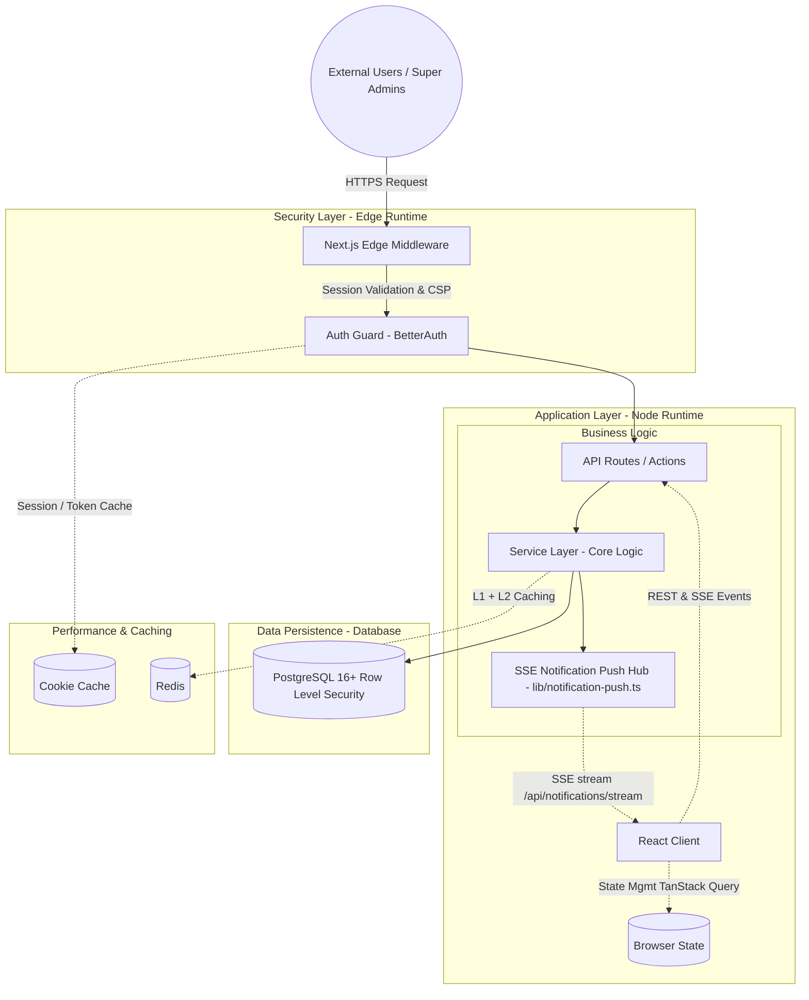
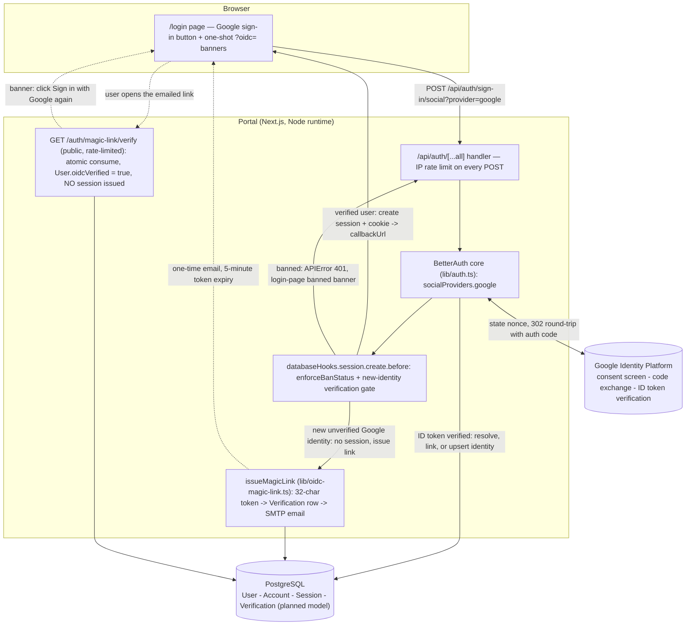
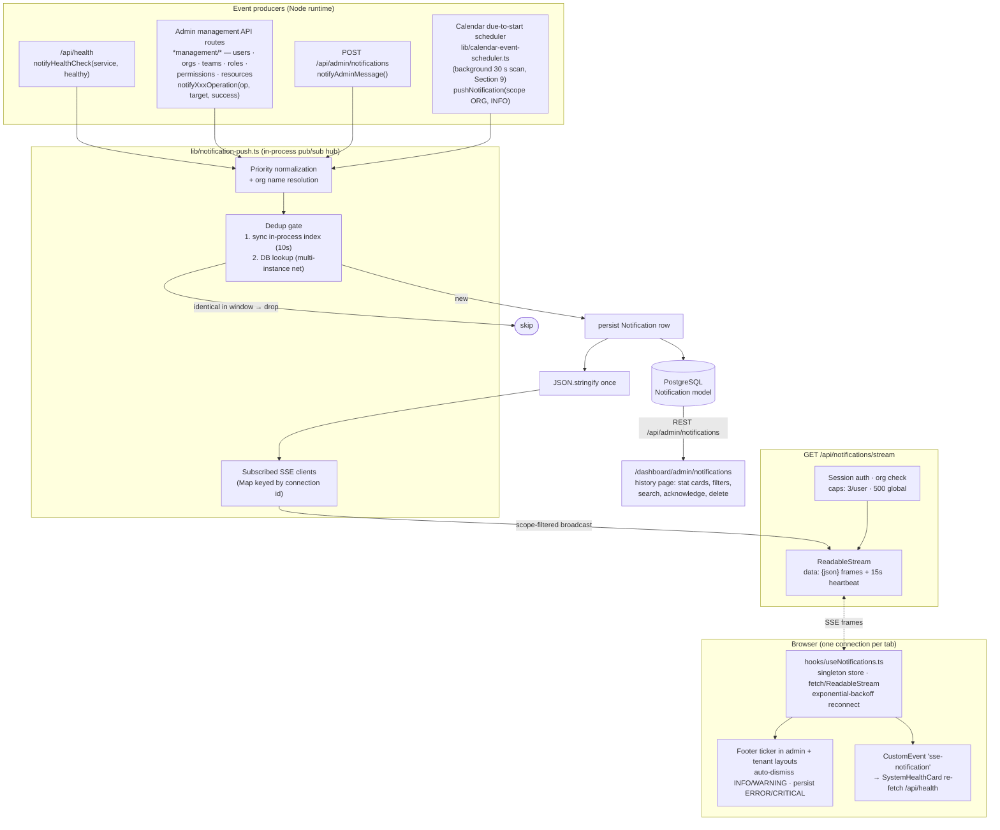
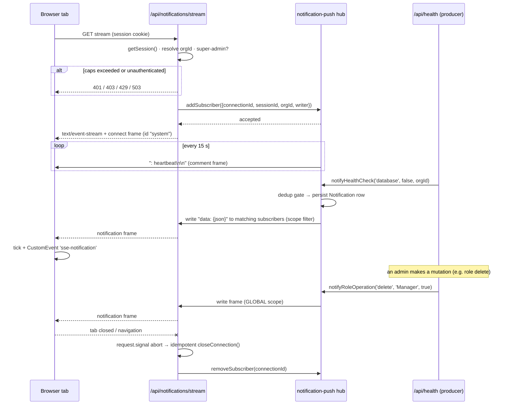
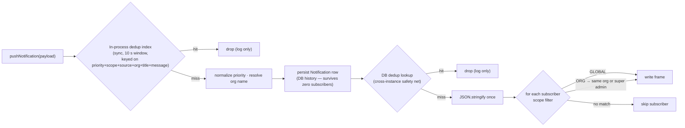
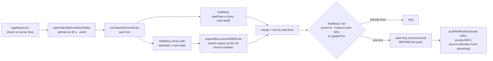
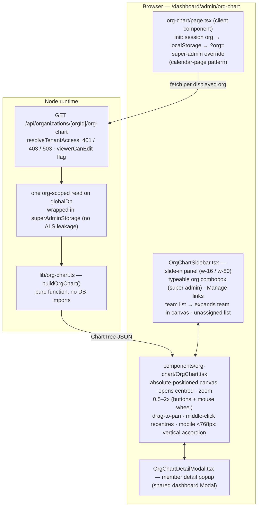
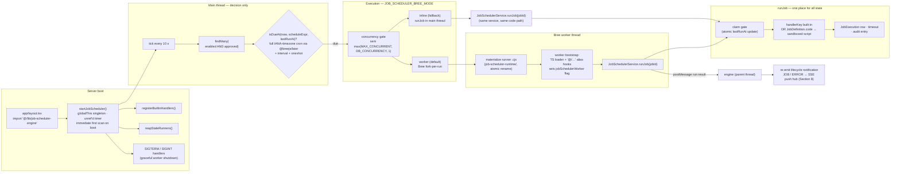

# Property NI Portal — System Architecture

A full-stack, multi-tenant property management system for Northern Ireland's public sector housing authority. It provides a secure, role-based platform for managing organizations (tenants), users, properties, leases, and maintenance requests. The system enforces strict data isolation between organizations using a defense-in-depth architecture combining application-layer query interception and database-level Row Level Security (RLS).

This document is organized by **functional area**. Use the table of contents below to navigate directly to the section you need.

## Table of Contents

- [1. Technology Stack](#1-technology-stack)
  - [Frontend](#frontend)
  - [Backend & Infrastructure](#backend--infrastructure)
  - [Testing & Quality](#testing--quality)
- [2. High-Level Architecture](#2-high-level-architecture)
  - [Component Diagram](#component-diagram)
  - [Layer Responsibilities](#layer-responsibilities)
- [3. Authentication & Session Management](#3-authentication--session-management)
  - [Auth Flow](#auth-flow)
  - [Session Cookies & Caching](#session-cookies--caching)
  - [Auto-Logout on Inactivity](#auto-logout-on-inactivity)
  - [Middleware Protection](#middleware-protection)
  - [Public Routes](#public-routes)
  - [Google OIDC Sign-In & Magic-Link Verification (in development)](#google-oidc-sign-in--magic-link-verification-in-development)
- [4. Authorization (RBAC)](#4-authorization-rbac)
  - [Identity vs. Membership](#identity-vs-membership)
  - [Dual-Authorization Model](#dual-authorization-model)
  - [Permission Resolution Flow](#permission-resolution-flow)
  - [Domain-Specific Permission Modules](#domain-specific-permission-modules)
  - [Role Validation](#role-validation)
- [5. Multi-Tenant Architecture](#5-multi-tenant-architecture)
  - [Defense-in-Depth Strategy](#defense-in-depth-strategy)
    - [Layer 1: Application-Level Isolation](#layer-1-application-level-isolation)
    - [Layer 2: Database-Level Isolation](#layer-2-database-level-isolation)
  - [Tenant Context Propagation](#tenant-context-propagation)
  - [Data Flow](#data-flow)
  - [Tenant-Scoped vs. Global Models](#tenant-scoped-vs-global-models)
- [6. Service Layer](#6-service-layer)
  - [Base Services](#base-services)
  - [Domain Services](#domain-services)
- [7. Data Layer](#7-data-layer)
  - [Core Entities](#core-entities)
  - [Relationships](#relationships)
  - [Indexing Strategy](#indexing-strategy)
  - [Connection Pooling (PgBouncer)](#connection-pooling-pgbouncer)
- [8. Real-Time Notification System (SSE)](#8-real-time-notification-system-sse)
  - [System Overview](#system-overview)
  - [Core Components](#core-components)
  - [Data Model: Scope & Priority](#data-model-scope--priority)
  - [Event Source Catalog](#event-source-catalog)
  - [Connection Security, Caps & Lifecycle](#connection-security-caps--lifecycle)
  - [Deduplication & Delivery Flow](#deduplication--delivery-flow)
  - [Client Architecture](#client-architecture-react-side)
  - [Health Event Integration](#health-event-integration)
  - [Notification Log API](#notification-log-api)
  - [Testing](#testing)
  - [Multi-Instance Limitation](#multi-instance-limitation)
- [9. Calendar System](#9-calendar-system)
  - [Models & Services](#models--services)
  - [Due-to-Start SSE Notifications](#due-to-start-sse-notifications)
  - [Authorization](#authorization)
- [10. Organization Chart](#10-organization-chart)
  - [Architecture](#architecture)
  - [Files & Responsibilities](#files--responsibilities)
  - [Data Flow & API](#data-flow--api)
  - [Tree Shaping Rules](#tree-shaping-rules)
  - [Authorization](#authorization-1)
  - [Test Suites](#test-suites)
- [11. Job Scheduler](#11-job-scheduler)
  - [Components](#components)
  - [Execution modes](#execution-modes)
  - [Concurrency and circuit breaking](#concurrency-and-circuit-breaking)
  - [Built-in handlers](#built-in-handlers)
  - [Operator scripts and dry run](#operator-scripts-and-dry-run)
  - [Approval Gate](#approval-gate)
  - [Data Model](#data-model)
  - [Lifecycle notifications via SSE](#lifecycle-notifications-via-sse)
  - [Admin API](#admin-api)
  - [Testing](#testing-1)
- [12. Cache Architecture](#12-cache-architecture)
  - [Overview](#overview)
  - [Layer 1: In-Memory LRU Cache](#layer-1-in-memory-lru-cache)
  - [Layer 2: Redis (Distributed Cache)](#layer-2-redis-distributed-cache)
  - [Hybrid Cache Orchestration](#hybrid-cache-orchestration)
  - [Adaptive TTL Strategy](#adaptive-ttl-strategy)
  - [Cross-Instance Invalidation](#cross-instance-invalidation)
  - [Stampede Protection](#stampede-protection)
  - [Cache Monitoring & Metrics](#cache-monitoring--metrics)
  - [13. Security](#13-security)
  - [Content Security Policy (CSP)](#content-security-policy-csp)
  - [Data-in-Transit Payload Encryption](#data-in-transit-payload-encryption)
  - [CSRF Protection](#csrf-protection)
  - [Secrets Management](#secrets-management)
  - [PII Logging Policy](#pii-logging-policy)
  - [14. Project Structure](#14-project-structure)
  - [15. Development & Testing](#15-development--testing)
  - [Local Setup](#local-setup)
  - [Running Tests](#running-tests)
  - [Database Migrations](#database-migrations)

---

## 1. Technology Stack

### Frontend

| Component | Version / Library |
|-----------|-------------------|
| Framework | Next.js 15 (App Router) |
| UI Library | React 19 |
| Styling | Tailwind CSS v4 (`@tailwindcss/postcss`, `@tailwindcss/typography`) |
| State / Data Fetching | TanStack Query v5 (React Query) |
| Calendar Engine | rrule v2.8.1 |
| UI Primitives | lucide-react (icons), sonner (toasts) |
| Validation | Zod v4.0.0 |
| Testing | Vitest v4, React Testing Library, jsdom |

### Backend & Infrastructure

| Component | Version / Library |
|-----------|-------------------|
| Runtime | Node.js 22 LTS (pinned, `>=22.0.0 <23.0.0`) |
| API Layer | Next.js App Router (API Routes) + Server Components |
| Authentication | BetterAuth v1.6 (Organization plugin, Teams mode) |
| Database ORM | Prisma 6 (`@prisma/client`) |
| Database | PostgreSQL 16+ |
| Connection Pooler | PgBouncer (port 6432) |
| Cache / Session Store | Redis (`ioredis`) |
| In-Memory Cache | `lru-cache` v11 (L1 cache) |
| Job Engine | Bree v9.2.9 + `@breejs/later` v4.2 — worker-per-run execution (default) with an inline main-thread fallback (`JOB_SCHEDULER_BREE_MODE`) |
| Email | Nodemailer v9.0.3 |
| Logging | Pino (`pino`, `pino-pretty`) |
| Database Driver | `pg` v8.22.0 |

### Testing & Quality

| Tool | Version |
|------|---------|
| Test Runner | Vitest v4.1 (with `@vitest/coverage-v8`) |
| E2E Testing | Playwright v1.62 |
| Type Checking | TypeScript 5.7 (strict mode) |
| Linting | ESLint 9 (flat config, `eslint-config-next`) |
| Formatting | Prettier v3.4 |
| Git Hooks | Husky + lint-staged |

---

## 2. High-Level Architecture

The following diagram illustrates the core components, data flow, and security boundaries of the portal.

### Component Diagram



### Layer Responsibilities

| Layer | Responsibility | Runtime |
|-------|---------------|---------|
| **Edge Middleware** (`middleware.ts`) | Session cookie check, CSP headers, cache control. Fast path — no Prisma. | Edge |
| **API Routes** (`app/api/`) | HTTP request handling, parameter parsing, status codes. Thin wrappers around services. | Node |
| **Service Layer** (`services/`, `lib/services/`) | Business logic: slug generation, complex transactions, multi-step bootstrapping. | Node |
| **Data Layer** (`prisma/schema.prisma`) | Schema definition, relations, RLS policies. | PostgreSQL |
| **Cache Layer** (`lib/cache/`, `lib/redis.ts`) | L1 in-memory + L2 Redis caching with stampede protection and cross-instance invalidation. | Node / Redis |
| **Real-Time Push** (`lib/notification-push.ts`, `app/api/notifications/stream/route.ts`) | SSE notification hub: subscriber registry, two-layer dedup, DB persistence, scope-filtered fan-out to admin & tenant browsers (Section 8). | Node |
| **Domain Services** (`services/`) | Domain business logic: `job-scheduler-service` (platform job engine), `calendar-event-service`, `team-service`, `organization-service`, … | Node |

---

## 3. Authentication & Session Management

### Auth Flow

Authentication is provided by **BetterAuth v1.6**. Email/password is the live sign-in method; Google OIDC sign-in is in development (branch `google-oidc` — see the dedicated subsection below).

1. User submits credentials to `/api/auth/sign-in/email`
2. BetterAuth validates the password hash, creates a `Session` record
3. Sets an HTTP-only session cookie (`__Secure-better-auth.session_token`)
4. In Node.js runtime, the `session` callback resolves user permissions and Super Admin status before returning the session object
5. In Edge runtime (middleware), a lightweight session is returned without permissions to avoid Prisma initialization errors
6. User is redirected to the appropriate dashboard; `AsyncLocalStorage` is populated with `organizationId`

### Session Cookies & Caching

- **Cookie Cache:** Enabled in `lib/auth.ts` (`maxAge: 5 minutes`). Encrypted, signed session cookies that can be validated in Edge runtime without database lookups.
- **Session Expiry:** Absolute maximum lifetime of 1 hour (`session.expiresIn`). Sessions renew on any request when remaining time drops below 15 minutes (`session.updateAge`).
- **Cross-Tab Invalidation:** Logout revokes the session in the database, expires all cookies via `document.cookie`, and performs a hard redirect to bust client-side caches.

### Auto-Logout on Inactivity

A React hook (`hooks/useInactivityTimeout.ts`) listens for `mousemove`, `click`, `keydown`, `scroll`, and `touchstart` events. After a configurable idle period (default 15 minutes, controlled by `INACTIVITY_TIMEOUT_MINS`), the session is terminated: a warning toast appears 30 seconds before timeout, then `signOutUser()` is called to delete the session from the database and redirect to `/login`.

### Middleware Protection

`middleware.ts` performs a fast check for session cookie presence on every non-public route. This avoids Prisma Edge Runtime crashes while ensuring unauthenticated users are redirected to `/login`. Protected routes return `Cache-Control: no-store, max-age=0`, `Surrogate-Control: no-store`, and `Pragma: no-cache` headers to prevent caching of sensitive data.

### Public Routes

The following routes bypass session validation: `/login`, `/register`, `/api/auth/*`, and `/api/health`. The planned magic-link verify route (`/auth/magic-link/verify`) joins this list when the Google OIDC work lands.

### Google OIDC Sign-In & Magic-Link Verification (in development)

Status: **proposed / in build** on branch `google-oidc`. Full design — flow diagrams, account-linking decision matrix, threat table, phased delivery, test strategy: [documents/feature-planning-and-development/google-oidc-design.md](./documents/feature-planning-and-development/google-oidc-design.md). This subsection covers the architectural shape only.

**Integration point.** The login page's "Sign in with Google" button calls `authClient.signIn.social({ provider: 'google', errorCallbackURL: '/login?oidc=inbox-check' })` against the existing `/api/auth/[...all]` catch-all — no new server entry points beyond the one verify route. BetterAuth's built-in `google` provider factory handles the OAuth leg: a signed per-flow `state` nonce guards the callback, and the token exchange plus ID-token verification (signature, audience, expiry, issuer) happen **server-to-server** — the auth code never returns to the browser.



**Component inventory (new/changed by this feature):**

| Piece | Where | Role |
|-------|-------|------|
| Google provider registration | `lib/auth.ts` (`socialProviders.google`) | OAuth leg for the Social door; reuses existing session, cookie, and org-bootstrap hooks — one code path for both sign-in methods |
| Session-creation gate | `lib/auth.ts` `databaseHooks.session.create.before` (new hook) | Single enforcement point all sign-ins funnel through: shared ban helper (`enforceBanStatus`, extracted from the email route hook) plus the `oidcVerified` check — rejects session creation for brand-new Google-only identities before any session exists |
| Magic-link helper | `lib/oidc-magic-link.ts` (new module, not the BetterAuth plugin's public endpoints) | Replicates the plugin's token plumbing: `generateRandomString(32)` → `Verification` row (`identifier=token`, 5-min expiry) → `${FRONTEND_URL}/auth/magic-link/verify?token=…` via the existing nodemailer path. Invoked from exactly two account-creation events (new Google identity; admin create-user without password) — no public self-service endpoint |
| Verify route | `GET /auth/magic-link/verify` (public in `middleware.ts`) | Rate-limited, session-less: looks up + deletes the `Verification` row atomically (single-use by construction), sets `User.oidcVerified = true`, redirects to `/login?oidc=link-verified`. Deliberately does **not** mint a session — sign-in completes only via the second Google click |
| Login UI | `app/login/page.tsx` | Button handler switch; two one-shot `?oidc=` banners (`inbox-check`, `link-verified`) consumed on mount and stripped from the URL; same-origin `callbackUrl` guard. Google icon stays an inline SVG (CSP `img-src 'self'` unaffected). Banned feedback reuses the existing message-keyed banner |
| Admin create-user | `app/api/admin/users/route.ts` + users modal | Passwordless submission calls the shared `issueMagicLink(email)` helper and confirms "a sign-in email has been sent" |

**Account semantics (one account, two doors).** Identity resolution on Google sign-in: an existing `Account(google, sub)` signs in as that linked user; a Google email matching an existing password-only `User` **links** a new `Account` row to it (no shadow users — org membership and history survive); otherwise a fresh `User` + `Account` is created. Ban status applies to both doors identically because enforcement lives at session creation.

**Data model additions:** a `Verification` model (`id`, `identifier`, `value` JSON, `expiresAt`) and `User.oidcVerified Boolean @default(false)` — one migration. `emailVerified` is *not* the marker: Google's token asserts it on sign-up by construction; only the user's own magic-link click (or an admin) flips `oidcVerified`.

**Invariant preserved:** email/password sign-in keeps its exact code path (local users are never gated — the hook blocks only pure-Google unverified identities), verified by the existing integration suite.

---

## 4. Authorization (RBAC)

### Identity vs. Membership

The system explicitly separates global identity from organizational authorization:

| Model | Scope | Purpose |
|-------|-------|---------|
| `User` (Identity) | Global | Authentication principal. The `role` field defines the **System Role** (`super_admin` vs `member`). |
| `Member` (Membership) | Organization | Junction linking a `User` to an `Organization`. Represents presence within a tenant. |
| `Role` (Tenant Authorization) | Organization-scoped | Role definitions within an org (e.g., "Manager", "Technician"). |
| `MemberRole` (Assignment) | Organization-scoped | Links a `Member` to one or more `Roles`. Supports multiple roles per member. |
| `RolePermission` (Capability) | Organization-scoped | Maps `Roles` to atomic `Permissions`. |

### Dual-Authorization Model

| Field | Scope | Purpose | Usage |
|-------|-------|---------|-------|
| `User.role` | Global | Server-side routing & access gates (e.g., `/admin/*` vs tenant dashboard) | Used in middleware, server components, and API route guards to determine *where* a user can go. |
| `MemberRole` | Org-Scoped | Fine-grained permission checks within an organization (e.g., `properties:view`, `tenants:create`) | Used by `<RequirePermission>`, `hasPermission()`, and service-layer authorization checks to determine *what* a user can do. |

`User.role` does **not** grant org-scoped permissions. A `super_admin` bypasses org-scoped checks entirely, but a standard `member` must be assigned `MemberRole`s to perform actions.

### Permission Resolution Flow

When an authorization check is performed (via `hasPermission` or `<RequirePermission>`):

1. **Super Admin Bypass (Fast Path):** If the user's global identity is `super_admin`, access is granted immediately. Super Admins do not have their permissions cached in Redis because they bypass the granular check entirely.
2. **Permission Resolution (Standard Path):** The `resolvePermissions` function in `lib/permissions/resolver.ts`:
   - Checks the hybrid cache (L1 → L2 → DB) for `perm:${userId}:${orgId}`
   - On cache miss, joins: `Member` → `MemberRole` → `RolePermission` → `Permission`
   - Writes the flattened permission list to both L1 and L2 caches (TTL: 5 min, volatile type)
3. **Enforcement:** The resulting permission list is compared against the required `resource:action` string.

### Domain-Specific Permission Modules

The permission system is organized into domain-specific modules under `lib/permissions/`:

| Module | File | Responsibility |
|--------|------|---------------|
| Contractor | `lib/permissions/contractor.ts` | Permissions and validation for contractor-related operations |
| Financial | `lib/permissions/financial.ts` | Permissions and validation for financial operations |
| Maintenance | `lib/permissions/maintenance.ts` | Permissions and validation for maintenance operations |
| Property | `lib/permissions/property.ts` | Permissions and validation for property management operations |
| Resolver | `lib/permissions/resolver.ts` | Core permission resolution with hybrid caching (L1 → L2 → DB) |
| Tenant | `lib/permissions/tenant.ts` | Permissions and validation for tenant-related operations |

### Role Validation

Role names are validated against the organization's role catalog to prevent free-text assignment. The validation utilities in `lib/roles/validation.ts` provide three functions:

- `isValidRoleName(roleName, orgId)` — returns boolean
- `getValidRoleNames(orgId)` — returns list of valid role names (for dropdowns)
- `assertValidRoleName(roleName, orgId)` — throws if invalid (fail-fast in API routes)

Domain-specific role modules under `lib/roles/` provide additional validation and definitions:
- `contractor.ts`, `letting.ts`, `maintenance.ts`, `property-management.ts` — domain role definitions
- `validation.ts` — core role name validation

---

## 5. Multi-Tenant Architecture

### Defense-in-Depth Strategy

The system enforces strict tenant isolation using a **defense-in-depth** approach. If one layer fails, the other acts as a safety net to prevent cross-tenant data leakage.

#### Layer 1: Application-Level Isolation

Located in `lib/tenant-db.ts`, a Prisma `$extends` extension intercepts queries at the application layer:

- **Context Propagation:** The current `organizationId` is stored in Node.js `AsyncLocalStorage` via middleware and `lib/tenant-context.ts`.
- **Query Interception:** The extension automatically injects `organizationId` into the `where`, `data`, `create`, and `update` clauses for tenant-scoped models.
- **Fail-Safe:** If a query executes against a scoped model without an active tenant context, the extension throws `Tenant context missing for scoped query.`, preventing accidental global queries.

#### Layer 2: Database-Level Isolation

PostgreSQL Row Level Security policies are applied to tenant-scoped tables as a secondary safety net. Even if the application layer is bypassed or misconfigured, the database engine rejects any query attempting to access rows belonging to a different `organizationId`. RLS policies use `current_setting('app.current_org_id', true)` to enforce isolation at the database engine level.

### Tenant Context Propagation

1. Request arrives at an API route or Server Component
2. Middleware extracts `organizationId` from the session, stores it in `AsyncLocalStorage` via `lib/tenant-context.ts`
3. Service layer and Prisma queries automatically inherit the context
4. The Prisma extension injects the filter into every tenant-scoped query

### Data Flow

1. **Request arrives** → Middleware checks session cookie presence (Edge-safe, no Prisma)
2. **Tenant context established** → `AsyncLocalStorage` stores the user's `organizationId`
3. **Database query executed** → Prisma extension automatically injects tenant filter into `where` clauses
4. **Response returned** → User only sees data scoped to their organization

### Tenant-Scoped vs. Global Models

| Scope | Models |
|-------|--------|
| **Tenant-Scoped** (protected by Prisma extension + RLS) | `Role`, `RolePermission`, `MemberRole`, `Team`, `TeamMember`, `TeamRole`, `Calendar`, `CalendarEvent` |
| **Global** (not org-scoped; require explicit authorization) | `User`, `Organization`, `Member`, `Permission`, `AuditLog`, `NotificationLog`, `Resource`, `ResourceRole` |

---

## 6. Service Layer

A dedicated `services/` layer sits between the API routes and the database (Prisma). This provides separation of concerns, reusability across entry points (REST API routes, Server Actions, CLI scripts), testability via mocking, transaction management for complex workflows, and reduced complexity in route handlers.

### Base Services

| File | Responsibility |
|------|---------------|
| `lib/services/base-service.ts` | Base class / utilities shared across all domain services |
| `lib/services/error-handler.ts` | Standardized error handling and transformation |
| `lib/services/types.ts` | Shared type definitions for service layer |

### Domain Services

| Service | File | Responsibility |
|---------|------|---------------|
| Organization | `services/organization-service.ts` | Org CRUD, slug generation, lifecycle transitions, bootstrapping with default teams and roles |
| User | `services/user-service.ts` | User CRUD, ban management, organization membership creation |
| Team | `services/team-service.ts` | Team CRUD, membership management, role inheritance (auto-assign on join) |
| Permission | `services/permission-service.ts` | Global permission catalog CRUD |
| Role | `services/role-service.ts` | Org-scoped role CRUD, permission assignment |
| Resource | `services/resource-service.ts` | Global resource catalog CRUD (Super Admin only) |
| Calendar | `services/calendar-service.ts` | Calendar container CRUD, default-calendar bootstrapping (org-scoped) |
| Calendar Event | `services/calendar-event-service.ts` | Event CRUD, recurrence expansion, upcoming events |
| Calendar Notification | `services/calendar-notification-service.ts` | Today's-events email notifications, delivery history |
| Job Scheduler | `services/job-scheduler-service.ts` + `lib/job-scheduler-engine.ts` / `lib/job-scheduler-bree.ts` | Platform-org job engine: main-thread due-scanner, Bree worker-per-run execution (or inline), sandboxed operator scripts, approval gate, concurrency circuit breaker, execution history, lifecycle SSE. |

---

## 7. Data Layer

### Core Entities

| Entity | Scope | Description |
|--------|-------|-------------|
| `User` | Global | Authentication principal with email, password hash, system role (`super_admin`/`member`), ban status (planned: `oidcVerified` flag for the magic-link gate) |
| `Account` | Global | Provider identities: `(providerId, providerAccountId)` — enables Google OIDC sign-in to link to existing users by email match (planned feature, branch `google-oidc`) |
| `Verification` | Global | *(planned)* Magic-link tokens: `id`, `identifier` (the token), `value` JSON (email + kind), `expiresAt` — atomically consumed on verify; one migration alongside `User.oidcVerified` |
| `Organization` | Global | Tenant entity with lifecycle states (`PENDING`, `ACTIVE`, `SUSPENDED`, `ARCHIVED`) |
| `Member` | Global | Junction linking Users to Organizations (many-to-many) |
| `Role` | Org-scoped | Organization-scoped role definitions (bootstrapped defaults vs. custom admin-created) |
| `Permission` | Global | Master catalog of atomic actions (`resource:action` syntax) |
| `RolePermission` | Org-scoped | Maps Roles to Permissions |
| `MemberRole` | Org-scoped | Links Members to Roles (multiple roles per member supported) |
| `Team` | Org-scoped | Sub-organizational groupings (e.g., "Operations", "QA") |
| `TeamMember` | Org-scoped | User-to-team membership within an organization |
| `TeamRole` | Org-scoped | Team-level role definitions mapped to org-scoped `Role` records |
| `Resource` | Global | Catalog of portal feature modules (e.g., "platform", "organizations") |
| `ResourceRole` | Global | Junction linking Resources to org-scoped Roles (feature-level access control) |
| `AuditLog` | Global | Security audit trail recording admin actions across all organizations |
| `NotificationLog` | Global | Tracks email notifications sent by the notification system |
| `Notification` | Global | In-app events pushed over SSE: title, message, priority (`INFO`/`WARNING`/`ERROR`/`CRITICAL`), scope (`GLOBAL`/`ORG`), source tag, optional `organizationId`, and an `acknowledged` admin flag |
| `Calendar` | Org-scoped | Container/namespace for calendar events (one default per org) |
| `CalendarEvent` | Org-scoped | Individual events within a calendar (local datetimes, optional `propertyId`; recurrence stored as RFC 5545 `rrule` JSON + `exdates` Json columns, not a separate model) |
| `JobDefinition` | Platform-org | Job specification. Fields: `name` (unique per org), `description`, `handlerKey`, `code` (operator script source — sandboxed, not eval'd), `scheduleExpr` (JSON), `timezone`, `timeoutMs`, `concurrencyLimit`, `enabled`, the approval gate (`approved` / `approvedBy` / `approvedAt` / `approvalNote`), `lastRunAt` (claim marker), `lastRunStatus`, `createdBy`. |
| `JobExecution` | Platform-org | Per-run record: status (PENDING→RUNNING→SUCCEEDED/FAILED/CANCELLED), trigger (SCHEDULE/MANUAL), actorId, resultJson, error, dryRun flag on the result. Cascading delete from `JobDefinition`. |

### Relationships

- `User` ↔ `Organization`: Via `Member` (many-to-many)
- `User` → `Account`: One-to-many provider identities (`providerId`, `providerAccountId`) — the link target for Google OIDC sign-in (planned feature) and credential accounts for local logins
- `Role` → `Permission`: Via `RolePermission` (one-to-many from Role)
- `Member` → `Role`: Via `MemberRole` (one-to-many from Member)
- `Organization` → `Role`, `Team`, `Calendar`: One-to-many cascading deletes
- `Team` → `TeamMember`, `TeamRole`: One-to-many cascading deletes
- `User` ↔ `Team`: Via `TeamMember` (many-to-many)
- `TeamRole` → `Role`: Many-to-one mapping to org-scoped roles (role inheritance)
- `Resource` → `Role`: Via `ResourceRole` (many-to-many, global junction)
- `Calendar` → `CalendarEvent`: One-to-many cascading delete
- `Notification` → `Organization`: Optional many-to-one (`SetNull` on org delete) — carries the affected tenant for org-level events; NULL for pure global broadcasts

### Indexing Strategy

- Foreign keys are automatically indexed by Prisma.
- Explicit composite indexes on `organizationId` for tenant-scoped models (`Role`, `RolePermission`, `MemberRole`).
- Additional indexes on `AuditLog` for `userId`, `organizationId`, `timestamp`, and `resourceType` to support Super Admin cross-tenant queries.
- Unique constraints on `[userId, orgId]` (Member), `[roleId, permissionId]` (RolePermission), and `[memberId, roleId]` (MemberRole) to prevent duplicates.

### Connection Pooling (PgBouncer)

The system uses **PgBouncer** as a connection pooler between the Node.js application and PostgreSQL. Prisma clients connect to PgBouncer's port (default 6432) instead of the raw PostgreSQL port (5432).

- **Health Monitoring:** The `/api/health` endpoint includes a dedicated PgBouncer health check via `lib/pgbouncer-monitor.ts`. It queries the admin interface for connection counts and pool utilization.
- **System Health Card:** The admin dashboard displays PgBouncer status, latency, and active connections alongside Database and Cache health.
- **Pool Modes:** Configured for `transaction` or `session` pooling depending on requirements.

---

## 8. Real-Time Notification System (SSE)

The platform pushes in-app notifications to every connected browser over a
single Server-Sent Events (SSE) endpoint, `GET /api/notifications/stream`. One
central push service owns the wire format, scoping, deduplication, and
persistence, so any server-side code path — health checks, admin management
APIs, or background schedulers such as the calendar "due to start" scanner
(Section 9) — can surface an event with a one-line call.

### System Overview



Step by step, a notification travels this path:

1. **A producer emits an event** — e.g. `/api/health` detects that the
   database just recovered, or a team-management route finishes a role
   deletion. All producers call one of the typed wrappers in
   `lib/notification-push.ts` (see [Core Components](#core-components)).
2. **The push service normalizes and deduplicates** — priority is coerced to a
   canonical Prisma enum value, then two dedup layers run (see [Deduplication &
   Delivery Flow](#deduplication--delivery-flow)).
3. **It persists before it broadcasts** — every notification is written to the
   `Notification` table first, so history survives even when zero clients are
   connected.
4. **It serializes once and fans out** — the JSON frame is written to each
   matching subscriber's stream: `GLOBAL` goes to everyone; `ORG` goes only to
   that tenant's subscribers plus Super Admins (who have no org binding).
5. **The route handler ships it over SSE** — each connection is a web
   `ReadableStream` with proper `text/event-stream` headers, a 15-second
   heartbeat comment frame (`: heartbeat`) so proxies don't drop idle streams,
   and backlog protection that disconnects clients falling more than 1 MiB behind.
6. **The browser reacts** — the singleton hook appends the item to its store
   (max 20 kept), renders the footer ticker, and mirrors the message to an
   `sse-notification` CustomEvent for pages that want a reaction without a
   connection of their own.

### Core Components

| Component | File | Responsibility |
|-----------|------|----------------|
| SSE endpoint | `app/api/notifications/stream/route.ts` | Auth, org validation, connection caps, `ReadableStream` response, connect frame, disconnect cleanup (`force-dynamic`) |
| Push hub | `lib/notification-push.ts` | Subscriber registry, dedup index, persistence, scope-filtered broadcast, heartbeat loop, and all typed producer wrappers |
| Client hook | `hooks/useNotifications.ts` | Singleton connection + store (via `useSyncExternalStore`), reconnect with backoff, auto-dismiss timers, CustomEvent mirroring |
| Ticker UI | `app/admin/layout.tsx`, `app/dashboard/admin/layout.tsx` | Footer ticker rendered once per layout — every admin/tenant page inherits it |
| Reactive consumers | `components/admin/SystemHealthCard.tsx` | Listens for the mirrored `sse-notification` event; re-fetches `/api/health` immediately on health-check sources (60 s poll remains as safety net) |
| History API + UI | `app/api/admin/notifications/route.ts`, `app/dashboard/admin/notifications/page.tsx` | Notification log: filters, search, stat cards, acknowledge/delete |

### Data Model: Scope & Priority

Events are stored in the global `Notification` model (distinct from
`NotificationLog`, which tracks *email* deliveries for calendar events):

| Field | Values | Meaning |
|-------|--------|---------|
| `priority` | `INFO` · `WARNING` · `ERROR` · `CRITICAL` · `CALENDAR` · `JOB` | Display weighting. `INFO`/`WARNING` auto-dismiss from the ticker after 10 s; `ERROR`/`CRITICAL`/`CALENDAR`/`JOB` persist until manually dismissed. Health failures push `CRITICAL`. `CALENDAR` (green) is for upcoming-event reminders; `JOB` (purple) is for job-scheduler telemetry. |
| `scope` | `GLOBAL` · `ORG` (default) | **Who receives it live over SSE.** `GLOBAL` = every connected subscriber; `ORG` = that tenant's subscribers plus Super Admins only. |
| `source` | e.g. `health-check:database`, `admin:role-management` | Machine-readable event family; powers filters, search, and page-level reactions (health card keys off these). |
| `organizationId` | nullable | Carries the affected tenant for org-level operations so the log can attribute them; NULL for pure global broadcasts. Org deletion is `SetNull`. |
| `acknowledged` | boolean, default `false` | Admin triage flag; toggled from the notification log page. |

Key rule: **scope gates live delivery, not historical visibility.** Super
Admins see every persisted notification in the log regardless of scope.

### Event Source Catalog

Every currently wired producer, with its success/failure priorities:

| Source | Wrapper (`lib/notification-push.ts`) | Events | Success / Failure priority | Scope |
|--------|--------------------------------------|--------|----------------------------|-------|
| `health-check:database` | `notifyHealthCheck('database', …)` | DB down / first healthy after boot / recovery | INFO / **CRITICAL** | GLOBAL |
| `health-check:cache` | `notifyHealthCheck('cache', …)` | Redis up/down transitions | INFO / CRITICAL | GLOBAL |
| `health-check:pgbouncer` | `notifyHealthCheck('pgbouncer', …)` | Pooler up/down transitions | INFO / CRITICAL | GLOBAL |
| `admin:user-management` | `notifyUserOperation(op, target, success, err?)` | user create · update · delete | INFO / ERROR | GLOBAL¹ |
| `admin:organization-management` | `notifyOrganizationOperation(…)` | org create · update · **archive** (no hard deletes — archive is terminal) | INFO / ERROR | GLOBAL¹ |
| `admin:team-management` | `notifyTeamOperation(…)` | team create · update · delete | INFO / ERROR | GLOBAL¹ |
| `admin:role-management` | `notifyRoleOperation(…)` | role create · update · delete | INFO / ERROR | GLOBAL¹ |
| `admin:permission-management` | `notifyPermissionOperation(…)` | permission create · update · delete | INFO / ERROR | GLOBAL (no org — global catalog) |
| `admin:resource-management` | `notifyResourceOperation(…)` | resource create · update · delete | INFO / ERROR | GLOBAL (no org — global catalog) |
| `admin:message` | `notifyAdminMessage(title, message, orgId?, priority?)` | Admin broadcast via `POST /api/admin/notifications` | caller-selected (default INFO) | GLOBAL or ORG |
| `calendar:event-upcoming` | direct `pushNotification(...)` from `lib/calendar-event-scheduler.ts` | One alert per event instance that starts within the lead window (default 15 min), single + recurring (exdate-aware) | INFO | ORG (event's tenant)² |
| `job-scheduler:execution` | `pushNotification(...)` — worker path via the engine (parent thread re-emits on receipt of the run result; inline/trigger runs emit in place) | Successful job run (SCHEDULE or MANUAL); JOB priority for operational visibility; the worker's own emission is skipped (its SSE subscriber registry is an empty thread-local copy) and DB dedup collapses any double | JOB | GLOBAL |
| `job-scheduler:failure` | same wiring, with the failure reason carried through `RunResult.error` | Failed job run (handler throws or times out); ERROR priority to alert administrators | ERROR | GLOBAL |
| `job-scheduler:worker-error` | `pushNotification(...)` in `lib/job-scheduler-bree.ts` | The worker engine itself failed (fork crashed, dispatch error) — the run reports SKIPPED; surfaced so a stuck lastRunAt doesn't hide | ERROR | GLOBAL |
| `job-scheduler:throttled` | `pushNotification(...)` in `lib/job-scheduler-concurrency.ts` (debounced to ≤ 1/min) | A run queued > 1 s for a concurrency slot — the circuit breaker is saturated | WARNING | GLOBAL |

¹ Sent `GLOBAL` so all Super Admins see platform operations everywhere, but the
affected `organizationId` is passed through so the log attributes the event to
the right tenant.
² The scheduler runs outside request scope and scans **all** organizations;
tenant isolation is enforced at delivery via the ORG scope + the event's own
`organizationId` (only that tenant's subscribers plus Super Admins receive it).

### Connection Security, Caps & Lifecycle

The stream endpoint enforces:

- **Authentication** — 401 without a valid BetterAuth session; anonymous access is impossible.
- **Org binding** — 403 for non-admin users with no active organization (they have nothing to receive); an optional `?orgId=` param may override the connection's scope only if it matches the user's own org, or for Super Admins (who see all).
- **Per-user cap** — max **3** SSE connections per session (extra tabs: 429), preventing StrictMode/tab-doubling abuse.
- **Global cap** — max **500** total connections (503 when saturated), bounding memory on long-lived streams.
- **Backpressure** — a client whose stream backlog exceeds 1 MiB is dropped rather than allowed to grow unbounded.



### Deduplication & Delivery Flow

High-frequency producers (health polling is the main case) can emit the same
title/message in a very short window — e.g. two `/api/health` requests racing
at boot both see "no previous state" and would each push a "first healthy"
notification. Two layers prevent that:



- **Layer 1 — synchronous in-process index.** Checked *and* marked atomically
  (single-threaded event loop) before any `await`, closing the TOCTOU gap the
  DB check has. Window: 10 s; entries opportunistically pruned past 256.
- **Layer 2 — database lookup.** An identical persisted row within the window
  means another instance (or a previous race in this process) already pushed it.
- The hub state (subscriber map, dedup index, heartbeat timer) lives on
  `globalThis` deliberately: Next.js dev mode can evaluate a module twice per
  process, and plain module-level state would give each copy an invisible
  separate subscriber registry — the "my subscribers are invisible to
  pushNotification" bug.

### Client Architecture (React Side)

- **One connection per tab, full stop.** `hooks/useNotifications.ts` starts a
  module-level singleton (100 ms after load so React StrictMode's double mount
  settles); every component consumes the shared store through
  `useSyncExternalStore` instead of opening its own stream.
- **Transport:** plain `fetch('/api/notifications/stream', {credentials:
  'include'})` reading a `ReadableStream` — cookie auth with no token-in-URL,
  which native `EventSource` can't do. Frames are parsed off the `data:` prefix,
  deduplicated by id, and capped at 20 in memory.
- **Reconnect:** exponential backoff `min(1s · 2^attempts, 30s)`; a clean
  stream end retries after 2 s; attempts reset on success.
- **Ticker behavior:** INFO/WARNING auto-dismiss after 10 s; ERROR/CRITICAL
  remain until dismissed; per-item dismiss and "clear all" are exposed by the
  hook.
- **Event mirroring:** each received message is re-dispatched as a
  `sse-notification` window CustomEvent, so any page can react (the system
  health card refetches on `health-check:*` sources) without holding its own SSE
  connection or duplicating state.
- The legacy bell in `features/notifications/` is a separate,
  poll-based inbox (React Query, 30 s when focused, paused when backgrounded —
  see `tests/integration/notification-reliability.test.tsx`); it intentionally
  never opens its own SSE connection so the per-user cap isn't a footgun.

### Health Event Integration

`/api/health` (`app/api/health/route.ts`) tracks each service's previous state
via `lib/system-logs.ts` and calls `notifyHealthCheck(service, healthy,
platformOrgId)` **only on transitions**: first check after boot (so admins know
the DB is up), failure onset (CRITICAL), and recovery (INFO). Polling ticks
that see no change push nothing — the dedup gate above remains as a backstop.

### Notification Log API

| Method | Route | Auth | Purpose |
|--------|-------|------|---------|
| `GET` | `/api/notifications/stream[?orgId=]` | valid session | Open the live SSE stream (401/403/429/503 as above) |
| `POST` | `/api/admin/notifications` | Super Admin + rate limit | Broadcast: `{title, message, scope: 'global'\|'org', organizationId?, priority?}` — scope requires a valid org id either way (a global sent on behalf of an org carries that org in the log) |
| `GET` | `/api/admin/notifications` | Super Admin | List with filters: `page`, `pageSize` (50), `scope`, `priority`, `organizationId`, `acknowledged`, `search` (source/message). Returns rows plus `counts` (total, per-priority, acknowledged) for the stat cards |
| `PATCH` | `/api/admin/notifications?id=…` | Super Admin | Mark acknowledged |
| `DELETE` | `/api/admin/notifications?id=…` | Super Admin | Remove a log entry |

### Testing

- **Unit** — one suite per producer family: `tests/unit/notify-health-check.test.ts`, `notify-user-operation.test.ts`, `notify-organization-operation.test.ts`, `notify-team-operation.test.ts`, `notify-role-operation.test.ts`, `notify-permission-operation.test.ts`, `notify-resource-operation.test.ts`. Coverage includes success/failure titles, priority selection, `source` and `organizationId` propagation, concurrent-push deduplication, org scope non-dedup, and swallowed persistence failures.
- **Calendar scheduler** — `tests/unit/calendar-event-scheduler.test.ts` covers the "due to start" producer: lead-window discovery, recurring expansion with exdates, per-instance (not once-ever) dedup, ORG-scoped payload shape, lost-not-resent push-failure semantics, DB-failure resilience, per-scan cap, and timer idempotency (Section 9).
- **Integration** — `tests/integration/notification-reliability.test.tsx` verifies the client's focus/blur-aware polling logic (listener attach/detach, event response) for the poll-based inbox hook.

### Multi-Instance Limitation

The subscriber registry and dedup index are **in-process** (`globalThis`) by
design of a single-instance deployment: a push only reaches clients connected
to *this* server process. Cross-instance, every instance still persists to the
shared `Notification` table, so history in the log is complete regardless of
which instance handled the event — but a client on instance B would not
instantly receive an event pushed by instance A. Scaling out requires relaying
pushes through a shared broker (e.g. the same Redis Pub/Sub pattern used for
cache invalidation) plus a shared dedup store; this is tracked as deferred work
(see README, Appendix F). The calendar due-to-start scheduler (Section 9) has
the same per-process property: its `firedKeys` set lives on `globalThis`, so N
instances would each emit one alert per detected event instance — another
input to the shared-dedup-store work above.

---

## 9. Calendar System

### Models & Services

| Model | Scope | Description |
|-------|-------|-------------|
| `Calendar` | Org-scoped | Container/namespace for events (one default per org, multiple supported) |
| `CalendarEvent` | Org-scoped | Individual events (local datetimes, optional `propertyId`; RFC 5545 `rrule` JSON + `exdates` Json columns on the event itself — there is no separate recurrence model) |

Services:
- `services/calendar-service.ts` — Calendar CRUD, default-calendar bootstrapping (org-scoped)
- `services/calendar-event-service.ts` — Event CRUD, recurrence expansion, upcoming events
- `services/calendar-notification-service.ts` — Today's-events email notifications
- `lib/calendar-event-scheduler.ts` — "Due to start" background scan that pushes live SSE notifications (see below; not a request-scoped service)

Recurrence handling is supported by:
- `lib/recurrence-rrule.ts` — rrule library integration (RFC 5545 rules stored as JSON on the event); shared by the API service *and* the due-to-start scheduler so both expand instances identically
- `lib/recurrence.ts` — Display/formatting helpers
- `lib/recurrence-scopes.ts` — Scoping logic for recurrence instances

### Due-to-Start SSE Notifications

Calendar events push live "due to start" alerts through the platform SSE system
documented in [Section 8 — Real-Time Notification System](#8-real-time-notification-system-sse) —
no calendar-specific stream or client-side polling exists. The producer is
`lib/calendar-event-scheduler.ts`, a background scanner booted once per server
process alongside the health checks (side-effect import in `app/layout.tsx`,
`globalThis`-keyed state so dev-mode's duplicate module evaluation can't fork it):



Key properties:

- **Lead window** `(now, now + LEAD_TIME_MINUTES]` (default 15 min). An event is
  in scope while it starts between "just after the last tick" and the end of the
  window; each new instance inside it is notified exactly once per process
  lifetime via the `firedKeys` in-memory set. No schema migration was needed —
  the accepted cost is that a restart can re-notify an event still in its lead
  window, at most one extra time.
- **Recurring parity** — series are expanded with `expandRecurrenceWithRrule()`
  (the same function `calendar-event-service.ts` uses), so an alert always
  matches a rendered calendar instance, and dragged-to-elsewhere occurrences
  (`exdates`) never alert for their excluded date.
- **Tenant isolation** — the scanner is request-scope-free and reads *all*
  orgs' events; isolation is enforced at delivery: each alert carries the event's
  `organizationId` with `ORG` scope, so only that tenant's subscribers (plus
  Super Admins) receive it.
- **Resilience** — a DB failure aborts the tick quietly and retries next interval;
  a failed push is claimed anyway (lost-not-resent — no retry storms when SSE is
  down); a per-scan cap (`CALENDAR_MAX_EVENTS_PER_SCAN`, default 20) bounds bursts.
- **Consumption** — the tenant dashboard's footer ticker renders the message
  ("Calendar event due to start: …") like any other SSE notification; it is also
  persisted to the `Notification` table and visible in the admin log, filterable
  by `source = calendar:event-upcoming`.
- **Configuration** — `CALENDAR_EVENT_SCAN_INTERVAL_MS` (30 000),
  `CALENDAR_LEAD_TIME_MINUTES` (15), `CALENDAR_MAX_EVENTS_PER_SCAN` (20).

Full design rationale, trade-offs (restart duplicates, lost-not-resent, per-scan
cap, cross-process dedup) and limitations:
[documents/feature-planning-and-development/calendar-event-sse-notifications.md](./documents/feature-planning-and-development/calendar-event-sse-notifications.md).

The other two module-load schedulers (health checks, this scanner) are
`isMainThread`-guarded for the same reason as the SSE hub: Bree job-scheduler
worker threads import these modules transitively via their runner bootstraps,
and an unguarded per-fork interval would double every 30 s scan.

The other calendar-owned notification flow is **email** dispatch for today's
events, handled by `lib/notifications/dispatcher.ts`, with delivery via
`lib/notifications/email.ts` (nodemailer) and event definitions in
`lib/notifications/events.ts`.

### Authorization

Every `/api/organizations/[orgId]/calendar*` route verifies the session (401) and membership in the URL's organization via `globalDb.member.findFirst` (403 for non-members). Mutations call `requireAnyAdmin(ctx)` — only tenant admins can modify data; members are read-only. Permissions: `calendar:read`, `calendar:create`, `calendar:update`, `calendar:delete` are seeded into the permission catalog.

---

## 10. Organization Chart

The org chart is a **read-only, live view of an organization's people** — an
interactive tree of **organization → teams → members**, each member carrying
their BetterAuth membership role, assigned roles, and permission keys. It is a
pure projection of existing tenant data (`Organization`, `Team`, `TeamMember`,
`Member`, `MemberRole`, `RolePermission`, `Permission`): **no new tables, no
migration**. The page lives at `/dashboard/admin/org-chart` inside the
admin dashboard, full-bleed like the calendar (the layout's
`isFullScreenPage` condition covers both paths), with a matching left-nav
entry ("Org Chart", `Network` icon).

### Architecture



### Files & Responsibilities

| Component | File | Responsibility |
|-----------|------|----------------|
| Page | `app/dashboard/admin/org-chart/page.tsx` | Client component: active-org init (session → localStorage → `?org=` super-admin override against `/api/admin/organizations/list`), tree fetch per org, loading / no-org / error+retry states. |
| API route | `app/api/organizations/[orgId]/org-chart/route.ts` | Single GET endpoint: authorization gate, one Prisma read, member-role and team-membership assembly, delegates shaping to `lib/org-chart.ts`. |
| Tree shaper | `lib/org-chart.ts` | Pure functions (`buildOrgChart`, `resolvePrimaryTeamSlug`, `pickPrimaryTeamSlug`) — unit-testable without a database; also the single source of the `ChartTree` / `ChartMember` types. |
| Canvas | `components/org-chart/OrgChart.tsx` | Desktop tree canvas (org node toggles the team row — visible by default — per-team member expand/collapse, zoom 50–200% via buttons or mouse wheel anchored at the cursor, drag-to-pan, opens centred in the viewport, re-centres via button or middle-click), responsive accordion below 768 px, owns the detail-modal state. |
| Node | `components/org-chart/OrgChartNode.tsx` | One org / team / member node: `role="treeitem"`, `aria-level` (1/2/3), `aria-expanded`, keyboard-operable `<button>`. |
| Sidebar | `components/org-chart/OrgChartSidebar.tsx` | Slide-in panel mirroring `CalendarSidebar`: collapsed/expanded, typeable org combobox for Super Admins, Manage links (organization settings / members / roles) shown when `viewerCanEdit`, team list that expands the matching tree node, unassigned member list. |
| Detail modal | `components/org-chart/OrgChartDetailModal.tsx` | Member popup: email, membership role, assigned roles with expandable permission keys, all team memberships. |
| Types | `components/org-chart/types.ts` | Re-exports the shaper's types so page and components share one type source with the API route. |

The canvas attaches its `wheel` listener natively with `{ passive: false }`
(React's synthetic `onWheel` is registered passive and cannot
`preventDefault()`, which would let the page scroll behind the canvas) and
mirrors zoom/pan into refs so rapid wheel ticks always compute against current
values; middle-click (`button === 1`) recentres the diagram (100% zoom,
content centred in the viewport — also the default start position for each
displayed org) and suppresses the browser's autoscroll gesture.

### Data Flow & API

One endpoint serves the whole chart:

| Route | Methods | Purpose |
|-------|---------|---------|
| `/api/organizations/[orgId]/org-chart` | GET | Full org tree — `organization`, `teams[]` (each with `members[]`), `unassigned[]`, and `viewerCanEdit`. Each member carries `name`, `email`, `memberRole` (BetterAuth role), `assignedRoles[]` (`name` + `permissionCount` + permission `resource:action` keys), and `teams` (all team slugs). |

Server-side, the route performs **one** org-scoped `globalDb.organization.findUnique`
(teams → members → user; members → memberRoles → role → permissions) wrapped in
`superAdminStorage.run(true, …)` so the unscoped client's `AsyncLocalStorage`
context cannot leak — the same guard pattern as the calendar routes. The route
then flattens rows into `BuildOrgChartInput`: one entry per `Member` row
(those are the authoritative membership list), with `teamSlugs` ordered by
primary-membership rule (earliest `TeamMember.createdAt`, ties broken by team
name — `pickPrimaryTeamSlug`), and hands it to the pure shaper.

**Response shape:**

| Field | Meaning |
|-------|---------|
| `organization` | `{ id, name, description }` |
| `teams[]` | Alphabetical by name; each team `{ id, slug, name, description, members[] }` |
| `unassigned[]` | Org members with no usable team membership (alphabetical) |
| `viewerCanEdit` | `true` for platform admins / tenant admins of the viewed org; clients use it to render edit affordances (v1 is read-only) |

### Tree Shaping Rules

`buildOrgChart()` in `lib/org-chart.ts` enforces:

- **Teams alphabetical** by name; **members alphabetical** within each bucket.
- **1:1 team display (v1):** each member renders under exactly one team — the
  first slug that matches a real org team (primary membership). All memberships
  remain visible in `ChartMember.teams` and the detail modal. Schema/index-level
  1:1 enforcement is deferred; no data is mutated.
- **Unassigned bucket:** members with no team slugs, or only slugs foreign to
  the org, land in `unassigned` — never silently dropped.

### Authorization

The route uses the shared `resolveTenantAccess` gate (`lib/tenant-access.ts`)
— the same authorization as the calendar and teams routes:

| Caller | Result |
|--------|--------|
| Unauthenticated | 401 |
| Member of `orgId` | 200, own org's chart only; `viewerCanEdit = (membership.role === 'admin')` |
| Member of a *different* org, not super admin | 403 |
| Super Admin (Platform Organization member) | 200 for **any** `orgId`, `viewerCanEdit: true` (PLATFORM_ADMIN) |
| DB failure during access check | 503 — fails closed |

The read is org-scoped at the query root, so the shaper cannot cross tenant
boundaries; the RLS layer remains as a second net. The seeded permissions
`org-chart:read` / `org-chart:update` (`prisma/seed.ts`) are in the global
catalog for future role-level tightening; v1 gating is membership/admin-status
only, matching calendar access.

### Test Suites

- **Unit** — `tests/unit/org-chart-tree.test.ts`: shaper contracts (team/member
  ordering, 1:1 placement, unassigned fallback, primary-membership selection,
  empty-org) with no database needed.
- **Integration** — `tests/integration/org-chart.test.ts`: the authorization
  matrix (401 anonymous, 403 non-member/other tenant, 200 member +
  `viewerCanEdit` for tenant admin / super admin), 1:1 rendering, roles and
  permission keys on member nodes, 404 for a missing org.

Full design spec, decisions, risks, and deferred work (drag-and-drop edits,
reporting lines, v2 tenant page):
[documents/feature-planning-and-development/interactive-org-chart.md](./documents/feature-planning-and-development/interactive-org-chart.md).

---

## 11. Job Scheduler

The platform runs a **background job scheduler** — a general-purpose execution
layer for platform automation (and the substrate for operator-authored scripts).
It is **platform-organization only**: tenant users cannot define, view, trigger,
or inspect jobs.



The split is deliberate: **the main-thread scanner decides *when* a job is due;**
**`runJob` alone owns all run state** — the DB claim gate, `JobExecution` row,
timeout, audit trail, and notification. Because the worker path calls the same
`runJob`, a forked run and an inline run produce identical execution history.

### Components

| Component | File | Responsibility |
|-----------|------|---------------|
| Engine (scanner) | `lib/job-scheduler-engine.ts` | 10 s poll of `JobDefinition`; due-detection (`isDueAt`, full IANA-timezone-aware cron via `@breejs/later` occurrence walks + interval + oneshot); dispatch through the concurrency gate; graceful shutdown handlers. State on `globalThis`, timer `unref`'d — survives Next.js dev double-evaluation, never blocks process exit. |
| Bree executor | `lib/job-scheduler-bree.ts` | Worker-per-run execution: materializes file-based CJS runners, forks via Bree (`node:worker_threads`), marshals results back with `postMessage`, enforces the per-run wall cap (`HARD_CAP_MS = 30 min` backstop over the job's own `timeoutMs`). |
| Concurrency gate | `lib/job-scheduler-concurrency.ts` | Global circuit breaker + DB-connection ceiling (see below). Emits a debounced WARNING SSE alert when runs queue past 1 s. |
| Built-in handlers | `lib/job-scheduler-builtins.ts` | The trusted, audited handler set (`noop`, `health-check`, `calendar-health-check`, `calendar-selftest`). Side-effect-free module so it can re-register inside every fork. |
| Sandbox script runner | `lib/job-scheduler-script-runner.ts` | Executes operator-authored `JobDefinition.code` in a Node `vm` sandbox (see below). |
| Service | `services/job-scheduler-service.ts` | The single platform-only interface: job CRUD, the approval gate, the DB-backed claim gate, handler dispatch, execution lifecycle + SSE, dry-run, execution history. Every public method runs `requirePlatformAdmin(ctx)`. |

### Execution modes

- **`worker` (default)** — each due run forks a fresh Bree worker thread
  (Phase 0 spike invariants: at most one live worker per run key; runners are
  file-based, never eval'd). The fork buys real isolation for operator scripts
  and is safe for built-ins.
- **`inline`** — the main thread runs `runJob` directly. Phase 1 fallback /
  rollback path (and used by tests); no fork cost per run.

The worker side cannot rely on anything the main process set up, so the
bootstrap (`job-scheduler-worker-bootstrap.cjs`, materialized by
`lib/job-scheduler-bree.ts`) registers a per-worker `node:module.registerHooks`
loader (Node ≥ 22.15) that transpiles project `.ts` files to CJS and resolves
both `@/…` aliases and extensionless relative imports to TypeScript candidates.
It is rewritten **only when the template content changed** (byte-identical
files are kept), so loader fixes in `job-scheduler-bree.ts` take effect on the
next run instead of outliving a freshness window. Bree and its deps stay
webpack-external (`serverExternalPackages` in `next.config.ts`) so the workers
see real filesystem paths.

**Worker-thread threading rules** (why some things happen in the parent):

- A worker is its own thread: module state, the Prisma client, and especially
  the SSE subscriber registry are **thread-local copies**. The bootstrap sets a
  `globalThis.jobSchedulerWorker` flag; `runJob` skips its own
  SUCCEEDED/FAILED notification when the flag is set, and the **engine parent
  re-emits it** on receipt (identical payload shape → the push hub's 10 s dedup
  collapses any double). SKIPPED runs announce nothing, matching inline mode.
- The health-check and calendar-event scanners that boot off module load are
  `isMainThread`-guarded for the same reason — a per-fork copy of their 30 s
  interval would double every scan (each worker sees its own "fresh"
  singleton).

### Concurrency and circuit breaking

Every run holds one slot in the process-wide semaphore for its full duration,
sized `max(JOB_SCHEDULER_MAX_CONCURRENT, JOB_SCHEDULER_DB_CONCURRENCY, 1)`
(`lib/job-scheduler-concurrency.ts`):

- `JOB_SCHEDULER_MAX_CONCURRENT` (default **5**) — the *runtime* circuit
  breaker: caps simultaneous runs / forked workers against a burst of due jobs.
- `JOB_SCHEDULER_DB_CONCURRENCY` (default **100**) — the *connection-pool
  ceiling*, sized below PgBouncer `max_client_conn`, so concurrent in-process
  Prisma clients can never exceed it even if the runtime cap is raised.
- A run waiting > 1 s for a slot emits at most one (debounced, per minute) WARNING-level SSE
 alert (`job-scheduler:throttled`) so a saturated circuit is operator-visible
 without a notification storm.

### Built-in handlers

Operators reference a handler by `handlerKey`; they cannot define new ones
(operator code takes the sandboxed-script path). Registered idempotently as
plain standalone functions (no closures over module state), so they survive the
worker boundary unchanged:

| handlerKey | Purpose | Emission |
|------------|---------|----------|
| `noop` | End-to-end smoke test; proves create → approve → enable → trigger → execute → SSE. | (result only) |
| `health-check` | Platform health probe; alert on any unhealthy check, silent when healthy. | `ERROR` / `job-scheduler:health-check` on unhealthy |
| `calendar-health-check` | Probes the calendar "due to start" pipeline; a thrown discovery **fails** the run. | (result only) |
| `calendar-selftest` | Emits one `CALENDAR`-priority probe to prove the notification path is reachable (optional `{ title, message }` input). | `CALENDAR` / `job-scheduler:calendar-selftest` |

### Operator scripts and dry run

A job may carry `handlerKey` *or* `JobDefinition.code` — operator-authored
JavaScript executed in a sandboxed VM **inside** the worker (defense in depth;
worker isolation alone is not security isolation):

- **Explicit surface only** — the script sees `ctx.{input, jobDefinitionId,
  platformOrgId, trigger, dryRun}`, `log`, and `capabilities.notify(text)`. No
  ambient globals: `process`, `require`, timers, `fetch`, `__dirname`, and ~25
  other host identifiers are blocked by a **static denylist scan** (comments /
  string-literal aware; needed because V8's `typeof` fast path bypasses Proxy
  traps) *and* by runtime Proxy traps that throw on `constructor` / `prototype`
  / `__proto__` / `__*` access. Code is capped at 50 KB.
- **Dry-run** — `dryRunJob` runs the script with `dryRun: true`: capabilities
  become no-op recorders, nothing is committed or emitted for real; the
  execution row records `dryRun: true` + `capabilitiesUsed`. New jobs default to
  dry-run only when `JOB_SCHEDULER_DRYRUN_DEFAULT=true`.

### Approval gate

Every newly created `JobDefinition` starts `enabled: false, approved: false`.

The **approval gate** is the control that moves a job from "defined" to "may
execute": a platform admin must approve the job before it can be enabled,
manually triggered, dry-run, or run on its schedule.

- `enableJob` throws if not approved; `updateJob` with `enabled: true` throws;
  `triggerJob` / `dryRunJob` require **both** `enabled: true` and
  `approved: true`.
- The scanner's `findMany` additionally requires `approved: true` (defense in
  depth: no job ever runs unreviewed, even against a corrupted row).
- `approveJob` / `rejectJob` record `approvedBy`, `approvedAt`, and an optional
  `approvalNote`, plus a durable `job.approved` / `job.rejected` audit entry.
  Re-approval is idempotent (refreshes approver/timestamp, no duplicate audit);
  rejection clears approval and disables the job.

### Data model

Two platform-org-scoped models in `prisma/schema.prisma`:

- **`JobDefinition`** — the job specification: `platformOrgId` (owner), `name`
  (unique per org), `description`, `handlerKey`, `code` (operator script,
  `null` for built-ins), `scheduleExpr` (JSON), `timezone`, `timeoutMs`,
  `concurrencyLimit`, `enabled`, the **approval gate** fields (`approved` /
  `approvedBy` / `approvedAt` / `approvalNote`), `lastRunAt` (claim marker),
  `lastRunStatus`, `createdBy`.
- **`JobExecution`** — per-run record: `status` (PENDING → RUNNING → SUCCEEDED /
  FAILED / CANCELLED), `trigger` (SCHEDULE / MANUAL), `actorId`, `resultJson`,
  `error`, `startedAt` / `finishedAt`. Cascading delete from `JobDefinition`.

### Lifecycle notifications via SSE

| Event | Priority | Scope | Source |
|-------|----------|-------|--------|
| Job succeeded (scheduled, manual, or dry-run's parent re-emit) | `JOB` | GLOBAL | `job-scheduler:execution` |
| Job failed (handler throws / times out; carries the failure reason) | `ERROR` | GLOBAL | `job-scheduler:failure` |
| Worker engine itself fails (fork crash, dispatch error) | `ERROR` | GLOBAL | `job-scheduler:worker-error` |
| Concurrency circuit saturated (run queued > 1 s) | `WARNING` | GLOBAL | `job-scheduler:throttled` |
| `health-check` handler detects unhealthy platform | `ERROR` | GLOBAL | `job-scheduler:health-check` |
| `calendar-selftest` handler fires | `CALENDAR` | GLOBAL | `job-scheduler:calendar-selftest` |

Routine job lifecycle uses the dedicated `JOB` priority so it stays visually
distinct from alert colours in the ticker (the same reasoning that justified
`CALENDAR`).

### Admin API

All `requireSuperAdmin`-guarded, all `wrapPiiRoute`-wrapped, writes are
`checkAdminRateLimit`-guarded:

| Route | Methods | Purpose |
|-------|---------|---------|
| `/api/admin/jobs` | GET, POST | List jobs (filters: `enabled`, `approved`, `limit`) / create a job (starts disabled + unapproved; optional `description`, `code`, dry-run default) |
| `/api/admin/jobs/[jobId]` | GET, PATCH, DELETE | Read / update (enabling via PATCH requires prior approval) / delete (cascades execution history) |
| `/api/admin/jobs/[jobId]/approvals` | POST | Approve (default) or reject (`{ action, note? }`) — audited |
| `/api/admin/jobs/[jobId]/trigger` | POST | Execute now — highest-risk; requires enabled **and** approved; audited via `job.triggered`; optional run `input` |
| `/api/admin/jobs/[jobId]/dry-run` | POST | Sandboxed execution with `dryRun: true` — no committed side effects, capability recording |
| `/api/admin/jobs/[jobId]/history` | GET | Execution history (filters: `status`, `trigger`, `limit`) |

### Testing

- **Service** — `tests/unit/job-scheduler-service.test.ts`: CRUD, the atomic
  claim gate (overlap / restart idempotency), approval gate semantics, schedule
  validation, dry-run plumbing.
- **Engine** — `tests/unit/job-scheduler-engine.test.ts` +
  `tests/unit/job-scheduler-engine-lifecycle.test.ts`: built-in handlers,
  `isDueAt` (incl. timezone-aware cron occurrence math) and boot/shutdown
  lifecycle.
- **Concurrency** — `tests/unit/job-scheduler-concurrency.test.ts`: gate sizing,
  FIFO release, throttle debouncing.
- **Sandbox** — `tests/unit/job-scheduler-script-runner.test.ts`: capability
  surface, static denylist, Proxy traps, dry-run recording.

Design rationale, spike evidence, and the phase plan live in
[documents/feature-planning-and-development/job-scheduler-service-plan.md](./documents/feature-planning-and-development/job-scheduler-service-plan.md).

---

## 12. Cache Architecture

The portal implements a **multi-layered caching strategy** combining Next.js ISR, L1 in-memory LRU cache, Redis (L2), TanStack Query (client-side), and SSE for real-time updates. This section covers the server-side cache layers in detail.

For client-side caching, see [CACHING_ARCHITECTURE.md](./CACHING_ARCHITECTURE.md); for the SSE real-time notification system, see [Section 8](#8-real-time-notification-system-sse).

### Overview

```
Request → API Route / Resolver
    │
    ▼
L1 Cache Check (in-memory, <0.1ms)
    ├── HIT → Return cached value
    │
    └── MISS
        │
        ▼
L2 Cache Check (Redis, ~5ms)
    ├── HIT → Populate L1, return value
    │
    └── MISS
        │
        ▼
Database Query (Prisma, ~15–40ms)
    │
    ▼
Write-Through: L2 (Redis, configurable TTL) + L1 (60s TTL)
    │
    ▼
Pub/Sub Publish → Other instances evict L1 key
```

### Layer 1: In-Memory LRU Cache

A high-performance, instance-local cache for frequently accessed data. Eliminates network round-trips for hot keys.

| Parameter | Default | Description |
|-----------|---------|-------------|
| `L1_CACHE_MAX_ENTRIES` | 1000 | Maximum cache entries per instance |
| `L1_CACHE_TTL_MS` | 60,000 (60s) | Max TTL for cache entries |
| `ENABLE_L1_CACHE` | `true` | Feature flag to disable L1 entirely |

- **Library:** `lru-cache` v11 with byte-level size calculation
- **Runtime Guard:** Disabled on Edge runtime (`process.env.NEXT_RUNTIME === 'edge'`)
- **Max Entry Size:** 10KB (rejects oversized entries to prevent memory issues)
- **Singleton Pattern:** Stored on `globalThis` for a single instance across all Next.js route bundles
- **TTL Strategy:** 60-second max TTL (shorter than Redis to limit stale data window)

### Layer 2: Redis (Distributed Cache)

Distributed server-side cache for cross-instance consistency and persistence across restarts.

- **Client:** `ioredis` with retry strategy (max 10 retries, exponential backoff)
- **Connection Pooling:** Handled internally by ioredis
- **Invalidation:** Explicit via `cacheDel()` + Pub/Sub for cross-instance sync

### Hybrid Cache Orchestration

The hybrid cache layer (`lib/cache/hybrid.ts`) provides a unified interface: `cacheGet(key, resolver, options)` checks L1 first, falls back to Redis (L2), then calls the resolver function on a miss. Results are written through to both layers.

- **Read Path:** L1 → L2 (Redis) → Resolver (DB). Write-through stores to both layers on miss.
- **Write Path:** L2 first (source of truth) → L1 → Pub/Sub publish for cross-instance invalidation.
- **Delete Path:** Remove from both layers + Pub/Sub publish.

### Adaptive TTL Strategy

| Type | TTL | Used For |
|------|-----|----------|
| `permanent` | No TTL (evicted only on explicit delete) | Static reference data |
| `stable` | 1 hour (3600s) | Orgs, users, roles |
| `volatile` | 5 minutes (300s) | Permissions (can change with role updates) |
| `search` | 30 seconds | Search results (relatively stable) |

### Cross-Instance Invalidation

When data changes, a Pub/Sub message is published to Redis channel `cache:invalidations`. All instances subscribe to this channel and evict the affected key from their L1 cache:

```
Instance A:  Mutation → redis.publish('cache:invalidations', { key })
Instance B:  subscriber.on('message') → lruCache.delete(key)
Instance C:  subscriber.on('message') → lruCache.delete(key)
```

### Stampede Protection

When the L1 cache is cold (e.g., after restart), concurrent requests for the same key could all miss and trigger simultaneous DB queries. Stampede protection uses a `Map<string, Promise>` (`lib/cache/stampede.ts`) to deduplicate concurrent misses — only one resolver is executed per unique key.

### Cache Monitoring & Metrics

Cache metrics are exposed via `lib/cache/health.ts` and the health endpoint (`GET /api/health`):

```json
{
  "l1Hits": 1500,
  "l1Misses": 500,
  "l2Hits": 450,
  "l2Misses": 50,
  "l1Size": 850,
  "l1MemoryBytes": 4250000,
  "l1HitRate": 75.0,
  "redisConnected": true
}
```

| Metric | Source | Target |
|--------|--------|--------|
| L1 Hit Rate | `lib/cache/health.ts` | >70% (varies by traffic) |
| L1 Entry Count | `lib/cache/health.ts` | <1000 (configurable) |
| L1 Memory Usage | `lib/cache/health.ts` | <20MB per instance |
| Redis Latency | `lib/redis.ts` | <5ms p99 |
| Redis Connection State | `lib/redis.ts` | Connected |

The admin dashboard includes a cache metrics page at `/admin/cache-metrics`. A profiling script (`scripts/cache-benchmark.ts`) measures real-world cache performance across all scenarios.

---

## 13. Security

### Content Security Policy (CSP)

The application enforces a strict CSP via Edge Runtime middleware (`middleware.ts`) to mitigate XSS and data injection attacks. CSP is deployed in **Report-Only** mode in development (logs violations without blocking) and strict enforcement in production.

| Directive | Development | Production | Rationale |
|-----------|------------|------------|-----------|
| `default-src` | `'self'` | `'self'` | Blocks all resources not explicitly allowed. |
| `script-src` | `'self' 'unsafe-inline' 'unsafe-eval'` | `'self' 'unsafe-inline'` | `unsafe-eval` only in dev for Fast Refresh. `unsafe-inline` required because Next.js App Router injects inline scripts (hydration, RSC payload) that cannot be given nonces without a custom server. |
| `style-src` | `'self' 'unsafe-inline'` | `'self' 'unsafe-inline'` | Next.js internal runtime injects inline styles at hydration time. |
| `img-src` | `'self' data: blob:` | `'self' data: blob:` | Standard images, inline base64 data URIs, and blob URLs. |
| `font-src` | `'self' data:` | `'self' data:` | Standard fonts and base64-encoded font files. |
| `connect-src` | `'self'` | `'self'` | Restricts AJAX/Fetch/WebSocket connections to same origin. |
| `frame-ancestors` | `'none'` | `'none'` | Prevents clickjacking. |
| `base-uri` / `form-action` | `'self'` | `'self'` | Prevents base tag hijacking and restricts form submissions. |

**Nonce Infrastructure:** A cryptographically secure nonce is generated on every request (`lib/csp-nonce.ts`) and passed via the `x-csp-nonce` header. Application-level inline scripts can use this nonce (browsers honor it alongside `'unsafe-inline'`). The nonce cannot be applied to Next.js internal hydration scripts — this is a known limitation documented at [vercel/next.js#54850](https://github.com/vercel/next.js/issues/54850).

### Data-in-Transit Payload Encryption

**Status:** Infrastructure complete — route-by-route migration in progress.

Payload encryption is gated by `PAYLOAD_ENCRYPTION_MODE=disabled` (default). When enabled, selected PII-bearing API routes encrypt request and response bodies at the application layer using AES-256-GCM, on top of TLS transport encryption.

#### Key Components

| Component | File | Purpose |
|-----------|------|---------|
| Payload Key Store | `lib/payload-key-server.ts` | In-memory key storage with session binding and expiry |
| Key Issuance Endpoint | `app/api/security/payload-key/route.ts` | Authenticated endpoint for key bootstrap |
| Server Crypto | `lib/crypto-server.ts` | AES-256-GCM with AAD using `node:crypto` |
| Client Crypto | `lib/crypto-client.ts` | AES-256-GCM with AAD using Web Crypto API |
| Wire Format | `lib/payload-format.ts` | Shared constants, binary helpers, validation |
| Route Matcher | `lib/pii-routes.ts` | PII route configuration and matching (11 patterns) |
| Server Middleware | `lib/payload-middleware.ts` | Route wrapper with decryption/encryption, replay protection |
| Client Key Manager | `lib/payload-key-manager.ts` | In-memory key fetching and caching |
| API Client | `lib/api-client.ts` | Encrypted fetch wrapper for PII calls |
| PII Crypto Helpers | `lib/pii-crypto.ts` | Additional PII-specific cryptographic utilities |

#### Key Lifecycle

1. Client POSTs to `/api/security/payload-key` with BetterAuth session cookie
2. Server validates session, generates 32-byte AES-256 key
3. Key stored in-memory bound to session ID with TTL expiry (single-instance only)
4. Server returns `keyId`, algorithm, `expiresAt`, and base64url-encoded key material
5. Client imports as non-extractable `CryptoKey` (Web Crypto)
6. Client refreshes key 30s before expiry or on stale-key error
7. Keys revoked on logout via `revokeSessionKeys()`

#### Payload Format

```
┌──────────────┬─────────────────┬──────────────────┐
│ 12-byte      │ ciphertext      │ 16-byte          │
│ nonce        │ (AES-GCM)       │ auth tag         │
└──────────────┴─────────────────┴──────────────────┘
```

HTTP headers for encrypted requests: `X-Payload-Encryption`, `X-Payload-Key-Id`, `X-Payload-Timestamp`, `X-Payload-Nonce`.

#### Feature Flag Modes

| Mode | Behavior |
|------|----------|
| `disabled` (default) | No payload encryption required or applied |
| `permissive` | Server accepts encrypted payloads; emits metrics for plaintext PII (migration-only) |
| `enforce` | Server requires encrypted payloads for configured PII routes |

#### Multi-Instance Limitation

The current in-memory key store does not work across multiple server instances. For production multi-instance deployments, the `PayloadKeyStore` interface should be backed by Redis or a shared database. The interface (`lib/payload-key-server.ts`) supports this via `setPayloadKeyStore()`. Enforce mode **must not** be enabled on multi-instance deployments until a shared key store is implemented.

#### Replay Protection

The server rejects requests with missing/unsupported versions, expired timestamps, replayed nonces, wrong routes/methods, or invalid/expired keys. Replay nonces are validated using a Redis-backed cache (`lib/replay-cache-redis.ts`). When `PAYLOAD_ENCRYPTION_REQUIRE_REPLAY_CACHE=true`, unavailability of the replay cache returns HTTP 503 (`replay_cache_unavailable`) — fail-closed behavior.

#### Configuration

| Variable | Default | Description |
|----------|---------|-------------|
| `PAYLOAD_ENCRYPTION_MODE` | `disabled` | Feature flag mode |
| `PAYLOAD_ENCRYPTION_MAX_BYTES` | 65536 | Maximum encrypted payload size |
| `PAYLOAD_ENCRYPTION_KEY_TTL_SECONDS` | 300 | Payload key lifetime |
| `PAYLOAD_ENCRYPTION_REPLAY_WINDOW_SECONDS` | 30 | Replay protection window |
| `PAYLOAD_ENCRYPTION_NONCE_TTL_SECONDS` | 60 | Replay nonce cache TTL |
| `PAYLOAD_ENCRYPTION_REPLAY_CACHE` | `redis` | Replay cache backend (`memory`, `redis`) |
| `PAYLOAD_ENCRYPTION_REQUIRE_REPLAY_CACHE` | `false` | Fail closed if replay cache unavailable |

### CSRF Protection

Payload encryption does **not** replace CSRF protection. PII mutating routes must continue to enforce SameSite cookie attributes, CORS restrictions, CSRF tokens where applicable, content-type restrictions, and origin checks.

### Secrets Management

- **Environment Variables:** All secrets managed via `.env` files, strictly gitignored. Only `.env.example` (with placeholders) is committed.
- **Pre-Commit Hooks:** `scripts/check-secrets.sh` scans staged files for AWS keys, private key headers, and database passwords. Commits are blocked if secrets detected.
- **PII Redaction:** The logger (`lib/logger.ts`) redacts passwords, session tokens, PII fields (email, phone, SSN), API keys, and payload encryption material via Pino's `redact` configuration.

---

## 14. Project Structure

```
nipp/
├── app/                          # Next.js App Router (pages, layouts, API routes)
│   ├── (auth)/                   # Authentication pages (login, register)
│   ├── admin/                    # Super admin dashboard & layouts
│   │   ├── audit-logs/page.tsx   # Audit log viewer
│   │   ├── cache-metrics/page.tsx# Cache performance metrics
│   │   ├── organizations/        # Org management (list, create, edit, delete, members, permissions, roles, settings)
│   │   ├── permissions/          # Permission catalog (list, create, edit, view, delete)
│   │   ├── roles/                # Role management (list, create, edit, view, delete)
│   │   ├── system-logs/page.tsx  # System log viewer
│   │   └── users/                # User management (list, create, edit, view, delete)
│   ├── api/                      # API endpoints (RESTful routes)
│   │   ├── admin/                # Super admin APIs (audit-logs, cache metrics, notifications log, orgs, permissions, roles, users, jobs)
│   │   ├── auth/                 # BetterAuth catch-all + user endpoints
│   │   ├── cache/metrics/        # Cache metrics endpoint
│   │   ├── csp-report/           # CSP violation reporting
│   │   ├── dashboard/admin/      # Dashboard admin APIs (orgs, permissions, resources, roles, teams, users)
│   │   ├── health/               # Health check endpoint (transition events pushed via SSE)
│   │   ├── notifications/stream/# Live SSE notification stream (auth, caps, heartbeat)
│   │   ├── organizations/[orgId]/# Org-scoped APIs (calendar, teams, org-chart)
│   │   ├── roles/                # Role-related APIs
│   │   └── security/payload-key/# Payload encryption key management
│   ├── dashboard/                # Tenant dashboard layouts & pages (layouts carry the SSE footer ticker)
│   │   ├── admin/                # Super admin tenant view (calendar, orgs, permissions, resources, roles, teams, users, system health)
│   │   │   └── notifications/    # Notification log: history, filters, search, acknowledge/delete
│   │   └── contractor/           # Contractor-specific dashboard
│   ├── org/[orgId]/              # Org-scoped pages (roles)
│   ├── layout.tsx                # Root layout (CSP, inactivity timeout provider)
│   ├── login/page.tsx            # Login page
│   ├── register/page.tsx         # Registration page
│   └── providers.tsx             # Global providers (Toaster, inactivity timeout)
├── components/                   # Reusable React components
│   ├── admin/                    # Admin-specific UI (AccessDenied, AuditLogViewer, ConfirmDialog, EditModal, OrgStatusBadge, OrgTable, Pagination, RoleManager, SystemHealthCard, TenantMemberForm, TenantRoleForm)
│   ├── auth/                     # Auth components (LogoutButton, RequirePermission, RequireSuperAdmin)
│   ├── calendar/                 # Interactive calendar (month/week/day/year views, DnD, recurrence)
│   ├── dashboard/                # Dashboard UI (ConfirmDialog, DataTable)
│   ├── org-chart/                # Interactive org chart (canvas tree, sidebar, member detail modal) — Section 7
│   └── ui/                       # Shared UI primitives
├── features/                     # Client feature modules (auth, notifications inbox, org, permissions, user)
├── hooks/                        # Custom React hooks
│   ├── useInactivityTimeout.ts   # Auto-logout on inactivity
│   ├── useNotifications.ts       # Singleton SSE connection + footer ticker store
│   └── usePermission.ts          # Three-state permission check (null/loading/true/false)
├── lib/                          # Core business logic & utilities
│   ├── api-client.ts             # Encrypted fetch wrapper for PII calls
│   ├── api-error.ts              # API error handling utilities
│   ├── audit-log.ts / audit.ts   # Audit logging
│   ├── auth.ts                   # BetterAuth configuration & session callbacks
│   ├── auth-client.ts            # Client-side auth utilities & hooks
│   ├── authz-route.ts / authz.ts # Authorization logic (hasPermission, isSuperAdmin)
│   ├── calendar-event-scheduler.ts  # "Due to start" background scan → ORG-scoped SSE alerts (Section 9)
│   ├── cache/                    # Cache architecture (hybrid L1+L2, LRU, stampede prevention, health/metrics, warming)
│   ├── client-error-logger.ts    # Client-side error logging
│   ├── constants.ts              # Shared constants
│   ├── crypto-client.ts / server.ts  # AES-256-GCM encryption (client & server)
│   ├── csp-nonce.ts              # CSP nonce generation
│   ├── csrf.ts                   # CSRF protection
│   ├── dashboard-router.ts       # Dashboard routing logic
│   ├── db.ts                     # Global Prisma client instance
│   ├── env.ts                    # Environment variable validation (Zod schemas)
│   ├── global-db-guard.ts        # Global database access guard
│   ├── global-db.ts              # Global (non-org-scoped) Prisma client
│   ├── ip.ts                     # IP address utilities
│   ├── logger.ts                 # Pino logger with PII redaction
│   ├── middleware/auth.ts        # Auth middleware utilities
│   ├── job-scheduler-builtins.ts    # Trusted handler set (noop, health-check, calendar-*); side-effect-free, shared by main thread + workers
│   ├── job-scheduler-bree.ts        # Bree worker-per-run executor: materialized runners, TS loader bootstrap, timeouts (Section 11)
│   ├── job-scheduler-concurrency.ts # Global concurrency gate / circuit breaker + DB pool ceiling (Section 11)
│   ├── job-scheduler-engine.ts      # Main-thread due-scanner, IANA-cron due-detection, dispatch, graceful shutdown; booted via app/layout.tsx (Section 11)
│   ├── job-scheduler-script-runner.ts # Sandboxed vm runner for operator code (Section 11)
│   ├── notification-push.ts      # In-process SSE push hub: subscriber registry, dedup, persist & broadcast (Section 8)
│   ├── notifications/            # Email notification system (dispatcher, email, events — calendar today-events flow)
│   ├── org-bootstrap.ts          # Organization bootstrapping logic
│   ├── org-chart.ts              # Org chart tree shaper: Prisma rows → ChartTree, primary-team placement — Section 7
│   ├── organization-context.tsx  # React context for organization state
│   ├── organization.ts           # Organization utilities
│   ├── payload-format.ts         # Payload encryption wire format
│   ├── payload-key-manager.ts    # Client-side payload key management
│   ├── payload-key-server.ts     # Server-side payload key store
│   ├── payload-key-server-redis.ts  # Redis-backed payload key store (multi-instance)
│   ├── payload-metrics.ts        # Payload encryption metrics
│   ├── payload-middleware.ts     # Server-side PII route wrapper & replay protection
│   ├── pgbouncer-monitor.ts      # PgBouncer health monitoring
│   ├── pii-crypto.ts             # PII-specific cryptographic helpers
│   ├── pii-routes.ts             # PII route configuration & matcher
│   ├── recurrence-rrule.ts       # rrule library expansion (RFC 5545); shared by API service + due-to-start scheduler
│   ├── recurrence-scopes.ts      # Recurrence instance scoping
│   ├── recurrence.ts             # Display/format helpers (legacy expansion engine, replaced by recurrence-rrule.ts)
│   ├── redis.ts                  # Redis client with retry strategy
│   ├── replay-cache-redis.ts     # Redis-backed replay nonce cache
│   ├── require-super-admin.ts    # Super admin route guard
│   ├── rls.ts                    # RLS policy management
│   ├── schemas/                  # Zod validation schemas (auth, member, org, user)
│   ├── services/                 # Base service utilities (base-service, error-handler, types)
│   ├── system-logs.ts            # System log utilities
│   ├── tenant-access.ts          # Tenant access control utilities
│   ├── tenant-context.ts         # AsyncLocalStorage for tenant context propagation
│   ├── tenant-db.ts              # Prisma $extends extension (tenant isolation)
│   └── validate-schema.ts        # Schema validation utilities
├── middleware.ts                 # Route protection & Edge-runtime CSP/session validation
│                                  # Public routes: /login, /register, /api/auth/*, /api/health
├── next.config.ts                # Next.js configuration (CSP, webpack externals)
├── prisma/                       # Database schema & migrations
│   ├── migration-scripts/        # Migration helper scripts (upgrade-existing-orgs.ts)
│   ├── schema.prisma             # Prisma schema (enums, models, relations, RLS comments)
│   └── seed.ts                   # Seed data (admin user, permission catalog, default roles/teams)
├── scripts/                      # Utility scripts
│   ├── cache-benchmark.ts        # Cache performance profiling script
│   ├── check-secrets.sh          # Pre-commit secret scanning hook
│   ├── setup-db.sh               # PostgreSQL database setup
│   ├── setup-db.sql              # Database initialization SQL
│   ├── setup-test-env.sh         # Test environment setup
│   └── teardown-test-env.sh      # Test environment cleanup
├── services/                     # Domain-specific business logic layers
│   ├── calendar-event-service.ts  # Calendar event CRUD, recurrence expansion
│   ├── calendar-notification-service.ts  # Today's-events email notifications
│   ├── calendar-service.ts        # Calendar CRUD, default-calendar bootstrapping
│   ├── job-scheduler-service.ts   # Job engine interface: CRUD, approval gate, claim gate, handler dispatch, sandboxed scripts, dry-run, history (Section 11)
│   ├── organization-service.ts    # Organization management & lifecycle
│   ├── permission-service.ts      # Global permission catalog CRUD
│   ├── resource-service.ts        # Global resource catalog CRUD (Super Admin)
│   ├── role-service.ts            # Org-scoped role CRUD
│   ├── team-service.ts            # Team CRUD, membership, role inheritance
│   └── user-service.ts            # User management & lifecycle
├── tests/                        # Test suites
│   ├── fixtures/                 # Test data fixtures (organizations, users)
│   ├── integration/              # Integration tests (PostgreSQL + Redis)
│   │   ├── auth.test.ts          # Authentication flow tests
│   │   ├── calendar-events-*.test.ts  # Calendar event CRUD & query tests
│   │   ├── logout-flow.test.ts   # Cross-tab session invalidation tests
│   │   ├── notification-reliability.test.ts  # SSE/notification reliability
│   │   ├── org-chart.test.ts                 # Org chart API authz matrix: membership / super-admin / 1:1 rule — Section 7
│   │   ├── org-lifecycle.test.ts # Organization lifecycle tests
│   │   ├── organization-*.test.ts  # Organization API & bootstrap tests
│   │   ├── payload-encryption.test.ts  # Payload encryption integration tests
│   │   ├── super-admin-integration.test.ts  # Super admin flow tests
│   │   ├── team-*.test.ts        # Team lifecycle & membership tests
│   │   ├── user-permissions.test.ts  # Permission resolution tests
│   │   └── user-profile.test.ts  # User profile management tests
│   ├── isolation/                # Tenant isolation guarantee tests (Playwright E2E)
│   │   ├── playwright.config.ts  # Playwright configuration for isolation tests
│   │   └── README.md             # Isolation test documentation
│   ├── setup.ts                  # Test setup & teardown
│   └── unit/                     # Unit tests (isolated function testing)
├── types/                        # TypeScript type declarations
│   ├── better-auth.d.ts          # BetterAuth type extensions
│   └── missing-modules.d.ts      # Missing module declarations
├── CACHING_ARCHITECTURE.md       # Detailed cache layer architecture document
├── SECURITY.md                   # Security guidelines and RLS policies
├── QUICK_START.md                # Developer onboarding guide
├── README.md                     # Project overview and quick start
├── docker-compose.test.yml       # Docker Compose for test infrastructure (PostgreSQL + Redis)
├── Dockerfile.test               # Test environment Dockerfile
├── docker-entrypoint.sh          # Container entrypoint script
├── job-scheduler-runtime/        # (gitignored) materialized worker runners + TS-loader bootstrap; rewritten only when content changes (Section 11)
└── vitest.config.ts              # Vitest configuration (jsdom for React, Node for backend)
```

---

## 15. Development & Testing

### Local Setup

```bash
git clone <repo-url> && cd nipp
nvm use                          # Switch to Node.js 22
npm install                      # Install dependencies
bash scripts/setup-db.sh         # Create PostgreSQL databases
cp .env.example .env             # Configure environment variables
npx prisma generate              # Generate Prisma client
npx prisma db push               # Push schema to database (dev only)
npm run db:seed                  # Seed admin user & permission catalog
npm run dev                      # Start development server
```

### Running Tests

| Command | Description |
|---------|-------------|
| `npm test` | Run all unit tests (fast, no running system required) |
| `npm run test:watch` | Watch mode for unit tests |
| `npm run test:integration` | Run integration & isolation tests (requires PostgreSQL + Redis) |
| `npm run test:all` | Execute full test suite (unit + integration + isolation) |
| `npm run test:coverage` | Generate code coverage report |
| `npm run test:isolation` | Run tenant isolation tests end-to-end (setup → app tests → Playwright E2E → teardown) |

### Database Migrations

| Command | Description |
|---------|-------------|
| `npm run db:migrate` | Create and apply migration files (recommended for production) |
| `npm run db:push` | Push schema changes directly to database (dev only, skips migration files) |
| `npm run db:studio` | Open Prisma Studio GUI for visual data inspection |
| `npm run db:reset` | Reset database (drops and recreates, skips seed) |
| `npm run db:seed` | Seed admin user and permission catalog |

---

*Last Updated: 15/09/26*
*Maintained by: Property NI Development Team*
