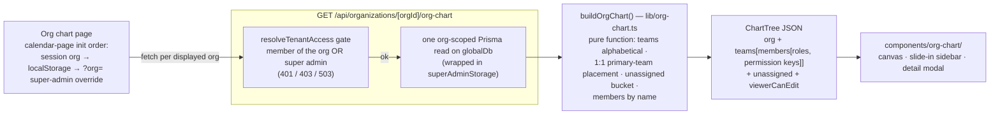
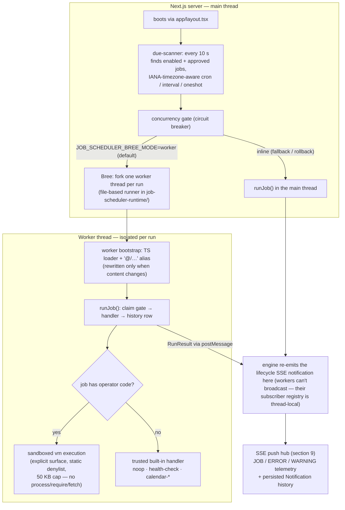

# Property NI Multi-Tenant Portal (nipp)

Property NI is a full-stack property management portal built for the Northern
Ireland public sector. It is a multi-tenant platform: a single deployment hosts
many organizations (tenants), and every tenant operates in complete isolation —
their properties, members, roles, permissions, calendars, and audit trails are
scoped to them and never visible to anyone else.

The application is built with Next.js 15 (App Router), React 19, BetterAuth,
Prisma 6, and PostgreSQL 16, with optional Redis for caching.

## Who uses it

There are two kinds of users:

- **Super Admins** — members of the internal "Platform Organization". They
  manage tenant organizations, global roles and permissions, user accounts,
  cache metrics, audit logs, and system health from a dedicated admin console.
- **Tenant Users** — staff of a tenant organization. They work inside their
  own organization's dashboard: an interactive calendar, teams, roles,
  resources, and notifications.

Self-service registration is not available (`/register` redirects to
`/login`); accounts are created by Super Admins or via the seed scripts.

## Contents

- [Who uses it](#who-uses-it)
- [At a glance](#at-a-glance)
- [Project layout](#project-layout)
- [Functional Areas](#functional-areas)
  - [Authentication & Sessions](#1-authentication-sessions)
    - [Auto-logout on inactivity](#auto-logout-on-inactivity)
  - [Multi-Tenant Isolation](#2-multi-tenant-isolation)
  - [Super Admin Console](#3-super-admin-console)
  - [Integrated Tenant Dashboard](#4-integrated-tenant-dashboard)
    - [Resources & feature-level access control](#resources-feature-level-access-control)
  - [Roles, Permissions & Teams (RBAC)](#5-roles-permissions-teams-rbac)
  - [Interactive Calendar](#6-interactive-calendar)
    - [Live "due to start" SSE alerts](#live-due-to-start-sse-alerts)
  - [Interactive Organization Chart](#7-interactive-organization-chart)
  - [Calendar Notifications](#8-calendar-notifications)
  - [Real-Time Notifications](#9-real-time-notifications)
  - [Caching](#10-caching)
  - [Background Job Scheduler](#11-background-job-scheduler)
  - [Data Protection & Security Hardening](#12-data-protection-security-hardening)
- [Getting Started](#getting-started)
  - [Prerequisites](#prerequisites)
  - [Setup (step by step)](#setup-step-by-step)
    - [1. Clone and install](#1-clone-and-install)
    - [2. Create the databases](#2-create-the-databases)
    - [3. Configure environment variables](#3-configure-environment-variables)
    - [4. Initialize and seed the database](#4-initialize-and-seed-the-database)
    - [5. Run it](#5-run-it)
    - [6. Verify](#6-verify)
- [Day-to-Day Development](#day-to-day-development)
  - [Scripts](#scripts)
  - [Quality gates (pre-commit & pre-push)](#quality-gates-pre-commit-pre-push)
  - [Testing the tenant isolation suite](#testing-the-tenant-isolation-suite)
  - [Troubleshooting](#troubleshooting)
- [Appendices](#appendices)
  - [Environment Variables](#appendix-a-environment-variables)
  - [Database Seeding Guide](#appendix-b-database-seeding-guide)
  - [Health Endpoint](#appendix-c-health-endpoint)
  - [Data Model](#appendix-d-data-model)
  - [Technology Stack & Version Pins](#appendix-e-technology-stack-version-pins)
  - [Project Documentation Map](#appendix-f-project-documentation-map)

## At a glance

| Area | What it does |
|------|--------------|
| **Multi-tenant isolation** | Two independent layers: Prisma query interception + PostgreSQL Row Level Security |
| **Authentication** | BetterAuth with email/password and Google OIDC, 1-hour session cap, inactivity auto-logout |
| **RBAC** | Organization-scoped roles, a catalog of ~50 atomic permissions, feature-level access via Resources |
| **Teams** | Sub-organizational groupings with role inheritance |
| **Super Admin console** | Manage organizations, users, roles, permissions, audit logs, cache metrics, system health/logs |
| **Tenant dashboard** | Integrated dashboard for users, organizations, roles, permissions, resources, teams, and the calendar |
| **Interactive Calendar** | Month/week/day/year views, drag-and-drop rescheduling, RFC 5545 (rrule) recurrence, event modals, quick-add, live "due to start" SSE alerts |
| **Org Chart** | Live interactive tree of org → teams → members: zoom/pan canvas (opens centred in the viewport, mouse-wheel zoom toward the cursor, middle-click recentres), member detail modal with roles & permissions, tenant-switcher sidebar, unassigned bucket, mobile accordion (`/dashboard/admin/org-chart`) |
| **Calendar Notifications** | Rate-limited email alerts for today's events, delivery logged to `NotificationLog` |
| **Hybrid caching** | L1 in-memory + L2 Redis cache with stampede protection, warming, and live metrics |
| **Real-time notifications** | Live server-side SSE broadcast (health checks, all admin management events, and upcoming calendar events) with org/global scoping, deduplication, and a persisted notification log |
| **Background job scheduler** | Platform-only scheduled/one-shot engine: main-thread due-scanner, Bree worker-per-run isolation (or inline fallback), sandboxed operator scripts with dry-run, approval gate, concurrency circuit breaker, execution history, and `job-scheduler:*` SSE telemetry |
| **Security hardening** | CSP in Report-Only mode, AES-256-GCM PII encryption at rest, optional payload encryption in transit, pre-commit secret scanning |

## Project layout

```
app/                  Next.js App Router: pages and API route handlers
  admin/              Super Admin console (pages + /api/admin/* handlers)
  dashboard/          Integrated role-based dashboards (+ /api/dashboard/admin/*)
  organizations/      Organization-scoped tenant pages
  api/                Other route handlers (auth, calendar, teams, health, …)
components/           React UI (admin, calendar, org-chart, dashboard, auth, providers)
features/             Client-side feature modules (notifications, org, permissions, user)
hooks/                Shared client hooks (useInactivityTimeout, usePermission)
lib/                  Core infrastructure: auth, tenant-db, cache, crypto, notifications
services/             Server-side domain services (calendar, teams, roles, resources, …)
prisma/               Schema, migrations, RLS scripts, and seed
tests/                unit/, integration/, isolation/ (app-layer + Playwright E2E)
scripts/              DB setup, test env setup/teardown, cache benchmark, secret check
openspec/             OpenSpec change proposals (the project's design process)
documents/            Business research, feature planning, operations runbooks
```

---

# Functional Areas

## 1. Authentication & Sessions

Authentication is handled by [BetterAuth](https://www.better-auth.com/)
(configured in `lib/auth.ts`):

- **Providers:** email/password and Google OIDC (optional — configure via
  `GOOGLE_CLIENT_ID` / `GOOGLE_CLIENT_SECRET`).
- **Sessions:** secure, HTTP-only cookies; `expiresIn` of **1 hour** is the
  absolute maximum lifetime, with renewal on any server request once remaining
  time drops below 15 minutes (`updateAge`). Active users who make at least one
  request per 45 minutes never hit the hard expiry.
- **Middleware:** `middleware.ts` performs a fast, Edge-runtime-safe session
  cookie check so unauthenticated visitors are redirected to `/login` before
  any page renders; public routes (`/api/health`, auth callbacks, CSP reports,
  …) live in its `PUBLIC_PATTERNS`.
- **Logout:** deletes the session from the database (not just local cookies),
  clears all BetterAuth cookies, and hard-redirects to `/login` so no stale
  client state survives.

### Auto-logout on inactivity

The app logs users out after a configurable idle period to protect unattended
devices (`INACTIVITY_TIMEOUT_MINS`, default **15**):

1. `hooks/useInactivityTimeout.ts` tracks `mousemove`, `click`, `keydown`,
   `scroll`, and `touchstart`.
2. 30 seconds before expiry, a warning toast appears (via sonner).
3. If no activity follows, the session is deleted server-side and the browser
   is redirected to `/login`. Any activity during the warning dismisses the
   toast and restarts the countdown.

The timer only runs for authenticated sessions and applies equally to Super
Admins and tenant users; each tab tracks inactivity independently. The
server-side 1-hour expiry is the backstop if client-side detection is bypassed
(JScript disabled, browser crash). Configuration flows to the client through a
React context (`components/providers/InactivityTimeoutConfig.tsx`) — no
`NEXT_PUBLIC_` duplication.

## 2. Multi-Tenant Isolation

Tenant isolation is enforced at **two independent layers** so a failure in one
does not leak data (full details in [SECURITY.md](./SECURITY.md)):

1. **Application layer** — the tenant-scoped Prisma client
   (`lib/tenant-db.ts`) uses a Prisma extension to inject the current
   `organizationId` into every query on org-scoped models. The org ID comes
   from the session into `AsyncLocalStorage` (`lib/tenant-context.ts`) via
   middleware, and queries without an active tenant context **throw** rather
   than silently going unscoped.
2. **Database layer** — PostgreSQL Row Level Security policies filter rows by
   `current_setting('app.current_org_id')` as a safety net.

Super Admins use a separate, explicitly unscoped client (`lib/global-db.ts`)
for cross-tenant work; a custom ESLint rule blocks direct imports of the raw
Prisma client in business code, and `lib/global-db-guard.ts` constrains who may
use the global client. To add RLS for a new table, see
`prisma/migrations/0000_enable_rls/migration.sql`.

Organizations follow a strict lifecycle state machine:
`PENDING → ACTIVE ↔ SUSPENDED → ARCHIVED` (terminal).

## 3. Super Admin Console

Super Admins (`app/admin/*`, guarded server-side by `requireSuperAdmin()` and
client-side by `<RequireSuperAdmin>`) get a console for platform operations:

| Route | Purpose |
|-------|---------|
| `/admin/organizations` | List orgs with search, filter, pagination; create/edit/delete, member management, per-org roles & permissions, status changes, settings |
| `/admin/users` | Platform user accounts (create/view/edit/delete) |
| `/admin/roles` | Global role management |
| `/admin/permissions` | Global permission catalog (resources, search, CRUD) |
| `/admin/audit-logs` | Cross-tenant security audit log viewer with filters |
| `/admin/cache-metrics` | Live L1/L2 cache hit-rate metrics |
| `/dashboard/admin/system-health` | Dependency health card (database, cache) |
| `/admin/system-logs` | Application/system log browser |

Backed by REST endpoints under `/api/admin/*` (organizations, members, roles,
permissions, users, audit logs, cache & payload-encryption metrics, system
logs). The **organization lifecycle** (activate/suspend/archive) is driven
through `/api/admin/organizations/[orgId]/status`.

A public health check for load balancers and uptime monitors lives at
`/api/health` — it checks the database (`SELECT 1`) and optionally Redis,
returning per-check latency. See [Appendix C](#appendix-c-health-endpoint).

## 4. Integrated Tenant Dashboard

The tenant-facing dashboard lives under `/dashboard/admin/*` and is assembled
from reusable components (`components/dashboard/`):

| Route | Purpose |
|-------|---------|
| `/dashboard/admin/users` | Users of the active organization |
| `/dashboard/admin/organizations` | Organization view/settings |
| `/dashboard/admin/roles` | Roles scoped to the organization |
| `/dashboard/admin/permissions` | Permission catalog as visible in org context |
| `/dashboard/admin/resources` | Feature resources and role-to-resource bindings |
| `/dashboard/admin/teams` | Teams, members, and team-level roles |
| `/dashboard/admin/calendar` | The interactive calendar (see below) |
| `/dashboard/admin/org-chart` | Interactive organization chart: org → teams → members tree, detail modal, tenant switcher (see §7) |
| `/dashboard/admin/notifications` | Live notification log: stat cards, filters, search, acknowledge/delete actions |

These pages talk to REST endpoints under `/api/dashboard/admin/*`. Role-based
routing (`lib/dashboard-router.ts`) maps a user's role to their dashboard; the
`contractor` route is currently scaffolding only, deferred to a future
OpenSpec proposal.

### Resources & feature-level access control

The **Resource** model (with `ResourceRole` bindings) links named features to
roles: a user can only reach a feature if one of their roles is bound to its
resource. This enables per-feature access control beyond plain read/write
permissions, managed from the dashboard's Resources page and
`/api/dashboard/admin/resources/*`.

## 5. Roles, Permissions & Teams (RBAC)

- **Permissions** are atomic `resource:action` keys (a catalog of ~50 seeded
  permissions: property, financial, maintenance, contractor, tenant domains in
  `lib/permissions/`). Resolution is cached through the hybrid L1/L2 cache.
  Organization-scoped calendar permissions (`calendar:read|create|update|delete`)
  are enforced on all `/api/organizations/[orgId]/calendar*` routes.
- **Platform permissions** (Super Admin only):
  `platform:manage_organizations`, `platform:manage_roles`,
  `platform:manage_permissions`, `platform:view_audit_logs`.
- **Roles** are organization-scoped; members hold roles through `MemberRole`,
  and roles carry permissions through `RolePermission`. Role deletion is
  protected by safety checks (see `tests/unit/role-deletion-safety.test.ts`).
- **Teams** let organizations group people. Teams are sub-organizational:
  members added to a team inherit its roles automatically. They are managed
  via the tenant REST API:

| Route | Methods | Purpose |
|-------|---------|---------|
| `/api/organizations/[orgId]/teams` | GET, POST | List / create teams |
| `/api/organizations/[orgId]/teams/[teamId]` | GET, PATCH, DELETE | Get / update / delete team |
| `/api/organizations/[orgId]/teams/[teamId]/members` | GET, POST, DELETE | List / add / remove members |
| `/api/organizations/[orgId]/teams/[teamId]/roles` | GET, POST, DELETE | List / assign / remove team roles |

Client-side guards: `<RequirePermission>`, `features/permissions/RoleGuard`,
and the `usePermission` hook for conditional UI.

## 6. Interactive Calendar

The calendar is a standalone component tree in `components/calendar/` embedded
at `/dashboard/admin/calendar`. Each organization bootstraps with one default
calendar (more can be added per org).

**UI features:**

- Month, Week, Day, and Year views; week/day views autoscroll while dragging.
- **Drag-and-drop rescheduling**: single events move across dates and times;
  dragging a *recurring* event's occurrence excludes the original date from
  the series (`exdates`) and creates a one-off event at the new location — the
  rest of the series is untouched.
- **Event detail modal** for viewing/editing; drag-and-drop changes persist to
  the database (including preserved start/end times across month-view drags).
- **Quick-add** via right-click context menu on any day, plus a **+ Create
  Event** button in the toolbar that opens the add-event modal pre-populated
  for the visible date range. Clicking an upcoming-event row navigates the
  calendar to it.
- **Sidebar** with the next upcoming events (scoped to the dates you're
  viewing) and a live search box filtering by title, plus a
  typeable organization combobox — Super Admins can switch between Platform and
  any tenant org from the sidebar (or via `?org=` in the URL) to view/edit any
  tenant's calendar.
- **Color-coded event types**: viewings, inspections, maintenance, lease
  events, key exchange, other — with per-event color overrides.

**Recurrence:** rules are stored as RFC 5545 `rrule` JSON on the event itself
(`CalendarEvent.rrule` / `CalendarEvent.exdates` Json columns) with `exdates` for
excluded dates; expansion happens in `lib/recurrence-rrule.ts` (the `rrule`
library, with QUARTERLY and SEMI_ANNUALLY mapped onto monthly intervals).
Supported frequencies: `DAILY`, `WEEKLY`, `MONTHLY`, `QUARTERLY`,
`SEMI_ANNUALLY`, `ANNUALLY`, each with an interval plus optional end-date or
occurrence-count limit.

### Live "due to start" SSE alerts

A background scheduler (`lib/calendar-event-scheduler.ts`) scans the calendar
every 30 seconds and pushes a real-time **ORG-scoped INFO** notification (`source:
calendar:event-upcoming`) for every event — single *or* recurring, including
exdate handling — that starts within its lead window (default the next **15
minutes**). Recurring series are expanded with the same rrule engine used by the
calendar UI, so alerts always match rendered instances. It rides the platform SSE
pipeline from [section 9](#9-real-time-notifications), so the dashboard's footer
ticker surfaces "Calendar event due to start: …" messages live — no client-side
polling.

Each `event + instance` pair is notified exactly once per process lifetime via an
in-memory dedup set (no schema change); a failed push is dropped rather than
retried (lost-not-resent, by design). Tunables: `CALENDAR_EVENT_SCAN_INTERVAL_MS`
(30000), `CALENDAR_LEAD_TIME_MINUTES` (15), `CALENDAR_MAX_EVENTS_PER_SCAN` (20). It
boots alongside the background health checks via an import in `app/layout.tsx`.
Full design, trade-offs, and known limitations:
[documents/feature-planning-and-development/calendar-event-sse-notifications.md](./documents/feature-planning-and-development/calendar-event-sse-notifications.md).

**API:**

| Route | Methods | Purpose |
|-------|---------|---------|
| `/api/organizations/[orgId]/calendar` | GET, POST | List calendars / create a calendar |
| `/api/organizations/[orgId]/calendar/[id]` | GET, PATCH, DELETE | Get / update / delete calendar |
| `/api/organizations/[orgId]/calendar-events` | GET, POST | List events in date range / create event |
| `/api/organizations/[orgId]/calendar-events/[id]` | GET, PATCH, DELETE | Get / update / delete event |
| `/api/organizations/[orgId]/calendar-events/upcoming` | GET | Upcoming events for the sidebar |

Event listing takes `start`, `end`, and optional `calendarId` query params:

```
GET /api/organizations/[orgId]/calendar-events?start=2026-08-01&end=2026-08-31&calendarId=xxx
```

Event types: `VIEWING`, `INSPECTION`, `MAINTENANCE`, `LEASE_SIGNING`,
`LEASE_RENEWAL`, `KEY_EXCHANGE`, `OTHER`. Events carry an optional
`propertyId` for future property-scheduling work.

## 7. Interactive Organization Chart

The org chart is a **live, read-only view of an organization's people** — an
interactive tree of **organization → teams → members** built from data that is
already in the database (no new tables, no migration). It opens at
`/dashboard/admin/org-chart`, full-bleed like the calendar page, with the same
dark slide-in panel on the right.



**What you get:**

- **Interactive canvas** — the diagram opens centred in the viewport with
  the team row visible; click the organization node to show/hide the whole
  team row, or a team to expand/collapse its members (collapsed by default);
  zoom from 50% to 200% with the buttons or the mouse wheel (roll forward =
  in, roll back = out, anchored at the cursor), drag-to-pan, and re-centre
  with the reset button or a middle-click.
- **Member detail modal** — name, email, membership role, the assigned roles
  with their permission keys, and every team the member belongs to (reuses the
  shared dashboard `Modal`).
- **Right slide-in panel** — collapsed (`w-16`) / expanded (`w-80`) like the
  calendar sidebar; a typeable organization combobox for Super Admins (view any
  tenant's chart, `?org=` survives refresh), **Manage** links into the existing
  settings / members / roles pages, and a team list that expands and scrolls to
  that team in the canvas.
- **Unassigned bucket** — members with no team membership are listed separately
  (in the tree and in the sidebar).
- **1:1 team display (v1)** — each member renders under exactly one team; if
  they belong to several, their primary membership (earliest join date, ties
  broken by team name) wins, and all memberships stay visible in the detail
  modal.
- **Responsive & accessible** — below 768 px the canvas becomes a vertical
  accordion (org → teams → members); the tree uses `role="tree"` /
  `role="treeitem"` and every node is a keyboard-operable button carrying
  `aria-expanded` / `aria-level`.

One endpoint serves everything:

| Route | Methods | Purpose |
|-------|---------|---------|
| `/api/organizations/[orgId]/org-chart` | GET | Full org tree in one call — organization, teams with members, unassigned members, and the `viewerCanEdit` flag; each member carries their BetterAuth role, assigned roles, and permission keys |

Authorization is the shared org-scoped gate used by the calendar and teams
routes (`resolveTenantAccess`): a member sees **their own** organization's
chart (other tenants → 403), Super Admins can view any tenant's chart, and
unauthenticated requests get 401. `viewerCanEdit` is true for platform / tenant
admins; v1 is read-only either way — the Manage links navigate to existing
admin pages (inline editing lands in v2). The seeded permissions
`org-chart:read` / `org-chart:update` reserve role-level gating for future use.

The tree shaper is a pure function, unit-tested without a database
(`tests/unit/org-chart-tree.test.ts`); the endpoint's authorization matrix is
covered by `tests/integration/org-chart.test.ts`. Full design spec, trade-offs,
and deferred work:
[documents/feature-planning-and-development/interactive-org-chart.md](./documents/feature-planning-and-development/interactive-org-chart.md).

## 8. Calendar Notifications

The notification service emails users — or entire organizations — about events
happening **today**, reusing the shared email infrastructure
(`lib/notifications/`) and logging every delivery to `NotificationLog`.

| Route | Methods | Purpose |
|-------|---------|---------|
| `/api/organizations/[orgId]/calendar-notifications/today` | GET | Today's events for the current user/org |
| `/api/organizations/[orgId]/calendar-notifications/send-today` | POST | Trigger today-event notifications |
| `/api/organizations/[orgId]/calendar-notifications/history` | GET | Delivery history |

Flow: scan for events whose `startDate` is today → resolve recipients
(specific user or all org members) → build a branded email (Property NI colors,
via nodemailer — configure `SMTP_*` variables) → dispatch through the shared
rate-limited dispatcher (max 5 per event type per 24h; fails open without
Redis) → log each delivery.

## 9. Real-Time Notifications

In-app real-time updates are pushed over Server-Sent Events (SSE) from a
single production-ready endpoint, `GET /api/notifications/stream`. Any event
worth surfacing to operators goes through one central push service
(`lib/notification-push.ts`), which deduplicates, persists the notification to
a database log, and broadcasts it to every connected SSE client.

### What gets pushed

Every notable platform event is emitted as an SSE notification:

| Event family | Source tag | Priority (success / failure) | Scope |
|--------------|-----------|------------------------------|-------|
| Health checks — database, cache/Redis, PgBouncer (state transitions and first check after boot) | `health-check:database` / `health-check:cache` / `health-check:pgbouncer` | INFO / CRITICAL | GLOBAL |
| User management (create / update / delete) | `admin:user-management` | INFO / ERROR | GLOBAL |
| Organization management (create / update / archive) | `admin:organization-management` | INFO / ERROR | GLOBAL |
| Team management (create / update / delete) | `admin:team-management` | INFO / ERROR | GLOBAL |
| Role management (create / update / delete) | `admin:role-management` | INFO / ERROR | GLOBAL |
| Permission catalog changes (create / update / delete) | `admin:permission-management` | INFO / ERROR | GLOBAL |
| Resource catalog changes (create / update / delete) | `admin:resource-management` | INFO / ERROR | GLOBAL |
| Admin broadcast messages (sent through the console) | `admin:message` | configurable (default INFO) | GLOBAL or ORG |
| Upcoming calendar events — due to start within the 15-minute lead window, from the background scheduler | `calendar:event-upcoming` | INFO | ORG (event's tenant) |
| Job runs — scheduled or manual triggers succeed | `job-scheduler:execution` | JOB | GLOBAL |
| Job runs — failed (handler throws or times out) | `job-scheduler:failure` | ERROR | GLOBAL |

Org-level operations carry the affected organization id, so the history log
can show which tenant was impacted; pure global catalog entries (permissions,
resources) are sent without one. A full per-family API reference lives in
[ARCHITECTURE.md §9](./ARCHITECTURE.md#9-real-time-notificationssystem-sse).

### Delivery model

- **Scoping** — a notification is either `GLOBAL` (every connected user) or
  `ORG` (only subscribers of that tenant, plus Super Admins). Super Admins
  subscribe without an org context and see everything.
- **Deduplication** — two layers stop duplicate spam: a synchronous in-process
  index (10 s window) closes the race where concurrent boot-time `/api/health`
  calls would each push a "first healthy" notification, and a DB lookup is the
  multi-instance safety net.
- **Persistence** — every notification is written to the `Notification` model
  before broadcast, giving a replayable history and admin log even for clients
  that were offline.
- **Connection governance** — requires a valid session; max 3 concurrent
  connections per user (extra tabs get HTTP 429) and a global cap of 500
  (HTTP 503 when saturated); a 15 s SSE heartbeat keeps proxies from closing
  idle streams.

### The client side

A singleton `useNotifications` hook (`hooks/useNotifications.ts`) owns the one
SSE connection per browser tab — components never open their own (that is what
caused 429 churn under React StrictMode). It:

1. Streams `data:` JSON frames off `/api/notifications/stream` using
   fetch/ReadableStream (cookie auth, so no EventSource query hacks needed),
   with exponential-backoff reconnects (1 s → 30 s max) and client-side id
   deduplication (max 20 items kept).
2. Renders a **footer ticker** in the Super Admin console *and* the tenant
   dashboard layouts (`app/admin/layout.tsx`, `app/dashboard/admin/layout.tsx`).
   INFO/WARNING items auto-dismiss after 10 s; ERROR/CRITICAL items persist
   until manually dismissed.
3. **Mirrors every received message to an `sse-notification` CustomEvent**, so
   pages can react without owning a connection — e.g., the system-health card
   re-fetches `/api/health` immediately when a health-check source notifies,
   instead of waiting for its 60 s poll.

### Notification log (history & triage)

The persisted history is browsable at `/dashboard/admin/notifications`:

- Stat cards: total, acknowledged / not-acknowledged, and per-priority counts.
- Filters: priority, scope, organization, acknowledged state, plus server-side
  free-text search over source and message.
- Actions: **Acknowledge** per row and **Delete** (with confirmation modal),
  backed by `/api/admin/notifications` (`GET` list, `PATCH` acknowledge,
  `DELETE`, and `POST` for sending admin broadcasts).

**Email calendar notifications** (today's events) remain a separate,
rate-limited flow described in section 8.

## 10. Caching

Permission resolution and search use a **hybrid cache**: an L1 in-memory LRU
(`lib/cache/lru.ts`, with stampede protection and background warming) in front
of L2 Redis (`lib/redis.ts`), orchestrated by `lib/cache/hybrid.ts`. The app
degrades gracefully when Redis is absent (reads fall back to the database).
Live hit-rate metrics are shown at `/admin/cache-metrics`, and a benchmark
script measures the real-world benefit of each layer:

```bash
npx tsx scripts/cache-benchmark.ts   # 8 scenarios: direct DB, L2 hit, L1 hit, etc.
```

See [CACHING_ARCHITECTURE.md](./CACHING_ARCHITECTURE.md) and
[scripts/README.md](./scripts/README.md).

## 11. Background Job Scheduler

The platform runs a general-purpose **background job scheduler**, booted by a
side-effect import in `app/layout.tsx` (`import '@/lib/job-scheduler-engine'`).
It is the reusable execution layer for platform automation and for
operator-authored scripts, and it is **platform-organization only** — tenant
users get no access.



**Design split:** the main-thread scanner decides **when** a job is due; the
single `JobSchedulerService.runJob()` owns everything about **a run** — the DB
claim gate (atomic `lastRunAt` update), the `JobExecution` history row, timeout,
audit trail, and notifications. Worker runs call the same `runJob`, so forked
and inline executions are indistinguishable in the history.

- **Engine** (`lib/job-scheduler-engine.ts`) — polls every 10 s; full cron
  parsing with IANA timezones (occurrence walks via `@breejs/later`, DST-aware);
  `globalThis` singleton state, `unref`'d timer, immediate first scan on boot,
  graceful SIGTERM/SIGINT shutdown of in-flight workers.
- **Bree executor** (`lib/job-scheduler-bree.ts`) — forks one worker per run via
  Bree (at most one live worker per run key); materializes a file-based CJS
  runner and a TypeScript-loading bootstrap into the gitignored
  `job-scheduler-runtime/` directory (atomic writes, content-idempotent, stale
  runners reaped at boot). A hard 30 min wall cap backs up every job's own
  `timeoutMs`. Engine-level worker failures raise an
  `ERROR` SSE alert (`job-scheduler:worker-error`).
- **Concurrency gate** (`lib/job-scheduler-concurrency.ts`) — global circuit
  breaker sized `max(JOB_SCHEDULER_MAX_CONCURRENT, JOB_SCHEDULER_DB_CONCURRENCY, 1)`;
  a run queued > 1 s emits a debounced WARNING alert.
- **Service** (`services/job-scheduler-service.ts`) — job CRUD, the approval
  gate, the claim gate, handler dispatch, dry-run, execution history, and SSE
  lifecycle. Every method runs `requirePlatformAdmin(ctx)`.

**Schedules** (`cron` / `interval` / `oneshot`) are stored as JSON in
`scheduleExpr`; cron is fully timezone-aware (no more "every-N-minutes"
approximation).

**Built-in handlers.** Operators reference a handler by `handlerKey`:

| handlerKey | Purpose |
|------------|---------|
| `noop` | End-to-end smoke test |
| `health-check` | Probe platform health; raise an `ERROR` alert on an unhealthy check (silent when healthy) |
| `calendar-health-check` | Probe the calendar "due to start" pipeline; fails if discovery throws |
| `calendar-selftest` | Emit one `CALENDAR`-priority SSE probe to prove the notification path is reachable |

**Operator scripts & dry-run.** A job may instead carry `code` — operator
JavaScript executed in a sandboxed Node `vm` **inside** the worker (worker
isolation alone is not security isolation): only an explicit surface
(`ctx`, `log`, `capabilities.notify`) is exposed; ~25 host identifiers
(`process`, `require`, timers, `fetch`, …) are blocked by a static
comment/string-aware denylist plus runtime Proxy traps. Code is capped at 50 KB.
`dryRunJob` (or `JOB_SCHEDULER_DRYRUN_DEFAULT=true`) executes with
capabilities as no-op recorders — nothing committed or emitted; the execution
row records which capabilities were used.

**Approval gate (defense in depth).** A job starts `enabled: false, approved:
false`. A platform admin must **approve** it before it can be enabled, patched
to enabled, manually triggered, dry-run, or scheduled — and the scanner's query
additionally requires `approved: true`, so no job ever runs unreviewed.
`approveJob`/`rejectJob` record approver, timestamp, note, plus a durable
audit entry; rejection also disables.

**Lifecycle → SSE.** Success emits `JOB`-priority (`job-scheduler:execution`),
failure `ERROR` (`job-scheduler:failure`, carrying the failure reason). In
worker mode the run's own emission is skipped (its SSE subscriber registry is an
empty thread-local copy) and the engine re-emits on the parent — identical
payload shape, so the push hub's dedup treats it as one event. `SKIPPED` runs
announce nothing, matching inline behaviour.

**Admin API (Super Admin / platform-only).** `requireSuperAdmin`-guarded:

| Route | Methods | Purpose |
|-------|---------|---------|
| `/api/admin/jobs` | GET, POST | List jobs (filter by `enabled` / `approved` / `limit`) / create a job (starts disabled + unapproved; optional `description`, `code`) |
| `/api/admin/jobs/[jobId]` | GET, PATCH, DELETE | Read / update (enabling via PATCH requires prior approval) / delete (cascades history) |
| `/api/admin/jobs/[jobId]/approvals` | POST | Approve (default) or reject a job (`{ action, note? }`) |
| `/api/admin/jobs/[jobId]/trigger` | POST | Execute now — highest-risk: requires enabled **and** approved; audited |
| `/api/admin/jobs/[jobId]/dry-run` | POST | Sandboxed execution with no committed side effects |
| `/api/admin/jobs/[jobId]/history` | GET | Execution history for the job |

Configuration is via `JOB_SCHEDULER_*` env vars (see
[Appendix A](#appendix-a-environment-variables)). Full design rationale, worker
lifecycle details, and the concurrency sizing live in
[ARCHITECTURE.md §11](./ARCHITECTURE.md#11-job-scheduler); the phase plan is at
[documents/feature-planning-and-development/job-scheduler-service-plan.md](./documents/feature-planning-and-development/job-scheduler-service-plan.md).
## 12. Data Protection & Security Hardening

- **PII at rest:** AES-256-GCM encryption for sensitive columns, keyed by
  `PII_ENCRYPTION_KEY` (`lib/pii-crypto.ts`, `lib/pii-routes.ts`).
- **Payloads in transit:** optional application-layer AES-256-GCM encryption of
  PII request/response bodies with session-bound payload keys, replay
  protection (nonce cache), and a `disabled | permissive | enforce` mode
  (`PAYLOAD_ENCRYPTION_MODE`, default `disabled`). Metrics at
  `/api/admin/payload-encryption/metrics`.
- **Content Security Policy:** strict nonce-based CSP applied via edge
  middleware in **Report-Only** mode (violations reported to
  `/api/csp-report`); `'unsafe-eval'` is permitted only in development for
  Fast Refresh. Directive details in [SECURITY.md](./SECURITY.md).
- **Secrets:** a pre-commit hook (`scripts/check-secrets.sh`, run by husky)
  blocks commits containing private-key headers, cloud access keys, or
  password-bearing connection strings; `lint-staged` runs ESLint + Prettier on
  staged files. `.env*` (except committed examples) and certificates are never
  committed.

---

# Getting Started

## Prerequisites

| Requirement | Version | Notes |
|-------------|---------|-------|
| **Node.js** | 22 LTS (pinned in `.nvmrc`) | `nvm install 22 && nvm use` |
| **PostgreSQL** | 16+ | Postgres.app (macOS), `brew install postgresql`, or your distro's manager. PgBouncer is used for connection pooling (port 6432 in the default `.env.example`) — set `PGBOUNCER_PASSWORD` accordingly, or use a plain connection string. |
| **Redis** *(optional)* | 7+ | Permission/cache layer; app works without it |
| **Docker** *(for isolation tests)* | Any recent | Used by the test infrastructure compose file |

```bash
node -v            # v22.x.x
psql --version     # 16+
redis-cli --version  # optional, 7+
```

## Setup (step by step)

### 1. Clone and install

```bash
git clone <repo-url> && cd nipp
nvm use            # switches to Node 22 via .nvmrc
npm install
```

### 2. Create the databases

```bash
bash scripts/setup-db.sh   # creates nipp_dev and nipp_prod
```

### 3. Configure environment variables

```bash
cp .env.example .env
```

Fill in the values — the required ones are `DATABASE_URL`,
`BETTER_AUTH_SECRET`, `PII_ENCRYPTION_KEY`, and the seed credentials
(`ADMIN_EMAIL`, `ADMIN_PASSWORD`). The complete reference is
[Appendix A](#appendix-a-environment-variables). Quick secret generation:

```bash
openssl rand -base64 32   # BETTER_AUTH_SECRET
openssl rand -hex 32      # PII_ENCRYPTION_KEY (64 hex chars)
```

> **Never commit `.env`** — only the committed examples (`.env.example`,
> `.env.local-prod.example`, `.env.test.example`) go in version control.

### 4. Initialize and seed the database

```bash
npx prisma generate   # required before any prisma command
npx prisma db push    # create all tables (dev; use db:migrate for migration files)
npm run db:seed       # platform org + permission catalog + admin + dev tenants
```

The seed is idempotent and runs in two profiles (dev by default, test mode when
`TEST_ADMIN_EMAIL` is set). Details are in
[Appendix B](#appendix-b-database-seeding-guide). The script prints the
`PLATFORM_ORG_ID` afterwards — add it to `.env` for stability.

### 5. Run it

```bash
npm run dev          # http://localhost:3000
```

Log in as the super admin (from your `.env`) to see the Super Admin console,
or as a dev tenant user to see the tenant dashboard and calendar.

### 6. Verify

```bash
npm test             # unit tests (no running services needed)
npm run type-check   # strict TypeScript
npm run lint         # ESLint — zero warnings expected
```

# Day-to-Day Development

## Scripts

| Script | Command | Purpose |
|--------|---------|---------|
| `npm run dev` | `next dev` | Dev server (HTTP, hot reload) |
| `npm run dev:https` | `next dev --experimental-https` | Dev server with local HTTPS |
| `npm run build` / `npm start` | `next build` / `next start` | Production build / serve |
| `npm run lint` | `next lint` | ESLint (zero warnings is the bar) |
| `npm run type-check` | `tsc --noEmit` | Strict TypeScript check |
| `npm run db:migrate` | `prisma migrate dev` | Create + apply a migration file |
| `npm run db:push` | `prisma db push` | Push schema without migration files (dev) |
| `npm run db:seed` | `tsx prisma/seed.ts` | Seed platforms, permissions, users, teams |
| `npm run db:studio` | `prisma studio` | GUI database browser |
| `npm run db:reset` | `prisma migrate reset --skip-seed` | Drop and recreate the database |
| `bash scripts/setup-db.sh` | — | Create dev/prod databases and guide setup |
| `npm test` | `vitest run tests/unit` | Unit tests only |
| `npm run test:watch` | `vitest tests/unit` | Watch mode (unit) |
| `npm run test:coverage` | `vitest run tests/unit --coverage` | Unit tests + coverage report |
| `npm run test:integration` | `vitest run tests/integration tests/isolation` | Integration + isolation app-layer tests (needs PostgreSQL + Redis) |
| `npm run test:all` | `vitest run` | Everything under `tests/` |
| `npm run test:isolation` | — | Full isolation pipeline: setup → app tests → Playwright E2E → teardown |
| `npm run test:isolation:setup` / `:teardown` | bash scripts | Create/drop the dedicated `nipp_test` database (+ Docker infra) |
| `npm run test:isolation:app` | `vitest run tests/isolation/application/` | App-layer tenant-separation tests |
| `npm run test:isolation:e2e` | Playwright | Browser E2E (cross-tenant UI isolation, calendar, payload encryption) |
| `npm run build:cloud` / `deploy:cloud` | — | Placeholders for the cloud pipeline |

## Quality gates (pre-commit & pre-push)

All four checks must pass before committing and pushing:

```bash
npm test              # 1. unit tests green
npm run test:integration   # 2. integration + isolation app-layer tests
npx eslint . --max-warnings=0   # 3. zero lint warnings
npx tsc --noEmit      # 4. strict type check clean
```

Husky runs `scripts/check-secrets.sh` and `lint-staged` (ESLint --fix +
Prettier) automatically on each commit.

## Testing the tenant isolation suite

Isolation tests use a dedicated `nipp_test` database and Docker infrastructure
(`docker-compose.test.yml` — PostgreSQL + PgBouncer):

```bash
npm run test:isolation   # full pipeline, one command
```

For the manual granular flow, fixtures, and troubleshooting see
[ISOLATION_TEST_STRATEGY.md](./ISOLATION_TEST_STRATEGY.md) and the
[quick-start](./ISOLATION_TEST_QUICK_START.md). The app-layer suite verifies
Prisma-extension scoping, tenant context propagation, and global-db guards;
the E2E suite exercises cross-tenant isolation, super-admin exclusivity,
calendar interactions, and payload encryption from a real browser.

## Troubleshooting

| Problem | Fix |
|---------|-----|
| `@prisma/client did not initialize` | Run `npx prisma generate` |
| `DATABASE_URL not found` | Ensure `.env` exists with a valid connection string |
| `PLATFORM_ORG_ID ... does not exist` (from `lib/rls.ts`) | Run the seed script first, or set `PLATFORM_ORG_ID` in `.env` |
| Redis connection errors | Optional — the app degrades to direct DB reads; fix your `REDIS_URL` if you want caching |
| Port 3000 busy | `lsof -ti:3000 \| xargs kill`, or `PORT=3001 npm run dev` |
| TypeScript errors after schema changes | `npx prisma generate` |
| Seed fails on credentials | `ADMIN_EMAIL` (valid email) and `ADMIN_PASSWORD` (> 8 chars) must be set |

---

# Appendices

## Appendix A — Environment Variables

All variables are validated at startup by the Zod schema in `lib/env.ts`.
Start from `.env.example` (committed, placeholders only).

**Database & core**

| Variable | Required | Default | Purpose |
|----------|----------|---------|---------|
| `DATABASE_URL` | yes | — | PostgreSQL connection string (PgBouncer-aware by default: port 6432 with pool options) |
| `PGBOUNCER_PASSWORD` | when using PgBouncer | — | Pooler password |
| `REDIS_URL` | no | `redis://localhost:6379` | Redis for L2 caching & replay cache |
| `L1_CACHE_MAX_ENTRIES`, `L1_CACHE_TTL_MS` | no | built-in | L1 in-memory cache tuning |
| `LOG_LEVEL` | no | `debug` | `debug` \| `info` \| `warn` \| `error` |
| `FRONTEND_URL`, `NEXT_PUBLIC_API_URL` | no | `http://localhost:3000` | App URLs |
| `PLATFORM_ORG_ID` | no (auto-found) | — | Platform organization ID; written by the seed, worth pinning |
| `TRUSTED_PROXY_CIDRS` | no | — | Proxy CIDRs for client-IP extraction |

**Authentication**

| Variable | Required | Purpose |
|----------|----------|---------|
| `BETTER_AUTH_SECRET` | yes (≥ 32 chars) | Session encryption key |
| `BETTER_AUTH_URL` | no | BetterAuth base URL |
| `GOOGLE_CLIENT_ID`, `GOOGLE_CLIENT_SECRET` | no (for Google login) | Google OIDC credentials |
| `INACTIVITY_TIMEOUT_MINS` | no (default `15`) | Auto-logout after this idle time; digits only |
| `SUPER_ADMIN_EMAIL` | no | Optional super-admin email hint |

**Email (nodemailer)**

| Variable | Required | Default | Purpose |
|----------|----------|---------|---------|
| `SMTP_HOST`, `SMTP_PORT` | for notifications | `localhost` / `587` | SMTP server |
| `SMTP_USER`, `SMTP_PASS` | no | — | SMTP auth |
| `SMTP_FROM` | no | `noreply@nipp.gov.uk` | Sender address |

**Data protection**

| Variable | Required | Default | Purpose |
|----------|----------|---------|---------|
| `CALENDAR_EVENT_SCAN_INTERVAL_MS` | no | 30000 | Interval between "due to start" calendar scans (see §6) |
| `CALENDAR_LEAD_TIME_MINUTES` | no | 15 | Lead window: notify when an event starts within this many minutes |
| `CALENDAR_MAX_EVENTS_PER_SCAN` | no | 20 | Per-scan cap on upcoming-event notifications (burst protection) |

**Job scheduler** (see [§11](#11-background-job-scheduler))

| Variable | Required | Default | Purpose |
|----------|----------|---------|---------|
| `JOB_SCHEDULER_ENABLED` | no | `true` | Master on/off for the job scheduler engine |
| `JOB_SCHEDULER_TIMEZONE` | no | `Europe/London` | Default IANA timezone for job schedules |
| `JOB_SCHEDULER_BREE_MODE` | no | `worker` | Execution path: `worker` (Bree fork-per-run) or `inline` (main thread — fallback/rollback) |
| `JOB_SCHEDULER_MAX_CONCURRENT` | no | `5` | Global cap on simultaneous job runs (runtime circuit breaker) |
| `JOB_SCHEDULER_DB_CONCURRENCY` | no | `100` | Connection-pool ceiling per forked worker, sized below PgBouncer `max_client_conn` |
| `JOB_SCHEDULER_DEFAULT_CONCURRENCY` | no | `1` | Per-job default concurrency limit |
| `JOB_SCHEDULER_DEFAULT_TIMEOUT_MS` | no | `300000` | Per-job default wall-clock cap (5 min) |
| `JOB_SCHEDULER_BOOT_REGISTRY` | no | `true` | Load enabled jobs from the DB at boot |
| `JOB_SCHEDULER_DRYRUN_DEFAULT` | no | `false` | New jobs default to dry-run until approved (Phase 2) |
| `PII_ENCRYPTION_KEY` | yes (64 hex chars) | — | AES-256-GCM key for PII at rest |
| `PAYLOAD_ENCRYPTION_MODE` | no | `disabled` | `disabled` \| `permissive` \| `enforce` — payload encryption in transit |
| `PAYLOAD_ENCRYPTION_MAX_BYTES` | no | 65536 | Max encrypted request body size |
| `PAYLOAD_ENCRYPTION_KEY_TTL_SECONDS` | no | 300 | Payload key lifetime |
| `PAYLOAD_ENCRYPTION_REPLAY_WINDOW_SECONDS` | no | 30 | Replay-protection window |
| `PAYLOAD_ENCRYPTION_NONCE_TTL_SECONDS` | no | 60 | Nonce cache TTL |
| `PAYLOAD_ENCRYPTION_REPLAY_CACHE` | no | `redis` | `memory` \| `redis` replay-dedup backend |
| `PAYLOAD_ENCRYPTION_REQUIRE_REPLAY_CACHE` | no | `false` | Fail closed in enforce mode if the replay cache is unavailable |

**Seed credentials** — never shared in committed files; see Appendix B.

## Appendix B — Database Seeding Guide

The seed script (`prisma/seed.ts`) bootstraps organizations, the permission
catalog (~50 `resource:action` permissions), the super admin, and teams. It is
**idempotent** — re-running upserts existing records to match the latest
script values.

**Both modes require:**

| Variable | Notes |
|----------|-------|
| `ADMIN_EMAIL` | Valid email for the super admin |
| `ADMIN_PASSWORD` | > 8 characters |

**Dev profile** (default — when `TEST_ADMIN_EMAIL` is *not* set):

Creates the Platform Organization ("Platform Ops" team), "Dev Tenant Ltd"
("Members" + "Operations" teams), the super admin with all platform
permissions, and two dev tenant users joined to Operations.

| Variable | Default |
|----------|---------|
| `DEV_TENANT_A_EMAIL` / `_PASSWORD` | `dev-tenant-a@example.com` / `DevTenantA123!` |
| `DEV_TENANT_B_EMAIL` / `_PASSWORD` | `dev-tenant-b@example.com` / `DevTenantB123!` |

**Test profile** (activated by setting a non-empty `TEST_ADMIN_EMAIL`):

Creates the Platform Organization (Members team only), "Test Tenant Ltd"
("Members" + "QA Operations" teams), the test super admin, and two test tenant
users in QA Operations.

| Variable | Default |
|----------|---------|
| `TEST_ADMIN_EMAIL` / `_PASSWORD` | *(required, no default)* |
| `TEST_TENANT_A_EMAIL` / `_PASSWORD` | `test-tenant-a@example.com` / `TestTenantA123!` |
| `TEST_TENANT_B_EMAIL` / `_PASSWORD` | `test-tenant-b@example.com` / `TestTenantB123!` |

```bash
npm run db:seed          # dev profile
# test profile:
cp .env.test.example .env.test   # fill in credentials, then
TEST_ADMIN_EMAIL=platform-test@nipp.gov.uk npx tsx prisma/seed.ts
```

After seeding: add the printed `PLATFORM_ORG_ID` to `.env`, restart the dev
server, and log in fresh.

## Appendix C — Health Endpoint

`GET /api/health` (public, excluded from session validation) is for load
balancers, orchestrators, and uptime monitors:

```json
{
  "status": "healthy",
  "timestamp": "2026-07-14T12:00:00.000Z",
  "version": "0.1.0",
  "uptime": 3600,
  "checks": {
    "database": { "status": "healthy", "latency_ms": 12 },
    "cache":    { "status": "healthy", "latency_ms": 3 }
  }
}
```

- **200** — healthy (or degraded: a non-critical check like Redis failed)
- **503** — critical check failed (database unreachable)
- No sensitive information is exposed.

## Appendix D — Data Model

Prisma models (`prisma/schema.prisma`), grouped by domain:

| Group | Models |
|-------|--------|
| Identity & auth | `User`, `Session`, `Account` |
| Organizations & membership | `Organization`, `Member`, `Invitation`, `SentInvitation` |
| Teams | `Team`, `TeamMember`, `TeamRole` (also the source of the [org chart](#7-interactive-organization-chart)) |
| RBAC | `Permission`, `Role`, `RolePermission`, `MemberRole`, `Resource`, `ResourceRole` |
| Calendar | `Calendar`, `CalendarEvent` (rrule JSON + exdates, optional `propertyId`) |
| Audit & notifications | `AuditLog`, `Notification` (SSE in-app events, org/global scope, acknowledged flag), `NotificationLog` (email deliveries) |
| Job scheduler | `JobDefinition` (platform-org job spec + approval gate), `JobExecution` (run history) |

All organization-scoped models carry an `organizationId` and are covered by
the two-layer isolation strategy (Prisma extension + RLS).

## Appendix E — Technology Stack & Version Pins

| Layer | Technology | Version |
|-------|-----------|---------|
| Runtime | Node.js | 22 LTS (pinned — `.nvmrc`, `engines`) |
| Framework | Next.js (App Router) | ^15.x |
| UI | React / Tailwind CSS | ^19.x / v4.x |
| Auth | BetterAuth | ^1.6.x |
| ORM / DB | Prisma / PostgreSQL | ^6.x / 16+ |
| Pooler | PgBouncer | — |
| Cache | Redis (ioredis) + in-memory LRU | optional |
| Recurrence | rrule | ^2.x |
| Email | nodemailer | ^9.x |
| State/queries | @tanstack/react-query | ^5.x |
| Validation / logging | Zod v4 / Pino | — |
| Testing | Vitest / Playwright / Testing Library | ^4.1.x / ^1.x |

Why Node 22: it is LTS (supported to April 2027); Vitest 4 requires
`^20 || ^22 || >=24`, and every other major dependency (Next 15, Prisma 6,
BetterAuth 1.6) is tested against it. Major framework upgrades require their
own OpenSpec proposal (see SPECIFICATION_DESIGN_PROCESS.md).

## Appendix F — Project Documentation Map

| Document | What it covers |
|----------|----------------|
| [ARCHITECTURE.md](./ARCHITECTURE.md) | System architecture, component diagram, teams API reference |
| [SECURITY.md](./SECURITY.md) | Multi-tenancy layers, auth/session model, auto-logout, CSP directives |
| [CACHING_ARCHITECTURE.md](./CACHING_ARCHITECTURE.md) | L1/L2/ISR caching design, stampede protection, tuning |
| [QUICK_START.md](./QUICK_START.md) | Minimal setup path |
| [ISOLATION_TEST_STRATEGY.md](./ISOLATION_TEST_STRATEGY.md) | Tenant-isolation test design and troubleshooting |
| [SPECIFICATION_DESIGN_PROCESS.md](./SPECIFICATION_DESIGN_PROCESS.md) | OpenSpec-driven feature lifecycle used across the project |
| [scripts/README.md](./scripts/README.md) | Cache benchmark and script utilities |
| `openspec/changes/` | One proposal per feature (calendar, isolation infra, payload encryption, CSP, …) |
| `documents/` | Business research, feature planning, operations runbook |

**Deferred work** is tracked in the deferred items registry at
[openspec/changes/project-initialization/proposal.md](./openspec/changes/project-initialization/proposal.md).
Notable open threads: multi-instance SSE fan-out (the broadcast layer is
in-process today; multiple server instances would need a Redis Pub/Sub relay),
contractor-role feature, property management business flows and the cloud
build/deploy pipeline (scripts are placeholders).

## License

Proprietary — Property NI
