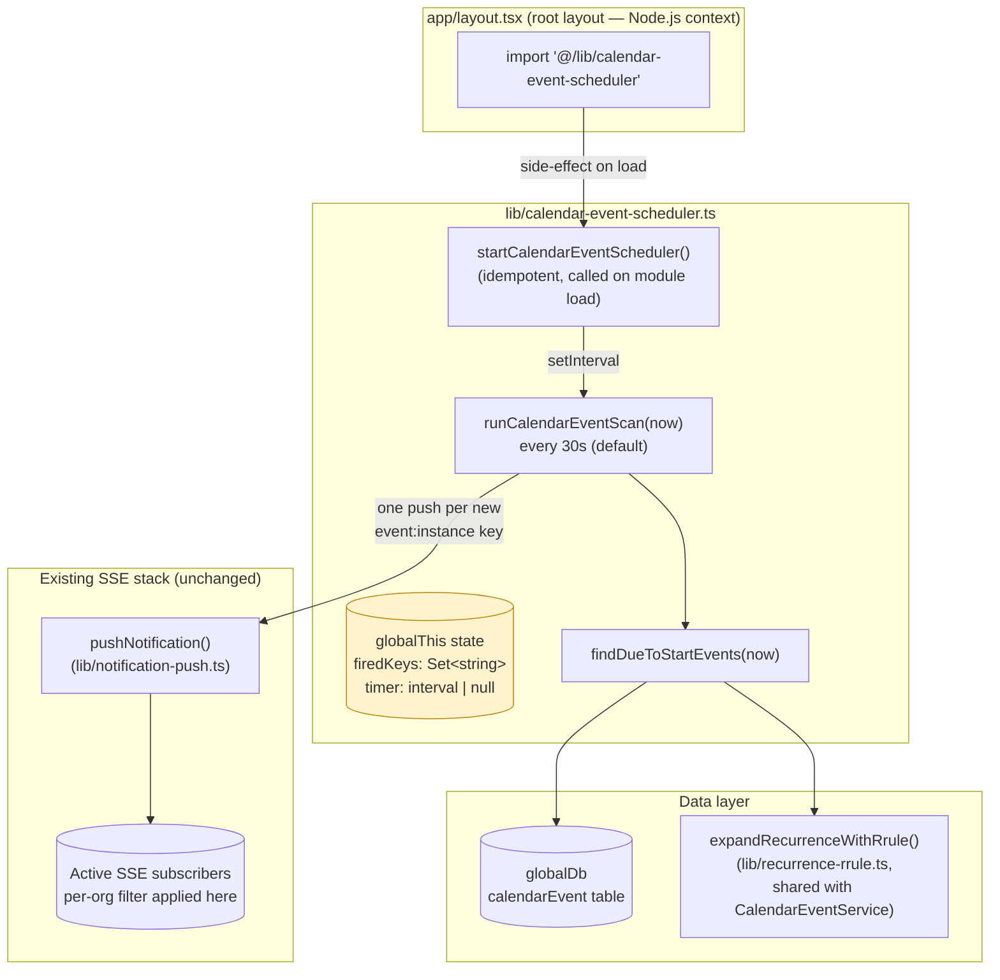
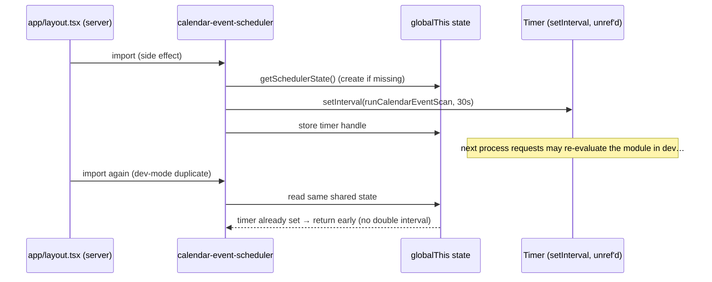
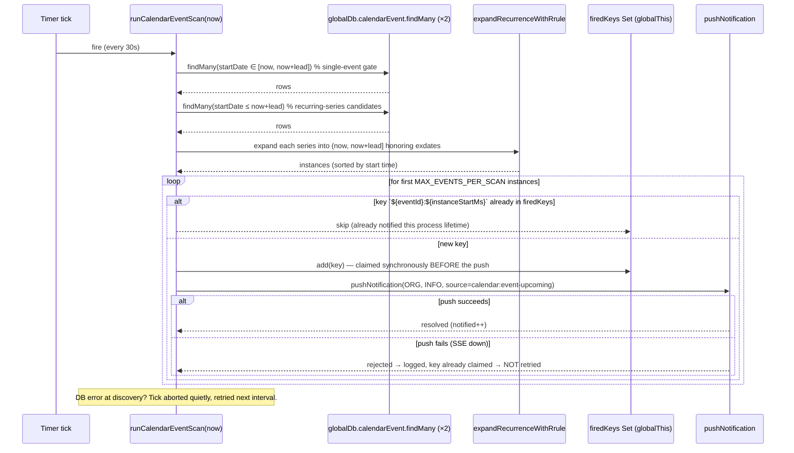
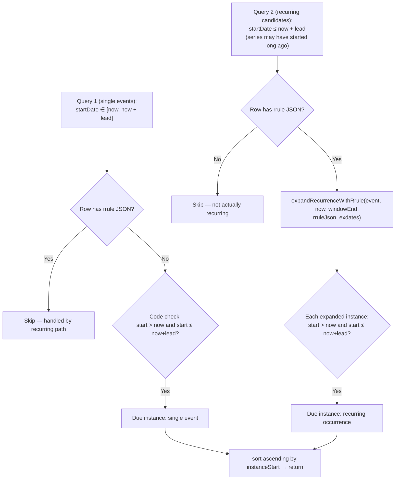
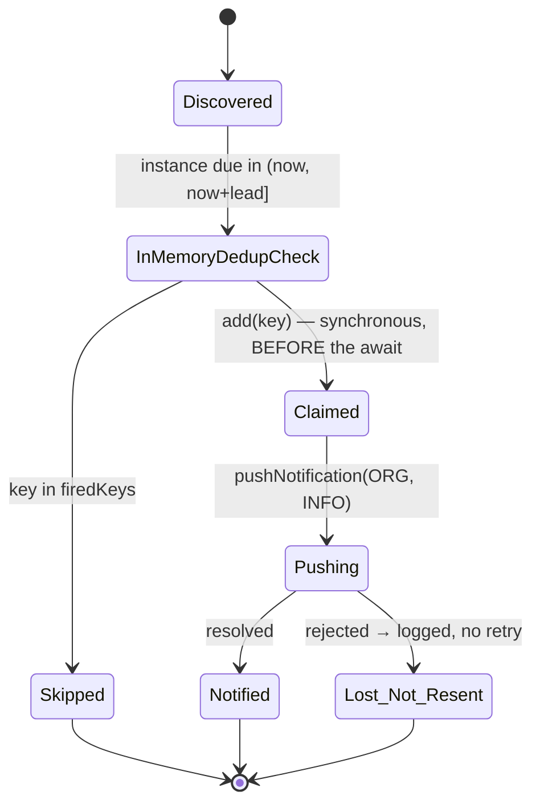
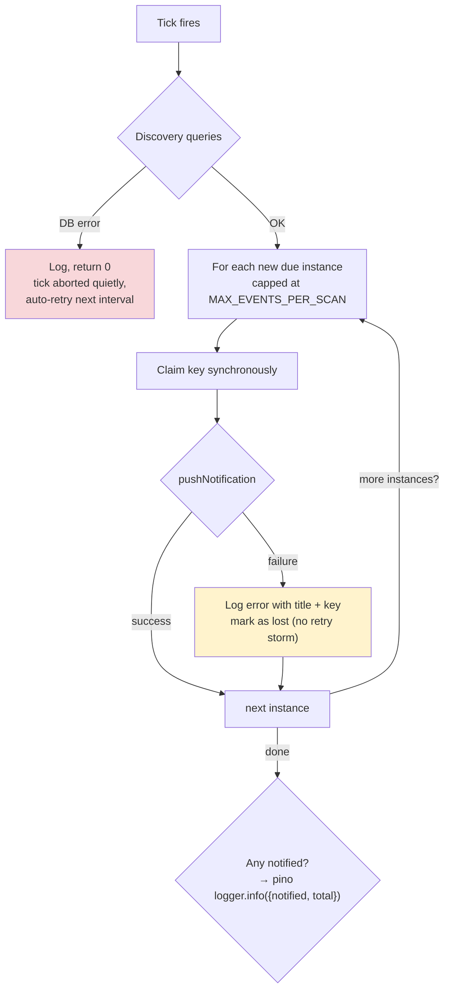

# Calendar Event SSE Notifications ("Due to Start" Alerts)

**Status:** Uncommitted working changes (branch `calendar-event-sse-notifications`)
**Changed files:**
| File | Change |
| --- | --- |
| `lib/calendar-event-scheduler.ts` | New — background scanner module |
| `tests/unit/calendar-event-scheduler.test.ts` | New — unit test suite (Vitest) |
| `app/layout.tsx` | 2 lines added — module import to boot the scheduler on server start |

## Table of Contents

- [Introduction](#introduction)
- [Motivation](#motivation)
- [Architecture Overview](#architecture-overview)
  - [Component Diagram](#component-diagram)
  - [Boot Path](#boot-path)
  - [Scan Tick Sequence](#scan-tick-sequence)
- [Core Concepts](#core-concepts)
  - [The Lead Window](#the-lead-window)
  - [Event Discovery: Single vs Recurring](#event-discovery-single-vs-recurring)
  - [Recurring Expansion and Exdates](#recurring-expansion-and-exdates)
  - [Notification Payload](#notification-payload)
  - [Tenant Isolation](#tenant-isolation)
- [Deduplication Strategy](#deduplication-strategy)
  - [Why In-Memory Instead of a DB Column](#why-in-memory-instead-of-a-db-column)
  - [Claimed-Before-Push Semantics](#claimed-before-push-semantics)
  - [Relationship to pushNotification's Own Dedup](#relationship-to-pushnotifications-own-dedup)
- [Resilience and Failure Modes](#resilience-and-failure-modes)
- [Process State and the globalThis Singleton](#process-state-and-the-globalthis-singleton)
- [Configuration](#configuration)
- [Testing](#testing)
- [Design Trade-offs and Known Limitations](#design-trade-offs-and-known-limitations)

---

## Introduction

The calendar event scheduler is a background service that watches the `CalendarEvent` table and pushes a real-time SSE notification whenever an event — single or recurring — is due to start within a configurable lead window (default 15 minutes). Each due instance produces exactly one **ORG-scoped, INFO-priority** notification per server process lifetime, delivered to all connected SSE subscribers in that organization (plus super admins).

The module is `lib/calendar-event-scheduler.ts` and deliberately mirrors the existing `lib/background-health-check.ts` pattern: a single shared `setInterval`, booted once per server process through the root layout's Node.js import side-effect, with all mutable state held on `globalThis` so duplicate module evaluation in Next.js dev mode cannot fork the timer or the dedup set.

## Motivation

Operators currently see calendar events only by opening the calendar UI — there is no proactive signal when a viewing, inspection, maintenance round, or lease signing is about to begin. This feature closes that gap without any client-side polling:

- **Proactivity:** staff get a push the moment an event enters its 15-minute lead window, delivered through the existing SSE notification ticker.
- **Recurring coverage:** daily/weekly maintenance rounds and similar series are expanded with the same rrule engine (`lib/recurrence-rrule.ts`) that powers calendar rendering, so alerts stay consistent with what the UI shows — including `exdate` exclusions.
- **Zero schema migration:** dedup is in-memory by deliberate choice (see [Deduplication Strategy](#deduplication-strategy)).
- **Zero client changes:** consumption goes through the existing `useNotifications()` hook and SSE ticker; no new API routes, no new models, no middleware changes.

## Architecture Overview

### Component Diagram



### Boot Path

The scheduler hooks into the same side-effect import that starts background health checks. The full diff to `app/layout.tsx` is:

```diff
 // Start background health checks on first request (Node.js context — not Edge).
 import '@/lib/background-health-check';
+// Start the calendar "due to start" SSE scanner (same Node.js boot path).
+import '@/lib/calendar-event-scheduler';
```

When `startCalendarEventScheduler()` runs at module load:

1. It returns immediately if a timer already exists on the shared state (idempotency guard).
2. Otherwise it creates a `setInterval` firing every `SCAN_INTERVAL_MS` and stores the handle in `globalThis` state.
3. It calls `timer.unref()` so the interval never keeps the Node.js process alive in dev mode.



### Scan Tick Sequence

Each tick is self-contained and never throws out of its callback:



## Core Concepts

### The Lead Window

The scan window is **`(now, now + LEAD_TIME_MINUTES]`** — exclusive lower bound, inclusive upper bound. An event starting exactly at `now` was already due on a previous tick; an event starting exactly at the window edge is in time for its lead-time warning.

```mermaid
timeline
    title A 15-minute lead window observed by consecutive ticks (30s interval)
    section Ticks
        Tick 1 t=10:14:30 : window (10:14:30, 10:29:30]
        Tick 2 t=10:15:00 : window (10:15:00, 10:30:00] — event E at 10:25 enters, NOTIFIED once
        Tick 3 t=10:15:30 : E still in window but key already fired → skipped
        ...          : every tick until E starts
        Tick N t≈10:25   : E is due; later ticks no longer match it (start ≤ now)
```

The DB query uses `startDate >= now` as the primary gate (inclusive at the boundary, which is why the code re-checks `start > now && start <= windowEnd` before accepting a row — this also keeps behavior identical for mocks and for the recurring path).

### Event Discovery: Single vs Recurring

Discovery runs **two queries** per tick, then merges and sorts the results by instance start time:



Notes on the two-stage design:

- **Query 1** is cheap and bounded: it only touches events whose single start date falls in the (short) window. The code-level re-check is a guard for mocks, clock rounding, and query-boundary inclusivity.
- **Query 2** intentionally uses a wider gate (`startDate <= windowEnd`, no lower bound) because a recurring series' *base* `startDate` can be days, months, or years in the past while its *next instance* falls inside the window. Expansion then restricts occurrences to `(now, windowEnd]`.
- Rows that appear in both queries (a row with an rrule, fetched by Query 1's range) are deduplicated by construction: Query 1 skips any row whose rrule parses successfully.

### Recurring Expansion and Exdates

Recurring series store their rule in the `rrule` JSON column (RRULE-format JSON: `freq`, `interval`, `dtstart`, optional `until`/`count`/`byweekday`/`bymonthday`) and skipped occurrences in the `exdates` JSON column (`YYYY-MM-DD` local-date strings). The scheduler reuses `expandRecurrenceWithRrule()` from `lib/recurrence-rrule.ts` — the exact same engine `CalendarEventService` uses — so alerts never disagree with rendered calendar instances.

Prisma returns `Json` columns as either a JSON string or an already-parsed object depending on driver/config; `getRruleJson()` / `getExdates()` normalize both shapes defensively (same approach as the service layer), and malformed JSON degrades to "not recurring" / "no exclusions" rather than crashing the tick.

An exdated occurrence is one the user explicitly skipped (e.g. a maintenance round cancelled for a public holiday). If *every* instance of a series inside the window is exdated, that scan produces no notification for it — but future unexdated instances of the same series will still fire, because dedup keys include the instance start time (see next section).

### Notification Payload

Each due instance produces one `pushNotification()` call with:

| Field | Value |
| --- | --- |
| `priority` | `INFO` |
| `scope` | `ORG` |
| `source` | `calendar:event-upcoming` (stable identifier for client-side filtering) |
| `organizationId` | the event's owning organization |
| `title` | `Calendar event due to start: <event title>` |
| `message` | `<Type label>: "<event title>" starts at HH:mm on Ddd D Mon (ends HH:mm).` |

Event type mapping for the label: `VIEWING → Viewing`, `INSPECTION → Inspection`, `MAINTENANCE → Maintenance`, `LEASE_SIGNING → Lease Signing`, `LEASE_RENEWAL → Lease Renewal`, `KEY_EXCHANGE → Key Exchange`, anything else (including unknown/missing) → `Other`. Times/dates are formatted with `en-GB` locales (`10:45`, `Tue 8 Sep`).

Example ticker entry:

```
Calendar event due to start: Viewing: 12 Foyle St
Viewing: "Viewing: 12 Foyle St" starts at 10:45 on Tue 8 Sep (ends 11:00).
```

### Tenant Isolation

The scheduler runs **outside any request scope** — it has no user, no session org — and therefore scans the entire `calendarEvent` table across all organizations. That is safe because tenant isolation is enforced **at delivery**: every notification is `ORG`-scoped with the event's own `organizationId`, and `pushNotification()` only writes to subscribers whose `orgId` matches (or `orgId = null` for super admins). An org's users can never see another org's upcoming-event notifications, even though the scanner reads all rows.

## Deduplication Strategy

### Why In-Memory Instead of a DB Column

Dedup state is an in-memory `Set<string>` of keys shaped like `${eventId}:${instanceStartMs}`, held on `globalThis`. It was chosen over persisting a "last notified instance" column for these reasons:

- **No schema migration** for a feature whose blast radius on failure is "one duplicate ticker message", not data corruption.
- **Per-instance precision:** a recurring series must fire again tomorrow for tomorrow's instance; an in-set key keyed on the *instance start timestamp* gives correct once-per-instance semantics for free, whereas a per-event "already notified" flag would suppress legitimate future notifications (or require timestamp-comparison logic at read time).
- **Accepted cost (documented trade-off):** after a server restart the `firedKeys` set is empty. An instance still inside its lead window can be notified once more in the new process. The product behavior chosen is *at-least-once with at most one restart-induced duplicate* — best-effort, accepted.

### Claimed-Before-Push Semantics

The key ordering in `runCalendarEventScan` is deliberate:



The claim happens **synchronously before the async push**. On a single-threaded event loop this means no two ticks can ever both decide to push the same `event:instance` pair — and if the push itself fails (SSE down, DB write error inside `pushNotification`), the key is already claimed, so the next tick silently skips it. This is **lost-not-resent** by design: if SSE is unavailable for a stretch, we drop those notifications rather than building a backlog that re-floods subscribers on recovery. The failure is logged with the event title and dedup key for observability.

### Relationship to `pushNotification`'s Own Dedup

`lib/notification-push.ts` already has a 10-second in-process/DB dedup window keyed on the full payload. The scheduler **deliberately does not rely on it**: at a 30s scan interval, consecutive ticks are spaced *outside* that window, so without the scheduler's own `firedKeys` set every due event would be re-pushed on every tick for up to the length of its lead window (15 min / 30 s = up to ~30 duplicate pushes per event). The scheduler's set is the primary dedup; the push service's window is only a safety net for genuinely concurrent calls.

## Resilience and Failure Modes



Guarantees and failure behavior:

| Failure | Behavior | Rationale |
| --- | --- | --- |
| DB unreachable during discovery | Tick aborts (logs `Discovery failed, skipping tick`), returns 0 | Next interval retries; no partial state is mutated because claims only happen after successful discovery |
| SSE push fails for one event | That notification is **lost**, key already claimed, error logged | Prevents retry storms when the SSE layer is down for minutes; ticker traffic must never cascade into a backlog |
| Push succeeds but subscriber write fails later | Handled inside `pushNotification` (dead subscribers are pruned) | Scheduler is unaffected |
| Burst of many due events at once (e.g. clock skew, mass-import) | First `MAX_EVENTS_PER_SCAN` (20) instances handled per tick; the rest wait for... *nothing* — they will not be re-matched after they fall past `now` | The cap bounds a single tick's work; see Known Limitations for the consequence |
| Timer callback throws (shouldn't — scan is wrapped) | `.catch()` on the scheduled promise logs and drops | One bad tick can never kill the interval |
| Module evaluated twice (Next.js dev mode) | `globalThis` state makes the second `startCalendarEventScheduler()` a no-op | Single interval, single dedup set per process |

Success logging: when a tick notified at least one event, a structured pino record is emitted via `logger.info({ notified, total }, 'Calendar upcoming-event notifications pushed')`. Quiet ticks (no due events) log nothing.

## Process State and the globalThis Singleton

All mutable module state lives under one key on `globalThis` — the same pattern as `lib/background-health-check.ts` and `lib/notification-push.ts`, which document why: Next.js dev mode (and some bundling configurations) can evaluate the same module more than once per process. A plain module-scoped `new Set()` would hand each copy its own timer *and* its own dedup set — producing double intervals **and** double notifications.

```typescript
type SchedulerState = {
  firedKeys: Set<string>;   // `${eventId}:${instanceStartMs}` — process-lifetime dedup
  timer: ReturnType<typeof setInterval> | null;  // idempotency guard
};
```

Keying on `globalThis`:

- makes every module copy share one store, matching production (single instance) behavior;
- is harmless in Vitest — each test file gets a fresh worker/global scope, so tests naturally start isolated;
- keeps dedup **per-process** by definition (the document this feature's restart-duplicate trade-off accordingly).

Lifecycle helpers export a small test surface: `startCalendarEventScheduler()` (idempotent), `stopCalendarEventScheduler()`, and `resetCalendarEventSchedulerState()` (stops the timer and clears `firedKeys` — used to simulate process restarts in tests). The module calls `startCalendarEventScheduler()` itself at load time.

## Configuration

All configuration is read from environment variables with hardcoded defaults, following the codebase convention:

| Variable | Default | Effect |
| --- | --- | --- |
| `CALENDAR_EVENT_SCAN_INTERVAL_MS` | `30000` (30 s) | Interval between scan ticks |
| `CALENDAR_LEAD_TIME_MINUTES` | `15` | Lead window length: notify when an event starts within this many minutes |
| `CALENDAR_MAX_EVENTS_PER_SCAN` | `20` | Per-tick cap on notifications pushed (burst protection) |

Values are parsed with `Number(process.env.X ?? default)`. Note the interaction between the two timing knobs: if `SCAN_INTERVAL_MS` is configured longer than the lead window, an event can enter and leave the window between ticks and be missed entirely. The defaults (30 s ≪ 15 min) give ~30 chances to catch each instance.

## Testing

`tests/unit/calendar-event-scheduler.test.ts` (Vitest) mocks `@/lib/global-db`, `@/lib/logger`, and `@/lib/notification-push`, and fixes a shared "now" (`2026-09-08T10:30:00`) per test. Coverage by area:

**`findDueToStartEvents` (discovery, pure query + expansion):**
- fetches single events in `(now, now+lead]` and asserts the exact DB `where` window (`gte: now`, `lte: now+15m`)
- empty results when nothing is due
- recurring series expand to the correct single instance (daily series, next day's occurrence in-window)
- exdated occurrences produce no notification for that scan
- out-of-window rows fetched by the DB are dropped by the code-level filter
- results ordered ascending by instance start

**`runCalendarEventScan` (notify + dedup):**
- ORG-scoped INFO payload with exact `source: 'calendar:event-upcoming'`, correct org id, and en-GB formatted time in the message
- repeat scans are no-ops (in-memory dedup)
- **recurring events fire again for a new instance 24h later** — dedup is per-`event:instance`, not once-ever; the two pushes carry different messages
- resetting state (simulated restart) allows re-firing of an in-window instance
- events starting just outside the window (`now + 16 min`) are never notified
- a **push failure** returns 0, still claims the key → no retry on the next scan
- a **DB failure** on the first query resolves to 0 without throwing and pushes nothing
- the per-scan cap limits a 40-event burst to ≤ 20 pushes

**Scheduler lifecycle (fake timers):**
- one tick performs exactly two `findMany` calls (single + recurring queries)
- double-starting is idempotent — timer advances still produce one scan per interval, not two
- stopping halts ticks entirely

## Design Trade-offs and Known Limitations

1. **Restart-induced duplicate (accepted):** in-memory dedup means an instance still inside its lead window when the server restarts can be notified a second time. Chosen over a schema migration; the duplicate is bounded to one per restart per in-window instance.
2. **Lost-not-resent on push failure:** if SSE delivery fails, the notification for that instance is lost permanently (key already claimed). This protects subscribers from backlog floods on recovery; the cost is that an event whose lead window fully elapses during an SSE/DB outage gets no alert at all.
3. **Per-scan cap can drop events:** with `MAX_EVENTS_PER_SCAN = 20`, a burst of more than 20 *new* due instances in one tick would leave the excess unclaimed... but because they sort by start time and later ticks re-discover only instances still inside `(now, windowEnd]` with exclusive lower bound, instances already past `now` are never retried across ticks. Under a genuine 20+-event burst some notifications can be dropped outright. The cap is an intentional DoS/burst guard; the default fleet size makes >20 simultaneous due instances vanishingly rare.
4. **Cross-instance dedup only within one process:** if the app ever runs multiple server processes/containers behind a load balancer, each process scans independently and each will notify once per its own lifetime — i.e., up to N notifications per event instance for N processes. `pushNotification`'s 10 s DB dedup window would suppress most of these only when the ticks happen to land closer than 10 s apart, which 30 s intervals do not guarantee. Current deployment is single-instance; document this before scaling horizontally.
5. **Wall-clock dependent:** detection relies on server clock accuracy and the DB `startDate` being in the server's interpretation of time (stored as UTC `Date`, compared directly — consistent with how the calendar service already handles instances). No timezone conversion occurs at scan time; instance times shown in messages are rendered from the stored instants via `en-GB` formatting, matching the rest of the app.
6. **All-orgs scan:** every tick queries all organizations' events (both queries are unscoped by org). At current scale this is a small indexed range scan; if the calendar table grows large, the obvious next step is an index on `startDate` plus org-scoped sharded scans — noted here so it's a conscious decision when that time comes.
