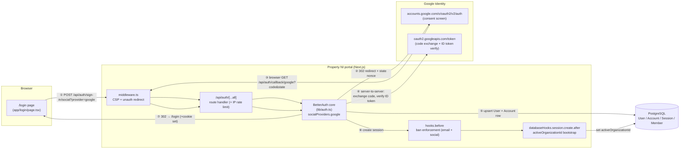
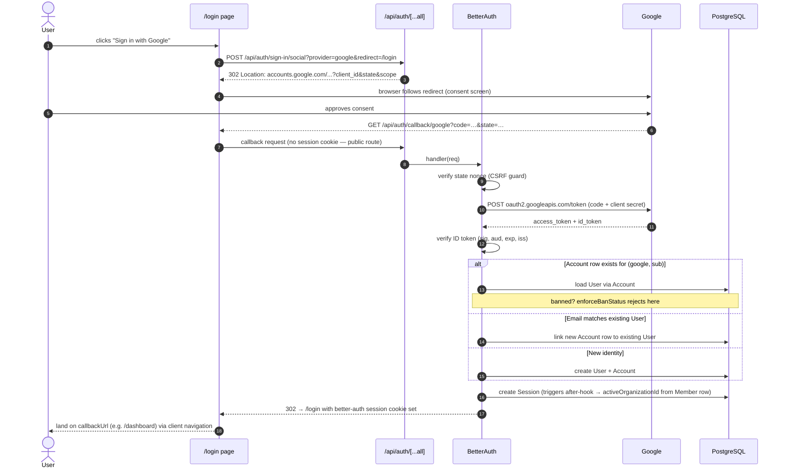
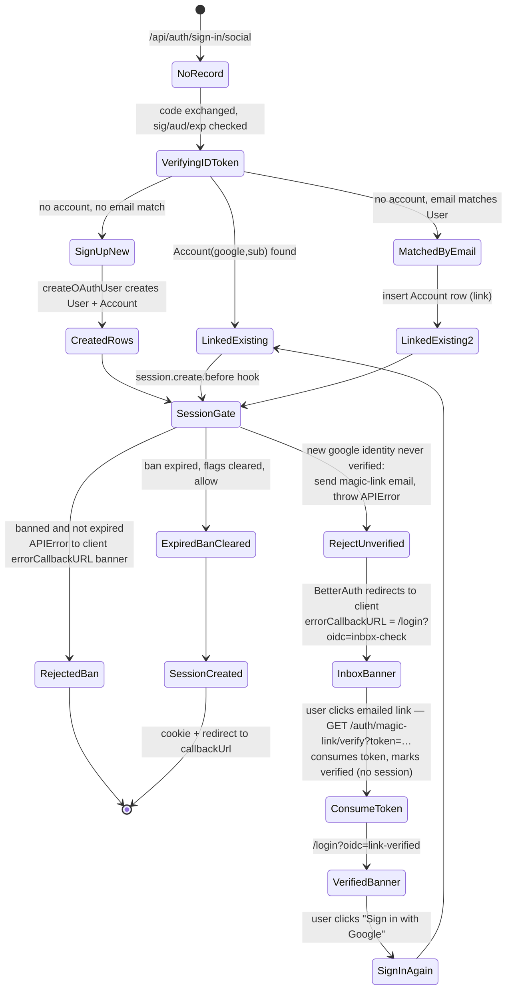
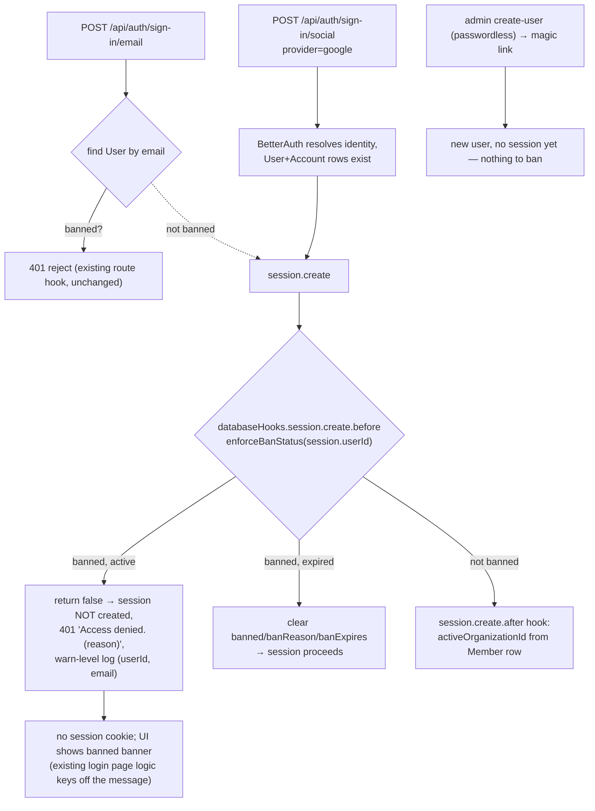
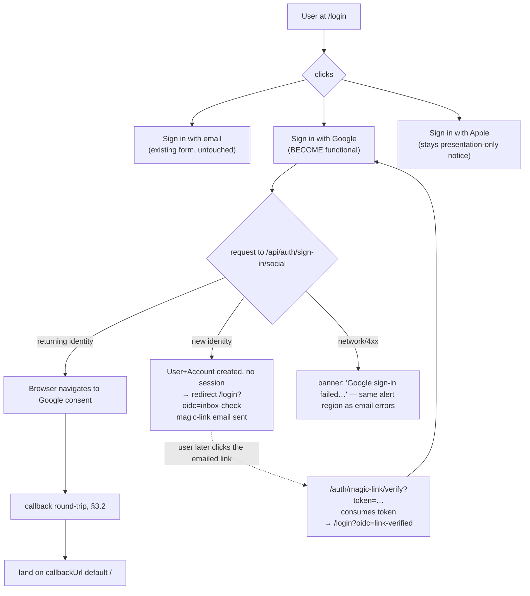
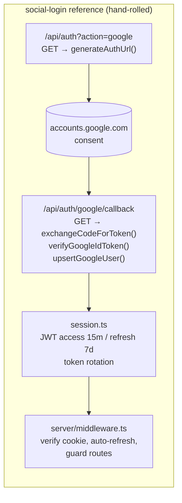

# Google OIDC Integration — Design Document

**Date:** 2026-10-02 (updated 2026-10-03: magic-link verification for new Google users)
**Status:** Proposed
**Branch:** `google-oidc`
**Related plan:** `.hermes/plans/20261003_042133-google-oidc-with-magic-link.md`

---

## Table of Contents

- [1. Overview](#1-overview)
- [2. Current State Audit](#2-current-state-audit)
- [3. Chosen Approach](#3-chosen-approach)
  - [3.1 High-Level Component Diagram](#31-high-level-component-diagram)
  - [3.2 Sign-In Sequence (happy path)](#32-sign-in-sequence-happy-path)
  - [3.3 Why BetterAuth over the reference implementation](#33-why-betterauth-over-the-reference-implementation)
- [4. Account Model & Linking Semantics](#4-account-model--linking-semantics)
  - [4.1 Decision Matrix](#41-decision-matrix)
  - [4.2 First Google Sign-In State Diagram](#42-first-google-sign-in-state-diagram)
- [5. Security Design](#5-security-design)
  - [5.1 Ban Enforcement Flow](#51-ban-enforcement-flow)
  - [5.2 CSRF / Open-Redirect Hardening](#52-csrf--open-redirect-hardening)
  - [5.3 Rate Limiting](#53-rate-limiting)
- [6. Configuration & Environment](#6-configuration--environment)
- [7. UI Changes](#7-ui-changes)
- [8. Phased Delivery](#8-phased-delivery)
- [9. Test Strategy](#9-test-strategy)
- [10. Risks & Open Questions](#10-risks--open-questions)
- [Appendix A: Reference — /Users/johnlynas/dev/social-login](#appendix-a-reference---usersjohnlynavsocial-login)

---

## 1. Overview

The Property NI portal (`nipp-0807`) currently enforces a single authentication method: email/password through BetterAuth. The login page has a "Sign in with Google" button that is **presentation-only** — clicking it shows a notice ("Google sign-in isn't connected to this portal yet"). This document designs the integration of genuine Google OIDC sign-in behind that button, leaving email/password fully intact and sharing one user account between both methods.

Product requirements fixed for v1 (added 2026-10-03):

1. **Local login stays exactly as it is** — admin-created users with passwords sign in via the existing form; no behavior change for them.
2. **Brand-new Google OIDC users are verified by magic link.** When a first-time Google identity is created, its account rows (`User` + `Account`) exist but **no session is issued**: the sign-in attempt is rejected at session-creation, an email with a one-time magic link goes to the user's (Google-asserted) address, and they land on a "/login — check your inbox" banner. The user opens the email, clicks the link (inbox ownership proven; the token is consumed and the user is marked verified), then completes sign-in by clicking **Sign in with Google** again — which now succeeds.
3. **The admin create-user flow supports sending a magic-link email**, so a passwordless admin-created user can complete their first sign-in the same way.

Non-goals for v1:

- Apple Sign In (button stays presentation-only).
- Admin UI for managing provider-linked accounts.
- Domain allowlists / hosted-domain restrictions (open question, §10).
- Password reset changes — out of scope, untouched.
- A standalone "magic-link sign in" entry point on the login page — links are issued only from account-creation events (new Google user, admin create-user). The magic-link *verify* endpoint exists but deliberately does not mint a session (§4.3).

## 2. Current State Audit

Everything was verified against the working tree on 2026-10-02 (branch `google-oidc`):

| Area | File(s) | Finding |
|---|---|---|
| Server auth core | `lib/auth.ts` | `betterAuth()` (v1.6.23, `minimal` entrypoint) with Prisma adapter, org plugin, session hooks, ban middleware, rate limits. **No `socialProviders` configured.** |
| API surface | `app/api/auth/[...all]/route.ts` | Catch-all → `auth.handler(req)`; POSTs IP-rate-limited (`checkAuthRateLimit`); org-create interception. Provider endpoints pass through unchanged. |
| Middleware | `middleware.ts` | `/api/auth` is in `PUBLIC_PATTERNS`; unauthenticated non-public routes bounce to `/login?callbackUrl=...`. Google auth endpoints already public. |
| Env | `lib/env-schema.ts:11-12`, `.env.example:24-25` | `GOOGLE_CLIENT_ID` / `GOOGLE_CLIENT_SECRET` **already required** by the Zod schema (and pinned in `tests/unit/env.test.ts`). No schema change needed. |
| Database | `prisma/schema.prisma:114,149` | `User` (unique email, nullable `passwordHash`) and `Account` (`providerId`, `providerAccountId`) — satisfies BetterAuth social login. **This feature adds:** a new `Verification` model + a `User.oidcVerified Boolean @default(false)` column (magic-link plumbing) — one migration, §6. |
| Session bootstrap | `lib/auth.ts` `databaseHooks.session.create.after` | Sets `activeOrganizationId` from the user's `Member` row on *any* session creation — applies to Google sessions automatically. |
| Ban enforcement | `lib/auth.ts:196-225` | Only runs for `ctx.path === '/sign-in/email'`. **Must be extended** (see §5.1). |
| Login UI | `app/login/page.tsx` | Own inline Google SVG icon (no remote image → CSP-safe, `img-src 'self'` in `middleware.ts`). Button wired to an `SSO_NOTES.google` notice. |
| Client | `lib/auth-client.ts` | `createAuthClient` with org client plugin; `authClient.signIn.social(...)` becomes available once the server registers the provider (no new package). |
| Rate limits | `lib/rate-limiter.ts`, auth route handler | Generic POST rate limit already covers `/api/auth/sign-in/social`. BetterAuth's own limiter also configured (`/sign-in/email` tightened). |

**Conclusion:** the repo is ~85% ready for Google OIDC — env vars, DB shape, public routes, and session bootstrapping are all in place. The work is: provider registration, the `Verification` model + `oidcVerified` column (migration), the magic-link helper + verify route, ban/verification enforcement at session creation, and UI wiring.

## 3. Chosen Approach

### 3.1 High-Level Component Diagram



Key points:

- **Step 4 is server-to-server only.** The auth code never reaches the browser a second time; the ID token is verified by BetterAuth (audience, expiry, signature) before any user row is touched.
- Steps 5–6 reuse the **existing** Prisma `User`/`Account` models and the **existing** session hooks, so Google users get identical downstream behavior (org context, permissions callback, cookie policy) to email users.
- No new runtime dependency: `better-auth@1.6.23` already ships a verified `google` provider factory (`import { google } from 'better-auth/social-providers'`, presence confirmed in the installed package).

### 3.2 Sign-In Sequence (happy path)



### 3.3 Why BetterAuth over the reference implementation

The working starter at `/Users/johnlynas/dev/social-login` demonstrates a complete Google OIDC flow (see Appendix A). It is excellent **flow reference material** but we deliberately do *not* port its code:

| Concern | Reference project (hand-rolled) | BetterAuth (chosen) |
|---|---|---|
| Token exchange + ID-token verify | Manual `google-auth-library` calls (`exchangeCodeForToken`, `verifyGoogleIdToken`) | Built into the provider factory; verified against Google JWKS automatically |
| CSRF / state | Handled in their OAuth flow, not extracted as middleware | BetterAuth issues a signed state nonce per redirect |
| Sessions & cookies | Own JWT access/refresh pair + Redis session store | Reuses the portal's existing session machinery (1h expiry, 15min renewal, cookie cache) — one code path for both sign-in methods |
| User upsert | Custom `upsertGoogleUser` with a swallowed duplicate-key catch | Deterministic provider→account linking semantics (§4) backed by the schema we already have |
| Ban/org/permissions hooks | None (greenfield starter) | Our existing `hooks.before`, `session.create.after`, and permission callbacks apply unchanged to Google sessions |

Porting the hand-rolled flow would mean **two parallel session systems** in one app — a maintenance and security liability. The reference's one non-obvious idea we *do* adopt is treating Google login as an account *linking* event, not a separate user class (see §4).

## 4. Account Model & Linking Semantics

### 4.1 Decision Matrix

`User.email` is unique; `Account(providerId='google', providerAccountId=<google sub>)` identifies the provider identity. Google sign-in resolves the portal user in this order:

| Case | State before login | Behavior | New row(s) |
|---|---|---|---|
| A. Returning Google user | `Account(google, sub)` exists | Sign in as the linked user (subject to the §4.3 provisioning gate) | none |
| B. Google email matches password-only user | `User(email)` exists, no google `Account` | **Blocked for v1 pre-registration** — session withheld at the provisioning gate until an admin invites the account (magic link consumed + org membership exists); free link-by-email was the doc's original default and is superseded by the implementation plan (product decision #3) | none until invited |
| C. Brand-new identity | No match on sub or email | Implicit sign-up creates `User` (email + verified flag from Google's token) + `Account`, then the **session gate rejects** (magic link sent, no session) until the user clicks their magic link; second "Sign in with Google" succeeds (§4.3) | 1 × `User` + 1 × `Account` |
| D. Google identity, password also set later | any of A–C | Both login methods work against the same `User.id` forever after | — |

Case B was originally the decision most worth calling out: **one account, two doors.** We do *not* create a shadow user when a Google email matches an existing password user (the naive behavior some IdPs produce) — that would strand their org membership and history on an orphan row. **Superseded for v1 pre-registration** by the implementation plan (`.hermes/plans/20261005_135703-google-login-pre-registration-magic-link.md`, product decision #3): in an invite-only deployment, case-B free linkage is a claim vector rather than a convenience, so the provisioning gate (`enforceOidcProvisioning`) withholds every Google-only session until an admin invites the account — which also covers admin-created users (decision #3/#4). The "no shadow user" posture is retained; only the link-by-email step is suppressed.

Consequences to keep in mind:

- **Brand-new Google users must complete magic-link verification before any session exists** (§4.3) — they cannot use the portal until they open their email, click the link, and sign in with Google a second time.
- New Google users start with **no org** (no `Member` row) → `activeOrganizationId` stays null, exactly like today's orphaned email users. Provisioning is a separate feature.
- The ban flag on `User` applies to both doors — enforced identically at session-creation time (§5.1).

### 4.2 First Google Sign-In State Diagram



### 4.3 Magic-Link Verification for New Google Users

**Requirement:** a brand-new OIDC user's account is created (with the email that Google asserted as verified), but no session is issued until the user proves ownership of that inbox by clicking a magic link, then signs in via Google again.

**Local-user guarantee:** none of the magic-link machinery touches email/password sign-in — local users keep the exact same flow as today (the only shared change is the extracted ban helper, §5.1). Their `emailVerified=false` is meaningless to them; the gate fires only for Google-only unverified identities.

**Why not `disableSignUp: true` on the provider (rejected design):** in installed `better-auth@1.6.23`, `handleOAuthUserInfo` (`node_modules/better-auth/dist/oauth2/link-account.mjs:78-83`) returns `{ error: "signup disabled" }` for a brand-new identity **without creating any `User`/`Account` rows at all** — so nothing exists to verify, and a second Google click fails the same way. The provider flag therefore cannot express "create the account, withhold only the session." We keep implicit sign-up **on** (BetterAuth's default) and implement the gate ourselves in a database hook.

**Verified mechanism (all `node_modules` references below are from installed 1.6.23):**

- **Create:** a first-time Google identity goes through `createOAuthUser` (`link-account.mjs:97`) → `User(email, emailVerified=true)` + `Account(google, sub)`. Implicit sign-up must stay enabled (no `disableSignUp`, no `disableImplicitSignUp`). Note: Google's token sets `emailVerified: true` on the new row (`link-account.mjs:102`) — so **`emailVerified` cannot be our "needs magic link" marker**. We add a dedicated column `User.oidcVerified Boolean @default(false)` (new migration, §6) that only becomes true when the user clicks their own magic link (or an admin verifies them manually).
- **Gate:** `databaseHooks.session.create.before` in `lib/auth.ts` rejects session creation when the user has a Google identity and `oidcVerified === false` — i.e. an `Account(providerId:'google')` exists, `user.oidcVerified` is false, and there is no credential (password) account (so case B of an existing local user linking Google is *not* blocked — local users are trusted by construction; only pure-Google identities need the inbox proof). Rejection throws `APIError('UNAUTHORIZED', { message: 'Access denied. …check your email…' })`. The callback route catches APIErrors (`callback.mjs:149-153`) and redirects the browser to the **client's `errorCallbackURL`** (state-carried; set by the login page on `authClient.signIn.social({ provider:'google', errorCallbackURL: '/login?oidc=inbox-check' })`) — so the user sees a branded banner, not BetterAuth's default error page.
- **Send (custom helper — plugin's public endpoint deliberately NOT registered):** the `magicLink` plugin in 1.6.23 bundles a *public* `POST /sign-in/magic-link` that reopens signup for anyone who can receive mail — contrary to the portal's closed-registration stance (`emailAndPassword.disableSignUp: true`). So we register **neither** the plugin nor its endpoints, and replicate its (tiny, verified) token plumbing in a new helper `lib/oidc-magic-link.ts`: `generateRandomString(32)` from `better-auth/crypto` → insert into the Prisma **`Verification` table** (`id`, `identifier=<token>`, `value=JSON{email, kind:'oidc-verify'}`, `expiresAt=now+5min`) → build `${FRONTEND_URL}/auth/magic-link/verify?token=…` → send via the existing nodemailer path (`lib/notifications/email.ts`, adapted for a CTA button). The helper is invoked from exactly two account-creation events (no public self-service endpoint anywhere):
  1. **New Google user** — at the first "Sign in with Google" attempt, inside `session.create.before` when it detects `oidcVerified === false`. The hook sends one email per attempt and then throws; every retry re-sends a fresh link (old tokens remain consumable until their 5-minute expiry — risk #5).
  2. **Admin create-user without password** — `app/api/admin/users/route.ts` POST handler after `UserService.create` (§7). An admin-created user with a Google-usable email can then verify via link and also sign in with Google (case B); an admin-created user *with* a password needs no link.
- **Verify:** a small **custom** route `GET /auth/magic-link/verify?token=…` (public in `middleware.ts`). It: (1) rate-limits via the existing `checkAuthRateLimit`; (2) looks up + deletes the `Verification` row where `identifier = token` and `expiresAt > now` — atomic consume, single-use by construction; (3) on hit, updates the user (`oidcVerified: true`) from `value.email` and redirects to `/login?oidc=link-verified`; (4) on miss/expired, redirects to `/login?oidc=link-expired`. **It deliberately does not mint a session** — the plugin's own `magic-link/verify` endpoint would create one (`index.mjs`: `internalAdapter.createSession(user.id)` + `setSessionCookie`), which contradicts "login happens via Sign in with Google."
- Token lifetime 5 minutes (plugin default). The token authorizes nothing beyond marking one user verified, so interception replay is bounded: worst case an attacker consumes a victim's token and the victim simply asks for another link.

**Why the gate can't be bypassed:** no other code path creates a session with `userId` except sign-in flows; `magic-link/verify` (custom) never mints sessions; admin-created users have no Google account and are unaffected by the gate condition until they attempt one. Ban enforcement lives in the same hook (§5.1).

## 5. Security Design

### 5.1 Ban Enforcement Flow

Today, ban checking runs only on the email path (`lib/auth.ts:196-225`, `ctx.path === '/sign-in/email'`). A banned user could simply click "Sign in with Google". After this feature, one exported helper owns the logic and both sign-in methods feed it from **one enforcement point**: `databaseHooks.session.create.before` in `lib/auth.ts`.

Why move here: the email path checks ban *before* session creation via a route hook, but that hook fires before BetterAuth resolves the social identity to a user (at `/sign-in/social` time we only have the provider — not the sub). Session-creation is the **single point where every successful sign-in funnels with `session.userId` known** — email, Google (returning user and second-login-after-magic-link), and passwordless admin-created users all pass through it. Enforcing ban there means no sign-in method can bypass it, including future ones.



Implementation notes:

- The helper (`enforceBanStatus(email)` in `lib/auth.ts`) is extracted from the existing inline code so the email route hook and the session hook share one implementation (DRY); email behavior stays covered by an existing integration test.
- `session.create.before` may return `false` to suppress creation, but that yields a generic failure — for the **banned** case we throw `APIError('UNAUTHORIZED', { message: 'Access denied. …' })` inside the hook so BetterAuth returns the exact message the login page's `isBanned` detection already recognizes.
- New Google users cannot be banned before first login (no session is ever issued for them), so there is no bypass at creation time; case A (returning user) and every subsequent login are all covered by the session hook.

### 5.2 CSRF / Open-Redirect Hardening

| Threat | Control | Status |
|---|---|---|
| CSRF on OAuth callback (attacker injects their own authorized code into our user's browser) | BetterAuth issues a per-flow signed **state** nonce; callback must match | provided by library; verify empirically in Task 2 of the plan |
| Magic-link token interception / replay | 32-char random token, stored in `Verification`, atomically consumed on verify (the plugin uses `consumeVerificationValue`); 5-minute expiry; our custom verify route never mints a session — worst case an attacker consumes a victim's token and the victim simply re-signs-in with Google | designed in §4.3; unit-tested in Task 4 |
| Magic-link enumeration (attacker probes tokens) | Tokens are 192-bit random strings — not enumerable; token is atomically consumed on first use, 5-minute expiry; our custom verify route IP-rate-limits via the existing `checkAuthRateLimit` helper | Task 4 implements + tests |
| Email spoofing (forged magic link lands in user inbox) | Link URL host is the portal origin (`FRONTEND_URL`); a forged mail client still has to present a **valid, unspent token** on the real host — tokens only exist server-side | no new surface; document in runbook |
| Open redirect via `callbackURL`/`redirect` params | Validate destination is same-origin before navigating (the login page already reads `callbackUrl`; add a URL-same-host guard when wiring it) + `newUserCallbackURL` is a **hardcoded constant** in server config, not user input | UI task action item |
| Token leakage via JS access to session cookie | Existing cookie attributes: httpOnly, `Secure` in prod, `SameSite=Lax` (`lib/auth.ts` `advanced.defaultCookieAttributes`) | unchanged |
| ID token acceptance from another app | Audience check against `GOOGLE_CLIENT_ID` during verification | provided by library |
| Credential brute force on Google path | Generic auth POST IP rate limit already applied in the route handler; BetterAuth's own limiter configured | confirmed no new gap |

CSP note: the login page uses an **inline SVG** Google icon, so `img-src 'self'` in `middleware.ts` is unaffected. Do not add a remote favicon/asset for the button.

### 5.3 Rate Limiting

No change required. `app/api/auth/[...all]/route.ts` runs `checkAuthRateLimit(ip)` on **every** POST, so `/api/auth/sign-in/social` inherits the same per-IP window as email login. BetterAuth's built-in limiter (`lib/auth.ts:123-134`) additionally covers its own route space; the tightened email-only rule stays as-is (Google sign-ins are inherently bounded by Google's own account system).

## 6. Configuration & Environment

Already in place — no changes needed for v1:

```env
GOOGLE_CLIENT_ID="<from Google Cloud Console>"     # lib/env-schema.ts:11, .env.example:24
GOOGLE_CLIENT_SECRET="<…>"                          # lib/env-schema.ts:12, .env.example:25
FRONTEND_URL="http://localhost:3000"                # used for redirect URIs AND as the magic-link host
SMTP_HOST / SMTP_PORT / SMTP_USER / SMTP_PASS       # existing nodemailer config (lib/notifications/email.ts)
SMTP_FROM="noreply@nipp.gov.uk"                     # sender of magic-link emails
```

Operational checklist (runbook, not code):

1. Google Cloud Console → create OAuth client (Web application).
2. Redirect URI **must exactly match** what BetterAuth constructs: `FRONTEND_URL + /api/auth/callback/google` (dev: `http://localhost:3000/api/auth/callback/google`; prod: the production origin).
3. Consent screen scope: `openid email profile` — BetterAuth's google provider default. Do **not** request offline access in v1.
4. Publish/verify status: for a portal whose users are not on staff emails, the consent screen must be *Published* or those users can't authenticate.
5. **Email forwarder (external dependency, user-owned):** the portal's outbound mail is delivered via its own mailbox (`SMTP_FROM`), so an email forwarder must route `noreply@nipp.gov.uk` → each Google account of a new OIDC user so they actually receive the magic-link email. Forwarding is per-user and lives outside this codebase (DNS/MX or provider-side forwarding rules); until it is configured for a given address, that new user will never see their magic link — treat "email not arriving" as the first diagnostic in the e2e checklist (Task 9).

## 7. UI Changes

Scope is intentionally minimal — `app/login/page.tsx` and the admin create-user modal:



**Login page (`app/login/page.tsx`):**

- The existing `GoogleIcon` SVG, button styling (`socialButtonCls`), divider, and layout are kept. Only the handler changes (from `setSsoNote(SSO_NOTES.google)` to `authClient.signIn.social({ provider: 'google' })`) and the `google` entry drops out of `SSO_NOTES`.
- **Two new one-shot banners**, driven by a `?oidc=…` query param consumed on mount (and stripped from the URL via `router.replace`):
  - `oidc=inbox-check` — info banner: *"We've sent a sign-in link to {email from Google is not client-known, so phrasing is generic}: 'If this was your first time signing in with Google, check your email for a link… then come back and Sign in with Google.'"*
  - `oidc=link-verified` — success banner: *"Email verified. Click Sign in with Google to finish setting up your account."*
- The `callbackUrl` guard (same-origin only) applies to all post-login navigation; the Google button itself does not accept user-supplied redirect targets.
- Banned-user feedback reuses the **existing** banner logic: the page already detects banned responses by message content (`isBanned`) and renders the "Contact your portal administrator" block — no new UI component.
- Accessibility: `aria-live` regions for the notice/banner are retained; button stays a `<button type="button">` with keyboard semantics unchanged.

**Admin create-user (`app/dashboard/admin/users/page.tsx` + `app/api/admin/users/route.ts`):**

- The modal's **Password field is already optional** (create form state at page line 71, conditional body at 269-271; `UserService.create` already handles missing password — no credential `Account` row). No destructive change.
- Add: when the admin submits **without a password**, the POST handler calls the shared `issueMagicLink(email)` helper (Task 4) and the modal shows *"A sign-in email has been sent to {email}."* When a password is given, behavior is identical to today. No new form fields — the product decision is that Google-OIDC + magic link replaces "set a password later."

## 8. Phased Delivery

| Phase | Contents (plan task refs) | Exit criterion |
|---|---|---|
| **1 — Server wiring** | `Verification` model + `User.oidcVerified` column + migration (T1); Google provider registration, implicit sign-up on (T2); ban enforcement consolidated at session-creation (T3) | `npx vitest run tests/integration/google-oidc.test.ts` green; no email-path regressions |
| **2 — Magic-link mechanics** | `lib/oidc-magic-link.ts` helper + new-user gate in `session.create.before` + custom `GET /auth/magic-link/verify` route (T4); integration tests for issue/consume (T6) | New-User path: User+Account created, token in `Verification`, no session, email sent; link consumes token, sets `oidcVerified`, lands `/login?oidc=link-verified`; returning-user sign-in still issues a session; banned Google identity rejected |
| **3 — UI + client** | Functional Google button (with `errorCallbackURL` to inbox-check banner) + `oidc` banners + `callbackUrl` same-origin guard (T5); admin create-user magic-link (T7) | `npm run build && npm run lint` clean; both login-page banners render; passwordless admin user receives a link |
| **4 — Hardening & e2e** | Rate-limit coverage + success logging (T8); live end-to-end verification against real Google credentials (T9) | Full gate green: `npm run lint`, `npm run test`, `npm run build`; manual checklist passes (new sign-up → email click → second Google login; returning login; banned user) |

Phase status as of 2026-10-06 (pre-registration plan, `.hermes/plans/20261005_135703-google-login-pre-registration-magic-link.md`): phases 1–4 complete on branch `google-oidc`. Note the numbering above refers to the design doc's original delivery phasing; the pre-registration plan tracks four implementation phases (magic-link gate, admin invite flow, login UI, hardening) — see §11 for the mapping. The Phase 4 exit criterion is met: full gate green with the rate-limit spec for the verify route and the full matrix in `google-oidc-full-flow.test.ts` (§9), plus the live checklist below.

**Live E2E checklist (real Google credentials, dev DB) — 2026-10-06:**

| # | Step | Expected | Result |
|---|---|---|---|
| 1 | Admin creates user `x@y.z` with no password + org | 202, "A sign-in email has been sent", token in `Verification`, email arrives at the forwarded address | — (manual) |
| 2 | User signs in with Google from `/login` | 401 round-trip → "check your inbox" banner; fresh link re-issued | — (manual) |
| 3 | User clicks the emailed link | 307 → `/login?oidc=link-verified` success banner; NO session cookie in the verify response | — (manual) |
| 4 | User signs in with Google again | 302 to `callbackUrl`, lands inside the assigned org; team membership visible on the dashboard | — (manual) |
| 5 | Admin resends the invite link before step 3 | Toast confirms resend; a second token exists, first remains consumable until expiry | — (manual) |
| 6 | Stranger Google account signs in | 401 → "has not been provisioned… Contact your portal administrator"; no session row | — (manual) |

Steps 2/3/4/6 are pinned in CI by `tests/integration/google-oidc-full-flow.test.ts` (mocked token exchange, real DB); step 1 and 5 by `tests/integration/user-invite-flow.test.ts`. The live run verifies the external forwarder + real Google consent screen only.

Each phase ends in an independent, committable state; Phase 1 is mergeable before any UI ships (feature-dormant behind a not-yet-wired button). Phases 2–3 can land together or independently — the magic-link mechanics don't touch the email path.

## 9. Test Strategy

| Layer | Target | What it proves |
|---|---|---|
| Unit | `enforceBanStatus` (new export in `lib/auth.ts`) | ban active/expired/absent transitions, shared by both doors |
| Integration | `tests/integration/google-oidc.test.ts` (new) | ① `sign-in/social?provider=google` → 302 to `accounts.google.com`; ② unknown provider rejected; ③ callback route reachable without an auth redirect; ④ **new Google user: User+Account row created, a token lands in `Verification`, and NO session is issued** (SMTP callback captured/spied); ⑤ **`GET /auth/magic-link/verify?token=…` consumes the token (row gone) and redirects to `/login?oidc=link-verified` without creating a session; replay of same token → INVALID_TOKEN, no double-consume**; ⑥ banned Google identity rejected at session creation |
| Integration (regression) | `tests/integration/auth.test.ts`, `tests/unit/env.test.ts`, `tests/integration/rate-limiting.test.ts` | email login, env schema, and IP rate limits unchanged |
| E2E (manual) | Plan Task 9 checklist | real Google account: first sign-in → email arrives → link clicked → second Google click lands on `/dashboard`; returning login; banned user; passwordless admin-created user receives a link |

**Magic-link mocking approach:** the `sendMagicLink` callback is injected in `lib/auth.ts` from a swappable module (`lib/auth-magic-link.ts`). Tests (and the real SMTP sender) go through it, so integration tests spy on it to capture `{ email, url, token }` instead of hitting a mail server. The custom verify route is exercised by posting a `Request` to `auth.handler` *and* a direct call to the Next.js route handler so the `Verification` consume is asserted against the real adapter. No library forking.

## 10. Risks & Open Questions

| # | Risk / Question | Severity | Disposition |
|---|---|---|---|
| 1 | **Account claim via email match (case B):** a user who owns a Google address matching an existing password-only account can take over that portal identity. Mitigation options: require admin approval for first Google link on pre-existing accounts, or block case B and force contact with support. Precedent (the reference starter) links freely. | Medium | **Decided (2026-10-05):** case B is blocked in v1 — the provisioning gate withholds all Google-only sessions until an admin invites the account (plan product decision #3; §4.1). Free linkage remains a post-GA option if the deployment opens up. |
| 2 | Any Google account may sign in (no domain restriction). If portal access should be limited to specific organizations/domains, set `hostedDomain` on the provider config. | Low–Medium | Open question; deferred — org membership gates *what* a user can do once inside. |
| 3 | New Google users have no org → they land in a login-but-contextless state (same as today's orphan email users). Acceptable v1. | Low | Documented; provisioning is a separate feature. |
| 4 | **Email forwarder is an external, per-user dependency.** Until forwarding for a new user's address is configured, they receive no magic link and are stuck at `/login?oidc=inbox-check`. This is the single biggest operational gap for v1 rollout. | Medium | Runbook item (§6 step 5); surfaced in the `oidc=inbox-check` banner; first diagnostic in Task 9. |
| 5 | **Magic-link email can be lost** (spam folder, forwarder down). Mitigation: no resend button in v1 (keeps surface minimal) — admin can re-trigger via a second passwordless create/link action or support; YAGNI until the flow proves painful. | Low–Medium | Open question; defer resend UX. Re-issue is idempotent-safe (each issue = fresh token, old one dead on consume). |
| 6 | **BetterAuth mock / `auth.api.*` surface varies by patch version** — a fully mocked callback may need narrowing. | Low | Task 6 has a defined fallback; use the swappable `sendMagicLink` seam; no library forking. |
| 7 | `emailVerified` semantics: Google users are signed up with verification asserted by the token *and* by our magic-link click; existing matched users keep their flag. | Info | No action. |
| 8 | Apple button remains a decoy until that work happens — acceptable per current product surface (already in production UX). | Info | No action this cycle. |

**Local-user guarantee (design invariant, verified by `tests/integration/auth.test.ts`):** email/password sign-in is byte-for-byte the same code path as before this feature — no new hook on the `/sign-in/email` route beyond the ban helper it already had.

---

## 11. Implementation Cross-Reference (2026-10-06)

This design was implemented on branch `google-oidc` under the tracking plan
`.hermes/plans/20261005_135703-google-login-pre-registration-magic-link.md`
(four phases, Task 9 complete — pre-registration + magic link). Where the
shipped behavior refines this doc, the plan is authoritative:

- **§4.1 case B** — blocked in v1 (plan product decision #3); free
  link-by-email deferred post-GA. The gate `enforceOidcProvisioning` in
  `lib/auth.ts` enforces the three ordered checks (ban → inbox proof → org
  membership) at `databaseHooks.session.create.before`.
- **§4.3 verify route** — ships as `GET /auth/magic-link/verify` (public in
  `middleware.ts`), IP-rate-limited, token-preserved on 429 with a JSON retry
  hint (plan implementation note #16); `emailVerified` is set alongside
  `oidcVerified` on consumption (note #17).
- **§5.1** — ban ordering pinned: the banned check runs before the
  provisioning gate, so a banned uninvited user sees the ban message and
  receives no invitation email (plan implementation note #3; matrix spec in
  `google-oidc-full-flow.test.ts`).
- **§7 UI** — the login page consumes BetterAuth's callback error params
  (`error_description`) via `classifyGateMessage` in `lib/oidc-login-ui.ts`
  rather than a client-set `?oidc=inbox-check` marker (plan implementation
  note #14); admin modal enforces mandatory org for passwordless creates and
  offers team selection + resend (Phase 2, plan notes #7–#13).
- **§9 Test strategy** — realized as `tests/integration/google-oidc-full-flow.test.ts`
  (mocked OAuth token exchange over the real DB), `tests/integration/user-invite-flow.test.ts`,
  `tests/integration/rate-limiting.test.ts` (verify-route + social sign-in IP limits)
  and `tests/unit/oidc-magic-link.test.ts`.

---

## Appendix A: Reference — /Users/johnlynas/dev/social-login

A working Next.js starter with hand-rolled Google OIDC, used **for flow reference only** (see §3.3 for why its code is not ported):



| Reference file | Teaching point we adopt / reject |
|---|---|
| `src/lib/google-auth.ts` | Adopt: scopes `openid email profile`, audience-verify the ID token, treat login as account upsert. Reject: manual `google-auth-library` exchange/verify — BetterAuth does this internally with JWKS checks. |
| `src/lib/session.ts` / `jwt.ts` | Reject wholesale: would create a parallel session system next to BetterAuth's cookies/sessions. Keep one session model. |
| `src/server/middleware.ts` | Mirrors our existing `middleware.ts` responsibilities (CSP, public routes, session guard) — no changes needed here; `/api/auth` prefix already covers OAuth paths. |
| `src/components/google-oidc-button.tsx` | Confirm: a plain anchor/button to the sign-in-social URL is all the frontend needs — our BetterAuth client call is the same thing with typing. |
