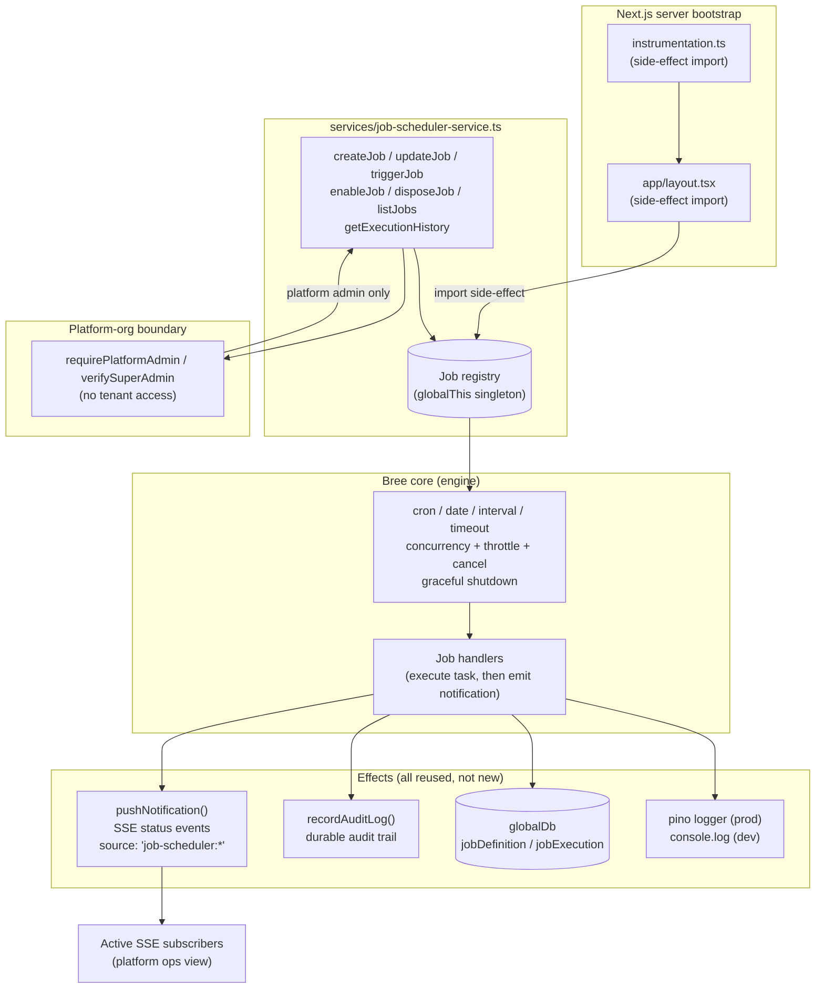
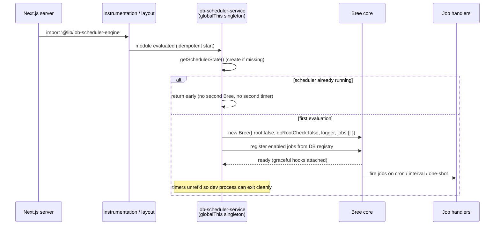
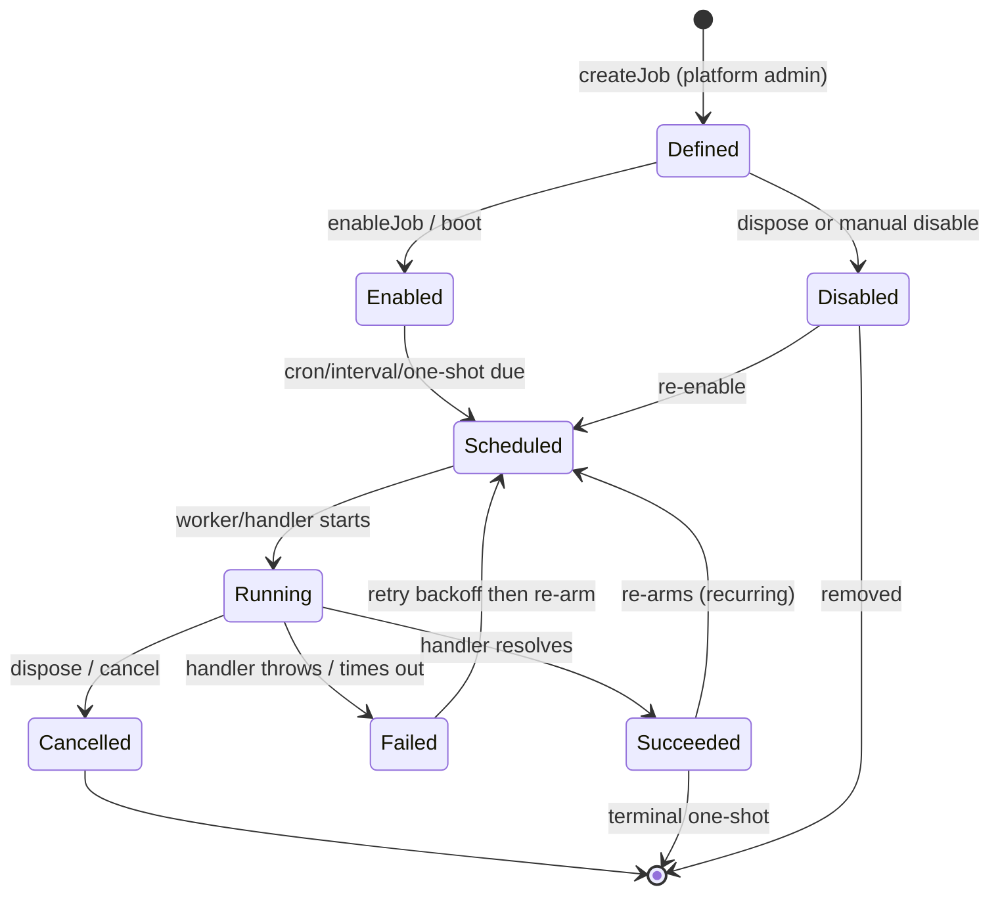
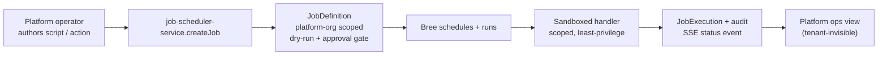

# Background Job Scheduler (job-scheduler-service)

**Status:** Proposed
**Branch:** `backgroud-job-scheduler`
**Engine under evaluation:** [Bree](https://jobscheduler.net) — a Node.js job
scheduler with workers, throttling, concurrency, cancelable jobs, cron/date/interval
scheduling, and graceful shutdown.
**Deliverable:** a Markdown plan. No code is changed by this document.

> **One-line summary.** Integrate Bree as the platform's background job engine,
> exposing a platform-tenant-only `job-scheduler-service` that boots alongside the
> existing calendar-event SSE scheduler. This service is the foundation on top of
> which an **automatic scripting feature** (platform-authored system-administration
> scripts that automate portal operations) will be built.

## Table of Contents

- [Introduction](#introduction)
- [Motivation](#motivation)
- [Scope](#scope)
- [Architecture Overview](#architecture-overview)
   - [Component Diagram](#component-diagram)
   - [Boot Path](#boot-path)
   - [Job Execution Lifecycle](#job-execution-lifecycle)
- [Chosen Engine](#chosen-engine)
   - [What Bree Provides](#what-bree-provides)
   - [The Nextjs and Worker Thread Tension](#the-nextjs-and-worker-thread-tension)
   - [Integration Strategy Decision](#integration-strategy-decision)
- [Boot Integration Alongside the Calendar Scheduler](#boot-integration-alongside-the-calendar-scheduler)
- [The Job Scheduler Service Interface](#the-job-scheduler-service-interface)
- [Data Model Proposal](#data-model-proposal)
- [Idempotency and Deduplication](#idempotency-and-deduplication)
- [SSE Notification Integration](#sse-notification-integration)
- [Configuration](#configuration)
- [Access and Security](#access-and-security)
- [The Automatic Scripting Feature](#the-automatic-scripting-feature)
- [Phased Delivery Plan](#phased-delivery-plan)
- [Testing](#testing)
- [Risks and Mitigations](#risks-and-mitigations)
- [Known Limitations](#known-limitations)
- [Open Questions](#open-questions)
- [File and Dependency Impact](#file-and-dependency-impact)
- [References](#references)

---

## Introduction

The NIPP portal already runs two background schedulers, both following the same
`globalThis` singleton pattern booted through a Next.js side-effect import:

| Scheduler | Module | Boot path | Purpose |
| --- | --- | --- | --- |
| Background health check | `lib/background-health-check.ts` | `instrumentation.ts` | Poll DB/Redis/PgBouncer; emit SSE on state change |
| Calendar "due to start" scanner | `lib/calendar-event-scheduler.ts` | `app/layout.tsx` | Push an ORG-scoped SSE reminder when an event enters its 15-minute lead window |
| Payload-key cleanup | `lib/payload-key-server.ts` | `instrumentation.ts` | Expire stale in-memory payload keys every 5 minutes |

This proposal adds a **fourth** background scheduler — a general-purpose **job
scheduler** — that starts alongside the calendar scanner. Its job is not to monitor
a single table but to **periodically execute registered automation tasks**, and to
serve as the reusable execution layer for a future "automatic scripting" feature in
which platform users author system-administration scripts to automate portal
operations.

The service layer for this engine is `services/job-scheduler-service.ts`
(referred to throughout as **job-scheduler-service**). It is the single, stable
interface between the rest of the platform and the Bree engine beneath it: callers
never touch Bree directly.

## Motivation

- **A missing execution substrate.** The existing schedulers are purpose-built
  scanners (health, calendar alerts). There is no general mechanism to "run task X
  on a schedule." Automating routine operations currently means bespoke ad-hoc code.
- **Foundation for automatic scripting.** Platform operators need to automate
  recurring system administration. A shared scheduler (cron/interval/one-shot,
  concurrency control, timeouts, cancellation, graceful shutdown, execution history,
  audit) is the natural substrate on which a *scripting* feature is a thin, safe
  wrapper.
- **Consistency.** The new scheduler adopts the project's established conventions:
  `globalThis`-singleton boot, pino logging in production and `console.log` in dev,
  `env`-schema-driven configuration, `pushNotification()` for real-time status,
  `recordAuditLog()` for a durable trail.
- **Controlled blast radius.** Because the feature runs operator-authored
  operations, it is **platform-organization only** — tenant users get no access to
  define, view, or trigger jobs (see [Access and Security](#access-and-security)).

## Scope

**In scope (this proposal):**

- Add Bree as the job engine dependency.
- Implement `services/job-scheduler-service.ts` as the interface to the engine.
- Boot the job scheduler **alongside** the calendar scanner via the existing
  side-effect-import convention.
- Define the job registry and execution-history data model (proposed schema — no
  migration applied by this document).
- Platform-only access control (tenant users excluded).
- Emit job lifecycle and status events through the existing **SSE notification
  model** (`pushNotification`).
- Design (not implement) the automatic scripting feature that builds on this.

**Out of scope / deferred to a later phase:**

- Executing arbitrary user-authored script code (sandboxed execution — Phase 2).
- A user-facing script authoring UI (build on the service once the foundation is
  stable).
- Horizontal (multi-instance) job coordination — single-instance is the current
  deployment; see [Known Limitations](#known-limitations).
- Cross-tenant automation. Jobs are platform-org scoped only.

## Architecture Overview

### Component Diagram



### Boot Path

The job scheduler hooks into the **same side-effect-import boot** as the other
background schedulers. It uses the `globalThis` singleton pattern so that Next.js dev
mode — which can evaluate a module more than once per process — never fork a second
Bree instance or its timer.



Guarantees (mirrors `lib/background-health-check.ts` and
`lib/calendar-event-scheduler.ts`):

- `startJobScheduler()` is **idempotent** — a repeated import is a no-op.
- The Bree instance and its job registry live on `globalThis`, so duplicate module
  copies share **one** engine and **one** registry.
- Timer/workers are `unref`'d so they never hold the dev process open.
- `graceful` attaches SIGHUP/SIGINT/SIGTERM handlers for clean shutdown.

### Job Execution Lifecycle



Every transition that changes *observable operational state* (start, success,
failure, cancel) emits a pino log **and** an SSE notification through
`pushNotification()` — same event model used by the calendar scanner and the health
check.

## Chosen Engine

### What Bree Provides

Bree (from [jobscheduler.net](https://jobscheduler.net)) is a small, fast,
lightweight Node.js job scheduler. Relevant to this proposal it offers:

- **Schedule types:** `cron`, `date` (one-shot / recurrence with cron),
  `interval`, and `timeout`, accepting ms numbers, `later` schedule objects, or
  human-friendly strings (`5m`, `3 days and 4 hours`, `on the last day of the
  month`), plus IANA `timezone` support.
- **Concurrency and throttling** (with `p-limit` / `p-queue` families) — essential
  so a burst of due jobs cannot flood the platform.
- **Cancelable jobs and graceful shutdown** via the companion `graceful` package
  (handles `SIGHUP`/`SIGINT`/`SIGTERM` and reloads).
- **Lifecycle events** (`worker created`, `worker deleted`, `added`, etc.) — the
  hooks we use to emit SSE status and write execution history.
- **Plugins** via `Bree.extend(plugin, options)`, and a **function-based job**
  model (a job can be a function run as if isolated, receiving data via
  `workerData`; built-in and bound functions are not allowed).
- **No forced state database** — Bree does not require Redis/MongoDB for job state.
  It explicitly recommends that *you* manage idempotency via your own queries
  (e.g. a `last_run_at` marker), which aligns with this design.

### The Nextjs and Worker Thread Tension

This is the primary integration risk and must be settled in a spike (Phase 0)
before the foundation is built.

Bree's *idiomatic* model is **file-based jobs in a `jobs/` directory** executed in
**worker threads**, and its own docs say that transpiled/bundled projects must be
configured to bundle each job as its own entry point. NIPP is a **Next.js / webpack
application**:

- Server modules are webpack-bundled and the app relies on **in-process
  singletons** — `globalDb` (Prisma), `ioredis`, the pino logger — all wired for a
  single process.
- `worker_threads` work under Node, but a spawned worker is a **separate thread**
  with no shared module state; it must rebuild its own Prisma/Redis/RLS context.
- The Bree logger expects a Cabin/`console`-like interface; the project uses **pino**,
  so a small pino adapter is required.
- Bree v9.0.0 introduced breaking changes (per its UPGRADING notes), so pin and
  review the exact version at install time.

Because of this, the *files-in-a-directory* model is **not** the fit — but Bree's
**worker-per-run execution is not optional**: even a function/handler job forks a
worker, so the worker boundary exists from Phase 1 regardless. What *is* optional is
the **on-disk `jobs/` directory** (disabled via `root:false`/`doRootCheck:false`) and
the *sandboxing* of the worker, which is desirable for Phase 2 (untrusted scripts).
The engine's **scheduling core** (cron/interval/date parsing, the job registry,
concurrency, cancellation, graceful shutdown) is exactly what we want; Phase 1 runs
that core with **trusted built-in handlers** — not untrusted code.

### Integration Strategy Decision

**Decision (settled): Bree forks a worker per run.** Bree's execution model is
worker-isolated by default — even a *function/handler* job is dispatched to a worker
thread, not run inline in the main process. There is therefore **no "run in the main
thread" path to opt into**; the worker boundary is **always-on from Phase 1**, not a
Phase 2 concern. (Record the exact Bree version and the worker-forcing flag at install
time so this is pinned, not assumed.)

That reframes the two strategies from "inline vs worker" to **how much isolation and
per-worker machinery we build** — both of which run on Bree's always-fork worker model:

**Strategy 1 (Phase 1) — Bree workers, trusted built-in handlers.**
- Instantiate Bree with `root: false` and `doRootCheck: false` to disable the on-disk
  `jobs/` directory requirement; register jobs by **handler** (`bree.add('name',
  handler)` / array form) so handlers are plain functions, not files on disk.
- Because every run forks a worker, each worker must **bootstrap its own context**:
  rebuild `globalDb` (Prisma), `ioredis`, the pino logger, and the tenant/RLS context.
  Bree passes state via `workerData`, so the parent marshals the minimal per-job
  context (org id, handler key, any input) into `workerData` and the worker
  re-derives the rest. **This per-worker bootstrap is the core Phase 1 task** —
  validate its cost (a fresh Prisma client per job run? a shared connection via
  `workerData`? a pool?) in the Phase 0 spike and pin the approach.
- Phase 1 handlers are the **trusted built-in set only** (no untrusted code), so the
  worker's job is context reconstruction, not sandboxing. Sandbox isolation is Phase 2.

**Strategy 2 (Phase 2) — Bree workers as the sandbox boundary.**
- Same worker model, but the handler is **operator-authored / untrusted**, so the
  worker additionally runs on a restricted capability surface (no ambient
  `globalDb`, no file/network by default; explicit capability injection).
- This is the natural place to run the automatic-scripting feature: the worker that
  Bree already forks *is* the isolation boundary.

The `job-scheduler-service` interface (below) is defined so that both strategies sit
behind the same API; switching Strategy 1 → 2 is an **internal** change to the handler
loader and worker bootstrap, invisible to callers.

## Boot Integration Alongside the Calendar Scanner

The new module starts in the **same place and the same way** as the calendar
scanner. Concretely, a single new side-effect import is added to the boot path
alongside the existing two (the health check and the calendar scanner):

`instrumentation.ts` (and/or `app/layout.tsx`) gains:

```diff
 // Start the calendar "due to start" SSE scanner (same Node.js boot path).
 import '@/lib/calendar-event-scheduler';
+// Start the background job scheduler (same boot path; platform-org jobs only).
+import '@/lib/job-scheduler-engine';
```

Because the module self-starts on load (`startJobScheduler()` at module bottom,
mirroring `calendar-event-scheduler.ts` and `background-health-check.ts`), the import
is the entire integration. The globalThis guard makes the double import in dev mode
a no-op.

## The Job Scheduler Service Interface

`services/job-scheduler-service.ts` follows the existing service-layer style
(`@/lib/services/base-service.ts`, `ServiceContext`, `ForbiddenError`,
`requirePlatformAdmin(ctx)`). It is the **only** public surface to the engine.
Proposed API (names for discussion):

```ts
// services/job-scheduler-service.ts (interface sketch — not yet implemented)
import { ServiceContext, ForbiddenError, requirePlatformAdmin } from '@/lib/services/types';

export type Schedule =
  | { kind: 'cron'; expr: string; timezone?: string }
  | { kind: 'interval'; everyMs: number }
  | { kind: 'oneshot'; at: Date; cronAfter?: string };

export interface JobSpec {
  name: string;             // unique per platform org
  schedule: Schedule;
  handlerKey: string;       // registry key -> resolved to a registered handler
  timeoutMs?: number;       // per-job wall-clock cap
  concurrencyLimit?: number;// max concurrent runs
  enabled?: boolean;
  description?: string;
}

export interface JobHandle {
  id: string;
  name: string;
  platformOrgId: string;    // platform-org scoped — enforced on every op
  lastRunStatus?: 'SUCCEEDED' | 'FAILED' | 'CANCELLED';
  lastRunAt?: Date;
}

// All of these call requirePlatformAdmin(ctx) internally (tenant users => 403).
export async function createJob(ctx: ServiceContext, spec: JobSpec): Promise<JobHandle>;
export async function updateJob(ctx: ServiceContext, id: string, patch: Partial<JobSpec>): Promise<JobHandle>;
export async function enableJob(ctx: ServiceContext, id: string): Promise<void>;
export async function disableJob(ctx: ServiceContext, id: string): Promise<void>;
export async function triggerJobNow(ctx: ServiceContext, id: string): Promise<void>;
export async function cancelRunningJob(ctx: ServiceContext, id: string): Promise<void>;
export async function listJobs(ctx: ServiceContext): Promise<JobHandle[]>;
export async function getExecutionHistory(ctx: ServiceContext, since?: Date): Promise<JobExecutionSummary[]>;
```

Internally, `createJob`/`updateJob`/`enableJob` translate to `bree.add(...)` /
`bree.remove(...)` / `bree.runOnce(...)`, and each lifecycle event fans out to
`pushNotification()` + `recordAuditLog()` + pino. The handler registry (a
`Map<string, (data) => Promise<void>>`) is where builtin and, later, user-scripted
handlers are looked up by `handlerKey`.

## Data Model Proposal

Schema proposal only — **no migration is applied by this document**. Two new models,
both **platform-org scoped**.

```prisma
// Suggested (illustrative) — to be finalized in a later change proposal.
model JobDefinition {
  id            String   @id @default(cuid())
  platformOrgId String                    // owner = platform organization only
  name          String                    // unique within platformOrgId
  handlerKey    String                    // registry key -> builtin or user script
  scheduleExpr  String                    // json: cron / interval / oneshot
  timezone      String?                   // IANA; default from env
  timeoutMs     Int?
  concurrencyLimit Int? @default(1)
  enabled       Boolean @default(false)
  lastRunAt     DateTime?
  lastRunStatus String?                   // SUCCEEDED | FAILED | CANCELLED
  createdBy     String?                   // platform admin user id
  createdAt     DateTime @default(now())
  updatedAt     DateTime @updatedAt

  executions JobExecution[]

  @@unique([platformOrgId, name])
  @@index([platformOrgId, enabled])
  @@index([platformOrgId, lastRunAt])
}

model JobExecution {
  id              String    @id @default(cuid())
  jobDefinitionId String
  platformOrgId   String
  startedAt       DateTime  @default(now())
  finishedAt      DateTime?
  status          String    // PENDING | RUNNING | SUCCEEDED | FAILED | CANCELLED
  trigger         String    // SCHEDULE | MANUAL
  actorId         String?   // who triggered (manual runs)
  error           String?
  resultJson      Json?
  source          String    // 'job-scheduler:execution'
  createdAt       DateTime  @default(now())

  jobDefinition JobDefinition @relation(fields: [jobDefinitionId], references: [id], onDelete: Cascade)

  @@index([jobDefinitionId, startedAt])
  @@index([platformOrgId, status])
}
```

Design notes:

- **`lastRunAt` / `lastRunStatus` on the definition** double as the idempotency
  marker — this is the exact pattern Bree recommends ("manage boolean job states
  yourself using queries") and gives **restart-safety** and **multi-instance
  safety** that the calendar scanner's in-memory `firedKeys` set deliberately lacks.
- **Platform-org scoping** is structural (`platformOrgId` on every row + indexes),
  not just an access check — tenant rows are impossible to reference.

## Idempotency and Deduplication

Because Bree does not carry job state in a DB, idempotency is **our**
responsibility. The design uses a DB-backed claim, distinct from the calendar
scanner's in-memory approach:

- On each due run, the handler **claims** the run atomically
  (`UPDATE ... WHERE lastRunAt < triggerInstant` / a status column) before doing
  work, so overlapping ticks or a restart cannot double-execute a recurring task.
- On success, `lastRunAt` / `lastRunStatus` are updated and the next tick re-arms.
- On failure, exponential backoff re-arms the job (bounded), then re-schedules.
- Bree's `concurrencyLimit` (per job) plus a **global circuit breaker**
  (`JOB_SCHEDULER_MAX_CONCURRENT`) bound total platform load from a burst of due
  jobs — the scheduler analogue of the calendar scanner's `MAX_EVENTS_PER_SCAN`.

This matches Bree's documented recommendation and keeps the feature durable across
restarts and (later) across instances — unlike the in-memory dedup of
`calendar-event-scheduler.ts`.

## SSE Notification Integration

The job scheduler emits real-time status through the **existing** `pushNotification()`
model. Job lifecycle and status events carry a new **first-class `JOB` priority** —
added to the `NotificationPriority` Prisma enum **exactly like `CALENDAR` was** for
upcoming-event reminders (see `commit ff8f8e7`) — plus `NotificationScope`
(GLOBAL — this is a platform-ops concern). Each event uses a stable `source` string
under the `job-scheduler:*` namespace for client-side filtering (the same convention
as `calendar:event-upcoming`).

**`JOB` priority.** Mirroring the `CALENDAR` change, `JOB` is a persistent,
job-scheduler-specific priority rendered with its own colour so job lifecycle events
are visually distinct from operational `INFO`/`WARNING`/`ERROR`/`CRITICAL` alerts.
The `CALENDAR` precedent is a 7-file cascade — the `JOB` addition must follow the same
blast radius (enumerated in [File and Dependency Impact](#file-and-dependency-impact)):

| Commit `ff8f8e7` (CALENDAR) | `JOB` analogue |
| --- | --- |
| `prisma/schema.prisma` — add enum member | add `JOB` to `NotificationPriority` |
| `lib/notification-push.ts` — accept/normalize | allow `JOB` in `normalizePriority` |
| `lib/calendar-event-scheduler.ts` — emit it | `job-scheduler-service` emits `JOB` |
| `app/api/admin/notifications/route.ts` — validate + count | same, for `JOB` |
| `app/dashboard/admin/notifications/page.tsx` — label + filter | `JOB` label + filter option |
| `hooks/useNotifications.ts` — ticker persistence | `JOB` stays in ticker until dismissed |
| `tests/unit/calendar-event-scheduler.test.ts` — assert | `job-scheduler-service.test.ts` asserts `JOB` |

| Event | Priority | Scope | Source |
| --- | --- | --- | --- |
| Job started (recurring tick) | JOB | GLOBAL | `job-scheduler:started` |
| Job succeeded | JOB | GLOBAL | `job-scheduler:success` |
| Job failed | ERROR (or CRITICAL for critical jobs) | GLOBAL | `job-scheduler:failure` |
| Job cancelled | WARNING | GLOBAL | `job-scheduler:cancelled` |
| Manual trigger by admin | JOB | GLOBAL | `job-scheduler:manual` |

**Rationale for `JOB`.** Routine job lifecycle (start/success/trigger) is operational
noise that would clutter a ticker if it used `INFO`; `ERROR`/`CRITICAL` are reserved
for genuine failures. A dedicated `JOB` priority keeps job telemetry visually
separable without polluting the alert colours — the same reasoning that justified
`CALENDAR`.

Example ticker entry:

```
Job run completed: nightly-report
Job "nightly-report" finished successfully in 3.2s (triggered by schedule).
```

Emission sits inside Bree's lifecycle-event handlers (`worker created` / run
complete / error / cancel), keeping notifications decoupled from individual job
logic — every job reports itself automatically without per-job code. Because Bree
forks a worker per run, the lifecycle-event callback that emits the notification runs
**in the parent** (Bree's worker events surface on the main Bree object), so emission
reuses the parent's `globalDb`/pino/`pushNotification` context directly.

## Configuration

Two config styles already exist: the calendar scanner reads `process.env` directly with
`Number(... ?? default)`, while payload/rate-limiting config is declared in
`lib/env-schema.ts` (Zod, validated). **Decision: the job scheduler's config goes into
`lib/env-schema.ts`**, mirroring `.env.example`, prefixed `JOB_SCHEDULER_` to match the
`CALENDAR_*` / `RATE_LIMIT_*` families. The divergence from the calendar scanner's raw
`process.env` reads is intentional — the scheduler is a new, validated surface, so it
should not perpetuate the unvalidated style.

| Variable | Default | Effect |
| --- | --- | --- |
| `JOB_SCHEDULER_ENABLED` | `true` | Master on/off for the engine |
| `JOB_SCHEDULER_TIMEZONE` | `Europe/London` | Default IANA timezone for schedules |
| `JOB_SCHEDULER_MAX_CONCURRENT` | `5` | Global cap on simultaneous job runs (circuit breaker) |
| `JOB_SCHEDULER_DEFAULT_CONCURRENCY` | `1` | Per-job default concurrency limit |
| `JOB_SCHEDULER_DEFAULT_TIMEOUT_MS` | `300000` | Per-job default wall-clock cap |
| `JOB_SCHEDULER_BOOT_REGISTRY` | `true` | Load enabled jobs from DB at boot |
| `JOB_SCHEDULER_DRYRUN_DEFAULT` | `false` | New jobs default to dry-run (Phase 2) |

Zod form (illustrative):

```ts
JOB_SCHEDULER_ENABLED: z.enum(['true','false']).default('true'),
JOB_SCHEDULER_TIMEZONE: z.string().default('Europe/London'),
JOB_SCHEDULER_MAX_CONCURRENT: z.string().regex(/^\d+$/).default('5'),
```

## Access and Security

This is the highest-risk surface of the feature — it runs operator-authored
operations — and is therefore **platform-organization only**. Tenant users must not
be able to define, view, trigger, or cancel jobs.

**Access control (defense in depth):**

- Every public `job-scheduler-service` call runs `requirePlatformAdmin(ctx)`
  (highest-risk manual triggers additionally gate on `verifySuperAdmin`).
- API routes mirror the existing `app/api/admin/**` guard pattern
  (`requireSuperAdmin` / `requirePlatformAdmin`).
- Data is platform-org scoped structurally: `JobDefinition`/`JobExecution` carry
  `platformOrgId`, and queries are always org-scoped.
- **Tenant isolation:** handlers may only write through scoped, audited service
  calls; they cannot reach raw cross-tenant data. No job may mutate another
  tenant's org outside an audited, platform-authorized action.

**Execution guardrails:**

| Control | Mechanism |
| --- | --- |
| No silent execution | Every start/success/failure/cancel writes pino **and** persists a `JobExecution` |
| Durable audit | `recordAuditLog()` on create/update/enable/disable/trigger with `actorId` |
| Timeouts | Per-job `timeoutMs` (default from env) kills runaway runs |
| Concurrency | Per-job `concurrencyLimit` + global `JOB_SCHEDULER_MAX_CONCURRENT` |
| Dry-run / preview | New jobs default to dry-run; a job computes its diff without committing until approved (Phase 2) |
| Approval gate | Critical jobs require explicit approval before first real run |
| Cancellation | `cancelRunningJob` + Bree's cancel/graceful paths |
| Secret hygiene | pino PII/secret redaction (already in `lib/logger.ts`) applies to all job output |
| No arbitrary side effects | By default handlers are the *registered* builtin set; arbitrary code (Phase 2) is sandboxed and network/FS-restricted |

**Sandboxing (Phase 2):** user-authored scripts execute in an isolated worker with a
restricted API surface (no ambient `globalDb`, no file/network by default, explicit
capability injection). The service injects a **least-privilege** context and
records every permission used.

## The Automatic Scripting Feature

The scripting feature is **built on top of** this foundation and is only sketched
here, not designed in detail. It will use `job-scheduler-service` as its execution
layer:

- **Authoring:** platform operators write a script that registers a handler under a
  `handlerKey` (or, in the scripted model, the platform stores a script reference
  that a sandbox loader resolves).
- **Scheduling:** the script's cadence is expressed as a `Schedule`
  (cron/interval/one-shot) via the same `JobSpec`.
- **Safety:** dry-run + approval + timeout + concurrency + audit — inherited from the
  foundation, not reimplemented.
- **Reporting:** run status is surfaced through SSE and `JobExecution` history with
  zero per-script plumbing.



The foundation (Phase 1) must be stable and fully tested before scripting begins.
The scripting feature is a **separate** change proposal that consumes this service.

## Phased Delivery Plan

**Phase 0 — Spike (validate, do not build).**
- Install and pin Bree (review v9 breaking changes; pin the version that forces the
  worker-per-run model).
- Confirm the worker-per-run model works inside the Next.js server with `root:false`
  / `doRootCheck:false` (no on-disk `jobs/` required).
- **Per-worker context bootstrap — DECIDED: use a connection pool.** Each forked
  worker acquires a connection from a shared pool (PgBouncer / a shared Prisma pool)
  rather than building a fresh client per run or duplicating the whole context via
  `workerData`. Exact pool sizing and PgBouncer wiring are refined in a short Phase 0
  design note that unblocks Phase 1.
- Build the pino logger adapter Bree expects.

**Phase 1 — Foundation (this proposal's core — the JOB service only; no UX, no
untrusted-code sandbox).**
- `services/job-scheduler-service.ts` (the API above).
- Bree boot module + `globalThis` singleton + side-effect import alongside calendar.
- `JobDefinition` / `JobExecution` models + migration.
- **Dynamic handler registry/loader** — resolves `handlerKey` → handler; built-in
  handlers now, script references wired for Phase 2. Implemented in **Phase 1**
  (not deferred), so the loader unblocks the scripting feature.
- Per-worker execution with a **shared connection pool** (see Phase 0 decision).
- DB-backed idempotency/circuit breaker.
- SSE status emission with the new **`JOB`** priority (the 7-file `CALENDAR`-style
  cascade), audit, pino (prod) / `console.log` (dev) split.
- **Approval gate via the admin API only** — dry-run diff + approve surfaced in
   `app/api/admin/jobs/**`; no user-facing approval UI in Phase 1.
- Platform-only access + routes.
- Full Vitest suite (see [Testing](#testing)).

**Phase 2 — Scripting feature (separate, later).**
- Sandboxed handler loader, dry-run, approval, capability injection.
- User-facing authoring/management UI.
- Network/FS sandboxing and least-privilege context for user code.

## Testing

Mirror `tests/unit/calendar-event-scheduler.test.ts` (Vitest); mock
`@/lib/global-db`, `@/lib/logger`, and `@/lib/notification-push`; fix a shared
`now` per test.

**Unit:**
- `createJob`/`updateJob`/`enableJob` assert the exact `bree.add`/`remove`/`runOnce`
  call and the platform-org scoping; tenant context throws `ForbiddenError`.
- Schedule parsing for cron / interval / oneshot, and timezone application.
- Idempotency: two ticks for the same run instant claim once (DB-backed).
- Failure path marks `JobExecution` FAILED and schedules backoff.
- Each lifecycle event emits exactly one `pushNotification` with the correct
  `source`/`priority`/`scope` (assert a `notify*`-style spy was called with
  `source: 'job-scheduler:failure'`, `priority: ERROR`, `scope: GLOBAL`).
- Concurrency/timeout: a slow job is bounded; global cap enforced.
- Logging split: pino path in prod (assert `logger.info` style), `console.log` in
  dev — same split the existing modules use.

**Integration:**
- Boot the scheduler (side-effect import), register a trivial 100ms interval job,
  advance fake timers, assert one `JobExecution` and one SSE event, then stop and
  assert the timer/workers are gone (idempotent stop).

**Sandbox (Phase 2):** an untrusted script cannot reach `globalDb`, network, or FS
outside declared capabilities; dry-run produces a diff and commits nothing.

## Risks and Mitigations

| Risk | Impact | Mitigation |
| --- | --- | --- |
| Bree's worker-per-run model vs Next.js bundling | Integration may not boot cleanly | Phase 0 spike confirms worker-per-run with `root:false`; per-worker connection pool + decision recorded |
| Bree v9 breaking changes | API drift | Pin the exact version; review `UPGRADING.md`; wrap behind the service API |
| pino vs Bree's Cabin logger | Boot log failures | Thin pino adapter as a Bree `logger` option |
| Runaway / burst of due jobs | Platform overload | Per-job + global concurrency caps, timeouts, backoff |
| Double execution on restart / overlapping tick | Corrupted state | DB-backed claim (atomic `lastRunAt` gate) |
| Untrusted user code | Security breach | Sandbox isolation, capability injection, dry-run + approval — Phase 2 only |
| Horizontal scale / multiple instances | Double runs | DB claim is instance-safe; document before scaling |
| Secrets/PII in job output | Leakage | pino redaction already in `lib/logger.ts`; applied to all job output |

## Known Limitations

- **Single-instance assumption.** Current deployment is one server process
  (same note as the calendar scanner). The DB-backed claim keeps this correct, but
  horizontal scaling is out of scope until the feature is in use.
- **Wall-clock dependent.** Cron/interval scheduling relies on a correct server
  clock and IANA timezone (see `JOB_SCHEDULER_TIMEZONE`).
- **Untrusted-code sandboxing is deferred.** Phase 1 runs only the *trusted built-in*
  handler set inside Bree's workers (worker isolation is present from the start); the
  capability sandbox for operator-authored/untrusted code is Phase 2.
- **Worker isolation is always-on.** Every run forks a worker (Bree's model), so
  there is no "in-process" fast path; Phase 1 uses the worker boundary for context
  reconstruction, and Phase 2 adds capability-based sandboxing on the same boundary.

## Open Questions

### Resolved this round

1. **Worker vs inline execution — RESOLVED.** Bree always forks a worker per run
   (even for function/handler jobs); there is no main-thread execution path. The
   worker boundary is therefore **always-on from Phase 1** (see
   [Integration Strategy Decision](#integration-strategy-decision)). The
   per-worker context bootstrap cost (how each worker rebuilds
   `globalDb`/Redis/pino/RLS) is now the concrete Phase 0 spike task, *not* an
   open design branch.
2. **New `NotificationPriority`? — RESOLVED.** Add a first-class **`JOB`** priority,
   mirroring the `CALENDAR` addition (`commit ff8f8e7`) with the same 7-file cascade
   (see [SSE Notification Integration](#sse-notification-integration)). `ERROR`/`CRITICAL`
   stay reserved for genuine failures.
3. **Env style — RESOLVED.** Add `JOB_SCHEDULER_*` to `lib/env-schema.ts` (validated,
   Zod), mirroring `.env.example`, and document the deliberate divergence from the
   calendar scanner's raw `process.env` reads (see [Configuration](#configuration)).

### Resolved — Phase 1 scope & runtime

4. **Handler registry shape — RESOLVED.** Implement the **dynamic handler loader in
   Phase 1** (resolves `handlerKey` → handler): built-ins run now, script references
   are wired for Phase 2. No static-only map.
5. **Approval UX — RESOLVED.** Approval gate is **admin-API only** (dry-run diff +
   approve in `app/api/admin/jobs/**`); no user-facing approval UI in Phase 1.
6. **Per-worker bootstrap — RESOLVED.** **Use a connection pool** (PgBouncer / a
   shared Prisma pool): each forked worker acquires a pooled connection instead of a
   fresh per-run client. Pool sizing + PgBouncer wiring captured in the Phase 0
   design note.

**No design questions remain open after this revision.** The only item still in flight
is engineering detail, not a design choice: per-worker pool sizing / PgBouncer
parameters, which the Phase 0 spike pins in a short design note before Phase 1.

## File and Dependency Impact

**New**

- `services/job-scheduler-service.ts` — the public service interface.
- A Bree boot/engine module (e.g. `lib/job-scheduler-engine.ts`) holding the
  `globalThis` singleton and the side-effect self-start.
- `tests/unit/job-scheduler-service.test.ts` (+ integration case).
- `prisma/schema.prisma` additions: `JobDefinition`, `JobExecution` (+ migration).

**Modified**

- `package.json` / `package-lock.json` — add `bree` (and `graceful`; `p-limit`/
  `p-queue` for throttling) + `@types` as needed.
- `instrumentation.ts` and/or `app/layout.tsx` — one new side-effect import.
- `lib/env-schema.ts` and `.env.example` — `JOB_SCHEDULER_*` vars.
- Admin routes (new `app/api/admin/jobs/**`) — guarded by `requirePlatformAdmin` /
   `verifySuperAdmin`; also the **approval gate** (dry-run + approve), admin-API only.
- `prisma/schema.prisma` — add `JOB` to `NotificationPriority` (+ migration).
- `lib/notification-push.ts` — allow/normalize `JOB` in `normalizePriority`.
- `app/dashboard/admin/notifications/page.tsx` + `hooks/useNotifications.ts` +
   `app/api/admin/notifications/route.ts` — `JOB` label/filter, count, ticker
  persistence (mirrors the `CALENDAR` cascade, `commit ff8f8e7`).
- No changes to `lib/global-db.ts`, `lib/logger.ts`, or the existing schedulers
  (reused as-is).

## References

- [Bree / jobscheduler.net](https://jobscheduler.net) — chosen job engine.
- `lib/calendar-event-scheduler.ts` +
  `documents/feature-planning-and-development/calendar-event-sse-notifications.md` —
  the pattern this scheduler boots alongside (globalThis singleton, `firedKeys`,
  `pushNotification`, pino/console split).
- `lib/background-health-check.ts` — the second in-service scheduler precedent.
- `lib/payload-key-server.ts` — lazy cleanup-scheduler precedent.
- `lib/notification-push.ts` — SSE model (`pushNotification`, priorities, scopes,
  `source` sources).
- `lib/require-super-admin.ts`, `lib/services/base-service.ts` — platform access
  guards (`requirePlatformAdmin`, `verifySuperAdmin`, `ServiceContext`).
- `lib/audit-log.ts` — `recordAuditLog` for the durable trail.
- `lib/env-schema.ts` / `.env.example` — configuration conventions.
