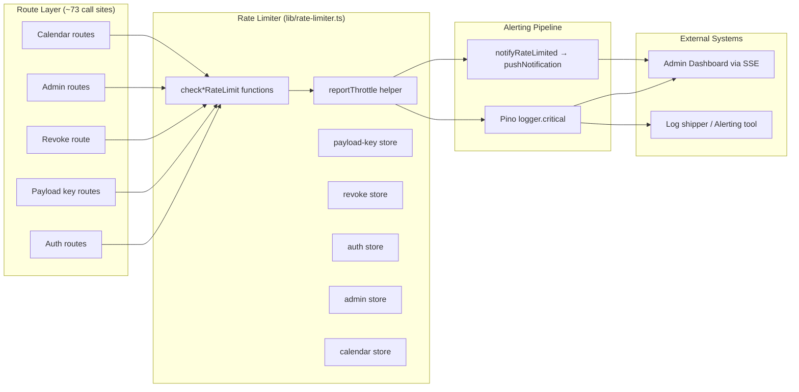
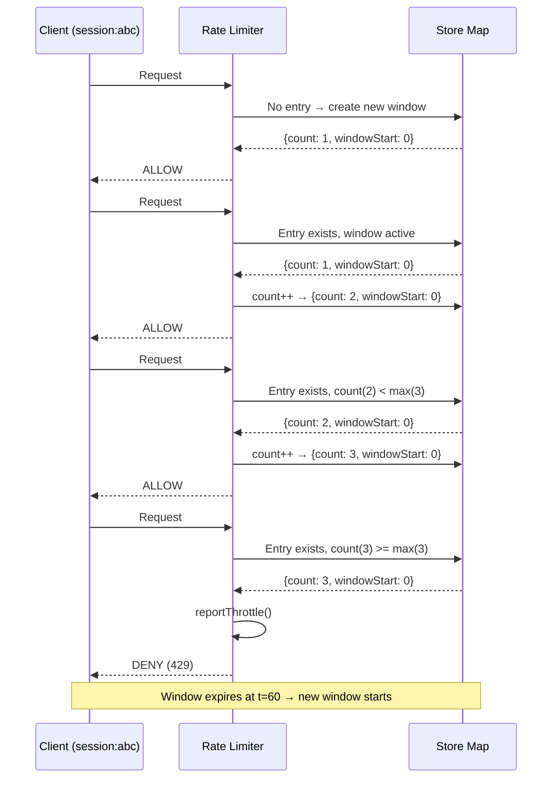
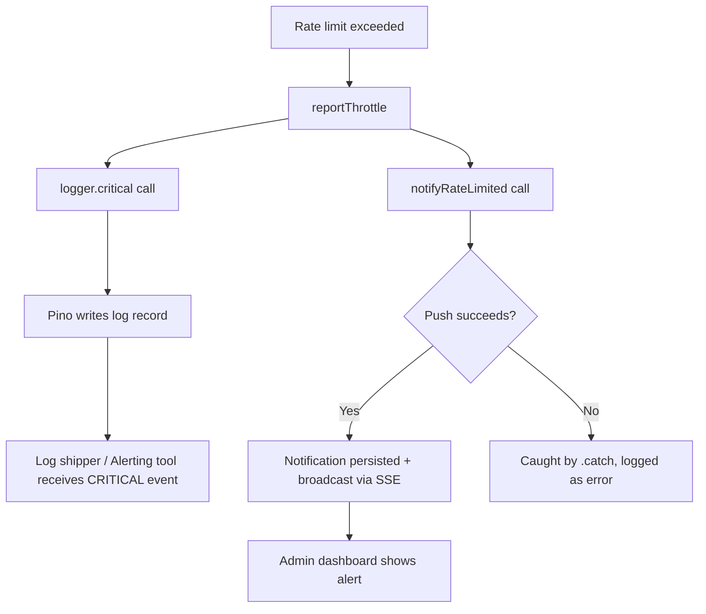
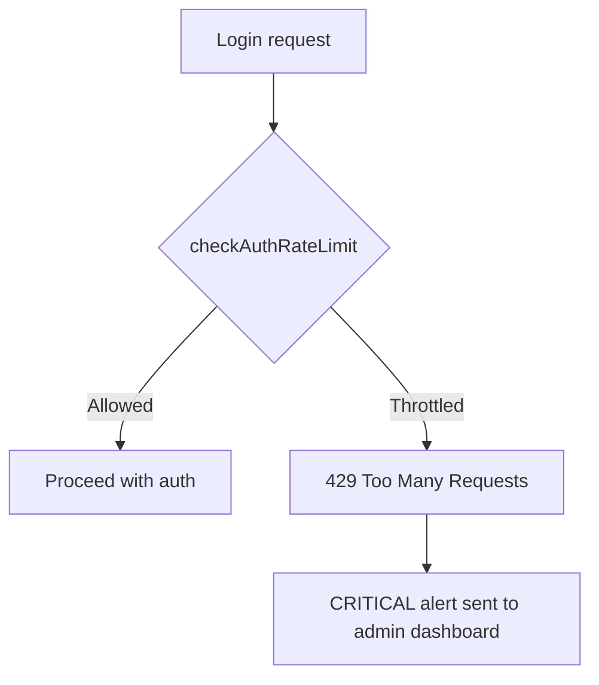
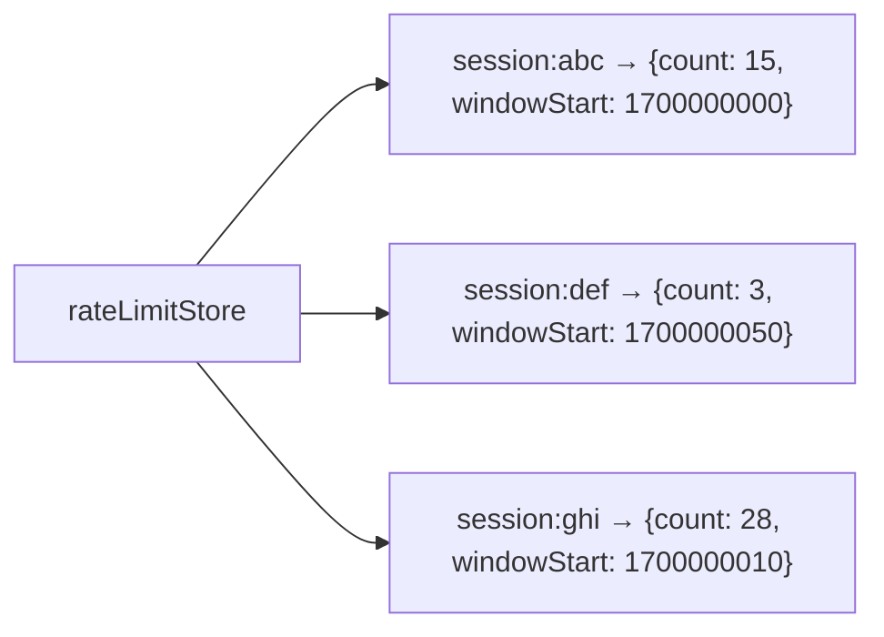

# Rate Limiting

## Table of Contents

- [Introduction](#introduction)
- [Architecture Overview](#architecture-overview)
  - [High-Level Flow](#high-level-flow)
  - [Component Diagram](#component-diagram)
- [Rate Limiting Concepts](#rate-limiting-concepts)
  - [Sliding Window Algorithm](#sliding-window-algorithm)
  - [Client Identification](#client-identification)
  - [Throttle Reporting](#throttle-reporting)
- [Rate Limit Categories](#rate-limit-categories)
  - [Summary Table](#summary-table)
  - [Payload-Key Rate Limit](#payload-key-rate-limit)
  - [Revoke Rate Limit](#revoke-rate-limit)
  - [Auth Rate Limit](#auth-rate-limit)
  - [Admin Write Rate Limit](#admin-write-rate-limit)
  - [Calendar Rate Limit](#calendar-rate-limit)
- [Configuration](#configuration)
  - [Environment Variables](#environment-variables)
  - [Defaults](#defaults)
- [Implementation Details](#implementation-details)
  - [Core Data Structures](#core-data-structures)
  - [In-Memory Store](#in-memory-store)
  - [Cleanup Mechanism](#cleanup-mechanism)
- [Alerting and Monitoring](#alerting-and-monitoring)
  - [CRITICAL Pino Log](#critical-pino-log)
  - [SSE Notifications](#sse-notifications)
- [Testing](#testing)
- [Known Limitations](#known-limitations)

---

## Introduction

The NIPP application uses a shared in-memory rate limiter to protect its API endpoints from abuse, brute-force attacks, and excessive resource consumption. Implemented in `lib/rate-limiter.ts`, the limiter provides five independent categories, each with configurable limits and a consistent alerting pipeline.

Rate limiting is critical to this project for several reasons:

- **Brute-force protection**: The auth endpoint limiter prevents credential stuffing and password guessing attacks.
- **Resource exhaustion prevention**: Payload-key issuance and revoke endpoints are protected from bulk generation or revocation that could degrade service quality.
- **Admin abuse mitigation**: Admin write endpoints are rate-limited to prevent compromised or rogue admin accounts from performing bulk destructive operations.
- **Calendar abuse prevention**: Calendar CRUD endpoints are rate-limited to prevent spam or excessive data manipulation.

When a client exceeds any rate limit, the system emits two CRITICAL signals:
1. A **critical-level pino log record** (synchronous, always emitted) that is surfaceable by alerting and log-shipping tools.
2. A **CRITICAL-priority GLOBAL SSE notification** that appears in the admin dashboard in real time, ensuring operators are immediately aware of potential abuse.

---

## Architecture Overview

### High-Level Flow

```mermaid
flowchart TD
    A[Incoming Request] --> B{Which endpoint?}
    
    B -->|Auth endpoints| C[checkAuthRateLimit]
    B -->|Payload key issue| D[checkRateLimit]
    B -->|Payload key revoke| E[checkRevokeRateLimit]
    B -->|Admin writes| F[checkAdminRateLimit]
    B -->|Calendar CRUD| G[checkCalendarRateLimit]
    
    C --> H{Within limit?}
    D --> H
    E --> H
    F --> H
    G --> H
    
    H -->|Yes| I[Process request]
    H -->|No| J[reportThrottle]
    
    J --> K[Pino CRITICAL log]
    J --> L[SSE notification]
    
    I --> M[Return response]
```



### Component Diagram



---

## Rate Limiting Concepts

### Sliding Window Algorithm

The project uses a **fixed-window counter** approach (often called a leaky bucket variant). Each rate limit category maintains its own `Map<string, RateLimitEntry>` where:

- The **key** is the client identifier (session ID or IP address, depending on category).
- The **value** contains:
  - `count`: the number of requests made in the current window.
  - `windowStart`: the Unix timestamp (in seconds) when the current window began.

When a request arrives:
1. The current time is compared against `windowStart`. If more than `window` seconds have elapsed, a new window is started with `count = 1`.
2. If within the same window, the count is checked against the maximum (`max`). If `count >= max`, the request is throttled.
3. Otherwise, `count` is incremented and the request is allowed.

This approach is simple, memory-efficient, and sufficient for the threat model of this application. A true sliding window (which tracks individual request timestamps) would be more precise but also more memory-intensive.



### Client Identification

Each category uses a different client identifier strategy:

| Category | Identifier | Source | Rationale |
|---|---|---|---|
| payload-key | Session ID | `getSessionId(request)` | Per-user, survives IP changes. Keys are user-scoped anyway. |
| revoke | Session ID | `getSessionId(request)` | Same as payload-key; revocation is user-specific. |
| auth | IP address | `getClientIp(request)` | Unauthenticated users have no session. IP is the best available identifier for brute-force protection. |
| admin | Session ID | `getSessionId(request)` | Admin actions are tied to authenticated sessions. Prevents a single admin from performing bulk operations. |
| calendar | Session ID | `getSessionId(request)` | Calendar operations are user-scoped. Prevents a single user from spamming CRUD endpoints. |

**Session extraction** (`getSessionId`):
```typescript
export async function getSessionId(request: Request): Promise<string | null> {
  const session = await auth.api.getSession({ headers: new Headers(request.headers) });
  return (session?.session as { id?: string })?.id ?? null;
}
```

**IP extraction** (`getClientIp`):
```typescript
export function getClientIp(request: Request): string {
  const forwarded = request.headers.get('x-forwarded-for');
  if (forwarded) return forwarded.split(',')[0].trim();
  return request.headers.get('x-real-ip') ?? 'unknown';
}
```

### Throttle Reporting

When any rate limit is exceeded, the shared `reportThrottle()` function is called. It performs two actions:

1. **Synchronous pino log**: Emits a `logger.critical()` record with structured metadata (category, clientId, max, window, count). This is always emitted — no async, no failure path.

2. **Fire-and-forget SSE notification**: Calls `notifyRateLimited()` which persists the notification to the database and broadcasts it via Server-Sent Events. This is wrapped in `.catch()` so failures do not crash the hot request path. The function returns `void` to maintain the synchronous nature of `reportThrottle()`.



---

## Rate Limit Categories

### Summary Table

| Category | Function | Identifier | Default Max | Window | Env Prefix | Source Tag |
|---|---|---|---|---|---|---|
| **payload-key** | `checkRateLimit()` | Session ID | 30 req/min | 60s | `RATE_LIMIT_PAYLOAD_KEY_*` | `rate-limit:payload-key` |
| **revoke** | `checkRevokeRateLimit()` | Session ID | 5 req/min | 60s | `RATE_LIMIT_PAYLOAD_KEY_REVOKE_*` | `rate-limit:revoke` |
| **auth** | `checkAuthRateLimit()` | IP address | 5 req/min | 60s | `RATE_LIMIT_AUTH_*` | `rate-limit:auth` |
| **admin** | `checkAdminRateLimit()` | Session ID | 30 req/min | 60s | `RATE_LIMIT_ADMIN_*` | `rate-limit:admin` |
| **calendar** | `checkCalendarRateLimit()` | Session ID | 30 req/min | 60s | `RATE_LIMIT_CALENDAR_*` | `rate-limit:calendar` |

### Payload-Key Rate Limit

- **Function**: `checkRateLimit(clientId: string): boolean`
- **Store**: `rateLimitStore` (Map)
- **Default limit**: 30 requests per 60-second window
- **Scope**: Per session ID

This limiter protects the payload key issuance endpoint. Payload keys are used to authenticate external integrations, so bulk generation could lead to unauthorized access or resource exhaustion.

```typescript
// Usage example (simplified)
if (!checkRateLimit(sessionId)) {
  return new Response('Too many requests', { status: 429 });
}
```

### Revoke Rate Limit

- **Function**: `checkRevokeRateLimit(clientId: string): boolean`
- **Store**: `revokeRateLimitStore` (Map)
- **Default limit**: 5 requests per 60-second window
- **Scope**: Per session ID

This is the **strictest limiter** in the system. Revoking a payload key invalidates it immediately, so bulk revocation could cause denial-of-service for legitimate integrations that rely on those keys. The 5 req/min limit is intentionally low to prevent abuse while still allowing legitimate administrative actions.

### Auth Rate Limit

- **Function**: `checkAuthRateLimit(ipAddress: string): boolean`
- **Store**: `authRateLimitStore` (Map)
- **Default limit**: 5 requests per 60-second window
- **Scope**: Per IP address

This limiter protects the authentication endpoints (login, register) from brute-force attacks. Since unauthenticated users do not have a session, the limiter uses IP address as the client identifier. The 5 req/min limit is aggressive enough to stop automated credential-stuffing tools while still allowing legitimate users who may share an IP (e.g., behind NAT or corporate proxies) to eventually get through.



### Admin Write Rate Limit

- **Function**: `checkAdminRateLimit(sessionId: string): boolean`
- **Store**: `adminRateLimitStore` (Map)
- **Default limit**: 30 requests per 60-second window
- **Scope**: Per session ID

This limiter protects all admin POST, PATCH, and DELETE endpoints from bulk data modification. A compromised or rogue admin account could otherwise perform destructive operations at scale (e.g., deleting all users, revoking all payload keys). The 30 req/min limit allows legitimate bulk operations (e.g., a migration) while preventing rapid-fire abuse.

### Calendar Rate Limit

- **Function**: `checkCalendarRateLimit(sessionId: string): boolean`
- **Store**: `calendarRateLimitStore` (Map)
- **Default limit**: 30 requests per 60-second window
- **Scope**: Per session ID

This limiter protects calendar event CRUD endpoints from abuse. While less security-critical than auth or revoke, calendar spam can still degrade user experience and consume database resources.

---

## Configuration

### Environment Variables

All rate limits are configurable via environment variables with sensible defaults. This allows operators to tune limits based on their deployment's traffic patterns and threat model without code changes.

| Variable | Type | Default | Description |
|---|---|---|---|
| `RATE_LIMIT_PAYLOAD_KEY_MAX` | number | 30 | Max payload key issuance requests per window |
| `RATE_LIMIT_PAYLOAD_KEY_WINDOW` | number | 60 | Window in seconds for payload key issuance |
| `RATE_LIMIT_PAYLOAD_KEY_REVOKE_MAX` | number | 5 | Max revoke requests per window |
| `RATE_LIMIT_PAYLOAD_KEY_REVOKE_WINDOW` | number | 60 | Window in seconds for revoke |
| `RATE_LIMIT_AUTH_MAX` | number | 5 | Max auth requests per window |
| `RATE_LIMIT_AUTH_WINDOW` | number | 60 | Window in seconds for auth |
| `RATE_LIMIT_ADMIN_MAX` | number | 30 | Max admin write requests per window |
| `RATE_LIMIT_ADMIN_WINDOW` | number | 60 | Window in seconds for admin writes |
| `RATE_LIMIT_CALENDAR_MAX` | number | 30 | Max calendar CRUD requests per window |
| `RATE_LIMIT_CALENDAR_WINDOW` | number | 60 | Window in seconds for calendar CRUD |

### Defaults

The defaults are chosen based on the sensitivity of each operation:

- **Auth (5/min)**: Aggressive — brute-force attacks are the highest risk.
- **Revoke (5/min)**: Equally aggressive — revocation is destructive and immediate.
- **Payload-key (30/min)**: Moderate — key generation is less destructive but can still be abused.
- **Admin (30/min)**: Moderate — allows legitimate bulk operations while preventing rapid abuse.
- **Calendar (30/min)**: Moderate — prevents spam without hindering normal usage patterns.

---

## Implementation Details

### Core Data Structures

```typescript
interface RateLimitEntry {
  count: number;        // Number of requests in current window
  windowStart: number;  // Unix timestamp (seconds) when window began
}
```

Each rate limit category has its own `Map<string, RateLimitEntry>` store:

- `rateLimitStore` — payload-key issuance
- `revokeRateLimitStore` — payload-key revocation
- `authRateLimitStore` — auth endpoints (IP-scoped)
- `adminRateLimitStore` — admin writes
- `calendarRateLimitStore` — calendar CRUD

### In-Memory Store

All rate limit data is stored in-memory using JavaScript `Map` objects. This means:

- **Fast lookups**: O(1) average case for `Map.get()` and `Map.set()`.
- **No external dependencies**: No Redis, no database — everything is self-contained.
- **Per-process isolation**: Each Node.js process maintains its own rate limit state. In a multi-instance deployment (e.g., behind a load balancer), the same client may be allowed by one instance but throttled by another.



### Cleanup Mechanism

Stale entries are cleaned up automatically by dedicated interval timers that run every 5 minutes. An entry is considered stale if its `windowStart` is older than **2x the window duration** (e.g., 120 seconds for a 60-second window). This ensures that entries from expired windows are removed, preventing unbounded memory growth.

```typescript
// Example: payload-key cleanup (runs every 5 minutes)
setInterval(() => {
  const now = Math.floor(Date.now() / 1000);
  for (const [clientId, entry] of rateLimitStore.entries()) {
    if (now - entry.windowStart > RATE_LIMIT_WINDOW * 2) {
      rateLimitStore.delete(clientId);
    }
  }
}, 5 * 60 * 1000); // 5 minutes in milliseconds
```

Each category has its own cleanup timer, and timers are started lazily on module load (safe in development, testing, and serverless environments).

---

## Alerting and Monitoring

### CRITICAL Pino Log

When a rate limit is exceeded, the system emits a structured log record at the `critical` level (severity 6 in pino, between `error` and `fatal`). This custom level was added to the logger configuration specifically for rate-limit alerting.

Example log output:
```json
{
  "level": 60,
  "time": "2025-01-15T10:30:00.000Z",
  "pid": 1234,
  "hostname": "server-01",
  "limiter": "rate-limiter",
  "category": "auth",
  "clientId": "203.0.113.42",
  "max": 5,
  "window": 60,
  "count": 5
}
```

The structured metadata enables:
- **Filtering**: Log shippers can query for `limiter: rate-limiter` to find all throttle events.
- **Aggregation**: Dashboards can count throttles by `category` to identify which endpoints are under attack.
- **Alerting**: Alerting tools can trigger on `level >= 60` to notify operators in real time.

### SSE Notifications

In addition to logging, the system broadcasts a CRITICAL-priority GLOBAL SSE (Server-Sent Events) notification. This notification is:

- **Persisted**: Stored in the `Notification` table via `pushNotification()`.
- **Broadcast**: Delivered to all connected admin dashboard clients via SSE.
- **Deduplicated**: The `notifyRateLimited()` function checks for recent duplicates to avoid flooding the dashboard.
- **Resilient**: Failures are caught and logged — a rate-limit alert must never crash the request that triggered it.

Notification structure:
```json
{
  "title": "Auth rate limit exceeded",
  "message": "Client 203.0.113.42 exceeded the rate limit for rate-limit:auth (5 per 60s) — current count: 5.",
  "priority": "CRITICAL",
  "scope": "GLOBAL",
  "source": "rate-limit:auth",
  "organizationId": null
}
```

---

## Testing

Integration tests are located in `tests/integration/rate-limit-critical.test.ts`. They exercise the real limiter functions (not mocked) and mock only the two alerting sinks:

- `@/lib/logger` — spied on to verify `logger.critical()` is called with the correct context.
- `@/lib/global-db` — spied on to verify notifications are persisted with the correct priority, scope, and source.

The test suite covers:
1. **Positive cases**: Each of the five limiters is tested to confirm that a throttle event emits both a CRITICAL log and a CRITICAL SSE notification.
2. **Negative cases**: Requests within the limit do not trigger any critical signaling.
3. **Bucket independence**: Throttling one category does not emit alerts for other categories.
4. **Resilience**: If the notification sink fails (e.g., database is down), the limiter still returns `false` and does not throw — it gracefully logs the error.

---

## Known Limitations

1. **In-memory only**: Rate limit state is not shared across process instances. In a multi-instance deployment, the same client may slip through if different instances track different counts. A distributed solution (e.g., Redis with atomic counters) would be needed for strict global enforcement.

2. **Fixed-window imprecision**: The fixed-window approach allows up to 2x the configured limit in a narrow time window (e.g., requests at second 59 of one window and second 1 of the next). A true sliding window would be more precise but is not currently implemented.

3. **IP-based auth limiting**: When clients share an IP (e.g., behind NAT, corporate proxies, or CDNs), legitimate users may be throttled by the auth rate limiter. Consider fallback mechanisms (e.g., CAPTCHA) for shared-IP scenarios.

4. **No exponential backoff**: Throttled clients receive the same 429 response regardless of how many times they've been throttled. Implementing progressive delays (e.g., 1s, then 2s, then 4s) would improve the user experience for persistent abusers.

5. **No rate limit headers**: The current implementation does not include `Retry-After` or `X-RateLimit-*` headers in responses. Adding these would improve client-side rate limit handling (e.g., automatic retry with backoff).
