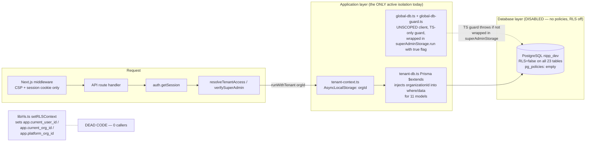
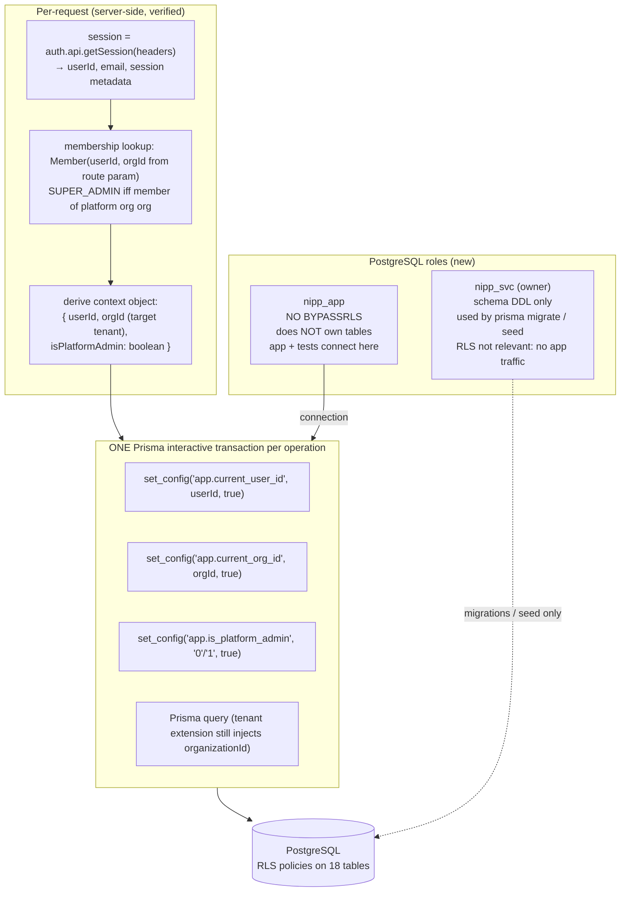
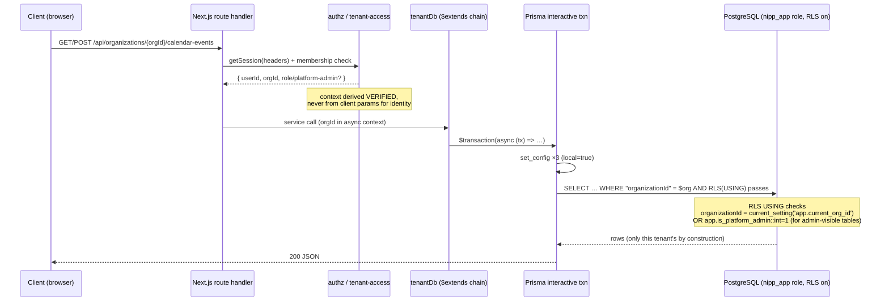

# PostgreSQL RLS — As-Built Review & Complete-Implementation Design

*Date: 2026-09-19 · Author: Engineering (Hermes-assisted review) · Status: PROPOSED*
*Companion implementation plan: `.hermes/plans/20260919_021632-rls-complete-implementation.md`*

---

## 1. Executive Summary

The codebase **intends** a two-layer tenant-isolation defense: an application-layer
Prisma extension (`lib/tenant-db.ts`) and database-layer PostgreSQL Row Level Security
(policies defined in `prisma/migrations/*rls*/migration.sql`). The documentation
(`SECURITY.md`, `ARCHITECTURE.md`, schema comments) states that both layers are active.

**Neither is true at present.** Verified against the live dev database and a full code
scan on 2026-09-19:

| Finding | Severity | Evidence |
|---|---|---|
| **Zero RLS policies exist in any running database.** All 23 tables report `relrowsecurity = false`, `pg_policies` is empty. The migrations that create policies (`20260711000000_rls_policies`, `20260715000000_permission_rls_fix`) have **never been applied** — the dev DB was created with `prisma db push` and has no `_prisma_migrations` table at all. | Critical | `pg_class.relrowsecurity=false` for every table; live probe 2026-09-19 |
| **The RLS context provider is dead code.** `lib/rls.ts → setRLSContext(userId, orgId)` is the only thing that sets `app.current_user_id` / `app.current_org_id` / `app.platform_org_id`, and it has **zero callers** (grep across `app/ lib/ services/ scripts/ tests/`). | Critical | Grep of entire tree; no import of `lib/rls` anywhere |
| **Super-admin bypass is architecturally unenforceable by RLS today.** Cross-tenant reads use an *unscoped* Prisma client (`lib/global-db.ts`) wrapped only in a TypeScript runtime guard (`global-db-guard.ts`). Nothing at the database layer stops that client reading every tenant. | High | `lib/tenant-access.ts:37`, 9 files wrap calls in `superAdminStorage.run(true, …)` |
| **The guard is bypassable by any code path** — it is a convention (`AsyncLocalStorage` flag), not an enforcement. The calendar routes even set it to `true` for *ordinary tenant members* (the flag means "run unscoped", not "is super admin"). | High | `app/api/organizations/[orgId]/calendar-events/route.ts:61,145` sets `superAdminStorage.run(true, …)` for plain MEMBER-role requests; the guard then trivially passes for anyone who wraps a call |
| **Application-layer scoping has type-safety and coverage gaps.** `TENANT_SCOPED_MODELS` is a loose string array — if a model is renamed in Prisma schema, the extension silently stops intercepting it. It also does not intercept `count`, `aggregate`, `groupBy`, or nested/inline includes. | Medium | `lib/tenant-db.ts:4`; known issue logged in `documents/outstanding-issues/review-issues.md` |
| **Documentation is false and stale.** `SECURITY.md` Appendix B claims "RLS Policy: Yes" for 12 models and references a `tenantId` column that does not exist (the real column is `organizationId`). It also lists a `CalendarRecurrence` model that was never created (recurrence lives in JSON fields on `CalendarEvent`). | Medium | `SECURITY.md:88-127,573-590` vs. actual schema/migration state |
| **RLS is off even for the tables it covers.** The app connects as `postgres` — a table *owner* — so even if policies were applied, they would be silently bypassed without `FORCE ROW LEVEL SECURITY`. No `BYPASSRLS`/role separation exists. | High | `.env DATABASE_URL=postgresql://postgres@…`; no roles in any migration |
| **Session-var lifetime is wrong for the current call pattern.** `set_config(…, true)` is *transaction-scoped*; on a connection pool (PgBouncer) with implicit autocommit it does not reliably persist across subsequent statements. The refactoring must bind context setting and querying into one unit of work. | Medium | `lib/rls.ts:32-36`; `docker-compose.test.yml` exposes PgBouncer :6432 |
| **Database-layer isolation tests are placeholders.** `tests/isolation/database/` does not exist; `tests/isolation/README.md:27-29` says "Templates are in place; RLS policies must be added first (deferred)." CI (`ci.yml`) runs unit tests only. | Medium | Repo inspection 2026-09-19 |

**Consequence:** today, *all* cross-tenant isolation of every organization-scoped model
rests on the Prisma extension alone, and for ~35 routes that use `globalDb` it rests on a
runtime convention. A single misuse — an unscoped query in a service, a renamed model, a
future dev forgetting the wrapper — is a data-breach-sized incident with no second line
of defense.

The remainder of this document defines what "complete RLS" means here and how to build it.

---

## 2. Current Implementation (As-Built)

### 2.1 The intended architecture



### 2.2 What exists

| Component | Location | State |
|---|---|---|
| RLS context setter (session vars) | `lib/rls.ts` | Implemented, **never called** |
| Prisma tenant extension (app layer) | `lib/tenant-db.ts` | Active. 11 models: `Role, RolePermission, MemberRole, Member, Invitation, SentInvitation, Team, TeamMember, TeamRole, Calendar, CalendarEvent` |
| Tenant context propagation | `lib/tenant-context.ts` (`AsyncLocalStorage`) | Active; set via `runWithTenant(orgId, fn)` in routes/services |
| Unscoped escape hatch + TS guard | `lib/global-db.ts`, `lib/global-db-guard.ts` | Active for ~35 routes via `superAdminStorage.run(true, …)` |
| RLS enablement template migration | `prisma/migrations/0000_enable_rls/` | **All comments** — no executable SQL |
| RLS policies migration | `prisma/migrations/20260711000000_rls_policies/` | Real SQL, **never applied**. Covers: `Organization`, `AuditLog`, `Member`, `Role`, `Permission` (select) |
| Permission policy fix | `prisma/migrations/20260715000000_permission_rls_fix/` | Real SQL, **never applied** (drops `permission_read_all`, adds org-scoped read via `RolePermission`) |
| DB-layer isolation tests | `tests/isolation/database/` | **Do not exist** ("deferred") |
| App-layer + E2E isolation tests | `tests/isolation/application/`, `tests/isolation/e2e/` | Active; cover the Prisma extension and HTTP flows, not RLS |

### 2.3 Coverage matrix — intended vs. live database

Legend: **A** = app-layer (Prisma ext), **R∋** = policy present in an (unapplied) migration, **L** = live-enforced in the running DB today.

| Table / Model | Org column | A | R∋ | L | Notes |
|---|---|---|---|---|---|
| `User` | — (global) | n/a | ✗ | ✗ | Global by design; auth plugin owns it |
| `Session` | — | n/a | ✗ | ✗ | Global by design |
| `Account` | — | n/a | ✗ | ✗ | Global by design |
| `Organization` | self (`id`) | n/a | ✓ (super-admin OR own-org) | ✗ | Policy exists only in unapplied migration |
| `Member` | `orgId` | ✓ | ✓ | ✗ | Uniqueness table for every cross-tenant check — RLS gap = broken authorization, not just data |
| `Invitation` | `orgId` | ✓ | ✗ | ✗ | **No policy drafted at all** |
| `SentInvitation` | `orgId` | ✓ | ✗ | ✗ | **No policy drafted** |
| `Team` | `organizationId` | ✓ | ✗ | ✗ | **No policy drafted** |
| `TeamMember` | `organizationId` | ✓ | ✗ | ✗ | **No policy drafted** (also carries user PII linkage) |
| `TeamRole` | `organizationId` | ✓ | ✗ | ✗ | **No policy drafted** |
| `Role` | `organizationId` | ✓ | ✓ | ✗ | Unapplied migration |
| `RolePermission` | `organizationId` | ✓ | ✗ | ✗ | **No policy drafted**, despite being in app-layer list |
| `MemberRole` | `organizationId` | ✓ | ✗ | ✗ | **No policy drafted** |
| `Permission` | — (global) | n/a | ✓ (org-scoped read, unapplied) | ✗ | Migration S12 fix correct in principle |
| `Resource` | — (global) | n/a | ✗ | ✗ | Global catalog; read-only today → optional |
| `ResourceRole` | **none** ⚠️ | n/a | ✗ | ✗ | Junction with role → reachable org, but no direct column; see §4.3 |
| `AuditLog` | nullable | n/a | ✓ (super-admin only, unapplied) | ✗ | Audit-trail leakage today: any route path touching it can read all tenants |
| `NotificationLog` | nullable | n/a | ✗ | ✗ | **No policy drafted** |
| `Notification` | nullable + scope | n/a | ✗ | ✗ | **No policy drafted** (SSE + admin log) |
| `Calendar` | `organizationId` | ✓ | ✗ | ✗ | **No policy drafted for 9 of 11 app-scoped tables in total** |
| `CalendarEvent` | `organizationId` | ✓ | ✗ | ✗ | Core tenant business data |
| `JobDefinition` | `platformOrgId` ⚠️ | n/a | ✗ | ✗ | **No policy drafted**; accessed via unguarded-for-RLS global path; platform-only by convention |
| `JobExecution` | `platformOrgId` ⚠️ | n/a | ✗ | ✗ | Same as above |

**Score: 0 of 23 tables have live-enforced RLS.** 5 have policies in unapplied migrations, and those 5 miss most org-scoped tables (teams, calendars, junctions, notifications, jobs).

### 2.4 Specific defects in the drafted-but-unapplied policies

1. **Recursive `Member` sub-query as bypass key.** Every super-admin clause is
   `EXISTS (SELECT 1 FROM "Member" m WHERE m."userId" = current_setting('app.current_user_id',…) AND m."orgId" = current_setting('app.platform_org_id',…))`.
   Problems: (a) it makes every policy check do a correlated lookup on the one table *whose rows are themselves being filtered* (policy on `Member` references `Member` — legal, only resolved once by Postgres, but confusing to audit); (b) correctness depends entirely on the GUCs being set truthfully by app code — see defect 2; (c) any platform-org membership change is instantly a full-data-access grant with no per-row scoping ("see everything" for org tables like `Organization`, `Member`).
2. **Trust in client-settable context.** Nothing prevents an application bug from `set_config`'ing a *different* org's id into `app.current_org_id`. RLS then faithfully hides rows for the lie — which is fine — except the super-admin clause means setting `app.current_user_id` to a platform member's id (if that value were ever derived from untrusted input) grants everything. The fix direction: context must be **derived server-side from a verified session/membership check**, and the super-admin grant should be an explicit boolean flag (`app.is_platform_admin`) computed once, not re-derived by sub-query per row.
3. **`FOR ALL` on `Organization`** combines the bypass with tenant checks in one policy; INSERT/UPDATE paths are never separately constrained (one permissive policy covers all ops). Works, but hard to reason about; the refactoring uses explicit per-command policies.
- **No `SET FORCE ROW LEVEL SECURITY`.** The `postgres` role owns every table Postgres creates under its name, so once applied, these policies would be **silently ignored by the app's own connection**. Refactoring requires a dedicated non-owner DB role (see §4.1).

---

## 3. Target Architecture

Principles:

- **P0 — Defense in depth made real.** App layer stays as first line; database layer *proves* it, including for code the app can't intercept (raw SQL, future models, the global client).
- **P1 — Least privilege at the role level.** The application connects under a DB role that does not own its tables and cannot `BYPASSRLS`. A separate service role owns schema objects and is used only by the migration tool.
- **P2 — Context is derived, never trusted.** `app.current_user_id`, `app.current_org_id`, and `app.is_platform_admin` are set at the start of a request from the *verified* BetterAuth session and, for platform-admin, from a single membership lookup in the platform org — then used only by policy GUC reads. Setting context is itself wrapped so that it cannot be called with arbitrary values (single choke-point function with typed inputs).
- **P3 — No unscoped client.** `lib/global-db.ts` and its guard are deleted. Every query flows through a single Prisma extension chain: tenant scope + RLS context injection in *one interactive transaction*, so GUCs and the query always share a connection. Cross-tenant (platform-admin) operations set the context to the **target organization** and rely on RLS policy — no "see everything" role at the DB level, which matches the product's model that platform admins operate *on a specific tenant* per request.
- **P4 — Every org-bearing table has a policy.** 18 of 23 tables get policies; the remaining 5 global auth tables are documented as out-of-scope (BetterAuth-owned).

### 3.1 Trust / privilege model



Key properties:

- Transaction-scoped GUCs (`set_config(…, true)`) are now **correct by construction**: context setting and the query run in the same `$transaction` block, hence on the *same connection*, so pooling/PgBouncer cannot split them.
- Platform admin gets `app.is_platform_admin = 1`; policies become simple `OR app.is_platform_admin::int = 1` with no recursive membership sub-query — cheaper per row, easier to audit, and it means **removing someone from the platform org removes their DB-level access immediately** (no stale policy logic).
- There is no role that sees all tenants at once. A super-admin viewing org B's data does so *as org B* (that request's context), giving natural per-request auditability (`app.current_org_id` always names who/what the rows belong to).

### 3.2 Request flow (after refactoring)



The Prisma extension and RLS now express the **same predicate** (`organizationId = context.orgId`), so a regression in one layer is caught — not hidden — by the other, and database tests (§5) can verify the second independently of the first.

### 3.3 Policy catalog (18 tables)

One canonical shape:

```sql
-- org-scoped table with platform-admin visibility (default for most business tables)
CREATE POLICY rls_<table>_isolated ON <table>
  USING ("organizationId"::text = current_setting('app.current_org_id', true)
         OR current_setting('app.is_platform_admin', true)::int = 1)
  WITH CHECK ("organizationId"::text = current_setting('app.current_org_id', true));

-- platform-admin only (audit trail, cross-tenant logs)
CREATE POLICY rls_<table>_platform ON <table>
  FOR SELECT USING (current_setting('app.is_platform_admin', true)::int = 1);
```

| Table | Policy shape | Detail |
|---|---|---|
| `Team` | default | org scope + platform admin |
| `TeamMember` | default | — |
| `TeamRole` | default | — |
| `Calendar` | default | — |
| `CalendarEvent` | default | — |
| `Role` | default | replaces drafted policy |
| `RolePermission` | default | (missing from draft) |
| `MemberRole` | default | (missing from draft) |
| `Member` | org-only, **no** platform clause for write | read: `orgId = ctx OR platform` (admin needs to view members of any tenant); INSERT/UPDATE/DELETE `WITH CHECK (orgId = ctx)` — a super admin modifying a tenant does so *as that tenant's context*, never as wildcard. Eliminates the drafted recursive `Member` self-reference |
| `Organization` | per-command: SELECT org∪platform; UPDATE/DELETE platform-only | An org row is only editable by platform ops acting on it (context = target org) — prevents "self-privilege" edits via tenant context |
| `Invitation` / `SentInvitation` | default on `orgId` | (missing from draft) |
| `AuditLog` | SELECT: ctx `organizationId` match **OR NULL** OR platform; INSERT: same as current draft but with `is_platform_admin` in place of sub-query; UPDATE/DELETE: platform only, and DELETE denied to everyone (append-only — enforce by *not creating* a delete policy) | append-only audit |
| `NotificationLog` | SELECT/INSERT: org∪null∪platform | (missing from draft) |
| `Notification` | SELECT: `(organizationId = ctx OR organizationId IS NULL)` for ORG-scope reads, plus all where platform; INSERT: org or platform; UPDATE (ack) : org or platform | matches SSE scope semantics in schema comments |
| `JobDefinition` / `JobExecution` | **platform only**, on `platformOrgId = current_setting('app.platform_org_id', true)` AND requires `is_platform_admin = 1` — jobs store executable operator code; no tenant-context path ever touches these tables | strongest possible stance for a table that runs code |
| `Permission` (global) | SELECT: platform **OR** permission assigned to a role in ctx org (i.e., the S12 fix, migrated to `is_platform_admin`) | global catalog must stay readable by admins configuring roles and by tenant admins seeing their granted set |
| `Resource` / `ResourceRole` (global) | no policy; documented as public catalog reachable only through org-level authorization in the app (`ResourceRole` is reachable via `Role` RLS + FK). Re-evaluate if a route ever queries it directly — add a lint rule (§5.2) to block direct app access | YAGNI: these are non-sensitive feature names; the sensitive side (which roles can use them) sits on org-scoped rows that are covered |

Tables with **no GUC-independent predicate** (`User`, `Session`, `Account`) remain global, owned by BetterAuth; they contain no tenant data and no cross-tenant identifiers beyond `User.activeOrganizationId`, which the app layer already handles.

### 3.4 What gets deleted / replaced

| Artifact | Action |
|---|---|
| `lib/global-db.ts` | **Delete.** All ~35 importing files switch to `tenantDb`; platform admin operations become "set target-tenant context, run query" with `is_platform_admin=true` supplied by the verified authz step |
| `lib/global-db-guard.ts` (`superAdminStorage`, `getGlobalDb`) | **Delete** — the TS guard is replaced by a *mechanism* (DB role + RLS) rather than a convention |
| `lib/rls.ts` | **Rewritten** as `lib/rls-context.ts`: pure function building the 3-GUC SET pair from a verified context object, called exactly once per interactive transaction via `tenantDb.$transaction` in the `tenant-db.ts` extension (no direct `$executeRaw` elsewhere) |
| Drafted migrations content for `Organization`, `AuditLog`, `Member`, `Role`, `Permission` | **Superseded** by the new policy catalog above. Because they were never applied to any running instance, they can be edited in place (or dropped and re-added under a new timestamp) — see Phase 1 of the plan for the no-running-RLS simplification |
| `0000_enable_rls` template | Replace with the executable role-creation + enablement migration |
| `SECURITY.md` § "Two-Layer Strategy" & Appendix B | Regenerate from this document once shipped (plan task) |

---

## 4. Design Details & Open Decisions

### 4.1 Database roles and ownership migration

The cleanest posture, and the one required for RLS to mean anything:

```sql
CREATE ROLE nipp_app LOGIN PASSWORD '…' NOSUPERUSER NOCREATEDB NOREPLICATION;  -- app traffic
-- nipp_svc is effectively the current "postgres" superuser account used ONLY by
-- prisma migrate and seed scripts; it owns all tables (owner) and therefore
-- RLS-ignores its own queries — which is exactly what migrations need.
REASSIGN OWNED BY postgres TO nipp_svc;   -- once per instance / in fresh setup
GRANT USAGE ON SCHEMA public TO nipp_app;
GRANT SELECT, INSERT, UPDATE, DELETE ON ALL TABLES IN SCHEMA public TO nipp_app;
ALTER ROLE nipp_app SET default_transaction_isolation = 'read committed';
-- RLS on + FORCE so that even ownership edge cases cannot bypass:
ALTER TABLE <each table> ENABLE ROW LEVEL SECURITY;
-- (FORCE not needed for non-owner role; kept as belt-and-braces for seeded dev DBs)
```

Deployment notes: `.env DATABASE_URL` switches to `nipp_app`; `DIRECT_DATABASE_URL` (migrations/seed) stays on the owner role. For *fresh* databases (CI, new prod), the seed/migration path runs first as owner, then creates policies — no data ever lands outside an RLS-enabled table.

### 4.2 Context derivation rules (anti-trust)

1. `userId` — from `auth.api.getSession()` only (server-verified token/session row).
2. `orgId` — the route's target org, **then confirmed**: member → own role; platform admin → may pass *any* org; everyone else → 403 before any query runs. `app.current_org_id` is therefore always an org the caller is legitimately touching this request.
3. `is_platform_admin` — result of a single `Member(userId, platformOrgId)` lookup per request (already in `verifySuperAdmin`, memoized per session via existing Redis user cache + invalidation on membership change). If that DB lookup fails → **fail closed** (503), flag = 0. Never read from headers/cookies/storage the client can influence.
4. The only code that may call the GUC-setting function is `lib/tenant-db.ts`'s transaction wrapper. No route, service, or script imports it directly (enforced by a new ESLint rule on import paths — see plan Phase 5).

### 4.3 `ResourceRole` and other junction tables without their own org column

`ResourceRole` joins global `Resource` to org-scoped `Role`. It carries no `organizationId`, so there is nothing for a row-level predicate to test *directly*. Options:

- **(a) Chosen:** leave it un-policied. Its only meaningful reads go through `Role` (which IS policied and filtered), and direct raw-SQL exposure requires the DB credentials — out of the app's threat model. Document in Appendix with re-evaluation trigger.
- (b) Denormalize an `organizationId` column onto `ResourceRole` for policy symmetry — rejected as change-for-symmetry; it duplicates what `Role.organizationId` already gives and complicates writes.

The same reasoning applies if future junctions arise: **any new model must ship with either an org column + policy, or an explicit documented exemption** (enforced by the schema-lint task in the plan).

### 4.4 Why not Postgres `SET ROLE` per tenant / shared-preload GUC defaults?

- Per-role-per-tenant (N roles) doesn't scale and breaks seed/migrations tooling.
- Shared preloaded GUCs are session-global, worse than transaction-local for a pooled app — rejected; interactive transactions give correct scope with zero new infrastructure.

### 4.5 Failure modes table (behavior is now deterministic)

| Incident | Before (today) | After |
|---|---|---|
| Developer writes `prisma.calendar.findMany({})` without tenant context | Extension throws — good; **but** if model name drifted out of the list, silent cross-tenant read possible | Same throw, plus RLS would return 0 rows even if extension logic were bypassed (defense in depth *live*) |
| Route uses `globalDb` for a quick "just a read" | Full cross-tenant visibility; guard only fires if wrapper omitted at runtime | Impossible — no unscoped client exists; query either runs under verified target-org context or doesn't run |
| App bug sets wrong `app.current_org_id` | (n/a — never set today) | Row-scoped: caller sees *other* tenant's rows only if that org is in their legitimate access path, per the authorization gate; audit log shows the ctx per request via `log_min_error_statement`-style query logging off by default |
| Platform admin removed from platform org mid-shift | Full access until process cache expiry | Next request: membership lookup fails (fail-closed 503) → flag=0 → RLS denies. Effective immediately, per-row |
| Table owner changes / ops mistake runs app as owner | Silent RLS bypass | `nipp_app` never owns tables; CI asserts ownership (`pg_class.reloidc <> 'nipp_app'::regrole`) in a test job |

---

## 5. Verification & Testing Plan

### 5.1 Database-layer suite (new, currently missing)

New directory `tests/isolation/database/` with Vitest + `pg`, talking to the CI Postgres container as **two roles**: `nipp_app` (enforces RLS) and the owner (fixtures setup only). Each test sets GUCs directly via `set_config` — independently of any application code — then runs raw SQL:

| Test | Asserts |
|---|---|
| `rls-org-scoped.spec.ts` (per each of 13 org-tables) | rows from org B invisible under ctx=org A; count=expected; UPDATE/DELETE touches only own rows; INSERT with foreign orgId rejected (`new row violates row-level security policy`) |
| `rls-platform-admin.spec.ts` | flag=1 → org B rows visible *for SELECT* (where allowed by catalog); flag=1 does **not** permit INSERTing `Member`/org data with a non-ctx org id (WITH CHECK still binds writes to ctx) |
| `rls-audit-append-only.spec.ts` | no UPDATE/DELETE policy exists (`pg_policies` meta-check); SELECT cross-org only with flag=1; NULL-org rows visible to platform & to matching ctx |
| `rls-job-definition-platform-only.spec.ts` | tenant-ctx cannot read/insert JobDefinition/JobExecution even with owner-equivalent app role (role-level GRANT + RLS together) |
| `rls-context-probe.spec.ts` | no GUC set at all → zero rows everywhere (fail-closed default: `current_setting('app.current_org_id', true)` = '' matches nothing) |
| `migrations-ownership.spec.ts` (CI) | every table owner ≠ `nipp_app`; RLS enabled count = 18; policy catalog hash matches golden file (drift detection, like Prisma's engine check) |

These run in CI after unit tests (`ci.yml` gains a `test:isolation:db` job on the same container used by E2E). A failure **blocks merge** (already the documented rule in `tests/isolation/README.md`; now actually testable).

### 5.2 App-layer hardening (small, in Phase 4)

- Type the extension model list: `TENANT_SCOPED_MODELS` derived from `keyof PrismaClient['…'] ∩ schema models` via a generated const; compile error if a new org-model appears without being listed.
- Extension covers `count`/`aggregate`/`groupBy` (add to the per-model map) — currently silent gaps.
- ESLint rule: forbid imports of `lib/rls-context` outside `lib/tenant-db.ts`; forbid any direct `new PrismaClient()` outside `lib/db.ts`.

### 5.3 E2E (extend existing Playwright specs, not new app code)

Reuse `tests/isolation/e2e/cross-tenant-isolation.spec.ts` style: assert via API responses that org A can never see org B rows *through the HTTP stack* — after this refactoring these tests exercise both layers simultaneously and must be re-run in CI with the new DB roles before the PR merges.

---

## 6. Migration & Rollout

Because no live database currently has RLS (verified), rollout is simpler than usual: **no data-migration, no online policy flip, no dual-write.** Steps: role creation → apply rewritten migrations (policies + FORCE) on a staging DB seeded from prod-shaped fixtures → run the new DB-layer suite → flip `DATABASE_URL` to `nipp_app` in CI first (full test stack), then to a production canary instance behind feature flag `RLS_ENFORCED=true` — with the understanding that "off" previously meant *nothing* was enforced, so there is no behavior regression risk from enabling; only performance cost of policies. Rollback = flip env var back (owner-role connection ignores RLS), then investigate.

Performance: policies are single-GUC comparisons (`current_setting(…, true)` is a cheap GUC read, cached per query plan); platform-admin `EXISTS` sub-queries are gone in favor of the boolean flag — expect neutral-or-positive on p95 for tenant queries. Add a quick benchmark (existing `scripts/cache-benchmark.ts` pattern) against a 1M-row `CalendarEvent` fixture to any regression >2%.

---

## 7. Rollout Sequence (summary)

```mermaid
gantt
    title RLS Refactoring Phases (from plan file)
    dateFormat X
    section Phase 1 — Foundation
    DB roles + ownership migration      :p1a, 0, 3
    Rewrite lib/rls as rls-context.ts   :p1b, after p1a, 2
    Transaction-wrapped tenantDb        :p1c, after p1b, 4
    section Phase 2 — Policy catalog
    Full 18-table policy migration      :p2a, after p1c, 3
    Supersede stale draft migrations    :p2b, after p2a, 2
    section Phase 3 — Kill the bypass
    Replace globalDb usage (35 routes)  :p3a, after p2b, 6
    Delete global-db(-guard).ts         :p3b, after p3a, 1
    section Phase 4 — Harden & test
    DB-layer RLS test suite + CI job    :p4a, after p3b, 4
    Extension type-safety + lint rules  :p4b, after p4a, 2
    docs/security rewrite (SECURITY.md) :p4c, after p4b, 2
```



---

*Verification performed for this review: live `pg_class`/`pg_policies` probe of the running dev database (2026-09-19); full-repo grep for `setRLSContext` callers (0), `globalDb` importers (~35), `superAdminStorage.run(true, …)` sites (9 files); `prisma migrate status` (9 unapplied migrations incl. both RLS ones).*
